# 📊 Qalcuity Analytics Studio — Architecture Document

> **"Analytics Studio adalah workspace analitik terpadu yang memungkinkan analyst menjelajahi data, menulis query, membangun visualisasi, dan mengambil keputusan bisnis — semuanya dalam satu platform yang aman, terisolasi per-tenant, dan terhubung langsung ke data ERP."**

> **Last Updated:** 31 Agustus 2026
> **Document Version:** 1.0 — Architecture Design
> **Status:** 📋 Design Phase — Belum ada implementasi

---

## 📋 Daftar Isi

1. [Executive Summary](#1-executive-summary)
2. [Architecture Overview](#2-architecture-overview)
3. [Analytics Read Model](#3-analytics-read-model)
4. [SQL Security Architecture](#4-sql-security-architecture)
5. [Row-Level Security Design](#5-row-level-security-design)
6. [SQL Studio Architecture](#6-sql-studio-architecture)
7. [Visual Query Builder Architecture](#7-visual-query-builder-architecture)
8. [SQL ↔ Visual Builder Conversion](#8-sql--visual-builder-conversion)
9. [Chart & Visualization Engine](#9-chart--visualization-engine)
10. [Dataset & Metric Layer](#10-dataset--metric-layer)
11. [Dashboard Builder Architecture](#11-dashboard-builder-architecture)
12. [Data Dictionary Architecture](#12-data-dictionary-architecture)
13. [Data Lineage Architecture](#13-data-lineage-architecture)
14. [AI Analyst Architecture](#14-ai-analyst-architecture)
15. [Query Performance & Caching](#15-query-performance--caching)
16. [Query History & Scheduling](#16-query-history--scheduling)
17. [Prisma Schema Extensions](#17-prisma-schema-extensions)
18. [API Routes Design](#18-api-routes-design)
19. [Implementation Phases](#19-implementation-phases)
20. [Security Considerations](#20-security-considerations)
21. [Performance Considerations](#21-performance-considerations)

---

## 1. Executive Summary

### 1.1 Visi

Qalcuity Analytics Studio adalah **workspace analitik tingkat profesional** yang memberikan kemampuan **SQL Studio** kepada analyst, **Visual Query Builder** kepada user bisnis, dan **AI-Assisted SQL** kepada semua pengguna — semuanya di atas fondasi **Analytics Read Model** yang terisolasi dari database transaksional ERP.

```text
ERP Data → Analytics Read Model → SQL / Visual Query → Dataset → KPI / Chart → Dashboard → Alert → Management Action
```

### 1.2 Tujuan

| Tujuan | Deskripsi |
|--------|-----------|
| **Separation of Concerns** | Query analytics tidak pernah mengganggu transaksi ERP |
| **Security by Design** | Tenant isolation otomatis, row-level security per role |
| **Self-Service Analytics** | User bisnis bisa explore data tanpa bantuan IT |
| **Professional SQL Workspace** | SQL editor lengkap untuk analyst Power User |
| **AI-Augmented** | Natural language → SQL dengan review manusia |

### 1.3 Prinsip Arsitektur

| Prinsip | Implementasi |
|---------|-------------|
| **Read-Only Safety** | Analytics engine hanya membaca dari materialized views |
| **Tenant Isolation** | Setiap query otomatis di-inject `WHERE tenant_id = $1` |
| **Defense in Depth** | SQL Parser → Permission Check → Tenant Injection → RLS → Execution |
| **Semantic Layer** | Metric didefinisikan sekali, digunakan di SQL Studio, Visual Builder, dan Dashboard |
| **Progressive Complexity** | Visual Builder untuk pemula, SQL Studio untuk expert, AI untuk semua |

---

## 2. Architecture Overview

### 2.1 High-Level Architecture

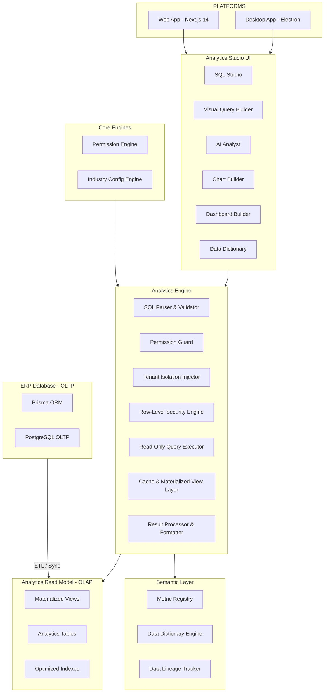

### 2.2 Data Flow — End to End

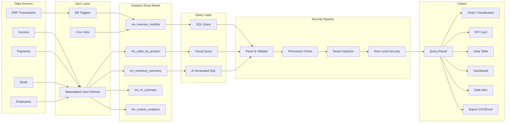

### 2.3 Package Structure

```text
packages/
├── analytics/                        # Core analytics engine
│   └── src/
│       ├── index.ts                  # Public API
│       ├── types.ts                  # Type definitions (40+ types)
│       ├── engine.ts                 # Query engine
│       ├── metrics.ts                # 16+ built-in metrics
│       ├── dimensions.ts             # Dimension definitions + 5 datasets
│       ├── utils.ts                  # Utility functions
│       ├── sql-parser.ts            # 🆕 SQL parsing & validation
│       ├── sql-security.ts          # 🆕 SQL security pipeline
│       ├── permission-guard.ts      # 🆕 Dataset/column/row permissions
│       ├── rls-engine.ts            # 🆕 Row-level security engine
│       ├── visual-query-builder.ts  # 🆕 Visual → SQL generation
│       ├── chart-recommender.ts     # 🆕 Auto chart type recommendation
│       ├── cache-manager.ts         # 🆕 Cache & materialized view management
│       ├── pivot-engine.ts          # 🆕 PIVOT/OLAP operations
│       ├── data-lineage.ts          # 🆕 Data lineage tracking
│       ├── export-engine.ts         # 🆕 Export to CSV/Excel/PDF
│       └── scheduler.ts             # 🆕 Scheduled query engine
│
├── db/
│   └── prisma/
│       └── schema.prisma            # Extended with analytics models
│
apps/web/
├── app/dashboard/analytics/
│   ├── page.tsx                     # Analytics overview
│   ├── layout.tsx                   # Analytics workspace layout
│   ├── sql-studio/
│   │   └── page.tsx                 # SQL Studio workspace
│   ├── visual-builder/
│   │   └── page.tsx                 # Visual Query Builder
│   ├── datasets/
│   │   ├── page.tsx                 # Dataset list
│   │   └── [id]/
│   │       └── page.tsx             # Dataset detail & exploration
│   ├── charts/
│   │   ├── page.tsx                 # Chart list
│   │   └── builder/
│   │       └── page.tsx             # Chart builder
│   ├── dashboards/
│   │   ├── page.tsx                 # Dashboard list
│   │   ├── [id]/
│   │   │   └── page.tsx             # Dashboard viewer
│   │   └── builder/
│   │       └── page.tsx             # Dashboard builder
│   ├── kpi/
│   │   └── page.tsx                 # KPI builder & viewer
│   ├── metrics/
│   │   └── page.tsx                 # Metric registry
│   ├── dictionary/
│   │   └── page.tsx                 # Data dictionary browser
│   ├── lineage/
│   │   └── page.tsx                 # Data lineage viewer
│   ├── history/
│   │   └── page.tsx                 # Query history
│   ├── scheduled/
│   │   └── page.tsx                 # Scheduled queries
│   └── ai-analyst/
│       └── page.tsx                 # AI Analyst workspace
│
├── app/api/analytics/
│   ├── sql/
│   │   └── route.ts                 # 🆕 SQL execution endpoint
│   ├── explorer/
│   │   └── route.ts                 # Data exploration query
│   ├── visual-query/
│   │   └── route.ts                 # 🆕 Visual query execution
│   ├── convert/
│   │   └── route.ts                 # 🆕 SQL ↔ Visual conversion
│   ├── datasets/
│   │   ├── route.ts                 # 🆕 Dataset CRUD
│   │   └── [id]/
│   │       └── route.ts             # 🆕 Dataset detail
│   ├── charts/
│   │   ├── route.ts                 # 🆕 Chart CRUD
│   │   └── [id]/
│   │       └── route.ts             # 🆕 Chart data
│   ├── dashboards/
│   │   ├── route.ts                 # Dashboard CRUD
│   │   └── [id]/
│   │       ├── route.ts             # Dashboard detail
│   │       ├── widgets/
│   │       │   └── route.ts         # Widget CRUD
│   │       └── layout/
│   │           └── route.ts         # Layout update
│   ├── kpi/
│   │   ├── route.ts                 # KPI CRUD
│   │   └── [id]/
│   │       ├── route.ts             # KPI detail
│   │       └── evaluate/
│   │           └── route.ts         # KPI evaluation
│   ├── metrics/
│   │   └── route.ts                 # Metric registry
│   ├── dictionary/
│   │   └── route.ts                 # 🆕 Data dictionary
│   ├── lineage/
│   │   └── route.ts                 # 🆕 Data lineage
│   ├── history/
│   │   └── route.ts                 # 🆕 Query history
│   ├── scheduled/
│   │   ├── route.ts                 # 🆕 Scheduled queries
│   │   └── [id]/
│   │       └── route.ts             # 🆕 Schedule detail
│   ├── alerts/
│   │   ├── route.ts                 # Alert rules CRUD
│   │   └── [id]/
│   │       └── route.ts             # Alert detail
│   ├── ai/
│   │   └── nlq/
│   │       └── route.ts             # 🆕 Natural Language Query
│   └── export/
│       └── route.ts                 # 🆕 Export endpoint
```

---

## 3. Analytics Read Model

### 3.1 Konsep

> **Analytics Read Model** adalah lapisan data terpisah dari OLTP yang dikhususkan untuk keperluan analytics. Data dari ERP Database disinkronkan ke Materialized Views yang dioptimasi untuk query analytics — sehingga query analyst tidak pernah membebani database transaksional.

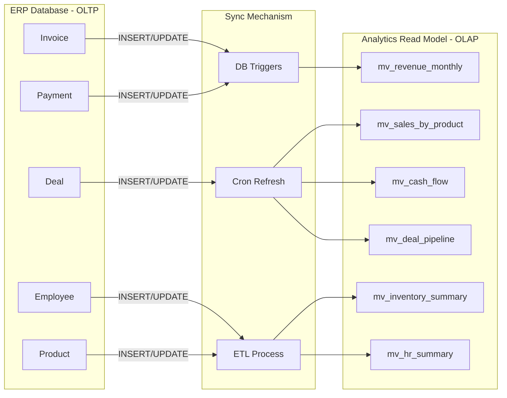

### 3.2 Materialized Views

| View Name | Purpose | Refresh Strategy | Source Tables | Indeks |
|-----------|---------|-----------------|---------------|--------|
| `mv_revenue_monthly` | Revenue per bulan per tenant | Setiap jam | Invoice, InvoiceItem | `tenant_id`, `month` |
| `mv_expense_monthly` | Expense per bulan per tenant | Setiap jam | Payment (type=EXPENSE) | `tenant_id`, `month` |
| `mv_sales_by_customer` | Sales aggregation per customer | Setiap 6 jam | Invoice, Contact | `tenant_id`, `contact_id` |
| `mv_sales_by_product` | Sales aggregation per product | Setiap 6 jam | InvoiceItem, Product | `tenant_id`, `product_id` |
| `mv_sales_by_category` | Sales per kategori | Setiap 6 jam | InvoiceItem, Product, Category | `tenant_id`, `category_id` |
| `mv_inventory_summary` | Current stock levels + value | Setiap jam | Product, StockMovement | `tenant_id`, `product_id` |
| `mv_hr_summary` | Employee stats per departemen | Harian | Employee, Attendance, Payroll | `tenant_id`, `department` |
| `mv_top_products` | Top products by revenue | Setiap 6 jam | InvoiceItem, Product | `tenant_id`, `revenue_rank` |
| `mv_top_customers` | Top customers by revenue | Setiap 6 jam | Invoice, Contact | `tenant_id`, `revenue_rank` |
| `mv_cash_flow` | Cash flow summary | Setiap jam | Payment | `tenant_id`, `month` |
| `mv_deal_pipeline` | Deal pipeline summary | Setiap 30 menit | Deal | `tenant_id`, `stage` |
| `mv_lead_funnel` | Lead conversion funnel | Harian | Lead | `tenant_id`, `source` |

### 3.3 Contoh Materialized View

```sql
-- Revenue per bulan per tenant
CREATE MATERIALIZED VIEW mv_revenue_monthly AS
SELECT
    i.tenant_id,
    DATE_TRUNC('month', i.created_at) AS month,
    COUNT(DISTINCT i.id) AS invoice_count,
    SUM(i.subtotal) AS subtotal,
    SUM(i.tax_amount) AS tax_total,
    SUM(i.total) AS revenue_total,
    AVG(i.total) AS avg_invoice_value
FROM "Invoice" i
WHERE i.status IN ('SENT', 'PAID')
  AND i.deleted_at IS NULL
GROUP BY i.tenant_id, DATE_TRUNC('month', i.created_at);

-- Unique index (WAJIB untuk CONCURRENTLY refresh)
CREATE UNIQUE INDEX idx_mv_revenue_pk
    ON mv_revenue_monthly(tenant_id, month);

-- Additional indexes untuk query performance
CREATE INDEX idx_mv_revenue_tenant
    ON mv_revenue_monthly(tenant_id);
CREATE INDEX idx_mv_revenue_month
    ON mv_revenue_monthly(month);
```

### 3.4 Refresh Strategy

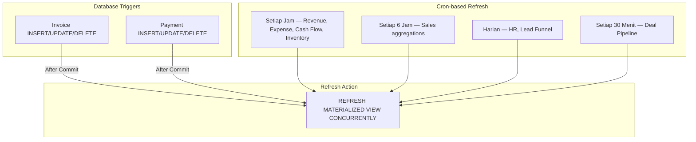

### 3.5 Custom Analytics Table

Untuk query yang membutuhkan joins kompleks atau aggregasi custom, Analytics Studio menyediakan **Custom Analytics Table** — tabel yang dibuat dari saved query dan bisa digunakan berkali-kali:

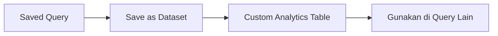

---

## 4. SQL Security Architecture

### 4.1 Security Pipeline

> **Setiap SQL query yang masuk ke Analytics Studio harus melewati 5 tahap security sebelum dieksekusi.**

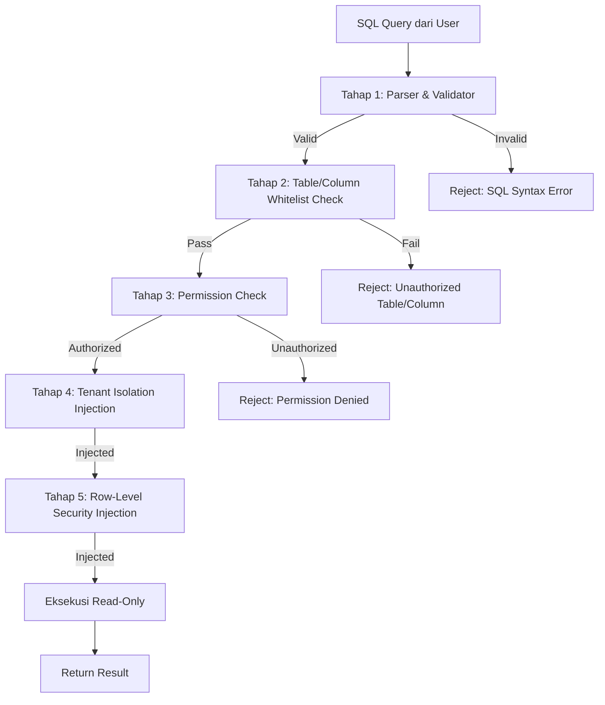

### 4.2 Tahap 1 — SQL Parser & Validator

```typescript
interface SQLParseResult {
    valid: boolean;
    ast: SQLAST | null;
    errors: string[];
    warnings: string[];
    tables: string[];       // Tabel yang diakses
    columns: string[];      // Kolom yang diakses
    hasSubquery: boolean;
    hasUnion: boolean;
    hasJoin: boolean;
    complexity: 'simple' | 'moderate' | 'complex';
}

interface SQLAST {
    type: 'SELECT' | 'INSERT' | 'UPDATE' | 'DELETE';
    tables: TableRef[];
    columns: ColumnRef[];
    where: WhereClause | null;
    groupBy: ColumnRef[];
    orderBy: OrderByClause[];
    having: WhereClause | null;
    limit: number | null;
    joins: JoinClause[];
    subqueries: SQLAST[];
}
```

**Validasi yang dilakukan:**

| Check | Description | Action |
|-------|-------------|--------|
| Syntax validity | SQL syntax harus valid | Reject jika invalid |
| Statement type | Hanya SELECT yang diizinkan | Reject INSERT/UPDATE/DELETE |
| Statement limit | Tidak boleh ada multiple statements | Reject `;` yang memisahkan statements |
| Subquery depth | Maksimal 3 level nesting | Reject jika terlalu dalam |
| Complexity check | Estimasi resource usage | Warn jika kompleks, reject jika berlebihan |

### 4.3 Tahap 2 — Table/Column Whitelist Check

```typescript
interface WhitelistCheckResult {
    allowed: boolean;
    blockedTables: string[];
    blockedColumns: string[];
    suggestions: string[];
}

// Hanya tabel dan kolom yang terdaftar di Data Dictionary yang boleh diakses
const ALLOWED_TABLES = new Set([
    // Materialized Views
    'mv_revenue_monthly',
    'mv_expense_monthly',
    'mv_sales_by_customer',
    'mv_sales_by_product',
    'mv_inventory_summary',
    'mv_hr_summary',
    'mv_cash_flow',
    'mv_deal_pipeline',
    // Custom Analytics Tables
    // (dynamically added when user saves query as dataset)
]);
```

### 4.4 Tahap 3 — Permission Check

```typescript
// Integrasi dengan Permission Engine
interface PermissionCheck {
    userId: string;
    tenantId: string;
    role: UserRole;
    resource: 'dataset' | 'column' | 'metric';
    action: 'read' | 'query' | 'export';
    resourceId: string;  // dataset ID atau column ID
}
```

### 4.5 Tahap 4 — Tenant Isolation Injection

```sql
-- SEBELUM injection:
SELECT month, revenue_total FROM mv_revenue_monthly;

-- SESUDAH injection:
SELECT month, revenue_total FROM mv_revenue_monthly
WHERE tenant_id = 'cm1234567890';
```

**Aturan injection:**
- `tenant_id` **selalu** di-inject ke SETIAP query
- Tidak ada cara untuk user melewati injection ini
- Injection dilakukan di **server-side**, bukan client-side
- `tenant_id` diambil dari session JWT, bukan dari user input

### 4.6 Tahap 5 — Row-Level Security Injection

```sql
-- SESUDAH tenant injection + RLS injection:
-- Untuk Branch Manager di branch "Surabaya":

SELECT month, revenue_total
FROM mv_revenue_monthly
WHERE tenant_id = 'cm1234567890'
  AND branch_id IN (
    SELECT id FROM "Branch"
    WHERE tenant_id = 'cm1234567890'
      AND id = 'branch_surabaya'
  );
```

---

## 5. Row-Level Security Design

### 5.1 Role-Based Data Access Matrix

| Role | Scope | Data Access | SQL Filter yang Di-inject |
|------|-------|-------------|--------------------------|
| **Data Analyst** | Seluruh company | Semua data dalam tenant | `WHERE tenant_id = $1` |
| **Branch Manager** | Branch sendiri | Data branch sendiri saja | `WHERE tenant_id = $1 AND branch_id = $userBranchId` |
| **Sales Manager** | Department Sales | Data sales department | `WHERE tenant_id = $1 AND department = 'SALES'` |
| **Regional Manager** | Region sendiri | Data region sendiri | `WHERE tenant_id = $1 AND region_id IN ($userRegions)` |
| **Finance Manager** | Department Finance | Data finance department | `WHERE tenant_id = $1 AND module = 'FINANCE'` |
| **HR Manager** | Department HR | Data HR saja | `WHERE tenant_id = $1 AND module = 'HR'` |

### 5.2 RLS Engine Flow

```mermaid
graph TD
    QUERY["User Query"]
    GET_SESSION["Ambil Session dari JWT"]
    GET_ROLE["Tentukan Role"]
    GET_SCOPE["Tentukan Data Scope"]

    R_DATA_ANALYST["RLS: tenant_id = $1"]
    R_BRANCH_MGR["RLS: tenant_id = $1 AND branch_id = $branch"]
    R_SALES_MGR["RLS: tenant_id = $1 AND department = 'SALES'"]
    R_REGIONAL_MGR["RLS: tenant_id = $1 AND region_id IN ($regions)"]

    INJECT["Inject WHERE Clause"]
    EXECUTE["Execute Query"]

    QUERY --> GET_SESSION
    GET_SESSION --> GET_ROLE
    GET_ROLE --> GET_SCOPE
    GET_SCOPE -->|"Data Analyst"| R_DATA_ANALYST
    GET_SCOPE -->|"Branch Manager"| R_BRANCH_MGR
    GET_SCOPE -->|"Sales Manager"| R_SALES_MGR
    GET_SCOPE -->|"Regional Manager"| R_REGIONAL_MGR
    R_DATA_ANALYST --> INJECT
    R_BRANCH_MGR --> INJECT
    R_SALES_MGR --> INJECT
    R_REGIONAL_MGR --> INJECT
    INJECT --> EXECUTE
```

### 5.3 RLS Implementation

```typescript
interface RLSPolicy {
    role: UserRole;
    column: string;           // Kolom yang di-filter
    operator: '=' | 'IN' | '>';
    getValue: (session: Session) => string | string[];
}

const RLS_POLICIES: RLSPolicy[] = [
    {
        role: 'DATA_ANALYST',
        column: 'tenant_id',
        operator: '=',
        getValue: (s) => s.user.tenantId,
    },
    {
        role: 'BRANCH_MANAGER',
        column: 'branch_id',
        operator: '=',
        getValue: (s) => s.user.branchId,
    },
    {
        role: 'SALES_MANAGER',
        column: 'assigned_to',
        operator: 'IN',
        getValue: (s) => getTeamMemberIds(s.user.department),
    },
    {
        role: 'REGIONAL_MANAGER',
        column: 'region_id',
        operator: 'IN',
        getValue: (s) => s.user.regionIds,
    },
];
```

---

## 6. SQL Studio Architecture

### 6.1 Overview

SQL Studio adalah **workspace SQL profesional** yang memungkinkan analyst menulis, mengeksekusi, dan menganalisis query SQL terhadap Analytics Read Model.

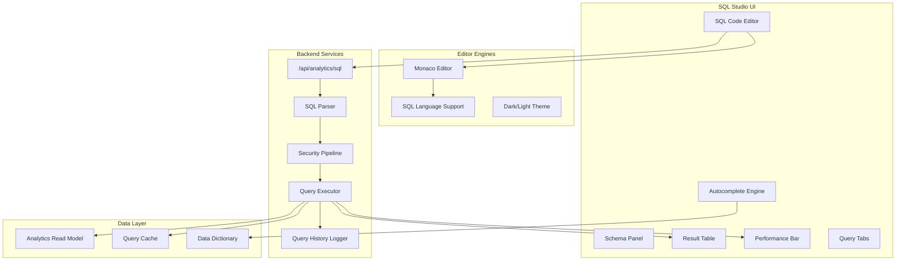

### 6.2 SQL Editor Features

| Feature | Description | Technology |
|---------|-------------|------------|
| **Syntax Highlighting** | Color-coded SQL keywords, functions, tables | Monaco Editor + SQL Language |
| **Autocomplete** | Table/column/function names dari Data Dictionary | Custom CompletionItemProvider |
| **Error Highlighting** | Real-time syntax error detection | SQL Parser (client-side) |
| **Query Formatting** | Auto-format SQL query | sql-formatter library |
| **Multiple Tabs** | Buka beberapa query sekaligus | Custom tab management |
| **Query Templates** | Template query yang sudah disediakan | Built-in template library |
| **Execution Plan** | Tampilkan execution plan (EXPLAIN) | PostgreSQL EXPLAIN ANALYZE |
| **Result Export** | Export hasil query ke CSV/Excel | Export Engine |

### 6.3 Autocomplete Architecture

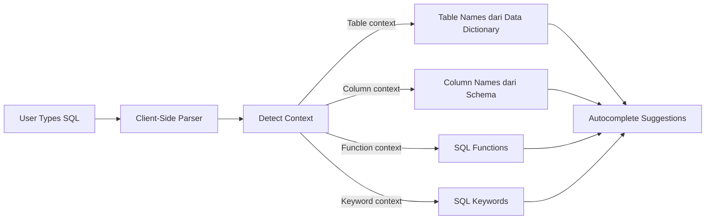

### 6.4 Performance Monitoring

```typescript
interface QueryPerformanceMetrics {
    executionTimeMs: number;      // Waktu eksekusi
    rowsReturned: number;         // Jumlah baris yang dikembalikan
    rowsScanned: number;          // Jumlah baris yang di-scan
    bytesRead: number;            // Data yang dibaca (bytes)
    planningTimeMs: number;       // Waktu planning
    executionPlanNodes: number;   // Jumlah node di execution plan
    cacheHit: boolean;            // Apakah hasil dari cache
    warnings: string[];           // Performance warnings
    suggestions: string[];        // Index suggestions
}
```

**Slow Query Warnings:**

| Threshold | Level | Action |
|-----------|-------|--------|
| `< 100ms` | 🟢 Fast | Tidak ada warning |
| `100ms - 1s` | 🟡 Normal | Info: "Query bisa dioptimasi" |
| `1s - 5s` | 🟠 Slow | Warning: "Query lambat, pertimbangkan filter" |
| `> 5s` | 🔴 Critical | Error: "Query timeout, gunakan materialized view" |

---

## 7. Visual Query Builder Architecture

### 7.1 Overview

Visual Query Builder memungkinkan user bisnis membangun query tanpa menulis SQL — cukup drag & drop dimensions, measures, dan filters.

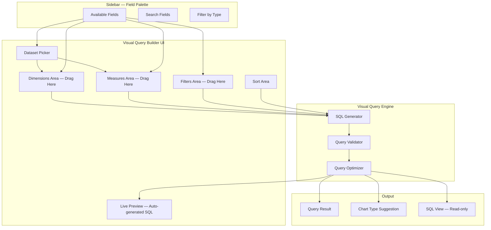

### 7.2 Visual Query Configuration

```typescript
interface VisualQueryConfig {
    dataset: string;               // ID dataset yang dipilih
    dimensions: VisualDimension[]; // Dimensions yang dipilih
    measures: VisualMeasure[];     // Measures yang dipilih
    filters: VisualFilter[];       // Filters yang diterapkan
    sortBy: VisualSort[];          // Sorting
    limit: number;                 // Maksimal rows
}

interface VisualDimension {
    fieldId: string;               // ID field dari dataset
    alias?: string;                // Custom alias
    granularity?: 'day' | 'week' | 'month' | 'quarter' | 'year';
    // Untuk temporal dimensions
}

interface VisualMeasure {
    fieldId: string;
    aggregation: 'SUM' | 'COUNT' | 'AVG' | 'MIN' | 'MAX' | 'COUNT_DISTINCT';
    alias?: string;
    format?: 'currency' | 'number' | 'percentage';
}

interface VisualFilter {
    fieldId: string;
    operator: '=' | '!=' | '>' | '>=' | '<' | '<=' |
              'contains' | 'starts_with' | 'ends_with' |
              'in' | 'not_in' | 'between' | 'is_null' | 'is_not_null';
    value: unknown;
    conjunction: 'AND' | 'OR';
}
```

### 7.3 SQL Generation from Visual Query

```typescript
// Contoh: Visual Query → SQL Generation
// Visual Config:
//   Dataset: invoices
//   Dimensions: [date.month, customer.name]
//   Measures: [{field: total, agg: SUM}, {field: id, agg: COUNT}]
//   Filters: [{field: status, op: '=', value: 'PAID'}]
//   Sort: [{field: total, agg: SUM, order: DESC}]
//   Limit: 100

// Generated SQL:
// SELECT
//   DATE_TRUNC('month', i.created_at) AS month,
//   c.name AS customer_name,
//   SUM(i.total) AS total_sum,
//   COUNT(i.id) AS id_count
// FROM mv_revenue_monthly i
// JOIN "Contact" c ON c.id = i.contact_id
// WHERE i.tenant_id = $1
//   AND i.status = 'PAID'
// GROUP BY DATE_TRUNC('month', i.created_at), c.name
// ORDER BY SUM(i.total) DESC
// LIMIT 100;
```

---

## 8. SQL ↔ Visual Builder Conversion

### 8.1 Dual Mode Architecture

> **User bisa beralih antara SQL mode dan Visual mode secara seamless.** Query di satu mode akan di-convert ke mode lainnya.

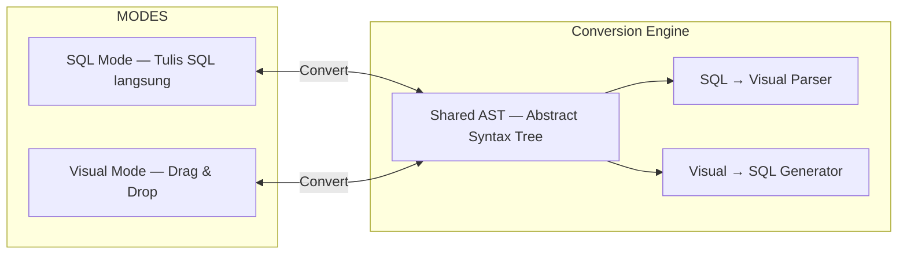

### 8.2 Conversion Rules

| Direction | Challenge | Strategy |
|-----------|-----------|----------|
| **Visual → SQL** | Straightforward | Map dimensions/measures/filters ke SQL clauses |
| **SQL → Visual** | SQL bisa kompleks | Parse AST → map ke visual components, skip yang tidak bisa di-represent |

**Limitasi SQL → Visual:**
- Subquery kompleks → ditampilkan sebagai "Advanced Filter" (tidak bisa di-edit visual)
- Window functions → ditampilkan sebagai "Calculated Column" (read-only)
- CTE (WITH clause) → tidak di-convert, tetap di SQL mode

### 8.3 Conversion API

```typescript
// POST /api/analytics/convert
interface ConvertRequest {
    direction: 'sql-to-visual' | 'visual-to-sql';
    sql?: string;                    // Untuk sql-to-visual
    visual?: VisualQueryConfig;      // Untuk visual-to-sql
    dataset?: string;                // Context dataset
}

interface ConvertResponse {
    success: boolean;
    sql?: string;                    // Generated SQL
    visual?: VisualQueryConfig;      // Generated visual config
    warnings?: string[];             // Parts yang tidak bisa di-convert
    partialConversion?: boolean;     // Apakah konversi parsial
}
```

---

## 9. Chart & Visualization Engine

### 9.1 Auto-Visualization

> **Query results otomatis direkomendasikan sebagai chart type yang paling sesuai.**

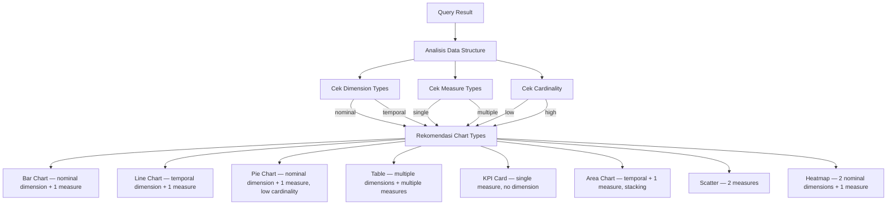

### 9.2 Chart Type Decision Matrix

| Dimension Type | Cardinality | Measures | Recommended Chart |
|---------------|-------------|----------|-------------------|
| 1 temporal | Any | 1 | **Line Chart** |
| 1 temporal | Any | 2+ | **Multi-line Chart** |
| 1 nominal | Low (2-7) | 1 | **Pie / Donut** |
| 1 nominal | Medium (8-20) | 1 | **Bar Chart (horizontal)** |
| 1 nominal | High (20+) | 1 | **Bar Chart (vertical, top 20)** |
| 1 nominal | Any | 2+ | **Grouped Bar Chart** |
| 2 nominal | Low × Low | 1 | **Heatmap** |
| 2 measures | N/A | 2 | **Scatter Plot** |
| 0 dimensions | N/A | 1 | **KPI Card** |
| 0 dimensions | N/A | 2+ | **KPI Cards Row** |
| Any | Any | Any | **Data Table (fallback)** |

### 9.3 Chart Configuration

```typescript
interface ChartConfig {
    id: string;
    title: string;
    type: ChartType;
    dataSource: string;            // Dataset atau saved query ID
    query?: VisualQueryConfig;     // Atau inline query config

    // Axis configuration
    xAxis?: ChartAxisConfig;
    yAxis?: ChartAxisConfig;

    // Visual options
    colors?: string[];
    showLegend?: boolean;
    showGrid?: boolean;
    showLabels?: boolean;
    showTooltip?: boolean;
    showDataLabels?: boolean;

    // Interaction
    enableDrillDown?: boolean;
    drillDownPath?: string[];
    enableZoom?: boolean;
    enablePan?: boolean;

    // Formatting
    valueFormat?: MetricFormat;
    dateFormat?: string;

    // Size
    width?: number;
    height?: number;
}

type ChartType =
    | 'bar' | 'horizontal_bar' | 'stacked_bar'
    | 'line' | 'multi_line' | 'area' | 'stacked_area'
    | 'pie' | 'donut'
    | 'scatter' | 'bubble'
    | 'heatmap' | 'treemap'
    | 'funnel' | 'gauge'
    | 'kpi_card' | 'kpi_row'
    | 'table';
```

### 9.4 Chart Rendering Technology

| Technology | Use Case |
|-----------|----------|
| **Recharts** | Primary charting library (React-based, composable) |
| **D3.js** | Custom visualizations (heatmap, treemap, funnel) |
| **Tailwind CSS** | Chart container styling, responsive layout |

---

## 10. Dataset & Metric Layer

### 10.1 Semantic Layer Architecture

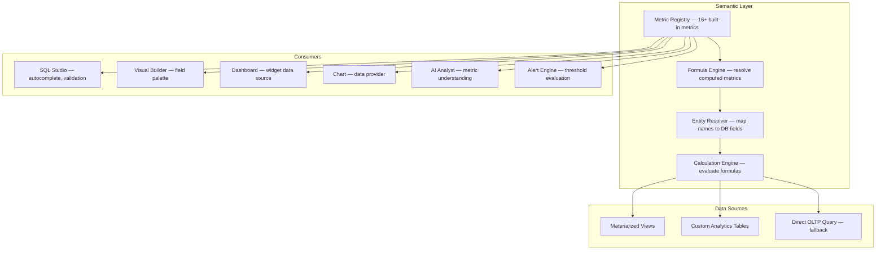

### 10.2 Built-in Metrics

| Category | Metric | Formula | Source |
|----------|--------|---------|--------|
| **Finance** | Revenue | `SUM(invoice.total) WHERE status IN (PAID, SENT)` | Invoice |
| **Finance** | Total Expenses | `SUM(payment.amount) WHERE type = EXPENSE` | Payment |
| **Finance** | Gross Profit | `Revenue - COGS` | Calculated |
| **Finance** | Net Income | `Revenue - Total Expenses` | Calculated |
| **Finance** | Cash Flow | `SUM(income) - SUM(expenses)` | Payment |
| **Finance** | AR Aging | `SUM(invoice.total) WHERE status IN (SENT, OVERDUE)` | Invoice |
| **Sales** | Total Deals | `COUNT(deal)` | Deal |
| **Sales** | Win Rate | `COUNT(WON) / COUNT(qualified)` | Deal |
| **Sales** | Pipeline Value | `SUM(deal.value) WHERE stage NOT IN (CLOSED)` | Deal |
| **Sales** | Avg Deal Size | `AVG(deal.value) WHERE stage = CLOSED_WON` | Deal |
| **CRM** | Lead Conversion Rate | `COUNT(deal) / COUNT(lead) * 100` | Lead + Deal |
| **Inventory** | Total Stock Value | `SUM(product.price * product.stock)` | Product |
| **Inventory** | Stock Turnover | `COGS / Average Inventory` | Calculated |
| **Inventory** | Low Stock Items | `COUNT(product WHERE stock < minStock)` | Product |
| **HR** | Headcount | `COUNT(employee WHERE status = ACTIVE)` | Employee |
| **HR** | Attendance Rate | `COUNT(PRESENT) / COUNT(total) * 100` | Attendance |

### 10.3 Custom Metric Builder

User bisa membuat metric custom dengan formula:

```typescript
interface CustomMetric {
    id: string;
    tenantId: string;
    name: string;
    description: string;
    category: string;
    formula: string;            // e.g. "Revenue / Headcount"
    dependencies: string[];     // IDs dari metrics yang bergantung
    format: 'currency' | 'number' | 'percentage';
    isActive: boolean;
}
```

### 10.4 Dataset as Saved Query

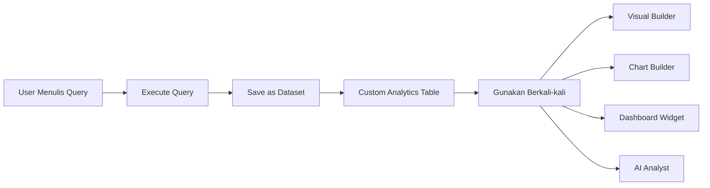

---

## 11. Dashboard Builder Architecture

### 11.1 Widget System

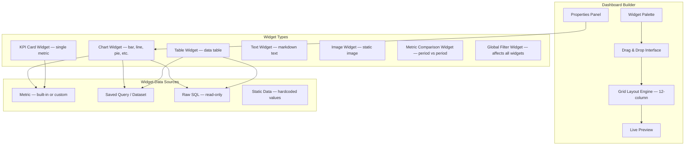

### 11.2 Dashboard Layout Model

```typescript
interface DashboardLayout {
    columns: 12;                    // 12-column grid
    rowHeight: number;              // pixels per row
    gap: number;                    // gap between widgets
    responsive: ResponsiveBreakpoints;
}

interface ResponsiveBreakpoints {
    desktop: { columns: 12; minWidth: 1024 };
    tablet: { columns: 6; minWidth: 768 };
    mobile: { columns: 1; minWidth: 0 };
}

interface DashboardWidget {
    id: string;
    type: WidgetType;
    title: string;

    // Grid position
    gridX: number;                  // 0-11
    gridY: number;
    gridW: number;                  // Column span (1-12)
    gridH: number;                  // Row span

    // Data source
    dataSource: 'metric' | 'query' | 'sql' | 'static';
    metricId?: string;
    queryId?: string;
    sql?: string;
    staticData?: unknown;

    // Display config
    config: WidgetConfig;
    refreshInterval?: number;       // seconds
}

type WidgetType =
    | 'chart' | 'kpi_card' | 'table'
    | 'text' | 'image' | 'metric_comparison'
    | 'global_filter';
```

### 11.3 Dashboard Visibility Control

| Visibility | Who Can See | Who Can Edit |
|-----------|-------------|-------------|
| **Private** | Owner only | Owner only |
| **Team** | Owner + team members | Owner only |
| **Department** | All in same department | Department admin |
| **Organization** | All tenant members | Admin + owner |

---

## 12. Data Dictionary Architecture

### 12.1 Overview

> **Data Dictionary adalah metadata browser yang memberikan definisi, source, formula, dan lineage dari setiap metric dan field yang tersedia di Analytics Studio.**

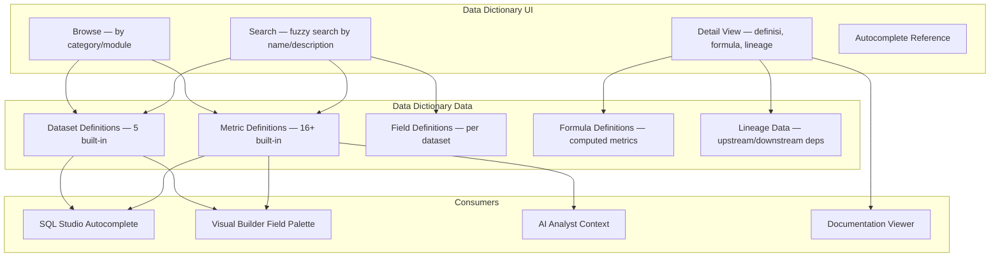

### 12.2 Data Dictionary Entry Structure

```typescript
interface DataDictionaryEntry {
    id: string;

    // Identity
    name: string;
    type: 'metric' | 'dimension' | 'measure' | 'dataset' | 'field';
    category: string;             // finance, sales, inventory, hr, crm

    // Definition
    businessDefinition: string;   // Definisi dalam bahasa bisnis
    technicalDefinition?: string; // Definisi teknis / SQL expression
    example?: string;             // Contoh penggunaan

    // Source
    sourceModule: string;         // finance, crm, inventory, hr
    sourceModel: string;          // Prisma model name
    sourceField?: string;         // Specific field

    // Formula (for computed metrics)
    formula?: string;
    dependencies?: string[];      // IDs dari metrics yang bergantung

    // Lineage
    upstreamDependencies?: string[];
    downstreamDependencies?: string[];

    // Quality
    freshness?: 'realtime' | 'hourly' | 'daily' | 'weekly';
    reliability?: 'high' | 'medium' | 'low';
    lastVerified?: Date;

    // Ownership
    owner?: string;
    department?: string;
}
```

---

## 13. Data Lineage Architecture

### 13.1 Overview

> **Data Lineage melacak asal-usul dan transformasi dari setiap metric — dari source table hingga ke dashboard widget.**

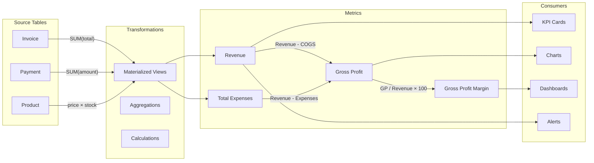

### 13.2 Lineage Tracking Model

```typescript
interface LineageNode {
    id: string;
    type: 'source_table' | 'materialized_view' | 'metric' |
          'kpi' | 'chart' | 'dashboard' | 'alert' | 'report';
    name: string;
    module: string;               // finance, sales, inventory, hr
}

interface LineageEdge {
    sourceId: string;
    targetId: string;
    transform: string;            // Deskripsi transformasi
    type: 'direct' | 'aggregate' | 'calculate' | 'filter';
}

interface LineageGraph {
    nodes: LineageNode[];
    edges: LineageEdge[];
    // Impact analysis: jika source berubah, apa yang terpengaruh?
    getImpact(nodeId: string): LineageNode[];
    // Root cause: jika metric aneh, dari mana asalnya?
    getRootCause(nodeId: string): LineageNode[];
}
```

---

## 14. AI Analyst Architecture

### 14.1 NLQ → SQL Pipeline

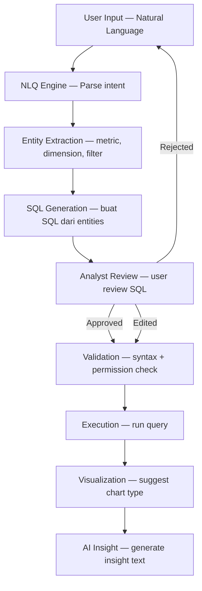

### 14.2 NLQ Engine Design

```typescript
interface NLQRequest {
    query: string;                // Natural language query
    context?: NLQContext;         // Context dari session
}

interface NLQContext {
    currentDataset?: string;      // Dataset yang sedang dilihat
    recentQueries?: string[];     // Query terakhir
    userRole: UserRole;
    department?: string;
}

interface NLQResponse {
    intent: NLQIntent;
    entities: NLQEntity[];
    generatedSQL: string;
    confidence: number;           // 0-1
    explanation: string;          // Penjelasan dalam bahasa manusia
    alternatives?: string[];      // SQL alternatif
}

interface NLQIntent {
    type: 'report' | 'compare' | 'filter' | 'aggregate' |
          'predict' | 'trend' | 'top_n' | 'count';
    description: string;
}

interface NLQEntity {
    type: 'metric' | 'dimension' | 'filter' | 'time_range' | 'aggregation';
    value: string;
    mappedTo: string;             // Field/metric ID yang sesuai
    confidence: number;
}
```

### 14.3 AI-Assisted SQL Safety Rules

> ⛔ **AI-generated SQL TIDAK PERNAH di-execute blind. Analyst WAJIB review terlebih dahulu.**

| Rule | Description |
|------|-------------|
| **No Blind Execution** | SQL dari AI harus di-review oleh analyst sebelum dieksekusi |
| **Confidence Threshold** | SQL dengan confidence < 0.7 memerlukan review lebih ketat |
| **Permission Still Applies** | AI-generated SQL melewati security pipeline yang sama |
| **Tenant Isolation** | AI tidak bisa generate query yang melanggar tenant isolation |
| **Audit Trail** | Semua AI-generated SQL dicatat di query history |
| **Rate Limiting** | Maksimal 10 NLQ requests per menit per user |

### 14.4 NLQ Context Understanding

```typescript
// Contoh NLQ → Entity Mapping
// Query: "Tampilkan penjualan bulan ini per produk untuk branch Surabaya"

const NLQ_MAPPING = {
    "penjualan": { type: 'metric', mappedTo: 'revenue', confidence: 0.95 },
    "bulan ini": { type: 'time_range', mappedTo: { from: '2026-08-01', to: '2026-08-31' }, confidence: 0.98 },
    "per produk": { type: 'dimension', mappedTo: 'product.name', confidence: 0.92 },
    "branch Surabaya": { type: 'filter', mappedTo: { field: 'branch.name', op: '=', value: 'Surabaya' }, confidence: 0.90 },
};

// Generated SQL:
// SELECT
//   p.name AS product_name,
//   SUM(i.total) AS revenue
// FROM mv_sales_by_product i
// JOIN "Product" p ON p.id = i.product_id
// WHERE i.tenant_id = $1
//   AND i.month >= '2026-08-01' AND i.month < '2026-09-01'
//   AND i.branch_name = 'Surabaya'
// GROUP BY p.name
// ORDER BY SUM(i.total) DESC;
```

---

## 15. Query Performance & Caching

### 15.1 Cache Strategy

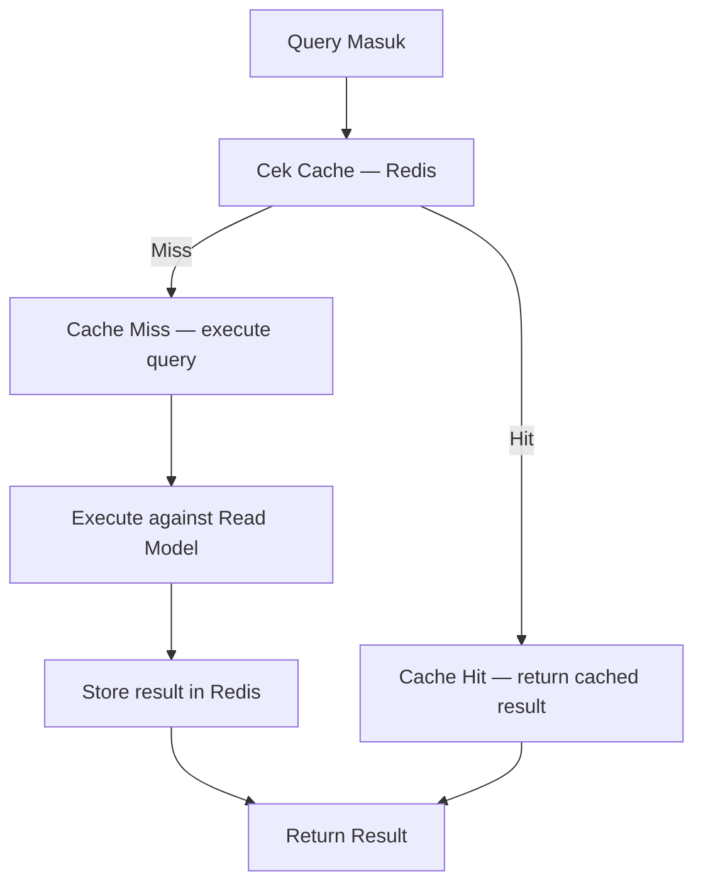

### 15.2 Cache Configuration

| Query Type | TTL | Cache Key Pattern |
|-----------|-----|-------------------|
| **Materialized View query** | 5 menit | `analytics:{tenantId}:{viewName}:{hash}` |
| **Custom query** | 15 menit | `analytics:{tenantId}:custom:{hash}` |
| **Dashboard widget** | 10 menit | `analytics:{tenantId}:widget:{widgetId}:{hash}` |
| **KPI evaluation** | 30 menit | `analytics:{tenantId}:kpi:{kpiId}:{period}` |
| **Data dictionary** | 1 jam | `analytics:dict:{tenantId}:{entryId}` |
| **AI-generated query** | 5 menit | `analytics:{tenantId}:ai:{hash}` |

### 15.3 Query Optimization Rules

| Rule | Description |
|------|-------------|
| **Force Materialized Views** | Query harus menggunakan materialized views, bukan OLTP tables |
| **Index Hints** | Sistem bisa suggest indexes untuk query yang lambat |
| **Result Caching** | Query yang sama dengan parameter sama menggunakan cache |
| **Pagination** | Semua query harus support LIMIT/OFFSET |
| **Max Rows** | Maksimal 10,000 rows per query |
| **Query Timeout** | Query timeout setelah 30 detik |
| **EXPLAIN ANALYZE** | User bisa meminta execution plan untuk optimasi |

---

## 16. Query History & Scheduling

### 16.1 Query History

```typescript
interface QueryHistoryEntry {
    id: string;
    tenantId: string;
    userId: string;
    userName: string;

    // Query Details
    queryType: 'sql' | 'visual' | 'ai' | 'dashboard' | 'kpi';
    sql: string;                    // SQL yang dieksekusi
    visualConfig?: VisualQueryConfig;
    dataset?: string;

    // Execution Results
    executionTimeMs: number;
    rowsReturned: number;
    rowsScanned?: number;
    status: 'success' | 'error' | 'timeout' | 'blocked';
    errorMessage?: string;

    // Metadata
    fromCache: boolean;
    ipAddress?: string;
    createdAt: Date;

    // Actions
    canRerun: boolean;
    canDuplicate: boolean;
    canSaveAsDataset: boolean;
    canShare: boolean;
}
```

### 16.2 Query History Actions

| Action | Description |
|--------|-------------|
| **Rerun** | Jalankan ulang query yang sama |
| **Duplicate** | Buka query di SQL Studio sebagai copy |
| **Edit** | Buka query di SQL Studio untuk diedit |
| **Save as Dataset** | Simpan hasil sebagai dataset baru |
| **Export** | Export hasil ke CSV/Excel |
| **Share** | Generate shareable link |

### 16.3 Scheduled Queries

```typescript
interface ScheduledQuery {
    id: string;
    tenantId: string;
    name: string;
    queryId: string;               // Referensi ke saved query

    // Schedule
    cronExpression: string;
    frequency: 'daily' | 'weekly' | 'monthly' | 'quarterly';
    timeOfDay: string;             // "08:00"
    dayOfWeek?: number;
    dayOfMonth?: number;

    // Output
    outputFormat: 'email' | 'pdf' | 'excel' | 'csv' | 'slack';
    recipients: string[];

    // Alert Integration
    alertOnFailure: boolean;
    alertOnAnomaly: boolean;

    // Status
    isActive: boolean;
    lastRunAt?: Date;
    nextRunAt?: Date;
    runCount: number;
}
```

---

## 17. Prisma Schema Extensions

### 17.1 Model Baru yang Diperlukan

> **Berikut model-model Prisma baru yang harus ditambahkan ke schema untuk mendukung Analytics Studio.**

#### 17.1.1 Analytics Dataset (Custom Datasets)

```prisma
model AnalyticsDataset {
  id            String   @id @default(cuid())
  tenantId      String
  tenant        Tenant   @relation(fields: [tenantId], references: [id])

  name          String
  description   String?
  slug          String

  // Source
  sourceType    String   @default("QUERY") // QUERY, MATERIALIZED_VIEW, CUSTOM_TABLE
  sourceQuery   String?  // SQL query yang menjadi sumber
  sourceView    String?  // Materialized view name
  schemaDef     String?  // JSON: column definitions

  // Permissions
  visibility    String   @default("PRIVATE") // PRIVATE, TEAM, DEPARTMENT, ORGANIZATION
  ownerId       String
  ownerName     String?

  // Metadata
  columnCount   Int      @default(0)
  rowCount      Int?
  lastRefreshed DateTime?
  refreshFreq   String?  // REALTIME, HOURLY, DAILY

  isActive      Boolean  @default(true)
  createdAt     DateTime @default(now())
  updatedAt     DateTime @updatedAt
  deletedAt     DateTime?

  @@unique([tenantId, slug])
  @@index([tenantId])
  @@index([ownerId])
}
```

#### 17.1.2 SQL Query History

```prisma
model AnalyticsQueryHistory {
  id            String   @id @default(cuid())
  tenantId      String
  tenant        Tenant   @relation(fields: [tenantId], references: [id])

  userId        String
  userName      String?

  // Query
  queryType     String   // SQL, VISUAL, AI, DASHBOARD, KPI
  sql           String   @db.Text
  visualConfig  String?  // JSON: VisualQueryConfig
  datasetId     String?
  datasetName   String?

  // Results
  executionMs   Int
  rowsReturned  Int
  rowsScanned   Int?
  status        String   // SUCCESS, FAILED, TIMEOUT, BLOCKED
  errorMessage  String?
  fromCache     Boolean  @default(false)

  // Metadata
  ipAddress     String?
  userAgent     String?

  createdAt     DateTime @default(now())

  @@index([tenantId])
  @@index([userId])
  @@index([createdAt])
  @@index([queryType])
  @@index([status])
}
```

#### 17.1.3 Chart Definitions

```prisma
model AnalyticsChart {
  id            String   @id @default(cuid())
  tenantId      String
  tenant        Tenant   @relation(fields: [tenantId], references: [id])

  name          String
  description   String?
  slug          String

  // Chart Config
  chartType     String   // bar, line, pie, donut, area, scatter, heatmap, kpi_card, table
  config        String   @default("{}") // JSON: ChartConfig

  // Data Source
  dataSource    String   @default("DATASET") // DATASET, QUERY, METRIC
  datasetId     String?
  dataset       AnalyticsDataset? @relation(fields: [datasetId], references: [id])
  queryId       String?
  query         AnalyticsQueryHistory? @relation(fields: [queryId], references: [id])
  metricId      String?
  queryConfig   String?  // JSON: VisualQueryConfig inline

  // Ownership
  visibility    String   @default("PRIVATE") // PRIVATE, TEAM, DEPARTMENT, ORGANIZATION
  ownerId       String
  ownerName     String?

  // Metadata
  viewCount     Int      @default(0)
  lastViewedAt  DateTime?
  isTemplate    Boolean  @default(false)
  tags          String?  // JSON array

  isActive      Boolean  @default(true)
  createdAt     DateTime @default(now())
  updatedAt     DateTime @updatedAt
  deletedAt     DateTime?

  @@unique([tenantId, slug])
  @@index([tenantId])
  @@index([ownerId])
  @@index([datasetId])
}
```

#### 17.1.4 Dashboard Builder

```prisma
model AnalyticsDashboard {
  id            String   @id @default(cuid())
  tenantId      String
  tenant        Tenant   @relation(fields: [tenantId], references: [id])

  name          String
  description   String?
  slug          String

  // Layout
  layout        String   @default("{}") // JSON: DashboardLayout
  theme         String?  // LIGHT, DARK, AUTO

  // Visibility & Access
  visibility    String   @default("PRIVATE") // PRIVATE, TEAM, DEPARTMENT, ORGANIZATION
  ownerId       String
  ownerName     String?
  department    String?
  allowedRoles  String?  // JSON array
  allowedUsers  String?  // JSON array

  // Metadata
  isDefault     Boolean  @default(false)
  isTemplate    Boolean  @default(false)
  tags          String?  // JSON array
  viewCount     Int      @default(0)
  lastViewedAt  DateTime?
  refreshAll    Int?     // Global refresh interval (seconds)

  isActive      Boolean  @default(true)
  createdAt     DateTime @default(now())
  updatedAt     DateTime @updatedAt
  deletedAt     DateTime?

  widgets       AnalyticsDashboardWidget[]

  @@unique([tenantId, slug])
  @@index([tenantId])
  @@index([ownerId])
}
```

#### 17.1.5 Dashboard Widget

```prisma
model AnalyticsDashboardWidget {
  id            String   @id @default(cuid())
  tenantId      String
  tenant        Tenant   @relation(fields: [tenantId], references: [id])

  dashboardId   String
  dashboard     AnalyticsDashboard @relation(fields: [dashboardId], references: [id], onDelete: Cascade)

  // Widget Config
  title         String
  type          String   // CHART, KPI_CARD, TABLE, TEXT, IMAGE, METRIC_COMPARISON
  chartType     String?  // BAR, PIE, LINE, etc.
  size          String   @default("MEDIUM") // SMALL, MEDIUM, LARGE, FULL_WIDTH

  // Grid Position
  gridX         Int      @default(0)
  gridY         Int      @default(0)
  gridW         Int      @default(6)  // Column span (1-12)
  gridH         Int      @default(4)  // Row span

  // Data Source
  dataSource    String   @default("METRIC") // METRIC, CHART, QUERY, SQL, STATIC
  metricId      String?
  chartId       String?
  queryId       String?
  sql           String?  @db.Text
  staticData    String?  // JSON: for static widgets

  // Display Config
  config        String   @default("{}") // JSON: colors, labels, formatting
  refreshInterval Int?   // seconds, null = no auto-refresh

  createdAt     DateTime @default(now())
  updatedAt     DateTime @updatedAt

  @@index([tenantId])
  @@index([dashboardId])
}
```

#### 17.1.6 Data Dictionary Entry

```prisma
model DataDictionaryEntry {
  id            String   @id @default(cuid())
  tenantId      String
  tenant        Tenant   @relation(fields: [tenantId], references: [id])

  // Identity
  name          String
  type          String   // metric, dimension, measure, dataset, field
  category      String   // finance, sales, inventory, hr, crm

  // Definition
  businessDef   String   @db.Text
  technicalDef  String?  @db.Text
  example       String?  @db.Text

  // Source
  sourceModule  String
  sourceModel   String
  sourceField   String?

  // Formula
  formula       String?  @db.Text
  dependencies  String?  // JSON array of entry IDs

  // Lineage
  upstreamDeps  String?  // JSON array
  downstreamDeps String? // JSON array

  // Quality
  freshness     String?  // REALTIME, HOURLY, DAILY, WEEKLY
  reliability   String?  // HIGH, MEDIUM, LOW
  lastVerified  DateTime?

  // Ownership
  owner         String?
  department    String?

  isActive      Boolean  @default(true)
  createdAt     DateTime @default(now())
  updatedAt     DateTime @updatedAt

  @@index([tenantId])
  @@index([type])
  @@index([category])
  @@index([name])
}
```

#### 17.1.7 Scheduled Query

```prisma
model ScheduledQuery {
  id              String   @id @default(cuid())
  tenantId        String
  tenant          Tenant   @relation(fields: [tenantId], references: [id])

  name            String
  description     String?

  // Source
  queryHistoryId  String   // Reference to the query to re-run
  datasetId       String?

  // Schedule
  cronExpression  String
  frequency       String   // DAILY, WEEKLY, MONTHLY, QUARTERLY
  timeOfDay       String   @default("08:00")

  // Output
  outputFormat    String   @default("EMAIL") // EMAIL, PDF, EXCEL, CSV, SLACK
  recipients      String[] @default([])

  // Alert
  alertOnFailure  Boolean  @default(true)
  alertOnAnomaly  Boolean  @default(false)

  // Status
  isActive        Boolean  @default(true)
  lastRunAt       DateTime?
  nextRunAt       DateTime?
  lastRunStatus   String?
  runCount        Int      @default(0)

  createdAt       DateTime @default(now())
  updatedAt       DateTime @updatedAt

  @@index([tenantId])
  @@index([isActive])
  @@index([nextRunAt])
}
```

---

## 18. API Routes Design

### 18.1 SQL Studio API

```
POST   /api/analytics/sql                    — Execute SQL query
GET    /api/analytics/sql/history             — Get query history
GET    /api/analytics/sql/schema              — Get schema for autocomplete
POST   /api/analytics/sql/format              — Format SQL query
POST   /api/analytics/sql/explain             — Get execution plan
```

### 18.2 Visual Query Builder API

```
POST   /api/analytics/visual-query            — Execute visual query
GET    /api/analytics/visual-query/datasets   — List available datasets
GET    /api/analytics/visual-query/fields     — Get fields for dataset
```

### 18.3 SQL ↔ Visual Conversion API

```
POST   /api/analytics/convert                 — Convert SQL ↔ Visual config
```

### 18.4 Dataset API

```
GET    /api/analytics/datasets                — List datasets
POST   /api/analytics/datasets                — Create dataset from query
GET    /api/analytics/datasets/:id            — Get dataset detail
PUT    /api/analytics/datasets/:id            — Update dataset
DELETE /api/analytics/datasets/:id            — Delete dataset
POST   /api/analytics/datasets/:id/refresh    — Refresh dataset
GET    /api/analytics/datasets/:id/preview    — Preview dataset data
```

### 18.5 Chart API

```
GET    /api/analytics/charts                  — List charts
POST   /api/analytics/charts                  — Create chart
GET    /api/analytics/charts/:id              — Get chart detail
PUT    /api/analytics/charts/:id              — Update chart
DELETE /api/analytics/charts/:id              — Delete chart
POST   /api/analytics/charts/recommend        — Get chart type recommendation
GET    /api/analytics/charts/:id/data         — Get chart data
```

### 18.6 Dashboard API

```
GET    /api/analytics/dashboards              — List dashboards
POST   /api/analytics/dashboards              — Create dashboard
GET    /api/analytics/dashboards/:id          — Get dashboard with widgets
PUT    /api/analytics/dashboards/:id          — Update dashboard
DELETE /api/analytics/dashboards/:id          — Delete dashboard
PUT    /api/analytics/dashboards/:id/layout   — Update layout
POST   /api/analytics/dashboards/:id/widgets  — Add widget
PUT    /api/analytics/dashboards/:id/widgets/:wid — Update widget
DELETE /api/analytics/dashboards/:id/widgets/:wid — Remove widget
```

### 18.7 KPI & Metric API

```
GET    /api/analytics/kpi                     — List KPIs
POST   /api/analytics/kpi                     — Create KPI
GET    /api/analytics/kpi/:id                 — Get KPI detail
PUT    /api/analytics/kpi/:id                 — Update KPI
DELETE /api/analytics/kpi/:id                 — Delete KPI
POST   /api/analytics/kpi/:id/evaluate        — Evaluate KPI
POST   /api/analytics/kpi/evaluate-all        — Evaluate all KPIs
GET    /api/analytics/kpi/:id/history         — KPI evaluation history

GET    /api/analytics/metrics                 — List metrics
POST   /api/analytics/metrics                 — Create metric
GET    /api/analytics/metrics/:code           — Get metric by code
PUT    /api/analytics/metrics/:code           — Update metric
DELETE /api/analytics/metrics/:code           — Delete metric
```

### 18.8 Data Dictionary & Lineage API

```
GET    /api/analytics/dictionary              — List dictionary entries
GET    /api/analytics/dictionary/:id          — Get entry detail
GET    /api/analytics/dictionary/search       — Search dictionary
POST   /api/analytics/dictionary              — Create entry
PUT    /api/analytics/dictionary/:id          — Update entry

GET    /api/analytics/lineage                 — Get lineage graph
GET    /api/analytics/lineage/:nodeId         — Get lineage for specific node
GET    /api/analytics/lineage/:nodeId/impact  — Impact analysis
```

### 18.9 Query History & Scheduling API

```
GET    /api/analytics/history                 — Query history list
POST   /api/analytics/history/:id/rerun       — Rerun query
POST   /api/analytics/history/:id/duplicate   — Duplicate to SQL Studio
POST   /api/analytics/history/:id/save-as-dataset — Save as dataset
DELETE /api/analytics/history/:id             — Delete history entry

GET    /api/analytics/scheduled               — List scheduled queries
POST   /api/analytics/scheduled               — Create schedule
PUT    /api/analytics/scheduled/:id           — Update schedule
DELETE /api/analytics/scheduled/:id           — Delete schedule
POST   /api/analytics/scheduled/:id/toggle    — Enable/disable schedule
```

### 18.10 AI Analyst API

```
POST   /api/analytics/ai/nlq                  — Natural Language Query
POST   /api/analytics/ai/suggest-metric       — Suggest metric for query
POST   /api/analytics/ai/explain-query        — Explain query in natural language
POST   /api/analytics/ai/optimize-query       — Suggest query optimization
```

### 18.11 Alert API

```
GET    /api/analytics/alerts                  — List alert rules
POST   /api/analytics/alerts                  — Create alert rule
GET    /api/analytics/alerts/:id              — Get alert detail
PUT    /api/analytics/alerts/:id              — Update alert
DELETE /api/analytics/alerts/:id              — Delete alert
GET    /api/analytics/alerts/triggers         — List alert triggers
POST   /api/analytics/alerts/triggers/:id/ack — Acknowledge alert
```

### 18.12 Export API

```
POST   /api/analytics/export                  — Export data
```

**Export Request:**

```typescript
interface ExportRequest {
    source: 'query' | 'chart' | 'dashboard' | 'kpi';
    sourceId: string;
    format: 'csv' | 'excel' | 'pdf' | 'json';
    options?: {
        includeHeaders?: boolean;
        delimiter?: string;
        encoding?: string;
        pageSize?: 'A4' | 'A3' | 'LETTER';
        orientation?: 'portrait' | 'landscape';
    };
}
```

---

## 19. Implementation Phases

### 19.1 Phase 1 — Foundation (MVP)

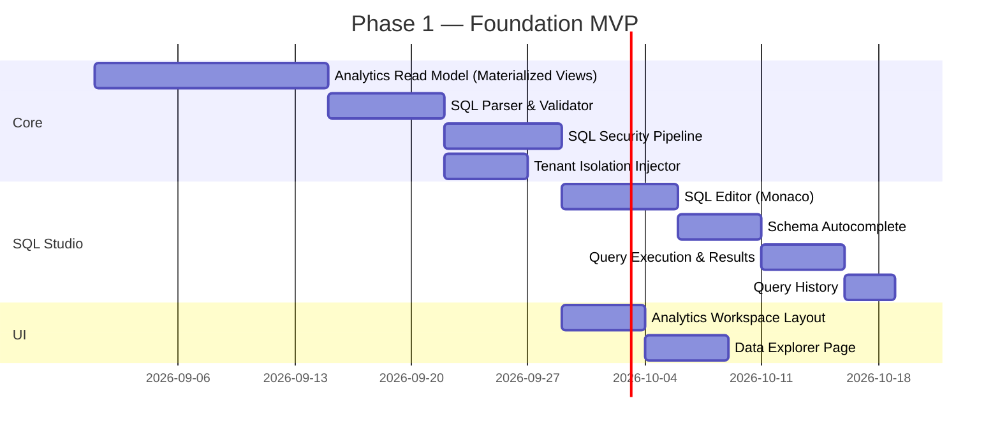

**Deliverables Phase 1:**

| # | Deliverable | Description |
|---|------------|-------------|
| 1 | Analytics Read Model | 12 materialized views + refresh strategy |
| 2 | SQL Parser & Validator | Parse, validate, whitelist check |
| 3 | SQL Security Pipeline | 5-layer security (parse → whitelist → permission → tenant → RLS) |
| 4 | SQL Editor | Monaco editor + syntax highlighting + error detection |
| 5 | Schema Autocomplete | Table/column/function autocomplete dari Data Dictionary |
| 6 | Query Execution | Execute SQL against Read Model, return results |
| 7 | Query History | Log semua queries, support rerun/duplicate |
| 8 | Performance Metrics | Execution time, rows returned, slow query warnings |
| 9 | Analytics Workspace | Layout dengan sidebar navigation |
| 10 | Data Explorer | Basic data exploration page |

### 19.2 Phase 2 — Visual Analytics

| # | Deliverable | Description |
|---|------------|-------------|
| 1 | Visual Query Builder | Drag & drop dimensions/measures/filters |
| 2 | SQL ↔ Visual Converter | Convert between SQL and Visual modes |
| 3 | Chart Builder | Chart creation with auto-recommendation |
| 4 | Chart Rendering | Bar, Line, Pie, Donut, Area, Scatter, KPI Card |
| 5 | Dataset Builder | Save query as reusable dataset |
| 6 | Data Dictionary | Metadata browser with search and browse |
| 7 | Dashboard Builder | Grid-based drag & drop dashboard |
| 8 | Dashboard Widgets | Chart, KPI Card, Table, Text widgets |

### 19.3 Phase 3 — Advanced Analytics

| # | Deliverable | Description |
|---|------------|-------------|
| 1 | PIVOT Engine | OLAP-style pivot tables |
| 2 | Metric Builder | Custom metric creation with formulas |
| 3 | KPI Builder | Advanced KPI with targets and thresholds |
| 4 | Data Lineage | Track metric origins and transformations |
| 5 | Scheduled Queries | Cron-based query scheduling |
| 6 | Data Alerts | Conditional alerts based on query results |
| 7 | Export Engine | CSV, Excel, PDF export |
| 8 | Query Performance Dashboard | Monitor query performance across users |

### 19.4 Phase 4 — AI-Powered Analytics

| # | Deliverable | Description |
|---|------------|-------------|
| 1 | AI Analyst (NLQ) | Natural language → SQL |
| 2 | AI Chart Suggestion | Auto-recommend chart types |
| 3 | AI Insight Generation | Auto-generate text insights from data |
| 4 | AI Query Optimization | Suggest query optimizations |
| 5 | Anomaly Detection | Detect data anomalies automatically |
| 6 | Forecasting | Time-series forecasting |
| 7 | Smart Alerts | AI-powered alert threshold suggestions |
| 8 | Conversational Analytics | Chat-based data exploration |

### 19.5 Phase Summary

| Phase | Focus | Status |
|-------|-------|--------|
| **Phase 1** | Foundation — SQL Studio + Security + Read Model | 📋 Planned |
| **Phase 2** | Visual Analytics — Builder + Charts + Dashboards | 📋 Planned |
| **Phase 3** | Advanced Analytics — PIVOT + Metrics + Lineage + Scheduling | 📋 Planned |
| **Phase 4** | AI-Powered — NLQ + Insights + Forecasting | 📋 Planned |

---

## 20. Security Considerations

### 20.1 Multi-Tenant Security

| Layer | Mechanism | Description |
|-------|-----------|-------------|
| **Network** | TLS 1.3 | Semua komunikasi terenkripsi |
| **Authentication** | NextAuth JWT | Session management via JWT |
| **Authorization** | RBAC + Permission Engine | Role-based + granular permissions |
| **SQL Injection** | Parser + Whitelist | SQL di-parse dan divalidasi sebelum eksekusi |
| **Tenant Isolation** | Automatic WHERE injection | `tenant_id` di-inject ke setiap query |
| **Row-Level Security** | Role-based filtering | Filter data berdasarkan role user |
| **Column-Level Security** | Whitelist check | Hanya kolom yang diizinkan yang bisa diakses |
| **Audit Trail** | Query history logging | Semua query dicatat untuk audit |

### 20.2 SQL Injection Prevention

```typescript
// STRATEGI PENCEGAHAN SQL INJECTION

// 1. SQL Parser — parse SQL sebelum eksekusi
const parsed = sqlParser.parse(userQuery);
if (!parsed.valid) {
    return reject('Invalid SQL syntax');
}

// 2. Statement Type Check — hanya SELECT yang diizinkan
if (parsed.ast.type !== 'SELECT') {
    return reject('Only SELECT queries are allowed');
}

// 3. Whitelist Check — hanya tabel/kolom yang terdaftar
const blocked = checkWhitelist(parsed.tables, parsed.columns);
if (blocked.length > 0) {
    return reject(`Blocked: ${blocked.join(', ')}`);
}

// 4. Parameterized Query — gunakan $1, $2, bukan string concatenation
const query = `SELECT * FROM mv_revenue WHERE tenant_id = $1`;
const result = await pgClient.query(query, [tenantId]);

// 5. Read-Only Connection — koneksi database khusus yang hanya bisa SELECT
// Dikonfigurasi di PostgreSQL: SET default_transaction_read_only = on;
```

### 20.3 Security Checklist

- [ ] SQL Parser menolak INSERT/UPDATE/DELETE/DROP/ALTER/TRUNCATE
- [ ] Whitelist check menolak akses ke tabel/kolom yang tidak terdaftar
- [ ] Tenant ID selalu di-inject, tidak bisa di-override oleh user
- [ ] Row-Level Security di-inject berdasarkan role user
- [ ] Semua query menggunakan parameterized query ($1, $2)
- [ ] Database connection menggunakan read-only transaction
- [ ] Query timeout 30 detik untuk mencegah long-running queries
- [ ] Rate limiting: maksimal 100 queries per menit per user
- [ ] Audit trail: semua query dicatat di `AnalyticsQueryHistory`
- [ ] Session validation: tenant ID dari JWT, bukan dari user input

---

## 21. Performance Considerations

### 21.1 Query Limits

| Limit | Value | Reason |
|-------|-------|--------|
| **Max rows returned** | 10,000 | Prevent memory overflow |
| **Max query execution time** | 30 detik | Prevent long-running queries |
| **Max concurrent queries per user** | 5 | Prevent resource hogging |
| **Max concurrent queries total** | 50 | Prevent database overload |
| **Max SQL query length** | 10,000 chars | Prevent abuse |
| **Max subquery depth** | 3 levels | Prevent complexity explosion |
| **Max dimensions per query** | 10 | Prevent overly complex GROUP BY |
| **Max measures per query** | 20 | Prevent overly complex SELECT |
| **Rate limit** | 100 req/min/user | Prevent abuse |

### 21.2 Connection Pooling

```typescript
// Analytics Read Model connection pool configuration
const ANALYTICS_POOL = {
    host: process.env.ANALYTICS_DB_HOST,
    port: 5432,
    database: 'qalcuity_analytics',
    max: 20,                    // Maximum connections
    min: 5,                     // Minimum connections
    idleTimeoutMillis: 30000,   // Close idle connections after 30s
    connectionTimeoutMillis: 5000, // Timeout when getting connection
    allowExitOnIdle: true,
};
```

### 21.3 Read Replicas

```mermaid
graph LR
    WRITE_DB["Primary DB — OLTP"]
    READ_REPLICA_1["Read Replica 1 — Analytics"]
    READ_REPLICA_2["Read Replica 2 — Analytics"]
    LB["Load Balancer"]

    WRITE_DB -->|"Async Replication"| READ_REPLICA_1
    WRITE_DB -->|"Async Replication"| READ_REPLICA_2
    LB -->|"Round Robin"| READ_REPLICA_1
    LB -->|"Round Robin"| READ_REPLICA_2
```

### 21.4 Performance Monitoring

| Metric | Target | Alert Threshold |
|--------|--------|----------------|
| **Avg query execution time** | < 500ms | > 2s |
| **P95 query execution time** | < 2s | > 5s |
| **Cache hit ratio** | > 80% | < 50% |
| **Materialized view freshness** | < 1 hour | > 6 hours |
| **Connection pool utilization** | < 70% | > 90% |
| **Query timeout rate** | < 1% | > 5% |

---

## Appendix A: Referensi

### Dokumen Terkait

| Document | Path | Description |
|----------|------|-------------|
| Analytics & Decision Intelligence | [`docs/ANALYTICS.md`](docs/ANALYTICS.md) | Architecture document existing (Phase 1-4 planning) |
| Architecture Vision | [`docs/ARCHITECTURE.md`](docs/ARCHITECTURE.md) | Qalcuity core architecture |
| AI Agent Rules | [`AGENT.md`](AGENT.md) | Development rules untuk AI Agent |
| Current Status | [`CURRENT.md`](CURRENT.md) | Status terkini project |
| Features | [`FEATURES.md`](FEATURES.md) | Daftar fitur dengan status |

### Package Existing

| Package | Path | Status |
|---------|------|--------|
| `@qalcuity/analytics` | [`packages/analytics/`](packages/analytics/) | 6 files — types, metrics, dimensions, engine, utils |
| `@qalcuity/db` | [`packages/db/`](packages/db/) | Prisma schema dengan 26 models |
| `@qalcuity/types` | [`packages/types/`](packages/types/) | Shared TypeScript types |
| `@qalcuity/validation` | [`packages/validation/`](packages/validation/) | Zod schemas |

### API Routes Existing

| Route | Path | Status |
|-------|------|--------|
| `/api/analytics/dashboard` | [`apps/web/app/api/analytics/`](apps/web/app/api/analytics/) | ✅ Implemented |
| `/api/analytics/explorer` | [`apps/web/app/api/analytics/explorer/`](apps/web/app/api/analytics/explorer/) | ✅ Implemented |
| `/api/analytics/kpi` | [`apps/web/app/api/analytics/kpi/`](apps/web/app/api/analytics/kpi/) | ✅ Implemented |
| `/api/analytics/metrics` | [`apps/web/app/api/analytics/metrics/`](apps/web/app/api/analytics/metrics/) | ✅ Implemented |
| `/api/analytics/alerts` | [`apps/web/app/api/analytics/alerts/`](apps/web/app/api/analytics/alerts/) | ✅ Implemented |
| `/api/analytics/reports` | [`apps/web/app/api/analytics/reports/`](apps/web/app/api/analytics/reports/) | ✅ Implemented |

---

> **Document maintained by:** Qalcuity AI Team
> **Version:** 1.0 — Architecture Design
> **Next Review:** Setelah Phase 1 MVP selesai
