# 📊 Analytics & Decision Intelligence — Architecture Document

> **"Mengubah data mentah bisnis menjadi insight yang dapat ditindaklanjuti — satu platform, satu source of truth, satu keputusan yang lebih baik."**

> **Last Updated:** 31 Agustus 2026
> **Document Version:** 1.1 — Architecture & Planning (Phase 1 Complete)
> **Status:** Phase 1 MVP ✅ Implemented | Phase 2–4 📋 Planned

---

## 📋 Daftar Isi

1. [Executive Summary](#1-executive-summary)
2. [System Architecture](#2-system-architecture)
3. [Data Layer Design](#3-data-layer-design)
4. [API Design](#4-api-design)
5. [Metric Layer — Single Source of Truth](#5-metric-layer--single-source-of-truth)
6. [Permission Model](#6-permission-model)
7. [Phase 1 Implementation Plan — MVP](#7-phase-1-implementation-plan--mvp)
8. [Phase 2–4 Roadmap](#8-phase-24-roadmap)
9. [Data Flow Diagrams](#9-data-flow-diagrams)
10. [Security Considerations](#10-security-considerations)
11. [Industry Configuration](#11-industry-configuration)
12. [Integration Points](#12-integration-points)

---

## 1. Executive Summary

### 1.1 Visi

Qalcuity Analytics & Decision Intelligence mengubah konsep **"Advanced Reporting"** menjadi sebuah **workspace analitik terpadu** yang memungkinkan pengguna menjelajahi, menganalisis, dan mengambil keputusan bisnis berdasarkan data real-time — tanpa perlu meninggalkan platform.

```
ERP → Unified Data → Analytics Workspace → Explore → Analyze → Dashboard → Insight → Decision
```

### 1.2 Goals

| Goal | Deskripsi |
|------|-----------|
| **Single Source of Truth** | Satu definisi metric yang digunakan di seluruh dashboard, laporan, dan alert |
| **Self-Service Analytics** | User bisnis bisa explore data tanpa bantuan IT/developer |
| **Actionable Insights** | Bukan sekadar chart — tapi alert, forecast, dan rekomendasi yang bisa ditindaklanjuti |
| **Industry-Agnostic Core** | Analytics engine bekerja untuk semua industri, dikonfigurasi per industri |
| **Security by Design** | Data access dikontrol secara granular — dataset, kolom, dan baris |

### 1.3 Principles

| Principle | Implementasi |
|-----------|-------------|
| **Core + Configuration** | Analytics engine di `packages/analytics/`, industry packs untuk customisasi |
| **Tenant Isolation** | Setiap query difilter `tenantId` — tidak ada cross-tenant access |
| **Permission Engine** | Integrasi dengan `@qalcuity/permissions` untuk dataset/column/row level |
| **Semantic Layer** | Metric didefinisikan sekali, digunakan di mana-mana |
| **Progressive Disclosure** | Phase 1 = MVP, Phase 2 = Advanced, Phase 3 = AI-powered, Phase 4 = Decision Intelligence |
| **Read-Only Safety** | Analytics queries tidak pernah mengubah data transaksional |

---

## 2. System Architecture

### 2.1 High-Level Architecture

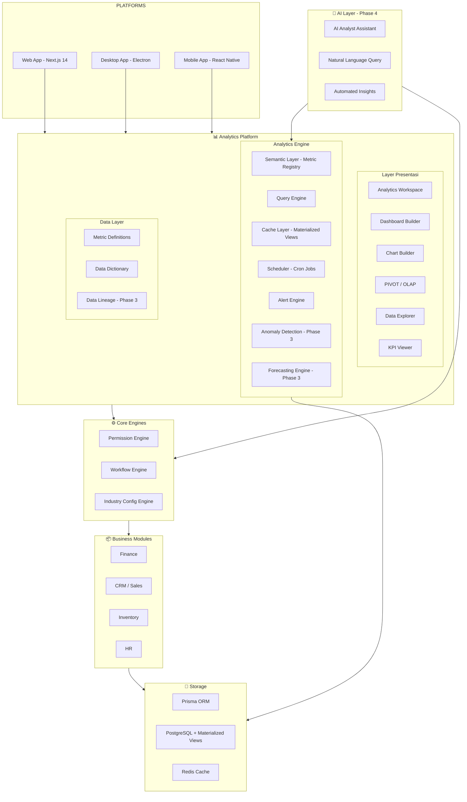

### 2.2 Package Structure

```
packages/
├── analytics/                    # 🆕 Core analytics package
│   ├── package.json
│   ├── tsconfig.json
│   └── src/
│       ├── index.ts              # Public API
│       ├── metric-registry.ts    # Metric definitions & formulas
│       ├── query-builder.ts      # Safe query construction
│       ├── semantic-layer.ts     # Semantic layer engine
│       ├── cache-manager.ts      # Materialized view management
│       ├── scheduler.ts          # Scheduled reports engine
│       ├── alert-engine.ts       # Data alerts engine
│       ├── anomaly-detector.ts   # Anomaly detection algorithms
│       ├── forecast-engine.ts    # Forecasting algorithms
│       ├── export-engine.ts      # Export to CSV/Excel/JSON/API
│       ├── pivot-engine.ts       # PIVOT/OLAP operations
│       ├── drill-down.ts         # Hierarchical drill-down logic
│       ├── data-lineage.ts       # Data lineage tracking
│       ├── permission-guard.ts   # Dataset/column/row permissions
│       └── types.ts              # Analytics-specific types

apps/web/
├── app/dashboard/analytics/      # 🆕 Analytics workspace pages
│   ├── layout.tsx                # Analytics layout with sidebar
│   ├── page.tsx                  # Overview dashboard
│   ├── explorer/
│   │   └── page.tsx              # Data Explorer
│   ├── reports/
│   │   ├── page.tsx              # Report list
│   │   └── [id]/
│   │       └── page.tsx          # Report viewer
│   ├── dashboards/
│   │   ├── page.tsx              # Dashboard list
│   │   ├── builder/
│   │   │   └── page.tsx          # Dashboard builder
│   │   └── [id]/
│   │       └── page.tsx          # Dashboard viewer
│   ├── pivot/
│   │   └── page.tsx              # PIVOT/OLAP workspace
│   ├── kpi/
│   │   └── page.tsx              # KPI builder & viewer
│   ├── metrics/
│   │   └── page.tsx              # Metric definitions
│   ├── charts/
│   │   └── page.tsx              # Chart builder
│   ├── cohort/
│   │   └── page.tsx              # Cohort analysis
│   ├── forecast/
│   │   └── page.tsx              # Forecasting workspace
│   ├── scheduled/
│   │   └── page.tsx              # Scheduled reports
│   ├── export/
│   │   └── page.tsx              # Data export center
│   └── dictionary/
│       └── page.tsx              # Data dictionary browser
│
├── app/api/analytics/            # 🆕 Analytics API routes
│   ├── explorer/
│   │   └── route.ts              # Data Explorer query
│   ├── reports/
│   │   ├── route.ts              # CRUD saved reports
│   │   └── [id]/
│   │       └── route.ts          # Report detail
│   ├── dashboards/
│   │   ├── route.ts              # CRUD dashboards
│   │   ├── [id]/
│   │   │   ├── route.ts          # Dashboard detail
│   │   │   └── widgets/
│   │   │       └── route.ts      # Widget CRUD
│   │   └── [id]/layout/
│   │       └── route.ts          # Dashboard layout update
│   ├── kpi/
│   │   ├── route.ts              # CRUD KPIs
│   │   └── [id]/
│   │       ├── route.ts          # KPI detail
│   │       └── evaluate/
│   │           └── route.ts      # KPI evaluation
│   ├── metrics/
│   │   ├── route.ts              # Metric registry CRUD
│   │   └── evaluate/
│   │       └── route.ts          # Metric evaluation
│   ├── pivot/
│   │   └── route.ts              # PIVOT query
│   ├── charts/
│   │   ├── route.ts              # Chart CRUD
│   │   └── [id]/
│   │       └── route.ts          # Chart data
│   ├── scheduled/
│   │   ├── route.ts              # CRUD scheduled reports
│   │   └── [id]/
│   │       └── route.ts          # Schedule detail
│   ├── alerts/
│   │   ├── route.ts              # CRUD alert rules
│   │   └── [id]/
│   │       └── route.ts          # Alert rule detail
│   ├── export/
│   │   └── route.ts              # Export endpoint
│   ├── dictionary/
│   │   └── route.ts              # Data dictionary
│   ├── lineage/
│   │   └── route.ts              # Data lineage
│   └── query/
│       └── route.ts              # SQL workspace - Phase 3
```

### 2.3 Data Flow Architecture

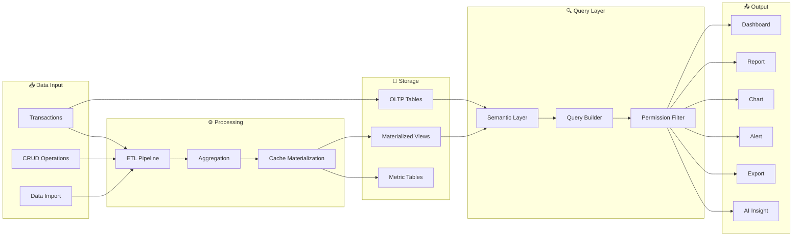

---

## 3. Data Layer Design

### 3.1 Prisma Models Baru

Berikut model-model Prisma baru yang diperlukan untuk Analytics & Decision Intelligence:

#### 3.1.1 Metric Definition

> **Single source of truth untuk semua metric yang digunakan di platform.**

```prisma
model MetricDefinition {
  id            String   @id @default(cuid())
  tenantId      String
  tenant        Tenant   @relation(fields: [tenantId], references: [id])

  // Identity
  code          String   // e.g. "REVENUE_TOTAL", "GROSS_PROFIT_MARGIN"
  name          String   // e.g. "Total Revenue"
  description   String?  // Definisi bisnis dari metric

  // Formula
  formula       String   // e.g. "SUM(invoice.total) WHERE status != CANCELLED"
  formulaType   String   @default("EXPRESSION") // EXPRESSION, SQL, PYTHON
  sourceTables  String   // JSON array: ["Invoice", "InvoiceItem"]

  // Classification
  category      String   // FINANCE, CRM, INVENTORY, HR, SALES, OPERATION
  subcategory   String?  // e.g. "Revenue", "Expense", "Profitability"
  unit          String?  // CURRENCY, PERCENTAGE, COUNT, DAYS, HOURS
  currency      String?  // IDR, USD (null if not currency-based)
  decimalPlaces Int      @default(2)

  // Aggregation
  defaultAgg    String   @default("SUM") // SUM, AVG, COUNT, MIN, MAX, DISTINCT_COUNT
  timeGrain     String?  // DAY, WEEK, MONTH, QUARTER, YEAR

  // Metadata
  isActive      Boolean  @default(true)
  isSystem      Boolean  @default(false) // System metrics cannot be deleted
  tags          String?  // JSON array of tags
  lastComputed  DateTime?
  createdAt     DateTime @default(now())
  updatedAt     DateTime @updatedAt

  // Relations
  dictionary    DataDictionaryEntry? @relation(fields: [id], references: [metricId])
  kpis          KPI[]
  savedAnalyses SavedAnalysis[]
  alertRules    AlertRule[]

  @@unique([tenantId, code])
  @@index([tenantId])
  @@index([category])
  @@index([code])
}
```

#### 3.1.2 Data Dictionary

> **Metadata browser — definisi, source, formula, dan lineage dari setiap metric dan field.**

```prisma
model DataDictionaryEntry {
  id            String   @id @default(cuid())
  tenantId      String
  tenant        Tenant   @relation(fields: [tenantId], references: [id])

  // Identity
  metricId      String   @unique
  metric        MetricDefinition @relation(fields: [metricId], references: [id])

  // Business Definition
  businessDef   String   // Definisi dalam bahasa bisnis
  technicalDef  String?  // Definisi teknis / SQL expression
  owner         String?  // Nama/role yang responsible
  department    String?  // Department yang ownership

  // Source
  sourceModule  String   // FINANCE, CRM, INVENTORY, HR
  sourceModel   String   // Prisma model name
  sourceField   String?  // Specific field if applicable

  // Lineage (JSON)
  upstreamDeps  String?  // JSON: array of metricIds yang bergantung
  downstreamDeps String? // JSON: array of metricIds yang bergantung padanya

  // Quality
  freshness     String?  // REALTIME, HOURLY, DAILY, WEEKLY
  reliability   String?  // HIGH, MEDIUM, LOW
  lastVerified  DateTime?
  notes         String?

  createdAt     DateTime @default(now())
  updatedAt     DateTime @updatedAt

  @@index([tenantId])
  @@index([sourceModule])
}
```

#### 3.1.3 KPI Definition

> **User bisa mendefinisikan KPI dengan formula, target, threshold, dan notification.**

```prisma
model KPI {
  id            String   @id @default(cuid())
  tenantId      String
  tenant        Tenant   @relation(fields: [tenantId], references: [id])

  // Identity
  name          String   // e.g. "Monthly Revenue Target"
  description   String?
  code          String   // e.g. "KPI_REVENUE_MONTHLY"

  // Formula & Target
  metricId      String?
  metric        MetricDefinition? @relation(fields: [metricId], references: [id])
  formula       String   // Custom formula if not using metric directly
  targetValue   Decimal  @db.Decimal(15, 2)
  thresholdYellow Decimal? @db.Decimal(15, 2) // Warning threshold
  thresholdRed  Decimal? @db.Decimal(15, 2)  // Critical threshold

  // Direction
  higherIsBetter Boolean @default(true) // true = di atas target bagus

  // Period
  period        String   @default("MONTHLY") // DAILY, WEEKLY, MONTHLY, QUARTERLY, YEARLY
  startDate     DateTime?
  endDate       DateTime?

  // Ownership
  ownerId       String?  // userId
  ownerName     String?  // Denormalized
  department    String?
  branchId      String?

  // Notification
  notifyOnBreach Boolean @default(true)
  notifyEmails   String? // JSON array of email addresses
  notifySlack    String? // Slack webhook URL

  // Status
  isActive      Boolean  @default(true)
  lastEvaluated DateTime?
  lastValue     Decimal? @db.Decimal(15, 2)
  lastStatus    String?  // ON_TRACK, WARNING, CRITICAL, N/A
  trend         String?  // UP, DOWN, STABLE

  createdAt     DateTime @default(now())
  updatedAt     DateTime @updatedAt

  evaluations   KPIEvaluation[]

  @@unique([tenantId, code])
  @@index([tenantId])
  @@index([period])
}
```

#### 3.1.4 KPI Evaluation History

```prisma
model KPIEvaluation {
  id            String   @id @default(cuid())
  tenantId      String
  tenant        Tenant   @relation(fields: [tenantId], references: [id])

  kpiId         String
  kpi           KPI      @relation(fields: [kpiId], references: [id])

  evaluatedAt   DateTime @default(now())
  period        String   // "2026-08", "2026-W35", etc.
  actualValue   Decimal  @db.Decimal(15, 2)
  targetValue   Decimal  @db.Decimal(15, 2)
  status        String   // ON_TRACK, WARNING, CRITICAL, N/A
  percentOfTarget Decimal @db.Decimal(7, 2) // e.g. 105.5 = 105.5%

  @@index([tenantId])
  @@index([kpiId])
  @@index([evaluatedAt])
}
```

#### 3.1.5 Dashboard

> **Drag-and-drop dashboard builder dengan visibility control.**

```prisma
model Dashboard {
  id            String   @id @default(cuid())
  tenantId      String
  tenant        Tenant   @relation(fields: [tenantId], references: [id])

  // Identity
  name          String
  description   String?
  slug          String

  // Layout
  layout        String   @default("[]") // JSON: grid layout configuration
  theme         String?  // LIGHT, DARK, AUTO

  // Visibility & Access
  visibility    String   @default("PRIVATE") // PRIVATE, TEAM, DEPARTMENT, ORGANIZATION
  ownerUserId   String
  ownerName     String?
  department    String?
  allowedRoles  String?  // JSON array of allowed roles
  allowedUsers  String?  // JSON array of userIds

  // Metadata
  isDefault     Boolean  @default(false)
  isTemplate    Boolean  @default(false)
  tags          String?  // JSON array
  viewCount     Int      @default(0)
  lastViewedAt  DateTime?

  createdAt     DateTime @default(now())
  updatedAt     DateTime @updatedAt
  deletedAt     DateTime?

  widgets       DashboardWidget[]

  @@unique([tenantId, slug])
  @@index([tenantId])
  @@index([ownerUserId])
}
```

#### 3.1.6 Dashboard Widget

```prisma
model DashboardWidget {
  id            String   @id @default(cuid())
  tenantId      String
  tenant        Tenant   @relation(fields: [tenantId], references: [id])

  dashboardId   String
  dashboard     Dashboard @relation(fields: [dashboardId], references: [id], onDelete: Cascade)

  // Widget Config
  title         String
  type          String   // CHART, KPI_CARD, TABLE, TEXT, IMAGE, METRIC
  chartType     String?  // BAR, PIE, LINE, AREA, DONUT, SCATTER, FUNNEL
  size          String   @default("MEDIUM") // SMALL, MEDIUM, LARGE, FULL_WIDTH

  // Grid Position
  gridX         Int      @default(0)
  gridY         Int      @default(0)
  gridW         Int      @default(6)  // Column span (1-12)
  gridH         Int      @default(4)  // Row span

  // Data Source
  dataSource    String   @default("METRIC") // METRIC, REPORT, QUERY, STATIC
  metricId      String?
  reportId      String?
  queryConfig   String?  // JSON: complex query configuration
  staticData    String?  // JSON: for static widgets

  // Display Config
  config        String   @default("{}") // JSON: colors, labels, formatting options
  refreshInterval Int?   // seconds, null = no auto-refresh

  createdAt     DateTime @default(now())
  updatedAt     DateTime @updatedAt

  @@index([tenantId])
  @@index([dashboardId])
}
```

#### 3.1.7 Saved Report / Analysis

```prisma
model SavedAnalysis {
  id            String   @id @default(cuid())
  tenantId      String
  tenant        Tenant   @relation(fields: [tenantId], references: [id])

  // Identity
  name          String
  description   String?
  slug          String

  // Query Definition
  dataset       String   // Source dataset / table
  dimensions    String   // JSON array: [{field, alias, aggregation}]
  measures      String   // JSON array: [{field, aggregation, alias}]
  filters       String?  // JSON array: [{field, operator, value}]
  sortConfig    String?  // JSON: {field, order}
  groupBy       String?  // JSON array
  dateRange     String?  // JSON: {start, end, preset}

  // Output Config
  outputType    String   @default("TABLE") // TABLE, CHART, PIVOT
  chartType     String?  // BAR, PIE, LINE, etc.
  pivotConfig   String?  // JSON: {rows, columns, values}

  // Ownership & Sharing
  ownerId       String
  ownerName     String?
  visibility    String   @default("PRIVATE") // PRIVATE, TEAM, DEPARTMENT, ORGANIZATION
  allowedUsers  String?  // JSON array of userIds
  tags          String?  // JSON array

  // Execution Metadata
  lastRunAt     DateTime?
  lastRunBy     String?
  runCount      Int      @default(0)
  avgRunTimeMs  Int?     // Average execution time in milliseconds

  createdAt     DateTime @default(now())
  updatedAt     DateTime @updatedAt
  deletedAt     DateTime?

  metric        MetricDefinition? @relation(fields: [tenantId], references: [id])

  @@unique([tenantId, slug])
  @@index([tenantId])
  @@index([ownerId])
  @@index([dataset])
}
```

#### 3.1.8 Scheduled Report

```prisma
model ScheduledReport {
  id            String   @id @default(cuid())
  tenantId      String
  tenant        Tenant   @relation(fields: [tenantId], references: [id])

  // Identity
  name          String
  description   String?

  // Source
  analysisId    String?
  dashboardId   String?
  reportType    String   // ANALYSIS, DASHBOARD, CUSTOM

  // Schedule
  cronExpression String  // "0 8 * * 1" = setiap Senin jam 8
  frequency     String   // DAILY, WEEKLY, MONTHLY, QUARTERLY
  dayOfWeek     Int?     // 0=Sunday, 1=Monday, etc.
  dayOfMonth    Int?     // 1-31
  timeOfDay     String   @default("08:00") // HH:mm

  // Output
  outputFormat  String   @default("PDF") // PDF, EXCEL, CSV, JSON
  recipients    String   // JSON array: [{email, name}]
  sendEmail     Boolean  @default(true)
  attachFile    Boolean  @default(true)
  dashboardLink Boolean  @default(false) // Include link to dashboard

  // Status
  isActive      Boolean  @default(true)
  lastRunAt     DateTime?
  lastRunStatus String?  // SUCCESS, FAILED, SKIPPED
  lastError     String?
  nextRunAt     DateTime?
  runCount      Int      @default(0)

  createdAt     DateTime @default(now())
  updatedAt     DateTime @updatedAt

  executions    ScheduledReportExecution[]

  @@index([tenantId])
  @@index([isActive])
  @@index([nextRunAt])
}
```

#### 3.1.9 Scheduled Report Execution Log

```prisma
model ScheduledReportExecution {
  id            String   @id @default(cuid())
  tenantId      String
  tenant        Tenant   @relation(fields: [tenantId], references: [id])

  scheduledReportId String
  scheduledReport   ScheduledReport @relation(fields: [scheduledReportId], references: [id])

  executedAt    DateTime @default(now())
  status        String   // SUCCESS, FAILED, SKIPPED
  outputFormat  String?
  fileUrl       String?  // URL to generated file
  fileSize      Int?     // File size in bytes
  recipients    String?  // JSON array of sent-to emails
  durationMs    Int?     // Execution duration
  error         String?  // Error message if failed

  @@index([tenantId])
  @@index([scheduledReportId])
  @@index([executedAt])
}
```

#### 3.1.10 Alert Rule

> **Conditional alerts — IF metric < threshold THEN notify.**

```prisma
model AlertRule {
  id            String   @id @default(cuid())
  tenantId      String
  tenant        Tenant   @relation(fields: [tenantId], references: [id])

  // Identity
  name          String
  description   String?

  // Condition
  metricId      String?
  metric        MetricDefinition? @relation(fields: [metricId], references: [id])
  dataSource    String   // Direct metric evaluation or custom query
  condition     String   // GREATER_THAN, LESS_THAN, EQUALS, NOT_EQUALS, CHANGE_PERCENT
  threshold     Decimal  @db.Decimal(15, 2)
  threshold2    Decimal? @db.Decimal(15, 2) // For RANGE checks
  period        String   @default("DAILY") // REALTIME, HOURLY, DAILY, WEEKLY

  // Notification
  severity      String   @default("WARNING") // INFO, WARNING, CRITICAL
  notifyEmails  String?  // JSON array
  notifySlack   String?  // Slack webhook URL
  notifyInApp   Boolean  @default(true)

  // Control Engine Integration
  controlAction String?  // ACTION to trigger in Control Engine
  controlParams String?  // JSON: parameters for control action

  // Status
  isActive      Boolean  @default(true)
  lastTriggered DateTime?
  lastValue     Decimal? @db.Decimal(15, 2)
  triggerCount  Int      @default(0)
  cooldownMinutes Int    @default(60) // Minimum minutes between alerts

  createdAt     DateTime @default(now())
  updatedAt     DateTime @updatedAt

  triggers      AlertTrigger[]

  @@index([tenantId])
  @@index([isActive])
}
```

#### 3.1.11 Alert Trigger Log

```prisma
model AlertTrigger {
  id            String   @id @default(cuid())
  tenantId      String
  tenant        Tenant   @relation(fields: [tenantId], references: [id])

  alertRuleId   String
  alertRule     AlertRule @relation(fields: [alertRuleId], references: [id])

  triggeredAt   DateTime @default(now())
  actualValue   Decimal  @db.Decimal(15, 2)
  threshold     Decimal  @db.Decimal(15, 2)
  condition     String   // The condition that was met
  severity      String
  acknowledged  Boolean  @default(false)
  acknowledgedBy String?
  acknowledgedAt DateTime?
  notes         String?

  @@index([tenantId])
  @@index([alertRuleId])
  @@index([triggeredAt])
}
```

#### 3.1.12 Analytics Query Log

> **Audit trail untuk semua analytics queries — query apa yang dijalankan, oleh siapa, berapa lama.**

```prisma
model AnalyticsQueryLog {
  id            String   @id @default(cuid())
  tenantId      String
  tenant        Tenant   @relation(fields: [tenantId], references: [id])

  userId        String
  userName      String?

  // Query Details
  queryType     String   // EXPLORER, PIVOT, REPORT, DASHBOARD, KPI, EXPORT, SQL
  dataset       String?  // Dataset yang diakses
  dimensions    String?  // JSON: dimensions used
  measures      String?  // JSON: measures used
  filters       String?  // JSON: filters applied
  rawQuery      String?  // Raw SQL for SQL workspace (masked)

  // Performance
  executionMs   Int      // Execution time in milliseconds
  rowCount      Int?     // Number of rows returned
  fromCache     Boolean  @default(false)

  // Metadata
  status        String   // SUCCESS, FAILED, TIMEOUT, BLOCKED
  errorMessage  String?
  ipAddress     String?
  userAgent     String?

  createdAt     DateTime @default(now())

  @@index([tenantId])
  @@index([userId])
  @@index([createdAt])
  @@index([queryType])
}
```

### 3.2 Materialized Views Strategy

PostgreSQL materialized views digunakan untuk mempercepat query analytics tanpa membebani database transaksional.

#### 3.2.1 Daftar Materialized Views

| View Name | Purpose | Refresh | Source Tables |
|-----------|---------|---------|---------------|
| `mv_monthly_revenue` | Revenue per bulan per tenant | Daily | Invoice, InvoiceItem |
| `mv_monthly_expense` | Expense per bulan per tenant | Daily | Payment (type=EXPENSE) |
| `mv_sales_by_customer` | Sales aggregation per customer | Daily | Invoice, Contact |
| `mv_sales_by_product` | Sales aggregation per product | Daily | InvoiceItem, Product |
| `mv_sales_by_category` | Sales aggregation per kategori | Daily | InvoiceItem, Product, Category |
| `mv_inventory_summary` | Current stock levels + value | Hourly | Product, StockMovement |
| `mv_hr_summary` | Employee stats per departemen | Daily | Employee, Attendance, Payroll |
| `mv_top_products` | Top products by revenue | Daily | InvoiceItem, Product |
| `mv_top_customers` | Top customers by revenue | Daily | Invoice, Contact |
| `mv_cash_flow` | Cash flow summary | Daily | Payment |
| `mv_deal_pipeline` | Deal pipeline summary | Hourly | Deal |
| `mv_lead_funnel` | Lead conversion funnel | Daily | Lead |

#### 3.2.2 Refresh Strategy

```sql
-- Contoh: Refresh materialized views
-- Dijalankan oleh scheduler (cron) atau trigger

REFRESH MATERIALIZED VIEW CONCURRENTLY mv_monthly_revenue;
REFRESH MATERIALIZED VIEW CONCURRENTLY mv_monthly_expense;
REFRESH MATERIALIZED VIEW CONCURRENTLY mv_sales_by_customer;
-- ... dst

-- CONCURRENTLY memungkinkan refresh tanpa lock read
-- Memerlukan UNIQUE INDEX pada materialized view
```

#### 3.2.3 Index Strategy

Setiap materialized view harus memiliki:
- **UNIQUE INDEX** — wajib untuk `REFRESH MATERIALIZED VIEW CONCURRENTLY`
- **Tenant index** — untuk filter tenant
- **Date index** — untuk range queries
- **Aggregate field index** — untuk sorting/limiting

```sql
-- Contoh indexes untuk mv_monthly_revenue
CREATE UNIQUE INDEX idx_mv_revenue_pk ON mv_monthly_revenue(tenant_id, month);
CREATE INDEX idx_mv_revenue_tenant ON mv_monthly_revenue(tenant_id);
CREATE INDEX idx_mv_revenue_month ON mv_monthly_revenue(month);
```

### 3.3 Semantic Layer Design

#### 3.3.1 Arsitektur

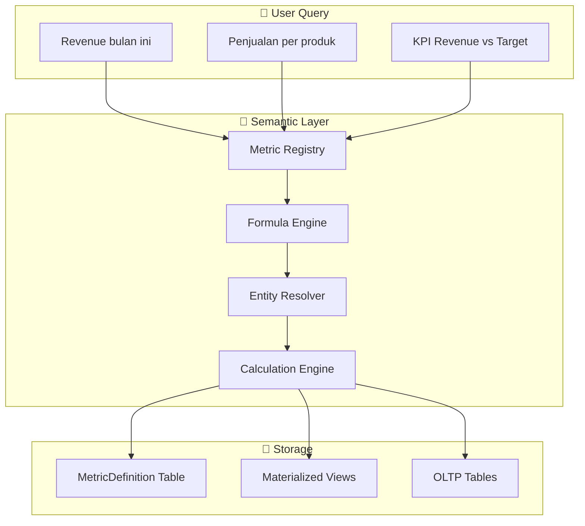

#### 3.3.2 Metric Registry Structure

```typescript
// Contoh metric registry configuration
const METRIC_REGISTRY = {
  REVENUE_TOTAL: {
    code: 'REVENUE_TOTAL',
    name: 'Total Revenue',
    formula: 'SUM(invoice.total) WHERE invoice.status NOT IN (CANCELLED)',
    source: ['Invoice'],
    category: 'FINANCE',
    unit: 'CURRENCY',
    defaultAgg: 'SUM',
    dimensions: ['month', 'quarter', 'year', 'branch', 'salesperson', 'customer'],
  },
  GROSS_PROFIT: {
    code: 'GROSS_PROFIT',
    name: 'Gross Profit',
    formula: 'REVENUE_TOTAL - COST_OF_GOODS_SOLD',
    source: ['Invoice', 'Product'],
    category: 'FINANCE',
    unit: 'CURRENCY',
    dependsOn: ['REVENUE_TOTAL', 'COGS'],
  },
  GROSS_PROFIT_MARGIN: {
    code: 'GROSS_PROFIT_MARGIN',
    name: 'Gross Profit Margin',
    formula: '(GROSS_PROFIT / REVENUE_TOTAL) * 100',
    source: ['Invoice', 'Product'],
    category: 'FINANCE',
    unit: 'PERCENTAGE',
    dependsOn: ['GROSS_PROFIT', 'REVENUE_TOTAL'],
  },
  CUSTOMER_ACQUISITION_COST: {
    code: 'CAC',
    name: 'Customer Acquisition Cost',
    formula: 'TOTAL_SALES_MARKETING_EXPENSE / NEW_CUSTOMERS_COUNT',
    source: ['Payment', 'Contact'],
    category: 'SALES',
    unit: 'CURRENCY',
  },
  INVENTORY_TURNOVER: {
    code: 'INVENTORY_TURNOVER',
    name: 'Inventory Turnover Ratio',
    formula: 'COGS / AVG_INVENTORY_VALUE',
    source: ['Product', 'StockMovement', 'InvoiceItem'],
    category: 'INVENTORY',
    unit: 'RATIO',
  },
  EMPLOYEE_PRODUCTIVITY: {
    code: 'EMP_PROD',
    name: 'Employee Productivity',
    formula: 'REVENUE_TOTAL / ACTIVE_EMPLOYEES_COUNT',
    source: ['Invoice', 'Employee'],
    category: 'HR',
    unit: 'CURRENCY_PER_PERSON',
    dependsOn: ['REVENUE_TOTAL'],
  },
};
```

---

## 4. API Design

### 4.1 Endpoint Structure

Semua endpoint analytics menggunakan prefix `/api/analytics/` dan mengikuti pattern yang sudah ada di codebase.

#### 4.1.1 Data Explorer

```
POST   /api/analytics/explorer          — Eksekusi data exploration query
GET    /api/analytics/explorer/datasets — List available datasets
GET    /api/analytics/explorer/fields   — List fields untuk dataset tertentu
```

**Request Body — Explorer Query:**

```typescript
interface ExplorerQuery {
  dataset: string;          // e.g. "invoice", "product", "employee"
  dimensions: Array<{
    field: string;          // e.g. "createdAt", "status", "contact.name"
    alias?: string;
    granularity?: 'day' | 'week' | 'month' | 'quarter' | 'year';
  }>;
  measures: Array<{
    field: string;          // e.g. "total", "quantity", "id"
    aggregation: 'SUM' | 'AVG' | 'COUNT' | 'MIN' | 'MAX' | 'DISTINCT_COUNT';
    alias?: string;
  }>;
  filters?: Array<{
    field: string;
    operator: 'equals' | 'not_equals' | 'greater_than' | 'less_than' |
              'contains' | 'starts_with' | 'in' | 'between' | 'is_null' | 'is_not_null';
    value: unknown;
    conjunction?: 'AND' | 'OR';
  }>;
  sort?: Array<{
    field: string;
    order: 'asc' | 'desc';
  }>;
  limit?: number;           // Max 10000
  offset?: number;
}
```

**Response:**

```typescript
interface ExplorerResponse {
  success: boolean;
  data: {
    columns: Array<{
      field: string;
      alias: string;
      type: 'string' | 'number' | 'date' | 'currency' | 'percentage';
    }>;
    rows: unknown[][];
    totalRows: number;
    executionMs: number;
    fromCache: boolean;
  };
}
```

#### 4.1.2 Saved Reports / Analysis

```
GET    /api/analytics/reports           — List saved reports
POST   /api/analytics/reports           — Create new report
GET    /api/analytics/reports/:id       — Get report detail
PUT    /api/analytics/reports/:id       — Update report
DELETE /api/analytics/reports/:id       — Delete report (soft delete)
POST   /api/analytics/reports/:id/run   — Execute report & return results
POST   /api/analytics/reports/:id/duplicate — Duplicate report
```

#### 4.1.3 Dashboards

```
GET    /api/analytics/dashboards              — List dashboards
POST   /api/analytics/dashboards              — Create dashboard
GET    /api/analytics/dashboards/:id          — Get dashboard with widgets
PUT    /api/analytics/dashboards/:id          — Update dashboard
DELETE /api/analytics/dashboards/:id          — Delete dashboard (soft delete)
PUT    /api/analytics/dashboards/:id/layout   — Update layout (grid positions)
POST   /api/analytics/dashboards/:id/widgets  — Add widget
PUT    /api/analytics/dashboards/:id/widgets/:widgetId — Update widget
DELETE /api/analytics/dashboards/:id/widgets/:widgetId — Remove widget
```

#### 4.1.4 KPIs

```
GET    /api/analytics/kpi                  — List KPIs
POST   /api/analytics/kpi                  — Create KPI
GET    /api/analytics/kpi/:id              — Get KPI detail
PUT    /api/analytics/kpi/:id              — Update KPI
DELETE /api/analytics/kpi/:id              — Delete KPI
POST   /api/analytics/kpi/:id/evaluate     — Evaluate KPI (compute current value)
POST   /api/analytics/kpi/evaluate-all     — Evaluate all KPIs
GET    /api/analytics/kpi/:id/history      — Get KPI evaluation history
```

#### 4.1.5 Metric Registry

```
GET    /api/analytics/metrics              — List all metrics
POST   /api/analytics/metrics              — Create metric definition
GET    /api/analytics/metrics/:code        — Get metric by code
PUT    /api/analytics/metrics/:code        — Update metric
DELETE /api/analytics/metrics/:code        — Delete metric (non-system only)
POST   /api/analytics/metrics/evaluate     — Evaluate metric with params
```

#### 4.1.6 PIVOT / OLAP

```
POST   /api/analytics/pivot                — Execute PIVOT query
```

**Request Body:**

```typescript
interface PivotQuery {
  dataset: string;
  rows: Array<{ field: string; alias?: string }>;
  columns: Array<{ field: string; alias?: string }>;
  values: Array<{
    field: string;
    aggregation: 'SUM' | 'AVG' | 'COUNT' | 'MIN' | 'MAX';
    alias?: string;
  }>;
  filters?: ExplorerQuery['filters'];
  page?: number;
  pageSize?: number;
}
```

#### 4.1.7 Charts

```
GET    /api/analytics/charts               — List saved charts
POST   /api/analytics/charts               — Create chart config
GET    /api/analytics/charts/:id           — Get chart
PUT    /api/analytics/charts/:id           — Update chart
DELETE /api/analytics/charts/:id           — Delete chart
POST   /api/analytics/charts/:id/data      — Get chart data
```

#### 4.1.8 Data Alerts

```
GET    /api/analytics/alerts               — List alert rules
POST   /api/analytics/alerts               — Create alert rule
GET    /api/analytics/alerts/:id           — Get alert detail
PUT    /api/analytics/alerts/:id           — Update alert rule
DELETE /api/analytics/alerts/:id           — Delete alert rule
GET    /api/analytics/alerts/:id/triggers  — Get trigger history
POST   /api/analytics/alerts/:id/acknowledge — Acknowledge alert
```

#### 4.1.9 Scheduled Reports

```
GET    /api/analytics/scheduled            — List schedules
POST   /api/analytics/scheduled            — Create schedule
GET    /api/analytics/scheduled/:id        — Get schedule detail
PUT    /api/analytics/scheduled/:id        — Update schedule
DELETE /api/analytics/scheduled/:id        — Delete schedule
POST   /api/analytics/scheduled/:id/run    — Run schedule immediately
GET    /api/analytics/scheduled/:id/executions — Get execution history
```

#### 4.1.10 Export

```
POST   /api/analytics/export               — Generate export
GET    /api/analytics/export/:id           — Download exported file
```

**Request Body:**

```typescript
interface ExportRequest {
  source: 'explorer' | 'report' | 'dashboard' | 'pivot' | 'kpi';
  sourceId?: string;
  format: 'csv' | 'excel' | 'json' | 'pdf';
  query?: ExplorerQuery;   // For ad-hoc exports
  options?: {
    includeHeaders?: boolean;
    dateFormat?: string;
    currencyFormat?: string;
    maxRows?: number;
  };
}
```

#### 4.1.11 Data Dictionary

```
GET    /api/analytics/dictionary           — List dictionary entries
GET    /api/analytics/dictionary/:metricId — Get entry detail
PUT    /api/analytics/dictionary/:metricId — Update entry
GET    /api/analytics/dictionary/search    — Search by name/description
```

#### 4.1.12 Data Lineage (Phase 3)

```
GET    /api/analytics/lineage              — Get lineage graph
GET    /api/analytics/lineage/:metricId    — Get lineage for specific metric
```

### 4.2 Standard Error Responses

```typescript
// Semua error mengikuti pattern yang sudah ada
{
  success: false,
  error: "Unauthorized"           // 401
}
{
  success: false,
  error: "Forbidden: Anda tidak memiliki akses ke dataset ini"  // 403
}
{
  success: false,
  error: "Query timeout — query melebihi batas waktu 30 detik"  // 408
}
{
  success: false,
  error: "Invalid query: field 'xyz' tidak ditemukan dalam dataset"  // 400
}
```

---

## 5. Metric Layer — Single Source of Truth

### 5.1 Filosofi

> **Satu definisi "Revenue" yang digunakan di SELURUH platform** — dashboard, report, KPI, alert, dan forecast.

Tanpa semantic layer, "Revenue" bisa didefinisikan berbeda di tempat berbeda:
- Dashboard: `SUM(invoice.total)` — termasuk cancelled?
- Report: `SUM(invoice.total) WHERE status = PAID` — hanya paid
- KPI: `SUM(payment.amount)` — dari payment, bukan invoice

**Semantic Layer memastikan semua menggunakan definisi yang SAMA.**

### 5.2 Metric Categories

| Category | Metrics | Sumber Data |
|----------|---------|-------------|
| **Finance** | Revenue, COGS, Gross Profit, Net Profit, OPEX, Cash Flow, AR Aging, AP Aging | Invoice, Payment, CoA |
| **Sales** | Deal Count, Pipeline Value, Win Rate, Avg Deal Size, Sales Cycle Length, Conversion Rate | Deal, Lead, Quotation |
| **Inventory** | Stock Value, Turnover Ratio, Dead Stock, Stockout Count, Reorder Point | Product, StockMovement |
| **HR** | Headcount, Attrition Rate, Cost per Employee, Attendance Rate, Leave Utilization | Employee, Attendance, Payroll |
| **CRM** | Customer Count, Customer LTV, CAC, Churn Rate, NPS | Contact, Invoice, Deal |
| **Cross-Module** | Revenue per Employee, Inventory Turnover, Customer Concentration | Multiple sources |

### 5.3 Formula Registry Pattern

```typescript
// Setiap metric memiliki formula yang di-resolve oleh Semantic Layer
interface MetricFormula {
  code: string;
  expression: string;
  dependencies: string[];     // Other metrics this depends on
  resolve: (params: ResolveParams) => ResolvedQuery;
}

// Contoh resolution chain
// GROSS_PROFIT_MARGIN
//   → depends on GROSS_PROFIT
//     → depends on REVENUE_TOTAL
//     → depends on COGS
//   → Resolved ke satu SQL query yang efisien
```

### 5.4 Integration dengan Reports Existing

12 report types yang sudah ada di [`apps/web/app/api/reports/route.ts`](apps/web/app/api/reports/route.ts) akan di-migrate ke Metric Registry:

| Existing Report | Metric Code | New Home |
|-----------------|-------------|----------|
| Revenue | `REVENUE_TOTAL` | Metric Registry |
| Expense | `EXPENSE_TOTAL` | Metric Registry |
| Profit & Loss | `GROSS_PROFIT`, `NET_PROFIT` | Metric Registry |
| Sales by Customer | `SALES_BY_CUSTOMER` | Metric Registry |
| Sales by Product | `SALES_BY_PRODUCT` | Metric Registry |
| Stock Summary | `STOCK_VALUE` | Metric Registry |
| Employee Summary | `HEADCOUNT` | Metric Registry |
| Attendance | `ATTENDANCE_RATE` | Metric Registry |
| Payroll | `TOTAL_PAYROLL` | Metric Registry |
| Low Stock | `LOW_STOCK_COUNT` | Metric Registry |
| Supplier Performance | `SUPPLIER_RATING` | Metric Registry |
| Cash Flow | `CASH_FLOW_NET` | Metric Registry |

---

## 6. Permission Model

### 6.1 Three-Layer Data Access Control

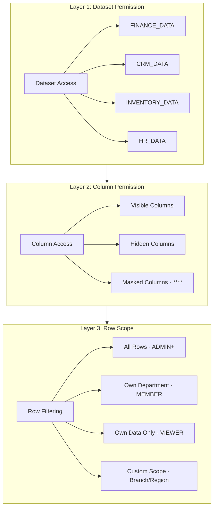

### 6.2 Permission Matrix

| Role | Dataset Access | Column Access | Row Scope | Analytics Features |
|------|---------------|---------------|-----------|-------------------|
| **SUPERADMIN** | ALL datasets | ALL columns | ALL rows | Full access, SQL workspace |
| **ADMIN** | ALL tenant data | ALL columns | ALL rows | Create dashboards, KPIs, alerts |
| **DATA_ANALYST** | Granted datasets | Granted columns | Granted scope | Create reports, charts, PIVOT |
| **MEMBER** | Department data | Non-sensitive columns | Own + department | View dashboards, run reports |
| **VIEWER** | Read-only | Non-sensitive columns | Limited scope | View shared dashboards only |

### 6.3 Dataset Permission Model

```prisma
model DatasetPermission {
  id            String   @id @default(cuid())
  tenantId      String
  tenant        Tenant   @relation(fields: [tenantId], references: [id])

  // Target
  userId        String?  // Specific user (null = role-based)
  userRole      String?  // Role-based (ADMIN, MEMBER, DATA_ANALYST, VIEWER)
  department    String?  // Department-scoped

  // Dataset Access
  datasetCode   String   // e.g. "FINANCE", "CRM", "INVENTORY", "HR"
  accessLevel   String   @default("READ") // READ, WRITE, ADMIN

  // Column Permission (JSON)
  allowedColumns String? // JSON array of column names
  maskedColumns  String? // JSON array of columns to mask (show ****)
  hiddenColumns  String? // JSON array of columns to hide completely

  // Row Scope
  rowScope      String   @default("ALL") // ALL, DEPARTMENT, OWN, CUSTOM
  customScope   String?  // JSON: custom row filter conditions

  isActive      Boolean  @default(true)
  createdAt     DateTime @default(now())
  updatedAt     DateTime @updatedAt

  @@unique([tenantId, datasetCode, userId])
  @@unique([tenantId, datasetCode, userRole])
  @@index([tenantId])
}
```

### 6.4 DATA_ANALYST Role

> **Role baru yang akan ditambahkan ke User model.**

DATA_ANALYST adalah role khusus untuk pengguna yang membutuhkan akses analitik lebih dari MEMBER tapi tidak se luas ADMIN.

| Capability | DATA_ANALYST | ADMIN |
|-----------|-------------|-------|
| View dashboards | ✅ All shared | ✅ All |
| Create dashboards | ✅ Private + Team | ✅ All visibilities |
| Run reports | ✅ Granted datasets | ✅ All |
| Create reports | ✅ Granted datasets | ✅ All |
| PIVOT / OLAP | ✅ Granted datasets | ✅ All |
| KPI builder | ✅ Own KPIs | ✅ All |
| Alert rules | ✅ Own alerts | ✅ All |
| SQL workspace | ❌ Phase 3 only | ✅ Phase 3 |
| Export data | ✅ Granted datasets | ✅ All |
| Scheduled reports | ✅ Own schedules | ✅ All |
| Manage metrics | ❌ Read-only | ✅ CRUD |
| Data dictionary | ✅ Read + suggest | ✅ CRUD |

### 6.5 Implementation in Query Engine

```typescript
// Permission Guard — setiap query analytics melewati guard ini
async function applyAnalyticsPermissions(
  tenantId: string,
  userId: string,
  userRole: string,
  dataset: string,
  requestedColumns: string[]
): Promise<{
  allowedColumns: string[];
  rowFilter: Record<string, unknown>;
  maskedColumns: string[];
}> {
  // 1. Check dataset access
  const datasetPerm = await prisma.datasetPermission.findFirst({
    where: { tenantId, datasetCode: dataset, isActive: true,
      OR: [{ userId }, { userRole }, { department: userDepartment }]
    },
  });
  if (!datasetPerm) throw new Error('Forbidden: No access to dataset');

  // 2. Apply column permissions
  const allowedColumns = datasetPerm.allowedColumns
    ? JSON.parse(datasetPerm.allowedColumns)
    : requestedColumns;
  const maskedColumns = datasetPerm.maskedColumns
    ? JSON.parse(datasetPerm.maskedColumns)
    : [];

  // 3. Apply row scope
  let rowFilter: Record<string, unknown> = {};
  switch (datasetPerm.rowScope) {
    case 'ALL': break;
    case 'DEPARTMENT': rowFilter = { department: userDepartment }; break;
    case 'OWN': rowFilter = { userId: userId }; break;
    case 'CUSTOM': rowFilter = JSON.parse(datasetPerm.customScope || '{}'); break;
  }

  return { allowedColumns, rowFilter, maskedColumns };
}
```

---

## 7. Phase 1 Implementation Plan — MVP

### 7.1 Scope Phase 1

> **Report Builder + PIVOT + Chart Builder + Filters + Export + Saved Reports**

Phase 1 mengubah existing 12 reports menjadi analytics workspace yang lebih fleksibel dengan kemampuan PIVOT, custom charts, dan saved reports.

### 7.2 File-by-File Breakdown

#### 7.2.1 Package Baru: `packages/analytics/`

| File | Deskripsi | Dependencies |
|------|-----------|-------------|
| `packages/analytics/package.json` | Package manifest | — |
| `packages/analytics/tsconfig.json` | TypeScript config | — |
| `packages/analytics/src/index.ts` | Public API exports | Semua files di bawah |
| `packages/analytics/src/types.ts` | Analytics-specific types (Query, Filter, Dimension, Measure, etc.) | — |
| `packages/analytics/src/metric-registry.ts` | Metric definitions & formula registry | types.ts |
| `packages/analytics/src/query-builder.ts` | Safe query construction dengan Prisma | types.ts, metric-registry.ts |
| `packages/analytics/src/pivot-engine.ts` | PIVOT/OLAP operations | types.ts, query-builder.ts |
| `packages/analytics/src/export-engine.ts` | Export to CSV/Excel/JSON | types.ts |
| `packages/analytics/src/permission-guard.ts` | Dataset/column/row permission check | — |

#### 7.2.2 Database Migration

| File | Deskripsi |
|------|-----------|
| `packages/db/prisma/migrations/YYYYMMDD_analytics_init/migration.sql` | Create MetricDefinition, SavedAnalysis, Dashboard, DashboardWidget, SavedChart models |
| `packages/db/prisma/migrations/YYYYMMDD_analytics_materialized_views/migration.sql` | Create materialized views + indexes |

#### 7.2.3 Shared Types

| File | Change |
|------|--------|
| `packages/types/src/index.ts` | Add Analytics types: `ExplorerQuery`, `PivotQuery`, `ChartConfig`, `SavedAnalysis`, `Dashboard`, `Widget`, `MetricDefinition`, `DataColumn`, `DataRow` |

#### 7.2.4 Feature Flags

| File | Change |
|------|--------|
| `packages/config/src/features.ts` | Add flags: `ANALYTICS_WORKSPACE`, `DATA_EXPLORER`, `PIVOT_OLAP`, `CHART_BUILDER`, `KPI_BUILDER`, `DASHBOARD_BUILDER`, `SCHEDULED_REPORTS`, `DATA_ALERTS`, `SQL_WORKSPACE`, `ANOMALY_DETECTION`, `FORECASTING` |

#### 7.2.5 Validation Schemas

| File | Change |
|------|--------|
| `apps/web/lib/validation-schemas.ts` | Add Zod schemas: `explorerQuerySchema`, `pivotQuerySchema`, `createReportSchema`, `updateReportSchema`, `createDashboardSchema`, `updateDashboardSchema`, `createKPISchema`, `createAlertRuleSchema`, `createScheduleSchema`, `exportRequestSchema` |

#### 7.2.6 API Routes

| File | Deskripsi |
|------|-----------|
| `apps/web/app/api/analytics/explorer/route.ts` | POST: Eksekusi explorer query |
| `apps/web/app/api/analytics/explorer/datasets/route.ts` | GET: List datasets |
| `apps/web/app/api/analytics/explorer/fields/route.ts` | GET: List fields per dataset |
| `apps/web/app/api/analytics/reports/route.ts` | GET/POST: List & create saved reports |
| `apps/web/app/api/analytics/reports/[id]/route.ts` | GET/PUT/DELETE: Report detail |
| `apps/web/app/api/analytics/reports/[id]/run/route.ts` | POST: Execute report |
| `apps/web/app/api/analytics/reports/[id]/duplicate/route.ts` | POST: Duplicate report |
| `apps/web/app/api/analytics/charts/route.ts` | GET/POST: List & create charts |
| `apps/web/app/api/analytics/charts/[id]/route.ts` | GET/PUT/DELETE: Chart detail |
| `apps/web/app/api/analytics/charts/[id]/data/route.ts` | POST: Get chart data |
| `apps/web/app/api/analytics/pivot/route.ts` | POST: Execute PIVOT query |
| `apps/web/app/api/analytics/export/route.ts` | POST: Generate export |
| `apps/web/app/api/analytics/dictionary/route.ts` | GET: Data dictionary |

#### 7.2.7 UI Pages

| File | Deskripsi |
|------|-----------|
| `apps/web/app/dashboard/analytics/layout.tsx` | Analytics workspace layout dengan sidebar navigasi |
| `apps/web/app/dashboard/analytics/page.tsx` | Overview — mini dashboard dengan quick access |
| `apps/web/app/dashboard/analytics/explorer/page.tsx` | Data Explorer — pilih dataset, dimensions, measures, filters |
| `apps/web/app/dashboard/analytics/reports/page.tsx` | Saved reports list |
| `apps/web/app/dashboard/analytics/reports/[id]/page.tsx` | Report viewer & editor |
| `apps/web/app/dashboard/analytics/pivot/page.tsx` | PIVOT workspace — drag fields ke rows/columns/values |
| `apps/web/app/dashboard/analytics/charts/page.tsx` | Chart builder — visual chart configuration |
| `apps/web/app/dashboard/analytics/export/page.tsx` | Export center — select source, format, download |
| `apps/web/app/dashboard/analytics/dictionary/page.tsx` | Data dictionary browser |

#### 7.2.8 UI Components

| File | Deskripsi |
|------|-----------|
| `apps/web/components/analytics/dataset-selector.tsx` | Dropdown untuk memilih dataset |
| `apps/web/components/analytics/field-picker.tsx` | Drag-and-drop field picker untuk dimensions/measures |
| `apps/web/components/analytics/filter-builder.tsx` | Visual filter builder (field + operator + value) |
| `apps/web/components/analytics/pivot-table.tsx` | PIVOT table component |
| `apps/web/components/analytics/chart-builder.tsx` | Visual chart configuration panel |
| `apps/web/components/analytics/results-table.tsx` | Results table dengan sorting & pagination |
| `apps/web/components/analytics/export-dialog.tsx` | Export format selection dialog |
| `apps/web/components/analytics/dictionary-card.tsx` | Metric definition card |
| `apps/web/components/analytics/save-dialog.tsx` | Save analysis dialog |

#### 7.2.9 Loading & Error States

| File | Deskripsi |
|------|-----------|
| `apps/web/app/dashboard/analytics/loading.tsx` | Loading skeleton untuk analytics overview |
| `apps/web/app/dashboard/analytics/explorer/loading.tsx` | Loading skeleton untuk explorer |
| `apps/web/app/dashboard/analytics/error.tsx` | Error boundary untuk analytics section |

### 7.3 Migration Strategy dari Existing Reports

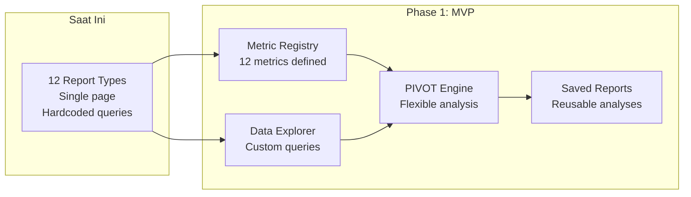

---

## 8. Phase 2–4 Roadmap

### 8.1 Phase 2: Advanced Analytics Workspace

> **Analytics Workspace, Data Explorer lanjutan, KPI Builder, Metric Layer, Data Dictionary, Dashboard Builder, Drill-down, Scheduled Reports, Data Alerts**

| Komponen | Deskripsi | Files Tambahan |
|----------|-----------|----------------|
| **KPI Builder** | User buat KPI: formula, target, threshold, period, owner | `api/analytics/kpi/`, `kpi/page.tsx`, `kpi-builder.tsx` |
| **Dashboard Builder** | Drag & drop widgets, visibility control | `api/analytics/dashboards/`, `builder/page.tsx`, `widget-*` components |
| **Metric Layer** | Metric registry UI, formula editor | `metrics/page.tsx`, `metric-editor.tsx` |
| **Data Dictionary** | Full metadata browser | `dictionary/page.tsx`, `dictionary-card.tsx` |
| **Drill-down** | Hierarchical drill-down Revenue → Branch → Customer → Invoice | `drill-down.tsx`, API drill-down endpoints |
| **Scheduled Reports** | Cron-like scheduling | `api/analytics/scheduled/`, `scheduled/page.tsx` |
| **Data Alerts** | Conditional alerts dengan Control Engine integration | `api/analytics/alerts/`, `alerts/page.tsx` |
| **Materialized Views** | Auto-refresh views | Scheduler job + refresh logic |

### 8.2 Phase 3: Intelligence Layer

> **SQL Workspace, Data Lineage, Anomaly Detection, Forecasting, Industry Analytics**

| Komponen | Deskripsi | Dependencies |
|----------|-----------|-------------|
| **SQL Workspace** | SQL editor dengan pengamanan: read-only, tenant-scoped, query timeout, resource limits | Query sandbox, PostgreSQL read-only user |
| **Data Lineage** | Visualisasi asal-usul metric: Revenue → Invoice → InvoiceItem → Product → COGS | DataDictionary upstream/downstream deps |
| **Anomaly Detection** | Deteksi anomali statistik: current vs normal range | Historical data, statistical algorithms |
| **Forecasting** | Prediksi sales, cash flow, inventory, demand | Time series algorithms, historical data |
| **Industry Analytics** | Configurable analytics templates per industri | Industry Configuration Engine integration |
| **Advanced Segmentation** | Customer/product segmentation analysis | Clustering algorithms |

### 8.3 Phase 4: Decision Intelligence

> **AI Analyst, Natural Language Query, Automated Insights, Automated Reports**

| Komponen | Deskripsi | Dependencies |
|----------|-----------|-------------|
| **AI Analyst Assistant** | Natural language query → analysis + chart + summary | AI Provider integration |
| **Natural Language Query** | "Tampilkan penjualan bulan ini per produk" → auto-generate explorer query | NLP engine, Semantic Layer |
| **Automated Insights** | AI-generated insight cards: "Revenue turun 15% vs bulan lalu" | Anomaly Detection, Metric Registry |
| **Automated Reports** | AI-generated reports on schedule | Forecasting, Scheduled Reports |
| **Decision Recommendations** | AI rekomendasi aksi: "Stok produk X akan habis dalam 5 hari, reorder sekarang?" | All analytics engines |

### 8.4 Timeline

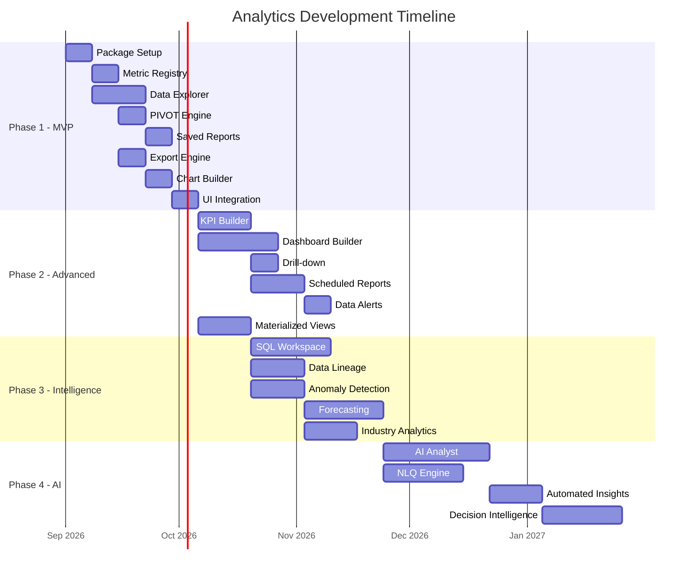

### 8.5 Implementation Status

> **Phase 1 MVP — ✅ Implemented** (31 Agustus 2026)

| Komponen | Status | Detail |
|----------|--------|--------|
| **@qalcuity/analytics package** | ✅ Implemented | Metric registry, dimensions, utility functions |
| **Analytics Dashboard** | ✅ Implemented | KPI cards, charts, summary stats |
| **Data Explorer** | ✅ Implemented | Column selection, filter, group, sort, pagination |
| **KPI Management** | ✅ Implemented | CRUD KPI, evaluation, breach tracking |
| **Saved Reports** | ✅ Implemented | Save/load/delete reports with i18n |
| **Data Alerts** | ✅ Implemented | Alert rules, trigger tracking, acknowledge |
| **Analytics API** | ✅ Implemented | 7 API routes (dashboard, explorer, kpi, kpi/[id], kpi/[id]/evaluate, alerts, metrics, reports, reports/[id]) |
| **i18n** | ✅ Implemented | English + Bahasa Indonesia |
| **Export (CSV/Excel/Print)** | ✅ Implemented | Via existing export utility |

> **Phase 2: Advanced Analytics Workspace** — 📋 Planned (Target: Q4 2026)

| Komponen | Status | Target |
|----------|--------|--------|
| Dashboard Builder (drag & drop widgets) | 📋 Planned | Q4 2026 |
| Pivot & OLAP Engine | 📋 Planned | Q4 2026 |
| Drill-down (hierarchical navigation) | 📋 Planned | Q4 2026 |
| Scheduled Reports (cron-like) | 📋 Planned | Q4 2026 |
| Data Dictionary (metadata browser) | 📋 Planned | Q4 2026 |
| Comparative Analysis (period vs period) | 📋 Planned | Q4 2026 |
| Materialized Views (auto-refresh) | 📋 Planned | Q4 2026 |

> **Phase 3: Intelligence Layer** — 📋 Planned (Target: Q1 2027)

| Komponen | Status | Target |
|----------|--------|--------|
| SQL Workspace (read-only, tenant-scoped) | 📋 Planned | Q1 2027 |
| Data Lineage (asal-usul metric) | 📋 Planned | Q1 2027 |
| Anomaly Detection (statistical) | 📋 Planned | Q1 2027 |
| Forecasting (time series prediction) | 📋 Planned | Q1 2027 |
| Industry Analytics (configurable templates) | 📋 Planned | Q1 2027 |
| Advanced Segmentation (clustering) | 📋 Planned | Q1 2027 |

> **Phase 4: Decision Intelligence** — 📋 Planned (Target: Q2 2027)

| Komponen | Status | Target |
|----------|--------|--------|
| AI Analyst Assistant | 📋 Planned | Q2 2027 |
| Natural Language Query (NLQ) | 📋 Planned | Q2 2027 |
| Automated Insights (AI-generated) | 📋 Planned | Q2 2027 |
| Automated Reports (AI-scheduled) | 📋 Planned | Q2 2027 |
| Decision Recommendations (AI-powered) | 📋 Planned | Q2 2027 |

---

## 9. Data Flow Diagrams

### 9.1 Transaction → Analytics → Decision → Action

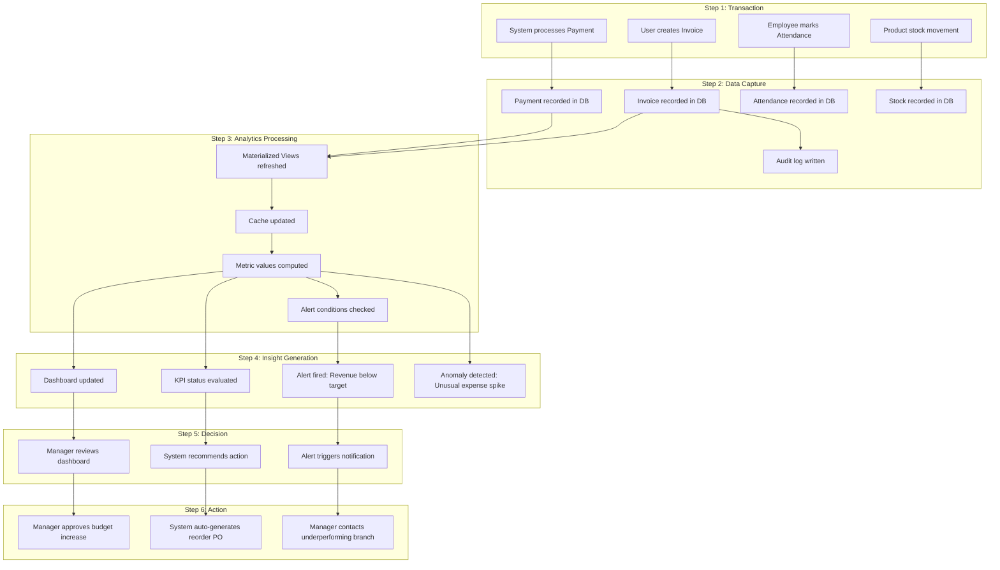

### 9.2 Data Explorer Flow

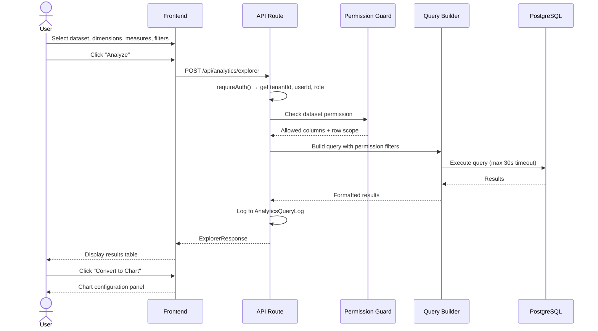

### 9.3 KPI Evaluation Flow

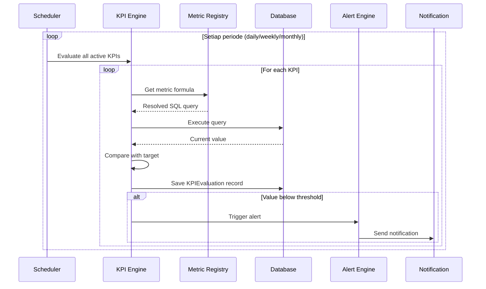

---

## 10. Security Considerations

### 10.1 Query Safety

| Control | Implementasi | Phase |
|---------|-------------|-------|
| **Read-Only Queries** | Analytics engine hanya menggunakan `findMany` / `aggregate` — tidak pernah `create`, `update`, `delete` | Phase 1 |
| **Tenant Isolation** | Setiap query difilter `tenantId` — tidak ada exception | Phase 1 |
| **Query Timeout** | Maximum 30 detik per query — auto-cancel jika timeout | Phase 1 |
| **Row Limit** | Maximum 10,000 rows per query — prevent memory exhaustion | Phase 1 |
| **Rate Limiting** | Maximum 100 analytics requests per menit per user | Phase 1 |
| **Input Validation** | Zod schema validation untuk semua query parameters | Phase 1 |
| **SQL Injection Prevention** | Parameterized queries — tidak ada raw string concatenation | Phase 1 |
| **Column Whitelist** | Hanya kolom yang diizinkan yang bisa di-query | Phase 1 |
| **Audit Logging** | Semua analytics queries dicatat di AnalyticsQueryLog | Phase 1 |

### 10.2 SQL Workspace Security (Phase 3)

| Control | Implementasi |
|---------|-------------|
| **Read-Only Connection** | PostgreSQL user dengan hanya `SELECT` permission |
| **Tenant Scope** | Setiap query otomatis di-wrap dengan `WHERE tenantId = ?` |
| **Query Parse & Validate** | SQL di-parse untuk memastikan tidak ada `INSERT`, `UPDATE`, `DELETE`, `DROP`, `ALTER` |
| **Resource Limits** | `statement_timeout = 30s`, `work_mem = 256MB`, `max_rows = 10000` |
| **Schema Restriction** | Hanya bisa akses tables yang di-whitelist untuk analytics |
| **Approval Required** | SQL workspace hanya untuk ADMIN+ atau DATA_ANALYST dengan approval |
| **Query History** | Semua SQL queries dicatat dengan user, timestamp, dan duration |

### 10.3 Data Protection

| Control | Implementasi |
|---------|-------------|
| **Sensitive Data Masking** | Kolom sensitif (gaji, NPWP, rekening) di-mask untuk non-admin users |
| **Export Restrictions** | Export terbatas pada data yang user boleh akses |
| **Column-Level Security** | `DatasetPermission.maskedColumns` untuk data masking |
| **No Cross-Tenant** | Impossible untuk mengakses data tenant lain melalui analytics |
| **Cache Invalidation** | Cache otomatis di-invalidate saat data berubah |

### 10.4 Rate Limits

| Endpoint Category | Limit | Window |
|-------------------|-------|--------|
| Explorer queries | 100 requests | per minute |
| Dashboard loads | 200 requests | per minute |
| Report executions | 50 requests | per minute |
| Export operations | 20 requests | per minute |
| PIVOT queries | 50 requests | per minute |
| SQL queries (Phase 3) | 20 requests | per minute |

---

## 11. Industry Configuration

### 11.1 Philosophy

> **Analytics engine bersifat universal. Industry packs menambahkan metrics, dashboards, dan reports yang spesifik per industri.**

### 11.2 Industry Analytics Templates

#### Retail

| Metric | Formula | Target |
|--------|---------|--------|
| Sales per Square Foot | Revenue / Store Area | > Rp 500K/m² |
| Inventory Turnover | COGS / Avg Inventory | > 6x/tahun |
| Cart Abandonment Rate | 1 - (Completed / Started) | < 70% |
| Average Basket Size | Revenue / Transaction Count | > Rp 500K |
| Sell-Through Rate | Units Sold / Units Received | > 80% |
| Customer Retention Rate | Returning / Total Customers | > 60% |

**Dashboard Templates:**
- Store Performance Dashboard (per outlet comparison)
- Product Performance Dashboard (top/bottom products)
- Customer Behavior Dashboard (purchase patterns)

#### Manufacturing

| Metric | Formula | Target |
|--------|---------|--------|
| OEE (Overall Equipment Effectiveness) | Availability × Performance × Quality | > 85% |
| Production Cost per Unit | Total Production Cost / Units Produced | Trend ↓ |
| Scrap Rate | Scrap Units / Total Units | < 5% |
| On-Time Delivery | On-Time Orders / Total Orders | > 95% |
| Machine Utilization | Running Hours / Available Hours | > 80% |
| Quality Index | Good Units / Total Units | > 98% |

**Dashboard Templates:**
- Production Floor Dashboard
- Quality Control Dashboard
- Supply Chain Dashboard

#### Construction

| Metric | Formula | Target |
|--------|---------|--------|
| Project Margin | (Revenue - Cost) / Revenue | > 15% |
| Rework Rate | Rework Cost / Total Project Cost | < 3% |
| Safety Incident Rate | Incidents / 200K Work Hours | < 1.0 |
| Equipment Utilization | Active Hours / Available Hours | > 75% |
| Progress vs Plan | Actual Progress / Planned Progress | > 95% |
| Cash Flow vs Revenue | Cash Received / Billed Revenue | > 90% |

**Dashboard Templates:**
- Project Overview Dashboard
- Safety & Compliance Dashboard
- Equipment Fleet Dashboard

#### Service

| Metric | Formula | Target |
|--------|---------|--------|
| Utilization Rate | Billable Hours / Available Hours | > 75% |
| Revenue per Consultant | Total Revenue / Active Consultants | Trend ↑ |
| Client Satisfaction | Average CSAT Score | > 4.5/5 |
| Project Profitability | (Billed - Cost) / Billed | > 20% |
| Employee Billable Ratio | Billable Hours / Total Hours | > 70% |
| Client Retention | Returning Clients / Total Clients | > 85% |

**Dashboard Templates:**
- Resource Utilization Dashboard
- Client Performance Dashboard
- Revenue per Consultant Dashboard

### 11.3 Configuration Pattern

```typescript
// Industry analytics configuration
interface IndustryAnalyticsConfig {
  industry: string;
  metrics: Array<{
    code: string;
    name: string;
    formula: string;
    unit: string;
    target?: number;
    category: string;
  }>;
  dashboards: Array<{
    name: string;
    description: string;
    widgets: WidgetConfig[];
  }>;
  reports: Array<{
    name: string;
    description: string;
    query: ExplorerQuery;
  }>;
}

// Config stored in Industry Configuration Engine
// NOT hardcoded in analytics core
```

---

## 12. Integration Points

### 12.1 Control Engine Integration

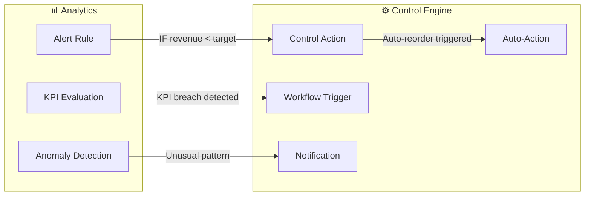

**Integration Pattern:**

```typescript
// Alert Rule → Control Engine
interface ControlAction {
  type: 'NOTIFY' | 'WORKFLOW' | 'AUTO_ORDER' | 'BLOCK' | 'ESCALATE';
  params: Record<string, unknown>;
}

// Contoh: Low stock alert → auto-generate purchase order
if (alertRule.controlAction === 'AUTO_ORDER') {
  await controlEngine.execute({
    type: 'AUTO_ORDER',
    params: {
      productId: triggerData.productId,
      quantity: triggerData.reorderQuantity,
      supplierId: triggerData.preferredSupplierId,
    },
  });
}
```

### 12.2 AI Hub Integration (Phase 4)

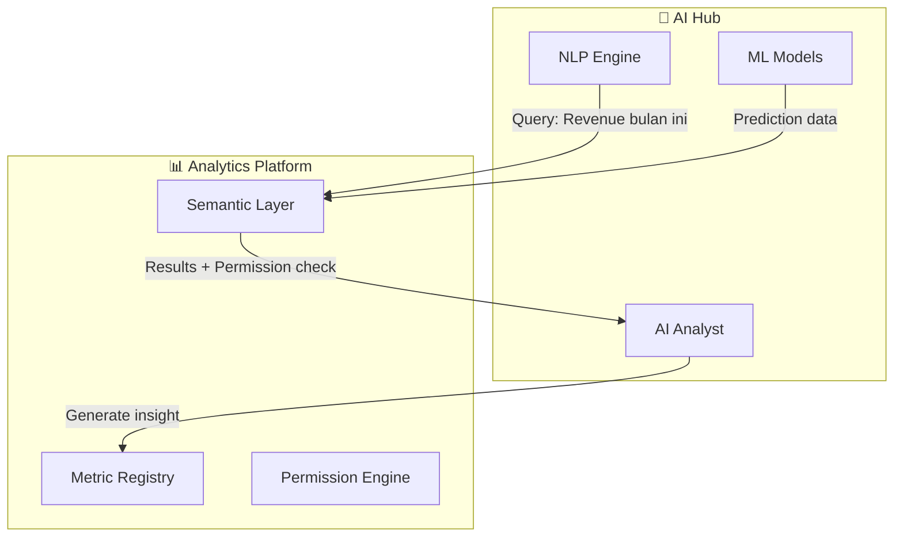

**AI Analyst Flow:**

```typescript
// Natural Language Query → Analytics Query → Results → AI Summary
async function aiAnalystQuery(nlQuery: string, tenantId: string, userId: string) {
  // 1. NLP: Convert natural language to structured query
  const structuredQuery = await nlpEngine.parse(nlQuery);

  // 2. Semantic Layer: Resolve metric references
  const resolvedQuery = await semanticLayer.resolve(structuredQuery);

  // 3. Permission Guard: Apply dataset/column/row permissions
  const permittedQuery = await permissionGuard.apply(tenantId, userId, resolvedQuery);

  // 4. Execute query
  const results = await queryBuilder.execute(permittedQuery);

  // 5. AI: Generate summary and recommendations
  const aiSummary = await aiEngine.generateSummary(nlQuery, results);

  // 6. Return combined result
  return {
    query: structuredQuery,
    results,
    summary: aiSummary,
    charts: aiSummary.suggestedCharts,
  };
}
```

### 12.3 Workflow Engine Integration

| Integration Point | Trigger | Action |
|-------------------|---------|--------|
| **KPI Breach** | KPI value below threshold | Trigger approval workflow |
| **Alert Triggered** | Alert condition met | Create task/workflow for resolution |
| **Scheduled Report** | Cron schedule hit | Generate report, notify stakeholders |
| **Anomaly Detected** | Statistical outlier found | Create investigation workflow |
| **Forecast Deviation** | Forecast significantly differs from actual | Trigger review workflow |

### 12.4 Notification Integration

| Channel | Integration | When |
|---------|-------------|------|
| **In-App** | Dashboard notifications | All alerts, KPI breaches |
| **Email** | SMTP / SendGrid | Scheduled reports, critical alerts |
| **WhatsApp** | WhatsApp Business API | Critical alerts (if configured) |
| **Slack** | Slack Webhook | Alert rules with Slack notification |

---

## Appendix A: Glossary

| Term | Definisi |
|------|---------|
| **Semantic Layer** | Abstraction layer yang mendefinisikan metric secara konsisten |
| **Materialized View** | Pre-computed query result yang di-cache di database |
| **PIVOT** | Operasi analisis yang mengubah baris menjadi kolom (cross-tabulation) |
| **OLAP** | Online Analytical Processing — teknologi untuk query analitik cepat |
| **Drill-down** | Navigasi hierarki data dari summary ke detail |
| **Data Lineage** | Tracking asal-usul dan transformasi data dari source ke destination |
| **Cohort Analysis** | Analisis perilaku kelompok pengguna yang memiliki karakteristik sama |
| **Anomaly Detection** | Deteksi data point yang menyimpang dari pola normal |
| **Forecasting** | Prediksi nilai masa depan berdasarkan data historis |

## Appendix B: Data Sources Mapping

| Dataset Code | Source Models | Key Fields | Typical Use |
|-------------|--------------|------------|-------------|
| `FINANCE_INVOICE` | Invoice, InvoiceItem | total, status, createdAt, dueDate | Revenue, P&L, AR Aging |
| `FINANCE_PAYMENT` | Payment | amount, method, type, status | Cash flow, payment analysis |
| `FINANCE_PURCHASE` | PurchaseOrder, PurchaseOrderItem | total, status, orderDate | Expense, PO analysis |
| `CRM_CONTACT` | Contact | name, type, city, province | Customer analysis |
| `CRM_LEAD` | Lead | status, value, source | Lead funnel, conversion |
| `CRM_DEAL` | Deal | stage, value, probability, closeDate | Pipeline, forecast |
| `INVENTORY_PRODUCT` | Product | sku, price, cost, stock | Stock analysis, valuation |
| `INVENTORY_MOVEMENT` | StockMovement | type, quantity, createdAt | Movement analysis |
| `HR_EMPLOYEE` | Employee | department, position, salary, status | Headcount, cost analysis |
| `HR_ATTENDANCE` | AttendanceRecord | status, clockIn, clockOut, workHours | Attendance analysis |
| `HR_PAYROLL` | PayrollRecord | baseSalary, allowances, deductions, netSalary | Payroll analysis |
| `HR_LEAVE` | LeaveRequest | type, startDate, endDate, status | Leave analysis |

---

**Document Maintainer:** Qalcuity AI Team
**Next Review:** Sebelum Phase 2 dimulai (Q4 2026)
**Status:** Phase 1 MVP ✅ Implemented | Architecture Document — Active
