# 🏗️ Qalcuity — Business Operating System Architecture

> **"Qalcuity — Business Operating System yang dapat dikonfigurasi untuk berbagai jenis industri."**
> Bukan "Qalcuity ERP untuk perusahaan dagang."

> **Last Updated:** 31 Agustus 2026
> **Current Version:** v2.0.0 — Business Operating System Architecture

---

## 📋 Daftar Isi

1. [Vision Statement](#1-vision-statement)
2. [Core Architecture — 3 Fondasi](#2-core-architecture--3-fondasi)
3. [Foundation Engine: Permission Engine](#3-foundation-engine-permission-engine)
4. [Foundation Engine: Workflow Engine](#4-foundation-engine-workflow-engine)
5. [Foundation Engine: Industry Configuration Engine](#5-foundation-engine-industry-configuration-engine)
6. [Core Modules (Industry-Agnostic)](#6-core-modules-industry-agnostic)
7. [Industry Packs (Configuration)](#7-industry-packs-configuration)
8. [Configurable Elements](#8-configurable-elements)
9. [Dashboard by Industry](#9-dashboard-by-industry)
10. [AI Agent Decision Tree](#10-ai-agent-decision-tree)
11. [Anti-patterns to Avoid](#11-anti-patterns-to-avoid)
12. [Tech Stack](#12-tech-stack)
13. [Monorepo Structure](#13-monorepo-structure)
14. [Permission Architecture](#14-permission-architecture)
15. [Application Architecture](#15-application-architecture)
16. [Shared Packages](#16-shared-packages)
17. [Data Flow](#17-data-flow)
18. [Security Layers](#18-security-layers)
19. [API Design](#19-api-design)
20. [Unified Control Engine Architecture](#20-unified-control-engine-architecture)
21. [Deployment Architecture](#21-deployment-architecture)
22. [POS Module (Core)](#22-pos-module-core)

---

## 1. Vision Statement

### Prinsip Utama

> **Qalcuity adalah Business Operating System yang dapat dikonfigurasi untuk berbagai jenis industri** — bukan ERP spesifik industri.

Qalcuity dibangun dengan filosofi **"Core + Configuration"**:
- **Core** menyediakan kemampuan bisnis universal (Finance, CRM, HR, Inventory, dll.)
- **Configuration** memungkinkan setiap industri menyesuaikan workflow, approval, fields, dan dashboard sesuai kebutuhan mereka

### Arsitektur 3 Fondasi

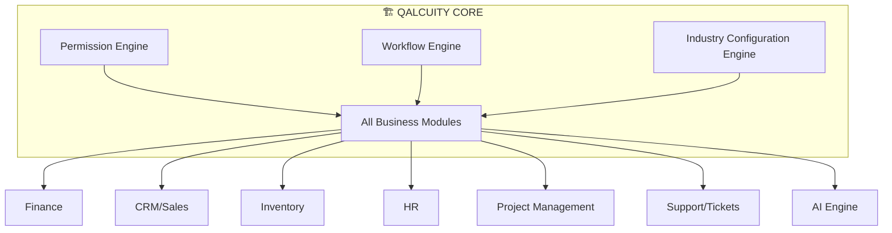

```text
                    QALCUITY CORE
                         │
        ┌────────────────┼────────────────┐
        ↓                ↓                ↓
 Permission          Workflow         Industry
  Engine              Engine        Configuration
        │                │                │
        └────────────────┼────────────────┘
                         ↓
                ALL BUSINESS MODULES
```

### Prinsip Wajib untuk AI Agent

> **"Never design a feature for only one industry unless the feature is inherently industry-specific. Prefer reusable core capabilities, configurable workflows, configurable fields, configurable permissions, configurable approval rules, and industry-specific extensions over hardcoded industry logic."**

---

## 2. Core Architecture — 3 Fondasi

### 2.1 Architecture Overview

```mermaid
graph TB
    subgraph PLATFORMS
        WEB[Web App<br/>Next.js 14]
        DESK[Desktop App<br/>Electron]
        MOB[Mobile App<br/>React Native]
    end
    
    subgraph CORE_ENGINES["⚙️ Qalcuity Core Engines"]
        PE[Permission Engine<br/>can\\(user, action, resource, ctx\\)]
        WE[Workflow Engine<br/>Configurable Status Transitions]
        ICE[Industry Config Engine<br/>Industry Packs + Custom Fields]
    end
    
    subgraph MODULES["📦 Business Modules"]
        FIN[Finance]
        CRM[CRM/Sales]
        INV[Inventory]
        HR[HR]
        PM[Project Management]
        SUP[Support/Tickets]
        AI[AI Engine]
    end
    
    subgraph DATA["💾 Data Layer"]
        PRISMA[Prisma ORM]
        PG[PostgreSQL]
    end
    
    WEB --> CORE_ENGINES
    DESK --> CORE_ENGINES
    MOB --> CORE_ENGINES
    
    CORE_ENGINES --> MODULES
    MODULES --> DATA
```

### 2.2 What Makes Qalcuity Different

| Aspek | ERP Tradisional | Qalcuity BOS |
|-------|----------------|--------------|
| **Pendekatan** | Hardcoded untuk 1 industri | Core universal + Config per industri |
| **Workflow** | Fixed workflow | Configurable per perusahaan |
| **Approval** | Hardcoded levels | Configurable threshold + routing |
| **Fields** | Fixed schema | Custom fields per kebutuhan |
| **Dashboard** | Generic | Industry-specific + Role-based |
| **AI** | Add-on | Built-in, industry-aware |

---

## 3. Foundation Engine: Permission Engine

> **Industry-agnostic granular permission system.**

### 3.1 Model

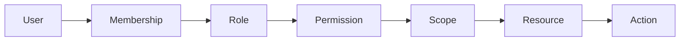

```text
User → Membership → Role → Permission → Scope → Resource → Action
```

### 3.2 Engine API

```typescript
// Core permission check
can(user, action, resource, context) → boolean

// Example usage
can(budi, "approve", "invoice", { branch: "Surabaya" })
// → true if budi has invoice.approve permission for Surabaya branch

can(sari, "create", "purchase_order", { department: "Procurement", amount: 50000000 })
// → true if sari has purchase_order.create for Procurement dept
```

### 3.3 Two Universes

| Universe | Scope | Examples |
|----------|-------|----------|
| **Platform Permissions** | Internal Qalcuity operations | `tenant.view`, `subscription.manage`, `system.monitor` |
| **Tenant Permissions** | Customer organization operations | `invoice.approve`, `employee.view`, `payroll.manage` |

### 3.4 Cross-platform Enforcement

| Platform | Enforcement | Notes |
|----------|------------|-------|
| **Web** | UI conditional rendering + API middleware | `can()` on every page |
| **Mobile** | Same `@qalcuity/permissions` package | Identical logic |
| **Desktop** | Same `@qalcuity/permissions` package | Identical logic |
| **API** | Middleware enforcement | `can()` check on every route |
| **AI Agent** | Tool-level permission checks | Agent checks before executing actions |

### 3.5 Industry-Agnostic Design

Permission Engine **tidak mengenal industri**. Yang mengenal industri adalah **Industry Configuration Engine** yang mendefinisikan:
- Resource apa saja yang ada per industri
- Action apa saja yang tersedia per resource
- Scope apa saja yang relevan per industri

---

## 4. Foundation Engine: Workflow Engine

> **Configurable transaction lifecycle per perusahaan.**

### 4.1 Core Concept

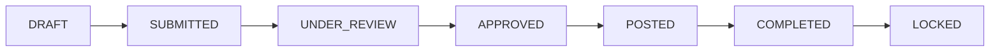

```text
DRAFT → SUBMITTED → UNDER_REVIEW → APPROVED → POSTED → COMPLETED → LOCKED
```

### 4.2 What's Configurable

| Element | Configurable? | Example |
|---------|--------------|---------|
| **Statuses** | ✅ Ya | Tambah status `NEEDS_REVISION` antara UNDER_REVIEW dan DRAFT |
| **Transitions** | ✅ Ya | ALLOW `APPROVED → DRAFT` untuk revision |
| **Guards** | ✅ Ya | TRANSITION hanya boleh dilakukan oleh role tertentu |
| **Actions** | ✅ Ya | AUTO-GENERATE invoice saat deal CLOSED_WON |
| **Notifications** | ✅ Ya | Notify Finance Manager saat invoice APPROVED |
| **SLA** | ✅ Ya | APPROVED dalam 24 jam, jika breach → escalate |

### 4.3 Workflow Configuration Example

```yaml
# Invoice Workflow untuk Perusahaan Manufaktur
workflow:
  name: "Invoice Workflow"
  entity: "invoice"
  statuses:
    - DRAFT
    - SUBMITTED
    - APPROVED_BY_MANAGER
    - APPROVED_BY_DIRECTOR  # Tambahan untuk amount > 100 juta
    - SENT
    - PAID
    - OVERDUE
    - CANCELLED
  
  transitions:
    - from: DRAFT
      to: SUBMITTED
      guard: "creator or admin"
    
    - from: SUBMITTED
      to: APPROVED_BY_MANAGER
      guard: "amount < 100000000"
      auto: true  # Auto-approve jika < 100 juta
    
    - from: SUBMITTED
      to: APPROVED_BY_DIRECTOR
      guard: "amount >= 100000000"
    
    - from: APPROVED_BY_DIRECTOR
      to: SENT
      guard: "finance_manager or director"
```

### 4.4 Unified Pipeline

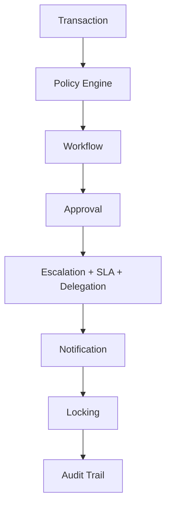

```text
Transaction → Policy Engine → Workflow → Approval → Escalation+SLA+Delegation → Notification → Locking → Audit Trail
```

---

## 5. Foundation Engine: Industry Configuration Engine

> **Memungkinkan Qalcuity dikonfigurasi untuk berbagai industri tanpa hardcoding.**

### 5.1 Core Concept

Industry Configuration Engine menyediakan **layer konfigurasi** di atas Core Modules:

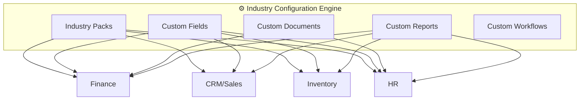

### 5.2 What's Configurable

| Element | Deskripsi | Contoh |
|---------|-----------|--------|
| **Custom Fields** | Field tambahan per entity | NPWP, NIB, PIC, Branch, Project, Site, Contract Number |
| **Custom Documents** | Document types + status + workflow | Surat Pesanan, Delivery Note, BAST, Service Report |
| **Custom Reports** | Reports berdasarkan module + field | Laporan Proyek, Laporan Produksi, Laporan Ticket |
| **Custom Workflows** | Workflow per transaction type | Quotation → Approval → SO → Delivery → Invoice → Payment |
| **Approval Rules** | Configurable approval routing | < 10 juta → Supervisor, 10-100 juta → Manager, > 100 juta → Director |
| **Locking Rules** | Period locking configuration | Monthly closing, Quarterly closing, Yearly closing |
| **Dashboard Widgets** | Industry-specific dashboard | Manufacturing: Production, WIP, Quality; Retail: Sales, Stock, Cash |

### 5.3 Custom Fields Configuration

```yaml
# Custom Fields untuk Industri Konstruksi
custom_fields:
  entity: "project"
  fields:
    - name: "site_location"
      type: "text"
      label: "Lokasi Proyek"
      required: true
    
    - name: "contract_number"
      type: "text"
      label: "Nomor Kontrak"
      required: true
    
    - name: "progress_percentage"
      type: "number"
      label: "Progress (%)"
      min: 0
      max: 100
    
    - name: "site_photos"
      type: "file"
      label: "Foto Lokasi"
      multiple: true
```

### 5.4 Custom Documents Configuration

```yaml
# Custom Documents untuk Industri Manufaktur
custom_documents:
  - name: "Work Order"
    entity: "work_order"
    statuses:
      - PLANNED
      - IN_PROGRESS
      - QUALITY_CHECK
      - COMPLETED
      - CANCELLED
    workflow:
      auto_create_from: "sales_order"
      approval_required: true
      sla_hours: 48
  
  - name: "Quality Report"
    entity: "quality_report"
    statuses:
      - DRAFT
      - SUBMITTED
      - APPROVED
      - REJECTED
    fields:
      - name: "defect_count"
        type: "number"
      - name: "defect_photos"
        type: "file"
```

---

## 6. Core Modules (Industry-Agnostic)

> **Semua modul ini bersifat universal — berlaku untuk semua industri.**

### 6.1 Module Overview

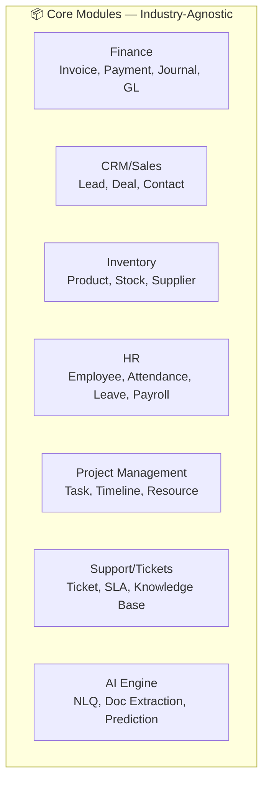

| Module | Core Entities | Status |
|--------|--------------|--------|
| **Finance** | Invoice, Payment, Journal, GL, Quotation, PO, CoA, Bank Reconciliation | ✅ CRUD Ready |
| **CRM/Sales** | Lead, Deal, Contact, Pipeline, Quotation | ✅ CRUD Ready |
| **Inventory** | Product, Stock, Category, Supplier, Stock Movement | ✅ CRUD Ready |
| **HR** | Employee, Attendance, Leave, Payroll | ✅ CRUD Ready |
| **Project Management** | Task, Timeline, Resource Allocation | 📋 Planned |
| **Support/Tickets** | Ticket, SLA, Knowledge Base | 📋 Planned |
| **AI Engine** | Natural Language Query, Doc Extraction, Prediction | ⚠️ Basic/Mock |

### 6.2 Core Module Principles

1. **Universal** — Tidak ada asumsi industri tertentu
2. **Configurable** — Bisa dikonfigurasi melalui Industry Configuration Engine
3. **Extensible** — Bisa ditambah custom fields, custom documents, custom workflows
4. **Composable** — Bisa dikombinasikan sesuai kebutuhan industri

---

## 7. Industry Packs (Configuration)

> **Industry Packs = Configuration, bukan Hardcoding.**
> Industry Pack mendefinisikan **default configuration** untuk industri tertentu, bukan code baru.

### 7.1 Supported Industries

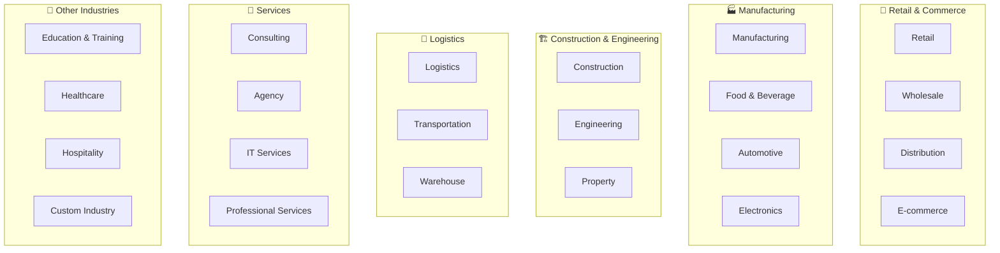

### 7.2 Industry Pack = Configuration Bundle

```yaml
# Contoh: Industry Pack untuk Manufaktur
industry_pack:
  name: "Manufacturing"
  description: "Configuration untuk industri manufaktur"
  
  # Default modules yang aktif
  modules:
    - finance
    - crm
    - inventory
    - hr
    - project_management
  
  # Custom workflows
  workflows:
    - name: "Sales Order → Production"
      from: "sales_order"
      to: "work_order"
      auto_create: true
    
    - name: "Quality Control"
      from: "work_order"
      to: "quality_report"
      approval_required: true
  
  # Custom fields
  custom_fields:
    product:
      - name: "sku"
        type: "text"
        label: "SKU"
      - name: "unit_of_measure"
        type: "select"
        options: ["pcs", "kg", "meter", "box"]
    
    work_order:
      - name: "production_line"
        type: "select"
        options: ["Line A", "Line B", "Line C"]
      - name: "batch_number"
        type: "text"
      - name: "expiry_date"
        type: "date"
  
  # Custom documents
  custom_documents:
    - name: "Work Order"
    - name: "Quality Report"
    - name: "Bill of Materials"
    - name: "Production Schedule"
  
  # Dashboard widgets
  dashboard_widgets:
    - production_overview
    - material_usage
    - quality_metrics
    - machine_utilization
    - work_in_progress
    - inventory_levels
```

### 7.3 Industry Pack Marketplace

| Industry Pack | Status | Custom Workflows | Custom Fields | Custom Documents |
|---------------|--------|-----------------|---------------|-----------------|
| **Retail** | 📋 Planned | POS, Stock Replenishment | Barcode, Shelf Location | Stock Opname Report |
| **Wholesale/Distribution** | 📋 Planned | Order → Delivery → Invoice | Route, Driver, Vehicle | Delivery Order |
| **Manufacturing** | 📋 Planned | Sales Order → WO → QC → Delivery | Production Line, Batch, BOM | Work Order, QC Report |
| **Food & Beverage** | 📋 Planned | Recipe → Production → Expiry | Recipe, Expiry Date, Batch | Production Report |
| **Construction** | 📋 Planned | Project → Milestone → Billing | Site, Contract, Progress | Progress Report, BAST |
| **Property** | 📋 Planned | Unit → Booking → Contract | Unit Type, Block, Floor | Booking Form, Handover |
| **Logistics** | 📋 Planned | Order → Pickup → Ship → Deliver | Route, Driver, Vehicle | Delivery Note, POD |
| **Consulting/Agency** | 📋 Planned | Proposal → SOW → Timesheet → Invoice | Project, Billable Hours | SOW, Timesheet, Invoice |
| **Education** | 📋 Planned | Registration → Enrollment → Graduation | Student, Class, Semester | Transcript, Certificate |
| **Healthcare** | 📋 Planned | Registration → Treatment → Billing | Patient, Doctor, Room | Medical Record, Insurance |

---

## 8. Configurable Elements

> **Semua elemen berikut BISA dikonfigurasi per perusahaan. Tidak ada yang hardcode.**

### 8.1 Workflow Configuration

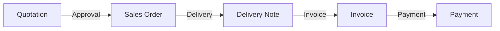

| Workflow | Configurable? | Default | Override |
|----------|--------------|---------|----------|
| **Sales Flow** | ✅ | Quotation → SO → Delivery → Invoice → Payment | Per perusahaan |
| **Purchase Flow** | ✅ | PR → PO → GR → Bill → Payment | Per perusahaan |
| **Leave Flow** | ✅ | Apply → Manager → HR → Approved | Per departemen |
| **Invoice Flow** | ✅ | Draft → Submit → Approve → Send → Paid | Per perusahaan |

### 8.2 Approval Rules Configuration

```yaml
# Approval Rules — Configurable per perusahaan
approval_rules:
  - entity: "invoice"
    rules:
      - condition: "amount < 10000000"        # < 10 juta
        approver: "supervisor"
        sla_hours: 4
      
      - condition: "amount >= 10000000 and amount < 100000000"  # 10-100 juta
        approver: "manager"
        sla_hours: 24
      
      - condition: "amount >= 100000000"      # > 100 juta
        approver: "director"
        sla_hours: 48
  
  - entity: "purchase_order"
    rules:
      - condition: "amount < 50000000"
        approver: "supervisor"
        sla_hours: 4
      
      - condition: "amount >= 50000000"
        approver: "director"
        sla_hours: 48
```

### 8.3 Locking Configuration

```yaml
# Locking Rules — Configurable per perusahaan
locking_rules:
  transaction_lock:
    automatically_lock_when_completed: true
  
  monthly_closing:
    enable: true
    closing_day: 5  # Tanggal 5 setiap bulan
  
  quarterly_closing:
    enable: true
  
  yearly_closing:
    enable: true
  
  edit_locked: "require_approval"
  delete_locked: "disabled"
  backdated: "require_approval"
```

### 8.4 Custom Fields Configuration

| Entity | Standard Fields | Custom Fields (Configurable) |
|--------|----------------|----------------------------|
| **Invoice** | Number, Date, Amount, Status | NPWP, NIB, PIC, Branch, Project, Contract Number |
| **Product** | Name, SKU, Price, Stock | Batch Number, Expiry Date, Unit of Measure, Barcode |
| **Employee** | Name, Position, Department | Branch, Site, Contract Type, BPJS Number |
| **Deal** | Name, Value, Stage | Industry, Source Campaign, Competitor, Win Reason |
| **Project** | Name, Budget, Timeline | Site Location, Contract Number, Progress %, Client PO |

### 8.5 Custom Documents Configuration

| Document Type | Industries | Statuses | Workflow |
|---------------|-----------|----------|----------|
| **Delivery Note** | Retail, Wholesale, Manufacturing | DRAFT → SENT → RECEIVED | Auto-created from SO |
| **Work Order** | Manufacturing | PLANNED → IN_PROGRESS → QC → COMPLETED | Created from SO |
| **BAST** | Construction, Engineering | DRAFT → REVIEWED → SIGNED → COMPLETED | Created at project milestone |
| **Service Report** | Consulting, Agency, IT | DRAFT → SUBMITTED → APPROVED | Created weekly |
| **Stock Opname** | Retail, Wholesale, Warehouse | PLANNED → COUNTED → ADJUSTED | Monthly schedule |

### 8.6 Custom Reports Configuration

| Report Type | Source Module | Customizable? |
|-------------|-------------|---------------|
| **Sales Report** | Finance + CRM | ✅ Filter by period, product, customer |
| **Inventory Report** | Inventory | ✅ Filter by category, warehouse, stock level |
| **HR Report** | HR | ✅ Filter by department, period, type |
| **Project Report** | Project Management | ✅ Filter by project, milestone, team |
| **Production Report** | Inventory + Custom | ✅ Filter by line, batch, period |
| **Financial Statements** | Finance | ✅ Filter by period, account, department |

---

## 9. Dashboard by Industry

> **Dashboard dikonfigurasi berdasarkan Industri + Role + Module + Permission.**

### 9.1 Dashboard Configuration

```yaml
# Dashboard Configuration per Industry
dashboards:
  retail:
    widgets:
      - sales_overview
      - stock_levels
      - top_products
      - cash_flow
      - customer_count
      - transaction_count
  
  manufacturing:
    widgets:
      - production_overview
      - material_usage
      - machine_utilization
      - quality_metrics
      - work_in_progress
      - inventory_levels
  
  construction:
    widgets:
      - project_overview
      - budget_tracking
      - progress_status
      - purchase_summary
      - material_usage
      - worker_count
  
  services:
    widgets:
      - project_overview
      - ticket_summary
      - sla_compliance
      - employee_utilization
      - billable_hours
      - invoice_summary
```

### 9.2 Dashboard Matrix

| Industry | Widget 1 | Widget 2 | Widget 3 | Widget 4 | Widget 5 | Widget 6 |
|----------|----------|----------|----------|----------|----------|----------|
| **Retail** | Sales | Stock | Top Products | Cash | Customer | Transactions |
| **Manufacturing** | Production | Material | Machine | Quality | WIP | Inventory |
| **Construction** | Projects | Budget | Progress | Purchase | Material | Workers |
| **Services** | Projects | Tickets | SLA | Employees | Billable Hours | Invoices |
| **Logistics** | Deliveries | Routes | Vehicles | Warehouse | Cost/Delivery | On-Time % |
| **Education** | Students | Classes | Enrollment | Revenue | Attendance | Certificates |

### 9.3 Role-based Dashboard

| Role | Dashboard View | Access Level |
|------|---------------|-------------|
| **Owner/Director** | Full dashboard + Control Center | All modules + settings |
| **Manager** | Department dashboard + Management view | Department modules + team |
| **Staff** | Work inbox + assigned modules | Assigned modules only |
| **Viewer** | Read-only dashboard | View only |

---

## 10. AI Agent Decision Tree

> **Decision tree untuk AI Agent saat menerima request fitur baru.**

### 10.1 Decision Tree

```mermaid
graph TD
    REQ[Request: "Tambahkan fitur untuk X"] --> Q1{Apakah ini<br/>Core Capability?}
    
    Q1 -->|Ya| CORE[Tambah ke Core Module]
    Q1 -->|Tidak| Q2{Apakah ini<br/>Configuration?}
    
    Q2 -->|Ya| CONFIG[Tambah ke Industry Config]
    Q2 -->|Tidak| Q3{Apakah ini<br/>Industry Module?}
    
    Q3 -->|Ya| IND[Buat Industry Pack]
    Q3 -->|Tidak| Q4{Apakah ini<br/>Custom Module?}
    
    Q4 -->|Ya| CUSTOM[Buat Custom Module]
    Q4 -->|Tidak| REJECT[Tolak —outside scope]
    
    CORE --> IMPLEMENT[Implement]
    CONFIG --> IMPLEMENT
    IND --> IMPLEMENT
    CUSTOM --> IMPLEMENT
```

### 10.2 Decision Criteria

| Question | Criteria | Action |
|----------|----------|--------|
| **Core Capability?** | Berguna untuk SEMUA industri | Tambah ke core module |
| **Configuration?** | Bisa diatasi dengan workflow/field/report config | Tambah ke industry config |
| **Industry Module?** | Spesifik untuk 1-2 industri saja | Buat industry pack |
| **Custom Module?** | Kebutuhan unik perusahaan tertentu | Buat custom module |

### 10.3 Examples

| Request | Decision | Rationale |
|---------|----------|-----------|
| "Tambahkan fitur Work Order" | → **Industry Pack (Manufacturing)** | Work Order spesifik manufaktur |
| "Tambahkan field NPWP di Invoice" | → **Industry Config (Custom Fields)** | Field tambahan, bukan core change |
| "Tambahkan multi-currency" | → **Core Module** | Berguna untuk SEMUA industri |
| "Tambahkan BAST document" | → **Industry Pack (Construction)** | Document spesifik konstruksi |
| "Tambahkan approval chain" | → **Core Module (Workflow Engine)** | Universal capability |
| "Tambahkan GPS check-in" | → **Industry Pack (Field Service)** | Spesifik industri tertentu |
| "Tambahkan barcode scanning" | → **Industry Config** | Bisa diatasi dengan custom field |

### 10.4 Anti-pattern Decision

| ❌ Anti-pattern | ✅ Correct Approach |
|----------------|-------------------|
| Hardcode "Work Order" di core module | Buat industry pack untuk Manufacturing |
| Hardcode "NPWP field" di Invoice schema | Gunakan custom fields engine |
| Hardcode "Approval 3 level" di code | Gunakan configurable approval rules |
| Hardcode "Dashboard manufaktur" | Gunakan dashboard configuration |
| Hardcode "Report produksi" | Gunakan custom reports engine |

---

## 11. Anti-patterns to Avoid

> **Daftar anti-pattern yang HARUS dihindari dalam pengembangan Qalcuity.**

### 11.1 Architecture Anti-patterns

| Anti-pattern | Description | Why Bad | Correct Approach |
|-------------|-------------|---------|-----------------|
| **Hardcoded Industry Logic** | Menambahkan `if (industry === 'manufacturing')` di core code | Viols open/closed principle, membuat core tidak reusable | Gunakan Industry Configuration Engine |
| **Hardcoded Workflow** | Workflow status yang fixed di code | Tidak bisa dikonfigurasi per perusahaan | Gunakan Workflow Engine |
| **Hardcoded Approval** | Approval level yang fixed (3 level) | Tidak bisa diatur per industri/perusahaan | Gunakan configurable approval rules |
| **Hardcoded Fields** | Field tambahan di schema Prisma tanpa engine | Schema blow-up, tidak scalable | Gunakan custom fields engine |
| **Hardcoded Dashboard** | Dashboard widgets yang fixed per module | Tidak bisa dikonfigurasi per industri | Gunakan dashboard configuration |
| **Hardcoded Reports** | Report queries yang fixed | Tidak bisa dikonfigurasi per industri | Gunakan custom reports engine |
| **Industry-specific Code in Core** | Code seperti `if (industry === 'retail') { ... }` di core module | Core menjadi tidak universal | Buat industry pack |

### 11.2 Code Anti-patterns

| Anti-pattern | Description | Correct Approach |
|-------------|-------------|-----------------|
| **Copy-Paste Code** | Menduplicate code antar module | Extract ke shared utility/package |
| **God Component** | Component yang terlalu besar (>500 lines) | Split ke smaller components |
| **Prop Drilling** | Passing props melalui many levels | Use context or state management |
| **Magic Numbers** | Hardcoded values tanpa constant | Extract ke constants file |
| **Any Type** | Menggunakan `any` di TypeScript | Use proper types |
| **Console.log** | Debug logs di production code | Use proper logging |

### 11.3 Validation Rule

> **Setiap code change harus di-validasi dengan pertanyaan:**
> 1. Apakah ini berlaku untuk SEMUA industri? → Core module
> 2. Apakah ini bisa dikonfigurasi? → Industry Configuration
> 3. Apakah ini spesifik untuk 1 industri? → Industry Pack
> 4. Apakah ini spesifik untuk 1 perusahaan? → Custom Module

---

## 12. Tech Stack

| Layer | Technology | Version | Status |
|-------|-----------|---------|--------|
| **Framework** | Next.js | 14+ (App Router) | ✅ Active |
| **Language** | TypeScript | 5.x (Strict) | ✅ Active |
| **UI Library** | React | 18.3+ | ✅ Active |
| **Styling** | Tailwind CSS | 3.4 | ✅ Active |
| **Icons** | Lucide React | 1.31+ | ✅ Active |
| **ORM** | Prisma | 5.22 | ✅ Active |
| **Database** | PostgreSQL | 18.4 (DBngin) | ✅ Active |
| **Auth** | NextAuth.js | 4.24 (JWT) | ✅ Active |
| **Validation** | Zod | 3.x | ✅ Active |
| **Monorepo** | pnpm workspaces | — | ✅ Active |
| **Desktop** | Electron | — | ⚠️ Placeholder |
| **Mobile** | React Native / Expo | — | ⚠️ Partial |

---

## 13. Monorepo Structure

```
qalcuity-allinone/
├── apps/
│   ├── web/                    # @qalcuity/web — Next.js core app
│   │   ├── app/                # Next.js App Router pages
│   │   │   ├── api/            # API Route Handlers (35+ routes)
│   │   │   ├── dashboard/      # Dashboard pages (SSR)
│   │   │   ├── (auth)/         # Auth pages (login, register)
│   │   │   ├── layout.tsx      # Root layout
│   │   │   └── page.tsx        # Landing page
│   │   ├── components/         # React components
│   │   ├── lib/                # Utility libraries
│   │   ├── messages/           # i18n translation files
│   │   └── types/              # TypeScript type definitions
│   ├── desktop/                # Electron desktop app
│   ├── mobile/                 # React Native / Expo mobile app
│   └── platform-admin/         # Qalcuity Admin dashboard [PLANNED]
├── packages/
│   ├── auth/                   # @qalcuity/auth — Auth logic [PLANNED]
│   ├── permissions/            # @qalcuity/permissions — Permission engine [PLANNED]
│   ├── workflow/               # @qalcuity/workflow — Workflow engine [PLANNED]
│   ├── industry-config/        # @qalcuity/industry-config — Industry config engine [PLANNED]
│   ├── db/                     # @qalcuity/db — Prisma schema + client
│   ├── types/                  # @qalcuity/types — Shared TypeScript types
│   ├── utils/                  # @qalcuity/utils — Shared utilities
│   ├── config/                 # @qalcuity/config — App constants + env config
│   ├── validation/             # @qalcuity/validation — Zod schemas
│   ├── ui/                     # @qalcuity/ui — Design tokens (partial)
│   └── i18n/                   # @qalcuity/i18n — i18n utilities
├── docs/                       # Documentation
├── plans/                      # Development plans
├── pnpm-workspace.yaml         # Workspace configuration
└── package.json                # Root scripts
```

---

## 14. Permission Architecture

### Model

```text
User → Membership → Role → Permission → Scope → Resource → Action
```

### Permission Engine

```typescript
// Core permission check
can(user, action, resource, context) → boolean

// Example usage
can(budi, "approve", "invoice", { branch: "Surabaya" })
// → true if budi has invoice.approve permission for Surabaya branch
```

### Two Universes

| Universe | Scope | Examples |
|----------|-------|----------|
| **Platform Permissions** | Internal Qalcuity operations | `tenant.view`, `subscription.manage`, `system.monitor`, `platform.billing` |
| **Tenant Permissions** | Customer organization operations | `invoice.approve`, `employee.view`, `payroll.manage`, `inventory.adjust` |

> ⚠️ Keduanya tidak boleh tercampur.

### Current vs Target

| Aspect | Current (v1.0) | Target (v2.0) |
|--------|----------------|---------------|
| **Model** | 4 hardcoded roles | Granular permission engine |
| **Check** | `role === "ADMIN"` | `can(user, action, resource, context)` |
| **Scope** | Tenant-level only | Branch + Department level |
| **Platforms** | Web only | Web + Mobile + Desktop + API + AI Agent |
| **Platform Admin** | Not separated | Separate `apps/platform-admin` |

---

## 15. Application Architecture

### Next.js App Router Patterns

**Route Groups:**
- `(auth)` — Login, register pages (centered card layout)
- `dashboard` — Main app (sidebar + header layout)

**Page Patterns:**
- `page.tsx` — Main page component (server component)
- `loading.tsx` — Loading skeleton (auto-wrapped by Next.js)
- `error.tsx` — Error boundary (auto-wrapped by Next.js)
- `[id]/page.tsx` — Dynamic detail pages
- `[id]/loading.tsx` — Detail page loading states

### Middleware Architecture

```text
Request → NextAuth (JWT) → RBAC Check → Rate Limiter → Route Handler
              │                 │              │
              ▼                 ▼              ▼
         Validate token    Check role     Check IP limit
         Extract session   Route access   Reject if exceeded
```

---

## 16. Shared Packages

### Package Dependency Graph

```text
@apps/web ──→ @qalcuity/db              (Prisma client)
           ──→ @qalcuity/types           (Shared types)
           ──→ @qalcuity/utils           (Utility functions)
           ──→ @qalcuity/config          (Constants, env)
           ──→ @qalcuity/validation      (Zod schemas)
           ──→ @qalcuity/i18n            (i18n utilities)
           ──→ @qalcuity/ui              (Design tokens)
           ──→ @qalcuity/auth            (Auth logic) [PLANNED]
           ──→ @qalcuity/permissions     (Permission engine) [PLANNED]
           ──→ @qalcuity/workflow        (Workflow engine) [PLANNED]
           ──→ @qalcuity/industry-config (Industry config) [PLANNED]

@apps/mobile ──→ @qalcuity/types
              ──→ @qalcuity/permissions [PLANNED]

@apps/desktop ──→ (Web app as renderer)

@apps/platform-admin ──→ @qalcuity/db
                       ──→ @qalcuity/permissions [PLANNED]
                       ──→ @qalcuity/auth [PLANNED]
```

### Package Status

| Package | Status | Notes |
|---------|--------|-------|
| `@qalcuity/db` | ✅ Active | Prisma schema + migrations |
| `@qalcuity/types` | ✅ Active | Shared TypeScript types |
| `@qalcuity/utils` | ✅ Active | Utility functions |
| `@qalcuity/config` | ✅ Active | App constants + env config |
| `@qalcuity/validation` | ✅ Active | Zod schemas |
| `@qalcuity/i18n` | ✅ Active | i18n utilities |
| `@qalcuity/ui` | ⚠️ Partial | Tokens only, no React components yet |
| `@qalcuity/auth` | 📋 Planned | Auth logic (extract from web) |
| `@qalcuity/permissions` | 📋 Planned | Permission engine (`can()` function) |
| `@qalcuity/workflow` | 📋 Planned | Workflow engine (configurable status transitions) |
| `@qalcuity/industry-config` | 📋 Planned | Industry configuration engine |

---

## 17. Data Flow

### Standard Request Flow

```text
┌──────────┐     ┌──────────────┐     ┌──────────────┐     ┌──────────────┐
│  Client  │ ──→ │  Middleware  │ ──→ │  API Route   │ ──→ │   Prisma     │
│  Request │     │  Auth+RBAC   │     │  Validation  │     │   Query      │
└──────────┘     └──────────────┘     └──────────────┘     └──────────────┘
                       │                      │                     │
                       ▼                      ▼                     ▼
                 ┌──────────────┐     ┌──────────────┐     ┌──────────────┐
                 │ JWT Validate │     │ Zod Parse    │     │ tenantId     │
                 │ Role Check   │     │ Sanitize     │     │ Filter       │
                 │ Rate Limit   │     │ Audit Log    │     │ Execute      │
                 └──────────────┘     └──────────────┘     └──────────────┘
```

### Mutations (Create/Update/Delete)

```text
1. Auth check     → getServerSession(authOptions)
2. RBAC check     → requireMutateAuth(req) or can() check
3. Tenant filter  → session.user.tenantId
4. Validation     → zodSchema.parse(body)
5. Sanitization   → sanitize(body)
6. Execute query  → prisma.model.create/update/delete({ where: { tenantId, ... } })
7. Audit log      → logAudit({ action, entity, entityId, tenantId, userId, oldValue, newValue })
8. Response       → NextResponse.json(result)
```

---

## 18. Security Layers

### Defense-in-Depth Pattern

```text
Layer 1: Middleware          → Route protection, role-based redirect
Layer 2: API Route          → Session validation, RBAC check (can() engine)
Layer 3: Business Logic     → Input validation, tenant isolation
Layer 4: Database           → tenantId filter, CUID IDs
Layer 5: UI                 → Permission-based rendering, hide/disable actions
```

### Auth Configuration

- **Library:** NextAuth.js 4.24
- **Strategy:** JWT (not database sessions)
- **Provider:** CredentialsProvider (email + password)
- **Config:** [`apps/web/lib/auth.ts`](apps/web/lib/auth.ts)

### RBAC Implementation

| Layer | Implementation | File |
|-------|---------------|------|
| **Middleware** | Route protection by path prefix | [`apps/web/middleware.ts`](apps/web/middleware.ts) |
| **API Route** | `requireMutateAuth(req)` for mutations | [`apps/web/lib/session.ts`](apps/web/lib/session.ts) |
| **UI** | Role-based button/link visibility | Page components |

---

## 19. API Design

### Route Inventory

| Module | Routes | Files | Methods |
|--------|--------|-------|---------|
| **Auth** | 3 | 2 | POST, GET |
| **Finance** | 12 | 6 | GET, POST, PUT, DELETE |
| **CRM** | 6 | 4 | GET, POST, PUT, DELETE |
| **HR** | 8 | 4 | GET, POST, PUT, DELETE |
| **Inventory** | 8 | 4 | GET, POST, PUT, DELETE |
| **Reports** | 1 | 1 | GET, POST |
| **Settings** | 5 | 5 | GET, PUT |
| **Audit** | 1 | 1 | GET |
| **Search** | 1 | 1 | GET |
| **Health** | 1 | 1 | GET |
| **Total** | **35+** | **19+** | — |

### Response Format

```typescript
// Success
{ data: T }                          // Single item
{ data: T[], total: number }         // List with pagination

// Error
{ error: string }                    // Error message
{ error: string, details: ZodError } // Validation error
```

---

## 20. Unified Control Engine Architecture

### Overview

Qalcuity Unified Control Engine adalah **satu engine terpadu** yang menjadi operational backbone platform — memastikan pekerjaan selesai, keputusan memiliki penanggung jawab, keterlambatan naik ke level yang tepat, dan transaksi yang sudah ditutup tidak bisa sembarangan diubah.

> Lihat [ADR-017](DECISIONS.md#adr-017-unified-control-engine), [ADR-015](DECISIONS.md#adr-015-qalcuity-control-center), dan [ADR-016](DECISIONS.md#adr-016-transaction-lifecycle--locking-engine).

### Unified Pipeline


```text
Transaction → Policy Engine → Workflow → Approval → Escalation+SLA+Delegation → Notification → Locking → Audit Trail
```

### Sub-Components

| Sub-Engine | Responsibility | Key Feature | Reference |
|------------|---------------|-------------|-----------|
| **Policy Engine** | Rules bisnis konfigurabel | WHEN condition THEN action, policy versioning | [ADR-018](DECISIONS.md#adr-018-policy-engine-architecture) |
| **Workflow** | Transaction lifecycle | Status transitions (DRAFT → LOCKED) | [ADR-016](DECISIONS.md#adr-016-transaction-lifecycle--locking-engine) |
| **Approval** | Multi-level approvals | Chain-based + amount threshold | [ADR-015](DECISIONS.md#adr-015-qalcuity-control-center) |
| **Escalation** | Deadline management | Automatic escalation on SLA breach | [ADR-020](DECISIONS.md#adr-020-sla--delegation-framework) |
| **SLA Engine** | Service level tracking | Color-coded compliance metrics | [ADR-020](DECISIONS.md#adr-020-sla--delegation-framework) |
| **Delegation** | Authority delegation | Temporary authority transfer | [ADR-020](DECISIONS.md#adr-020-sla--delegation-framework) |
| **Notification** | Real-time alerts | Connected to all sub-engines | [ADR-015](DECISIONS.md#adr-015-qalcuity-control-center) |
| **Locking** | Period protection | Hierarchical locking | [ADR-016](DECISIONS.md#adr-016-transaction-lifecycle--locking-engine) |
| **Audit Trail** | Change tracking | Immutable trail | [ADR-015](DECISIONS.md#adr-015-qalcuity-control-center) |
| **SoD Engine** | Segregation of Duties | Conflict detection & prevention | [ADR-019](DECISIONS.md#adr-019-segregation-of-duties) |
| **Exception Center** | Anomaly dashboard | Centralized exception tracking | [ADR-021](DECISIONS.md#adr-021-exception-center--emergency-access) |
| **Emergency Access** | Temporary elevated permission | Auto-revoke, full audit | [ADR-021](DECISIONS.md#adr-021-exception-center--emergency-access) |
| **Work Inbox** | Personal work dashboard | Tasks, approvals, escalations | [ADR-023](DECISIONS.md#adr-023-control-dashboard-tiers) |
| **Period Closing** | Period closing wizard | Step-by-step with pre-checks | [ADR-022](DECISIONS.md#adr-022-period-closing-wizard) |

### Transaction Lifecycle

```text
DRAFT → SUBMITTED → UNDER_REVIEW → APPROVED → POSTED → COMPLETED → LOCKED
```

### Lock Hierarchy

```text
Transaction → Day → Month → Quarter → Year
```

> Higher level lock = all lower levels automatically locked.

---

## 21. Deployment Architecture

### Development Setup

| Component | Technology | Port |
|-----------|-----------|------|
| **PostgreSQL** | DBngin | 5432 |
| **Next.js Dev** | Next.js CLI | 3000 |
| **Electron** | Electron CLI | — |

### Production Setup (Planned)

```text
┌─────────────────────────────────────────────────────────┐
│                    Load Balancer                          │
│                  (Nginx / Cloudflare)                     │
└─────────────────────┬───────────────────────────────────┘
                      │
                      ▼
┌─────────────────────────────────────────────────────────┐
│                  Docker Containers                        │
│                                                          │
│  ┌──────────────┐  ┌──────────────┐  ┌──────────────┐  │
│  │  Next.js     │  │  PostgreSQL  │  │  Redis       │  │
│  │  (App)       │  │  (Database)  │  │  (Cache)     │  │
│  │  Port 3000   │  │  Port 5432   │  │  Port 6379   │  │
│  └──────────────┘  └──────────────┘  └──────────────┘  │
│                                                          │
└─────────────────────────────────────────────────────────┘
```

### Environment Variables

| Variable | Location | Purpose |
|----------|----------|---------|
| `DATABASE_URL` | `packages/db/.env` | PostgreSQL connection |
| `NEXTAUTH_SECRET` | `apps/web/.env` | JWT signing key |
| `NEXTAUTH_URL` | `apps/web/.env` | App URL |
| `SMTP_HOST` | `apps/web/.env` | Email server |
| `SMTP_PORT` | `apps/web/.env` | Email port |

---

> **Note:** Permission middleware will be added to the security layers during Phase 9 (Permission Engine Foundation).

> **Note:** Control Center engines will be implemented in Phase 10 (Control Center Foundation).

> **Note:** Industry Configuration Engine will be implemented in Phase 11 (Industry Configuration Foundation).

> **Note:** POS Module will be implemented in Phase 22 (POS Core Foundation).

---

## 22. POS Module (Core)

> **POS (Point of Sale) adalah Core Module dalam Qalcuity — bukan produk terpisah.** POS terintegrasi langsung ke seluruh ekosistem ERP: Inventory → Finance → Accounting → CRM → Audit. POS menggunakan Permission Engine, Workflow Engine, dan Audit Trail yang sama dengan modul lainnya.

### 22.1 POS as Core Module

POS merupakan bagian dari **Core Modules (Industry-Agnostic)** — berlaku untuk semua industri yang membutuhkan transaksi penjualan langsung. POS bukan industry-specific; ia adalah capability universal yang **dikonfigurasi** per industri melalui Industry Configuration Engine.

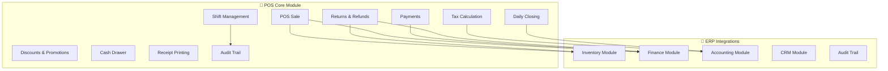

### 22.2 POS Integration Flow

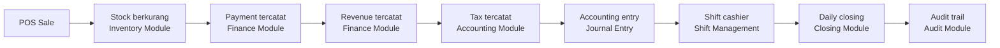

```text
POS Sale → Stock berkurang (Inventory) → Payment tercatat (Finance) → Revenue tercatat (Finance)
→ Tax tercatat (Accounting) → Accounting entry (Journal) → Shift cashier (Shift Management)
→ Daily closing (Closing) → Audit trail (Audit)
```

### 22.3 POS Features

| Feature | Description | Module Integration |
|---------|-------------|-------------------|
| **Sales** | Transaksi penjualan langsung | Inventory, Finance |
| **Returns** | Pengembalian barang | Inventory, Finance |
| **Refunds** | Pengembalian dana | Finance, CRM |
| **Discounts** | Diskon per item/transaksi | Finance |
| **Promotions** | Promosi berbasis waktu/quantity | Marketing |
| **Customers** | Data pelanggan POS | CRM |
| **Products** | Master produk untuk POS | Inventory |
| **Barcode** | Scan barcode untuk transaksi | Inventory |
| **Payments** | Multi metode pembayaran | Finance |
| **Cash Drawer** | Kelola uang tunai | Finance |
| **Shift Management** | Kelola shift cashier | HR, Payroll |
| **Cashier Management** | Kelola akun cashier | HR |
| **Receipt Printing** | Cetak struk transaksi | — |
| **Tax Calculation** | Perhitungan pajak otomatis | Accounting |
| **Offline Mode** | Transaksi tanpa koneksi | Sync Engine |
| **Closing** | Penutupan harian/shift | Accounting, Audit |
| **Audit Trail** | Jejak audit transaksi | Audit Module |

### 22.4 POS Permissions by Role

POS menggunakan **Permission Engine** yang sama dengan modul lain. Berikut default permission matrix:

| Role | Permission | Scope |
|------|------------|-------|
| **Cashier** | `pos.sale.create`, `pos.payment.receive`, `pos.receipt.print` | Terminal/Cabang |
| **Cashier** | ❌ NO `pos.sale.void` | — |
| **Cashier** | ❌ NO `pos.discount.override` (>10%) | — |
| **Cashier** | ❌ NO `pos.refund.create` | — |
| **Supervisor** | `pos.sale.void`, `pos.refund.create`, `pos.discount.override` | Cabang |
| **Manager** | `pos.price.change`, `pos.refund.approve`, `pos.shift.close` | Cabang/Regional |

```typescript
// Contoh: Permission check untuk POS
can(cashier, "create", "pos_sale", { terminal: "Terminal-01" })
// → true jika cashier punya pos.sale.create untuk terminal tersebut

can(supervisor, "void", "pos_sale", { branch: "Surabaya" })
// → true jika supervisor punya pos.sale.void untuk cabang Surabaya

can(manager, "close", "pos_shift", { branch: "Surabaya" })
// → true jika manager punya pos.shift.close untuk cabang Surabaya
```

### 22.5 POS Control Engine (Shift Lifecycle)

POS menggunakan **Unified Control Engine** dengan shift-specific lifecycle:

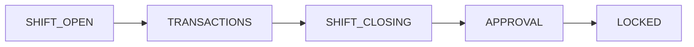

```text
SHIFT_OPEN → TRANSACTIONS → SHIFT_CLOSING → APPROVAL → LOCKED
```

| Status | Description | Allowed Actions |
|--------|-------------|-----------------|
| **SHIFT_OPEN** | Shift baru dibuka | Create sale, receive payment |
| **TRANSACTIONS** | Proses transaksi | Create sale, void, refund (with permission) |
| **SHIFT_CLOSING** | Shift akan ditutup | Hitung cash, count items, submit closing |
| **APPROVAL** | Menunggu approval | Manager review closing report |
| **LOCKED** | Shift sudah ditutup | View only, no modifications |

### 22.6 POS Offline Mode Architecture

POS mendukung **offline mode** dengan aturan sync ketat:

| Rule | Description | Implementation |
|------|-------------|----------------|
| **Stock Management** | Local cache + sync saat online | IndexedDB/localStorage + background sync |
| **Nomor Transaksi** | Offline counter + merge saat online | UUID v4 + sequence generator |
| **Payment Handling** | Cash offline, card pending | Cash: immediate, Card: queue for sync |
| **Sync Conflict Resolution** | Last-write-win + manual resolution | Timestamp-based with conflict UI |
| **Duplicate Prevention** | Idempotency key per transaction | SHA-256 hash of transaction data |
| **Audit Trail** | Offline entries marked | `isOffline: true` flag + sync timestamp |

```text
Offline Flow:
1. User creates transaction offline
2. Transaction stored locally (IndexedDB)
3. Stock deducted from local cache
4. Transaction marked as "pending_sync"
5. When online: sync queue processes transactions
6. Conflict detection: if stock changed during offline
7. Resolution: manual if conflict, auto if no conflict
8. Audit trail: all offline entries flagged with sync timestamp
```

### 22.7 POS Industry Configuration

POS dikonfigurasi per industri melalui **Industry Configuration Engine**:

| Industry | POS Flow | Special Features |
|----------|----------|-----------------|
| **Retail** | Barcode → Cart → Payment → Receipt | Multi-item cart, barcode scanning, receipt printing |
| **F&B** | Order → Kitchen → Preparation → Payment | Kitchen display, order tracking, table management |
| **Bengkel** | Customer → Vehicle → Service → Parts → Invoice → Payment | Vehicle database, service history, parts inventory |
| **Apotek** | Product → Batch → Expiry → Sale → Payment | Batch tracking, expiry management, prescription handling |

```yaml
# Contoh: POS Configuration untuk Retail
pos_config:
  industry: "retail"
  flow: "barcode_cart_payment_receipt"
  features:
    - barcode_scanning
    - multi_item_cart
    - receipt_printer
    - cash_drawer
    - customer_display
  hardware:
    barcode_scanner: true
    receipt_printer: true
    cash_drawer: true
    customer_display: true
    scale: false
```

```yaml
# Contoh: POS Configuration untuk F&B
pos_config:
  industry: "food_beverage"
  flow: "order_kitchen_preparation_payment"
  features:
    - table_management
    - kitchen_display
    - order_tracking
    - split_bill
    - tip_management
  hardware:
    kitchen_printer: true
    customer_display: false
    order_display: true
```

### 22.8 POS Data Model (Prisma Schema Extension)

```prisma
// POS-specific models (extensions to existing schema)
model POSSession {
  id            String   @id @default(cuid())
  tenantId      String
  terminalId    String
  cashierId     String
  shiftNumber   Int
  startTime     DateTime
  endTime       DateTime?
  status        ShiftStatus @default(SHIFT_OPEN)
  openingCash   Decimal  @default(0)
  closingCash   Decimal?
  totalSales    Decimal  @default(0)
  totalRefunds  Decimal  @default(0)
  totalDiscounts Decimal @default(0)
  transactionCount Int @default(0)
  createdAt     DateTime @default(now())
  updatedAt     DateTime @updatedAt
  
  transactions  POSTransaction[]
  
  @@index([tenantId, status])
  @@index([tenantId, cashierId])
  @@index([tenantId, startTime])
}

model POSTransaction {
  id            String   @id @default(cuid())
  tenantId      String
  sessionId     String
  transactionNo String
  customerId    String?
  subtotal      Decimal
  taxAmount     Decimal
  discountAmount Decimal @default(0)
  totalAmount   Decimal
  paymentMethod PaymentMethod
  paymentStatus PaymentStatus @default(PAID)
  status        TransactionStatus @default(COMPLETED)
  isOffline     Boolean  @default(false)
  syncTimestamp DateTime?
  createdAt     DateTime @default(now())
  updatedAt     DateTime @updatedAt
  
  session       POSSession @relation(fields: [sessionId], references: [id])
  items         POSTransactionItem[]
  payments      POSTransactionPayment[]
  refunds       POSRefund[]
  
  @@unique([tenantId, transactionNo])
  @@index([tenantId, sessionId])
  @@index([tenantId, createdAt])
  @@index([tenantId, customerId])
}

model POSTransactionItem {
  id            String   @id @default(cuid())
  tenantId      String
  transactionId String
  productId     String
  quantity      Int
  unitPrice     Decimal
  discountPercent Decimal @default(0)
  discountAmount Decimal @default(0)
  taxRate       Decimal  @default(0)
  taxAmount     Decimal  @default(0)
  lineTotal     Decimal
  createdAt     DateTime @default(now())
  
  transaction   POSTransaction @relation(fields: [transactionId], references: [id])
  
  @@index([tenantId, transactionId])
  @@index([tenantId, productId])
}

model POSTransactionPayment {
  id            String   @id @default(cuid())
  tenantId      String
  transactionId String
  paymentMethod PaymentMethod
  amount        Decimal
  reference     String?
  status        PaymentStatus @default(COMPLETED)
  createdAt     DateTime @default(now())
  
  transaction   POSTransaction @relation(fields: [transactionId], references: [id])
  
  @@index([tenantId, transactionId])
}

model POSRefund {
  id            String   @id @default(cuid())
  tenantId      String
  transactionId String
  refundNo      String
  amount        Decimal
  reason        String
  status        RefundStatus @default(PENDING)
  approvedBy    String?
  approvedAt    DateTime?
  createdAt     DateTime @default(now())
  updatedAt     DateTime @updatedAt
  
  transaction   POSTransaction @relation(fields: [transactionId], references: [id])
  
  @@unique([tenantId, refundNo])
  @@index([tenantId, transactionId])
  @@index([tenantId, status])
}

enum ShiftStatus {
  SHIFT_OPEN
  TRANSACTIONS
  SHIFT_CLOSING
  APPROVAL
  LOCKED
}

enum TransactionStatus {
  PENDING
  COMPLETED
  VOIDED
  REFUNDED
}

enum PaymentMethod {
  CASH
  CREDIT_CARD
  DEBIT_CARD
  E_WALLET
  BANK_TRANSFER
  QRIS
}

enum PaymentStatus {
  PENDING
  COMPLETED
  FAILED
  REFUNDED
}

enum RefundStatus {
  PENDING
  APPROVED
  REJECTED
  COMPLETED
}
```

---

**Last Updated:** August 31, 2026
**Maintainer:** Qalcuity Engineering Team
**Document Version:** 2.1 — Business Operating System Architecture + POS Module
