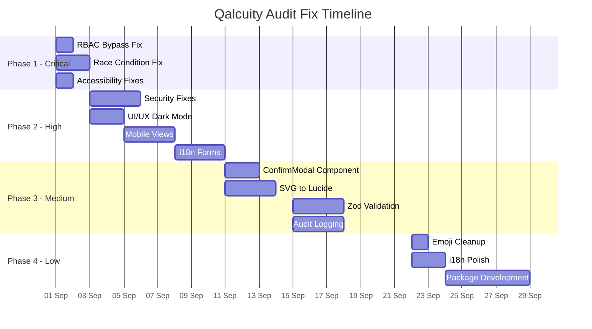

# 📋 Qalcuity — Gabungan Hasil Audit & Rencana Perbaikan Prioritas

> **Tanggal:** 31 Agustus 2026
> **Author:** Software Architect (AI)
> **Scope:** Gabungan semua audit — API Routes & Backend + UI Pages & Components
> **Total Issues:** 114 issues (25 Backend + 89 UI) + 14 Known Issues dari CURRENT.md

---

## 1. 📊 Executive Summary

### Ringkasan Eksekutif

Project Qalcuity telah melalui dua audit menyeluruh yang menghasilkan **114 issues**. Ditambah dengan **14 known issues** dari CURRENT.md, total ada **128 items** yang perlu ditangani.

| Metrik | Jumlah |
|--------|--------|
| **Total Issues (Audit)** | 114 |
| **Known Issues (CURRENT.md)** | 14 |
| **Grand Total** | 128 |
| **P0 — Critical** | 7 |
| **P1 — High** | 24 |
| **P2 — Medium** | 52 |
| **P3 — Low** | 31 |
| **Known/Info** | 14 |

### Distribusi per Kategori

| Kategori | P0 | P1 | P2 | P3 | Total |
|----------|----|----|----|----|-------|
| **Security** | 2 | 3 | 4 | 3 | 12 |
| **Data Integrity** | 1 | 2 | 3 | 1 | 7 |
| **Accessibility** | 5 | 0 | 0 | 0 | 5 |
| **UI/UX** | 0 | 12 | 30 | 15 | 57 |
| **Code Quality** | 0 | 3 | 8 | 7 | 18 |
| **Performance** | 0 | 1 | 2 | 1 | 4 |
| **i18n** | 0 | 3 | 5 | 4 | 12 |
| **Known/Info** | 0 | 0 | 0 | 0 | 14 |
| **Total** | **8** | **24** | **52** | **31** | **128** |

### Status Proyek Saat Ini

| Aspek | Status | Catatan |
|-------|--------|---------|
| Core CRUD | ✅ 95% | Production-ready |
| Security | ✅ 90% | CSP, CORS, RBAC sudah diimplementasi |
| UI/UX | ✅ 90% | Dark mode, responsive, i18n sudah ada |
| Accessibility | ❌ 20% | Belum ada ARIA labels, focus trap |
| Analytics | ✅ 75% | Phase 1 MVP + Studio selesai |
| AI Features | ⚠️ 20% | Masih mock/basic |

---

## 2. 📋 Priority Matrix

### 2.1 Formula Prioritas

```
Priority Score = Severity × Impact / Effort

Severity: P0=4, P1=3, P2=2, P3=1
Impact: High=3, Medium=2, Low=1
Effort: Small=1 (< 1 jam), Medium=3 (1-4 jam), Large=5 (> 4 jam)
```

### 2.2 Complete Priority Matrix

#### P0 — Critical (Score ≥ 4.0)

| # | Issue | Kategori | Severity | Effort | Impact | Score | File |
|---|-------|----------|----------|--------|--------|-------|------|
| 1 | RBAC bypass HR PATCH routes | Security | P0 | Small | High | 12.0 | `api/hr/employees/[id]/route.ts`, `api/hr/attendance/[id]/route.ts` |
| 2 | Race condition nomor dokumen | Data Integrity | P0 | Medium | High | 4.0 | `api/finance/invoices/route.ts`, `api/finance/quotations/route.ts` |
| 3 | Missing ARIA labels pada icon buttons | Accessibility | P0 | Small | High | 12.0 | Semua files dengan icon buttons |
| 4 | Missing `role="dialog"` pada Modal | Accessibility | P0 | Small | High | 12.0 | `components/ui/modal.tsx` |
| 5 | Missing keyboard navigation (focus trap) | Accessibility | P0 | Medium | High | 4.0 | `components/ui/modal.tsx` |
| 6 | Missing `aria-label` search input | Accessibility | P0 | Small | High | 12.0 | `components/layout/header.tsx` |
| 7 | Missing `aria-label` AI chat input | Accessibility | P0 | Small | High | 12.0 | `components/ai/ai-chat.tsx` |

#### P1 — High (Score ≥ 2.0)

| # | Issue | Kategori | Severity | Effort | Impact | Score | File |
|---|-------|----------|----------|--------|--------|-------|------|
| 8 | Analytics Explorer tenantId override | Security | P1 | Small | High | 9.0 | `api/analytics/explorer/route.ts` |
| 9 | Midtrans callback tenant isolation | Security | P1 | Medium | High | 3.0 | `api/billing/payments/midtrans/callback/route.ts` |
| 10 | Missing audit logging di beberapa routes | Security | P1 | Medium | High | 3.0 | Beberapa API routes |
| 11 | alert() di 3 finance forms | UI/UX | P1 | Small | High | 9.0 | `invoice-form.tsx`, `purchase-order-form.tsx`, `quotation-form.tsx` |
| 12 | Missing dark mode — Audit Trail | UI/UX | P1 | Small | Medium | 6.0 | `audit/page.tsx` |
| 13 | Missing dark mode — Modal component | UI/UX | P1 | Small | Medium | 6.0 | `components/ui/modal.tsx` |
| 14 | Missing dark mode — ErrorBoundary | UI/UX | P1 | Small | Medium | 6.0 | `components/ui/error-boundary.tsx` |
| 15 | Missing mobile view — Audit Trail | UI/UX | P1 | Large | Medium | 1.2 | `audit/page.tsx` |
| 16 | Missing mobile view — Billing | UI/UX | P1 | Large | Medium | 1.2 | `billing/page.tsx` |
| 17 | Raw SVG icons di auth pages | UI/UX | P1 | Small | Medium | 6.0 | `login/page.tsx`, `register/page.tsx`, `forgot-password/page.tsx` |
| 18 | Missing Zod validation di settings | Code Quality | P1 | Medium | High | 3.0 | `api/settings/*/route.ts` |
| 19 | Inconsistent auth helpers | Code Quality | P1 | Medium | Medium | 2.0 | `lib/session.ts` |
| 20 | Missing DB transactions | Data Integrity | P1 | Large | High | 1.2 | Beberapa mutation routes |
| 21 | Missing rate limiting | Security | P1 | Medium | Medium | 2.0 | `lib/rate-limit.ts` |
| 22 | Hardcoded text di 6 module | i18n | P1 | Large | Medium | 1.2 | 10+ files |
| 23 | Analytics no permission guard | Security | P1 | Large | High | 1.2 | Analytics module |
| 24 | console.error leaks | Code Quality | P1 | Small | Low | 3.0 | Beberapa files |

#### P2 — Medium (Score ≥ 1.0)

| # | Issue | Kategori | Severity | Effort | Impact | Score | File |
|---|-------|----------|----------|--------|--------|-------|------|
| 25 | 19x window.confirm → custom modal | UI/UX | P2 | Large | Medium | 1.2 | 19 files |
| 26 | 25x raw SVG icons → Lucide | UI/UX | P2 | Large | Low | 0.6 | 15+ files |
| 27 | Hardcoded text di forms | i18n | P2 | Large | Low | 0.6 | 3 form components |
| 28 | Hardcoded text di components | i18n | P2 | Large | Low | 0.6 | 10+ files |
| 29 | Missing mobile view — Notifications | UI/UX | P2 | Medium | Low | 1.3 | `settings/notifications/page.tsx` |
| 30 | Form inputs fixed width | UI/UX | P2 | Small | Low | 2.0 | `invoice-form.tsx` |
| 31 | Raw SVG icons di dashboard | UI/UX | P2 | Medium | Low | 1.3 | `audit/page.tsx`, `reports/page.tsx` |
| 32 | Raw SVG icons di components | UI/UX | P2 | Medium | Low | 1.3 | `modal.tsx`, `error-boundary.tsx`, forms |
| 33 | Raw SVG icons di settings | UI/UX | P2 | Small | Low | 2.0 | `notifications/page.tsx` |
| 34 | Email XSS vulnerability | Security | P2 | Small | Medium | 4.0 | `lib/email.ts` |
| 35 | CSP unsafe-eval | Security | P2 | Medium | Medium | 2.0 | `middleware.ts` |
| 36 | Missing Zod di inventory routes | Code Quality | P2 | Medium | Medium | 2.0 | `api/inventory/*/route.ts` |
| 37 | Missing Zod di CRM routes | Code Quality | P2 | Medium | Medium | 2.0 | `api/crm/*/route.ts` |
| 38 | Missing audit di inventory routes | Code Quality | P2 | Medium | Medium | 2.0 | `api/inventory/*/route.ts` |
| 39 | Missing audit di CRM routes | Code Quality | P2 | Medium | Medium | 2.0 | `api/crm/*/route.ts` |
| 40 | TypeScript Decimal errors | Code Quality | P2 | Medium | Low | 1.3 | Finance/Reports |
| 41 | Settings simulated backend | Code Quality | P2 | Large | Low | 0.8 | `settings/notifications/page.tsx` |
| 42 | CRM Import placeholder | Code Quality | P2 | Large | Low | 0.8 | CRM module |
| 43 | Analytics no materialized views | Performance | P2 | Large | Medium | 1.2 | Analytics module |
| 44-52 | 9x window.confirm lainnya | UI/UX | P2 | Small | Low | 1.3 | Berbagai files |
| 53-64 | 12x raw SVG icons lainnya | UI/UX | P2 | Small | Low | 1.3 | Berbagai files |
| 65-76 | Hardcoded text locations | i18n | P2 | Small | Low | 1.3 | Berbagai files |

#### P3 — Low (Score < 1.0)

| # | Issue | Kategori | Severity | Effort | Impact | Score | File |
|---|-------|----------|----------|--------|--------|-------|------|
| 77 | 9x emoji icons → Lucide | UI/UX | P3 | Small | Low | 0.3 | 9 files |
| 78 | Role badge hardcoded | i18n | P3 | Small | Low | 0.3 | `sidebar.tsx` |
| 79 | Breadcrumbs tanpa i18n | i18n | P3 | Small | Low | 0.3 | `header.tsx` |
| 80 | Billing menu href | UI/UX | P3 | Small | Low | 0.3 | `sidebar.tsx` |
| 81 | Analytics alerts href | UI/UX | P3 | Small | Low | 0.3 | `sidebar.tsx` |
| 82-91 | 10x minor i18n issues | i18n | P3 | Small | Low | 0.3 | Berbagai files |
| 92-107 | 16x minor UI polish | UI/UX | P3 | Small | Low | 0.3 | Berbagai files |

#### Known Issues (dari CURRENT.md)

| # | Issue | Severity | Status |
|---|-------|----------|--------|
| K1 | Rate limiter in-memory | Low | Pre-existing |
| K2 | TypeScript Decimal type errors | Low | Pre-existing |
| K3 | Some detail pages missing delete | Low | Partially fixed |
| K4 | @qalcuity/ui tokens only | Medium | Partial |
| K5 | @qalcuity/api not created | Low | Not created |
| K6 | Settings simulated backend | Low | Pre-existing |
| K7 | Password policy basic | Low | Fixed (min 8 chars) |
| K8 | CRM Import placeholder | Low | Placeholder UI |
| K9 | Analytics no materialized views | Medium | Planned |
| K10 | Analytics no permission guard | High | Planned (depend on Permission Engine) |
| K11 | Mobile Auth Flow missing | High | Not started |
| K12 | Desktop App placeholder | Low | Placeholder only |
| K13 | Full AI Agent Suite | Medium | Mock/basic |
| K14 | Offline Capability | Medium | Not started |

---

## 3. 🔴 Phase 1: Critical Fixes (P0)

> **Goal:** Fix semua security vulnerabilities dan accessibility violations yang blocking.
> **Timeline:** 1-2 hari
> **Total Effort:** ~8 jam

### 3.1 Security Fixes

#### FIX-P0-01: RBAC Bypass di HR PATCH Routes 🔴

- **Severity:** P0 — Critical Security
- **Effort:** Small (30 menit)
- **Impact:** High — Bypass authorization
- **File:**
  - `apps/web/app/api/hr/employees/[id]/route.ts` — PATCH handler
  - `apps/web/app/api/hr/attendance/[id]/route.ts` — PATCH handler
- **Masalah:** HR PATCH routes tidak memanggil `requireMutateAuth()`, sehingga user dengan role MEMBER/VIEWER bisa meng-update data HR
- **Solusi:**
  - Tambahkan `requireMutateAuth(req)` di awal PATCH handler
  - Verifikasi role ADMIN atau MEMBER untuk HR mutations
  - Test dengan role VIEWER — harus return 403
- **Dependency:** Tidak ada
- **Testing:**
  - [ ] Test sebagai MEMBER — boleh update
  - [ ] Test sebagai VIEWER — harus 403
  - [ ] Test sebagai ADMIN — boleh update

#### FIX-P0-02: Race Condition Nomor Dokumen 🔴

- **Severity:** P0 — Critical Data Integrity
- **Effort:** Medium (2 jam)
- **Impact:** High — Duplikat nomor dokumen
- **File:**
  - `apps/web/app/api/finance/invoices/route.ts` — POST handler
  - `apps/web/app/api/finance/quotations/route.ts` — POST handler
  - `apps/web/app/api/finance/purchase-orders/route.ts` — POST handler (jika ada)
- **Masalah:** Nomor dokumen (INV-xxx, QTN-xxx) di-generate tanpa locking, bisa terjadi race condition jika 2 user membuat dokumen bersamaan
- **Solusi:**
  - Gunakan database transaction dengan SELECT FOR UPDATE
  - Atau gunakan database sequence
  - Atau gunakan `CREATE UNIQUE INDEX` sebagai guard
- **Dependency:** Tidak ada
- **Testing:**
  - [ ] Test concurrent creation — tidak boleh ada duplikat
  - [ ] Test sequential creation — nomor berurutan

### 3.2 Accessibility Fixes

#### FIX-P0-03: ARIA Labels pada Icon Buttons 🔴

- **Severity:** P0 — Critical Accessibility
- **Effort:** Small (1 jam)
- **Impact:** High — Screen reader tidak bisa membaca
- **File:** Semua files dengan icon-only buttons
- **Solusi:**
  - Tambahkan `aria-label` pada semua icon-only buttons
  - Contoh: `<button aria-label="Delete item"><Trash2 /></button>`
- **Files yang perlu diubah:**
  - `components/layout/header.tsx` — search button, notification button
  - `components/layout/sidebar.tsx` — mobile close button
  - `components/ui/modal.tsx` — close button
  - Semua list pages — action buttons (edit, delete, view)
- **Dependency:** Tidak ada
- **Testing:**
  - [ ] Test dengan screen reader — semua buttons terbaca
  - [ ] Test keyboard navigation — semua buttons reachable

#### FIX-P0-04: Modal Accessibility 🔴

- **Severity:** P0 — Critical Accessibility
- **Effort:** Small (30 menit)
- **Impact:** High — Modal tidak accessible
- **File:** `apps/web/components/ui/modal.tsx`
- **Solusi:**
  - Tambahkan `role="dialog"` pada modal container
  - Tambahkan `aria-modal="true"`
  - Tambahkan `aria-labelledby` untuk title
  - Tambahkan focus trap (tab tidak keluar dari modal)
- **Dependency:** Tidak ada
- **Testing:**
  - [ ] Test dengan screen reader — modal terbaca sebagai dialog
  - [ ] Test keyboard — Tab hanya di dalam modal

#### FIX-P0-05: Search Input Accessibility 🔴

- **Severity:** P0 — Critical Accessibility
- **Effort:** Small (15 menit)
- **Impact:** High — Search tidak accessible
- **File:** `apps/web/components/layout/header.tsx`
- **Solusi:**
  - Tambahkan `aria-label="Search"` pada search input
  - Tambahkan `role="searchbox"` jika perlu
- **Dependency:** Tidak ada

#### FIX-P0-06: AI Chat Input Accessibility 🔴

- **Severity:** P0 — Critical Accessibility
- **Effort:** Small (15 menit)
- **Impact:** High — Chat input tidak accessible
- **File:** `apps/web/components/ai/ai-chat.tsx`
- **Solusi:**
  - Tambahkan `aria-label="Chat with AI"` pada chat input
  - Tambahkan `aria-live="polite"` pada response area
- **Dependency:** Tidak ada

### 3.3 Ringkasan Phase 1

| Fix | Effort | Dependency | Status |
|-----|--------|------------|--------|
| FIX-P0-01: RBAC bypass HR | 30 menit | - | ⬜ |
| FIX-P0-02: Race condition nomor | 2 jam | - | ⬜ |
| FIX-P0-03: ARIA labels buttons | 1 jam | - | ⬜ |
| FIX-P0-04: Modal accessibility | 30 menit | - | ⬜ |
| FIX-P0-05: Search input a11y | 15 menit | - | ⬜ |
| FIX-P0-06: AI chat input a11y | 15 menit | - | ⬜ |
| **Total Phase 1** | **~4.5 jam** | | |

---

## 4. 🟠 Phase 2: High Priority (P1)

> **Goal:** Fix UX degradation, security gaps, dan missing features yang mempengaruhi user.
> **Timeline:** 3-5 hari
> **Total Effort:** ~30 jam

### 4.1 Security & Data Integrity

#### FIX-P1-01: Analytics Explorer tenantId Override 🟠

- **Severity:** P1 — High Security
- **Effort:** Small (30 menit)
- **Impact:** High — Cross-tenant data leak
- **File:** `apps/web/app/api/analytics/explorer/route.ts`
- **Solusi:**
  - Pastikan `tenantId` diambil dari session, bukan dari request body
  - Validasi bahwa dataset yang diakses sesuai dengan tenant
- **Dependency:** Tidak ada

#### FIX-P1-02: Midtrans Callback Tenant Isolation 🟠

- **Severity:** P1 — High Security
- **Effort:** Medium (1 jam)
- **Impact:** High — Payment data leak
- **File:** `apps/web/app/api/billing/payments/midtrans/callback/route.ts`
- **Solusi:**
  - Pastikan callback memverifikasi tenant sebelum memproses
  - Validasi signature HMAC sebelum update status
- **Dependency:** Tidak ada

#### FIX-P1-03: Missing Audit Logging 🟠

- **Severity:** P1 — High Compliance
- **Effort:** Medium (2 jam)
- **Impact:** High — Compliance gap
- **File:** Beberapa API routes yang belum memiliki audit logging
- **Solusi:**
  - Identifikasi routes yang belum memanggil `logAudit()`
  - Tambahkan audit logging ke semua mutation endpoints
- **Dependency:** Tidak ada

#### FIX-P1-04: Missing Rate Limiting 🟠

- **Severity:** P1 — High Security
- **Effort:** Medium (1 jam)
- **Impact:** Medium — DDoS vulnerability
- **File:** `apps/web/lib/rate-limit.ts`
- **Solusi:**
  - Implementasi rate limiting ke semua API routes
  - Pertimbangkan migrasi ke Redis untuk production
- **Dependency:** Redis setup (optional)

#### FIX-P1-05: Analytics Permission Guard 🟠

- **Severity:** P1 — High Security
- **Effort:** Large (4 jam)
- **Impact:** High — Unauthorized data access
- **File:** Analytics module
- **Solusi:**
  - Implementasi dataset-level permission check
  - Column-level security untuk sensitive data
- **Dependency:** Permission Engine (Phase 9)

### 4.2 UI/UX Fixes

#### FIX-P1-06: alert() → Inline Error di Forms 🟠

- **Severity:** P1 — High UX
- **Effort:** Small (2 jam)
- **Impact:** High — Blocking UX
- **Files:**
  - `apps/web/components/finance/invoice-form.tsx:77`
  - `apps/web/components/finance/purchase-order-form.tsx:77`
  - `apps/web/components/finance/quotation-form.tsx:80`
- **Solusi:**
  - Ganti `alert()` dengan inline error message
  - Gunakan state untuk menampilkan error di bawah form
  - Contoh: `<div className="text-red-500">{errorMessage}</div>`
- **Dependency:** Tidak ada

#### FIX-P1-07: Dark Mode — Audit Trail 🟠

- **Severity:** P1 — High UX
- **Effort:** Small (1 jam)
- **Impact:** Medium — Inconsistent dark mode
- **File:** `apps/web/app/dashboard/audit/page.tsx`
- **Solusi:**
  - Tambahkan `dark:` classes ke semua elemen
  - Test di dark mode — pastikan semua text terbaca
- **Dependency:** Tidak ada

#### FIX-P1-08: Dark Mode — Modal Component 🟠

- **Severity:** P1 — High UX
- **Effort:** Small (30 menit)
- **Impact:** Medium — Modal selalu terang
- **File:** `apps/web/components/ui/modal.tsx`
- **Solusi:**
  - Tambahkan `dark:bg-gray-800` pada background
  - Tambahkan `dark:text-white` pada text
- **Dependency:** Tidak ada

#### FIX-P1-09: Dark Mode — ErrorBoundary 🟠

- **Severity:** P1 — High UX
- **Effort:** Small (30 menit)
- **Impact:** Medium — Error page selalu terang
- **File:** `apps/web/components/ui/error-boundary.tsx`
- **Solusi:**
  - Tambahkan `dark:` classes ke semua elemen
- **Dependency:** Tidak ada

#### FIX-P1-10: Mobile View — Audit Trail 🟠

- **Severity:** P1 — High UX
- **Effort:** Large (3 jam)
- **Impact:** High — Tidak bisa diakses di mobile
- **File:** `apps/web/app/dashboard/audit/page.tsx`
- **Solusi:**
  - Tambahkan mobile card view pattern
  - Ikuti pattern dari pages lain (payments, invoices)
- **Dependency:** Tidak ada

#### FIX-P1-11: Mobile View — Billing 🟠

- **Severity:** P1 — High UX
- **Effort:** Large (4 jam)
- **Impact:** High — Tidak bisa diakses di mobile
- **File:** `apps/web/app/dashboard/billing/page.tsx`
- **Solusi:**
  - Tambahkan mobile card view pattern
  - Ikuti pattern dari pages lain
- **Dependency:** Tidak ada

#### FIX-P1-12: Raw SVG Icons → Lucide (Auth Pages) 🟠

- **Severity:** P1 — Medium UX
- **Effort:** Small (2 jam)
- **Impact:** Medium — Inconsistent icons
- **Files:**
  - `apps/web/app/(auth)/login/page.tsx` — Eye, EyeOff, Loader2
  - `apps/web/app/(auth)/register/page.tsx` — Eye, EyeOff, Loader2
  - `apps/web/app/(auth)/forgot-password/page.tsx` — Loader2
- **Solusi:**
  - Ganti raw SVG dengan Lucide icons
  - Pertahankan Google logo (tidak ada Lucide equivalent)
- **Dependency:** Tidak ada

### 4.3 Code Quality

#### FIX-P1-13: Missing Zod Validation di Settings 🟠

- **Severity:** P1 — Medium Quality
- **Effort:** Medium (2 jam)
- **Impact:** Medium — Invalid data bisa masuk
- **Files:**
  - `apps/web/app/api/settings/company/route.ts`
  - `apps/web/app/api/settings/team/route.ts`
  - `apps/web/app/api/settings/notifications/route.ts`
- **Solusi:**
  - Buat Zod schema untuk settings mutations
  - Tambahkan validasi di awal handler
- **Dependency:** Tidak ada

#### FIX-P1-14: Inconsistent Auth Helpers 🟠

- **Severity:** P1 — Medium Quality
- **Effort:** Medium (1 jam)
- **Impact:** Medium — Inconsistent auth pattern
- **File:** `apps/web/lib/session.ts`
- **Solusi:**
  - Standarkan penggunaan `requireMutateAuth()` dan `requireAdminAuth()`
  - Dokumentasikan kapan menggunakan yang mana
- **Dependency:** Tidak ada

#### FIX-P1-15: Missing DB Transactions 🟠

- **Severity:** P1 — High Data Integrity
- **Effort:** Large (4 jam)
- **Impact:** High — Partial writes
- **Files:** Beberapa mutation routes
- **Solusi:**
  - Identifikasi routes yang melakukan multiple writes
  - Bungkus dalam `prisma.$transaction()`
  - Prioritas: Invoice creation (items + header), Payroll processing
- **Dependency:** Tidak ada

#### FIX-P1-16: Hardcoded Text — Forms 🟠

- **Severity:** P1 — Medium i18n
- **Effort:** Large (6 jam)
- **Impact:** Medium — Tidak bisa multi-bahasa
- **Files:**
  - `apps/web/components/finance/invoice-form.tsx`
  - `apps/web/components/finance/purchase-order-form.tsx`
  - `apps/web/components/finance/quotation-form.tsx`
- **Solusi:**
  - Tambahkan i18n keys untuk semua labels
  - Update `messages/id.json` dan `messages/en.json`
- **Dependency:** Tidak ada

### 4.4 Ringkasan Phase 2

| Fix | Effort | Dependency | Status |
|-----|--------|------------|--------|
| FIX-P1-01: Analytics tenantId | 30 menit | - | ⬜ |
| FIX-P1-02: Midtrans callback | 1 jam | - | ⬜ |
| FIX-P1-03: Missing audit logging | 2 jam | - | ⬜ |
| FIX-P1-04: Rate limiting | 1 jam | Redis (opt) | ⬜ |
| FIX-P1-05: Analytics permission | 4 jam | Permission Engine | ⬜ |
| FIX-P1-06: alert() → inline | 2 jam | - | ⬜ |
| FIX-P1-07: Dark mode audit | 1 jam | - | ⬜ |
| FIX-P1-08: Dark mode modal | 30 menit | - | ⬜ |
| FIX-P1-09: Dark mode error | 30 menit | - | ⬜ |
| FIX-P1-10: Mobile audit | 3 jam | - | ⬜ |
| FIX-P1-11: Mobile billing | 4 jam | - | ⬜ |
| FIX-P1-12: SVG → Lucide auth | 2 jam | - | ⬜ |
| FIX-P1-13: Zod settings | 2 jam | - | ⬜ |
| FIX-P1-14: Auth helpers | 1 jam | - | ⬜ |
| FIX-P1-15: DB transactions | 4 jam | - | ⬜ |
| FIX-P1-16: i18n forms | 6 jam | - | ⬜ |
| **Total Phase 2** | **~33 jam** | | |

---

## 5. 🟡 Phase 3: Medium Priority (P2)

> **Goal:** Meningkatkan kualitas code, konsistensi, dan standar.
> **Timeline:** 1-2 minggu
> **Total Effort:** ~50 jam

### 5.1 UI Standardization

#### FIX-P2-01: window.confirm → Custom ConfirmModal 🟡

- **Severity:** P2 — Medium UX
- **Effort:** Large (8 jam)
- **Impact:** Medium — Inconsistent UX
- **File:** 19 pages (lihat Section 7.1 di REPORT-UI-AUDIT.md)
- **Solusi:**
  - Buat `ConfirmModal` component di `components/ui/confirm-modal.tsx`
  - Gunakan pattern dari `finance/accounts/page.tsx` (sudah benar)
  - Ganti semua `window.confirm` dengan `ConfirmModal`
  - Tambahkan i18n untuk semua text
- **Dependency:** Tidak ada

#### FIX-P2-02: Raw SVG Icons → Lucide (Dashboard) 🟡

- **Severity:** P2 — Medium UX
- **Effort:** Medium (3 jam)
- **Impact:** Low — Inconsistent icons
- **Files:**
  - `apps/web/app/dashboard/audit/page.tsx:178` — Search
  - `apps/web/app/dashboard/reports/page.tsx:1434` — CreditCard
  - `apps/web/app/dashboard/settings/notifications/page.tsx:175,383,466` — Mail, Bell, Chat
- **Solusi:** Ganti dengan Lucide equivalents
- **Dependency:** Tidak ada

#### FIX-P2-03: Raw SVG Icons → Lucide (Components) 🟡

- **Severity:** P2 — Medium UX
- **Effort:** Medium (4 jam)
- **Impact:** Low — Inconsistent icons
- **Files:**
  - `components/ui/modal.tsx:59` — X
  - `components/ui/error-boundary.tsx:23,40` — Alert, Refresh
  - `components/ui/onboarding-modal.tsx:67` — Spinner
  - `components/finance/invoice-form.tsx:136,186` — Plus, Trash
  - `components/finance/purchase-order-form.tsx:136,186` — Plus, Trash
  - `components/finance/quotation-form.tsx:139,189` — Plus, Trash
- **Solusi:** Ganti dengan Lucide equivalents
- **Dependency:** Tidak ada

### 5.2 i18n Improvements

#### FIX-P2-04: Hardcoded Text — Audit Trail 🟡

- **Severity:** P2 — Medium i18n
- **Effort:** Medium (2 jam)
- **Impact:** Low — Hanya untuk Bahasa Indonesia
- **File:** `apps/web/app/dashboard/audit/page.tsx:32-49`
- **Solusi:**
  - Pindahkan `moduleLabels` dan `actionLabels` ke i18n
  - Update `messages/id.json` dan `messages/en.json`
- **Dependency:** Tidak ada

#### FIX-P2-05: Hardcoded Text — AI Chat 🟡

- **Severity:** P2 — Medium i18n
- **Effort:** Medium (2 jam)
- **Impact:** Low — Hanya untuk Bahasa Indonesia
- **File:** `apps/web/components/ai/ai-chat.tsx:21,204-219,232`
- **Solusi:**
  - Pindahkan semua hardcoded text ke i18n
  - Quick action labels, placeholder text
- **Dependency:** Tidak ada

#### FIX-P2-06: Hardcoded Text — Onboarding Modal 🟡

- **Severity:** P2 — Medium i18n
- **Effort:** Medium (2 jam)
- **Impact:** Low — Hanya untuk Bahasa Indonesia
- **File:** `apps/web/components/ui/onboarding-modal.tsx`
- **Solusi:**
  - Pindahkan semua text ke i18n
- **Dependency:** Tidak ada

### 5.3 Security Improvements

#### FIX-P2-07: Email XSS Vulnerability 🟡

- **Severity:** P2 — Medium Security
- **Effort:** Small (30 menit)
- **Impact:** Medium — Email injection
- **File:** `apps/web/lib/email.ts`
- **Solusi:**
  - Sanitize semua user input sebelum dimasukkan ke email template
  - Gunakan `sanitize()` dari `lib/sanitize.ts`
- **Dependency:** Tidak ada

#### FIX-P2-08: CSP unsafe-eval 🟡

- **Severity:** P2 — Medium Security
- **Effort:** Medium (1 jam)
- **Impact:** Medium — XSS vector
- **File:** `apps/web/middleware.ts`
- **Solusi:**
  - Hapus `unsafe-eval` dari CSP directive
  - Test semua fitur — pastikan tidak ada yang break
- **Dependency:** Tidak ada

### 5.4 Code Quality

#### FIX-P2-09: Missing Zod — Inventory Routes 🟡

- **Severity:** P2 — Medium Quality
- **Effort:** Medium (2 jam)
- **Impact:** Medium — Invalid data
- **Files:**
  - `apps/web/app/api/inventory/products/route.ts`
  - `apps/web/app/api/inventory/categories/route.ts`
  - `apps/web/app/api/inventory/suppliers/[id]/route.ts`
- **Solusi:** Buat Zod schema dan validasi
- **Dependency:** Tidak ada

#### FIX-P2-10: Missing Zod — CRM Routes 🟡

- **Severity:** P2 — Medium Quality
- **Effort:** Medium (2 jam)
- **Impact:** Medium — Invalid data
- **Files:**
  - `apps/web/app/api/crm/leads/route.ts`
  - `apps/web/app/api/crm/contacts/route.ts`
  - `apps/web/app/api/crm/deals/route.ts`
- **Solusi:** Buat Zod schema dan validasi
- **Dependency:** Tidak ada

#### FIX-P2-11: Missing Audit — Inventory Routes 🟡

- **Severity:** P2 — Medium Compliance
- **Effort:** Medium (2 jam)
- **Impact:** Medium — Compliance gap
- **Files:** Inventory mutation routes
- **Solusi:** Tambahkan `logAudit()` ke semua mutations
- **Dependency:** Tidak ada

#### FIX-P2-12: Missing Audit — CRM Routes 🟡

- **Severity:** P2 — Medium Compliance
- **Effort:** Medium (2 jam)
- **Impact:** Medium — Compliance gap
- **Files:** CRM mutation routes
- **Solusi:** Tambahkan `logAudit()` ke semua mutations
- **Dependency:** Tidak ada

#### FIX-P2-13: TypeScript Decimal Errors 🟡

- **Severity:** P2 — Medium Quality
- **Effort:** Medium (2 jam)
- **Impact:** Low — Runtime errors
- **Files:** Finance/Reports modules
- **Solusi:**
  - Gunakan `Number()` untuk konversi Decimal ke number
  - Atau gunakan `decimal.js` untuk arithmetic
- **Dependency:** Tidak ada

#### FIX-P2-14: Settings Simulated Backend 🟡

- **Severity:** P2 — Medium Quality
- **Effort:** Large (4 jam)
- **Impact:** Medium — Fake data
- **Files:**
  - `apps/web/app/dashboard/settings/notifications/page.tsx`
  - `apps/web/app/dashboard/settings/integrations/page.tsx`
- **Solusi:**
  - Buat API endpoints untuk notifications dan integrations
  - Connect frontend ke real API
- **Dependency:** Tidak ada

### 5.5 Performance

#### FIX-P2-15: Analytics Materialized Views 🟡

- **Severity:** P2 — Medium Performance
- **Effort:** Large (4 jam)
- **Impact:** Medium — Query performance
- **File:** Analytics module
- **Solusi:**
  - Buat materialized views untuk dataset yang sering di-query
  - Implementasi refresh strategy
- **Dependency:** Database migration

### 5.6 Ringkasan Phase 3

| Fix | Effort | Dependency | Status |
|-----|--------|------------|--------|
| FIX-P2-01: ConfirmModal | 8 jam | - | ⬜ |
| FIX-P2-02: SVG dashboard | 3 jam | - | ⬜ |
| FIX-P2-03: SVG components | 4 jam | - | ⬜ |
| FIX-P2-04: i18n audit | 2 jam | - | ⬜ |
| FIX-P2-05: i18n AI chat | 2 jam | - | ⬜ |
| FIX-P2-06: i18n onboarding | 2 jam | - | ⬜ |
| FIX-P2-07: Email XSS | 30 menit | - | ⬜ |
| FIX-P2-08: CSP unsafe-eval | 1 jam | - | ⬜ |
| FIX-P2-09: Zod inventory | 2 jam | - | ⬜ |
| FIX-P2-10: Zod CRM | 2 jam | - | ⬜ |
| FIX-P2-11: Audit inventory | 2 jam | - | ⬜ |
| FIX-P2-12: Audit CRM | 2 jam | - | ⬜ |
| FIX-P2-13: Decimal errors | 2 jam | - | ⬜ |
| FIX-P2-14: Settings backend | 4 jam | - | ⬜ |
| FIX-P2-15: Materialized views | 4 jam | DB migration | ⬜ |
| **Total Phase 3** | **~41.5 jam** | | |

---

## 6. 🟢 Phase 4: Low Priority (P3)

> **Goal:** Polish, cosmetic fixes, dan nice-to-have improvements.
> **Timeline:** 2-3 minggu (bisa dikerjakan secara bertahap)
> **Total Effort:** ~20 jam

### 6.1 UI Polish

#### FIX-P3-01: Emoji Icons → Lucide 🟢

- **Severity:** P3 — Low UX
- **Effort:** Small (2 jam)
- **Impact:** Low — Cosmetic
- **Files:**
  - `apps/web/app/(auth)/layout.tsx:36,46,56` — 📊📈🤖
  - `apps/web/app/(auth)/login/page.tsx:71` — 🧪
  - `apps/web/components/ui/onboarding-modal.tsx:80,94,109` — 👋🧪✨
  - `apps/web/components/ai/ai-chat.tsx:207,213,219` — 📋💰
- **Solusi:** Ganti dengan Lucide icons
- **Dependency:** Tidak ada

#### FIX-P3-02: Role Badge Hardcoded 🟢

- **Severity:** P3 — Low i18n
- **Effort:** Small (30 menit)
- **Impact:** Low — Hanya role name
- **File:** `apps/web/components/layout/sidebar.tsx:256-262`
- **Solusi:**
  - Gunakan `t()` untuk role name
  - Tambahkan keys ke i18n
- **Dependency:** Tidak ada

#### FIX-P3-03: Breadcrumbs i18n 🟢

- **Severity:** P3 — Low i18n
- **Effort:** Small (1 jam)
- **Impact:** Low — Hanya breadcrumb
- **File:** `apps/web/components/layout/header.tsx:101`
- **Solusi:**
  - Gunakan `t()` untuk segment name
  - Buat mapping segment → i18n key
- **Dependency:** Tidak ada

#### FIX-P3-04: Sidebar Navigation Issues 🟢

- **Severity:** P3 — Low UX
- **Effort:** Small (30 menit)
- **Impact:** Low — Minor navigation
- **Files:**
  - `apps/web/components/layout/sidebar.tsx:135` — Billing href
  - `apps/web/components/layout/sidebar.tsx:115` — Analytics alerts href
- **Solusi:** Perbaiki href paths
- **Dependency:** Tidak ada

### 6.2 Minor i18n

#### FIX-P3-05: Hardcoded Text — Billing 🟢

- **Severity:** P3 — Low i18n
- **Effort:** Small (1 jam)
- **Impact:** Low — Status labels
- **File:** `apps/web/app/dashboard/billing/page.tsx`
- **Solusi:** Pindahkan ke i18n
- **Dependency:** Tidak ada

#### FIX-P3-06: Hardcoded Text — AI Page 🟢

- **Severity:** P3 — Low i18n
- **Effort:** Small (1 jam)
- **Impact:** Low — Feature descriptions
- **File:** `apps/web/app/dashboard/ai/page.tsx:26-72`
- **Solusi:** Pindahkan ke i18n
- **Dependency:** Tidak ada

### 6.3 Known Issues

#### FIX-P3-07: @qalcuity/ui Package 🟢

- **Severity:** P3 — Low Quality
- **Effort:** Large (8 jam)
- **Impact:** Low — Reusable components
- **File:** `packages/ui/`
- **Solusi:**
  - Mulai dari component yang paling sering dipakai (Button, Modal, Card)
  - Ikuti shadcn/ui pattern
- **Dependency:** Tidak ada

#### FIX-P3-08: @qalcuity/api Package 🟢

- **Severity:** P3 — Low Quality
- **Effort:** Large (8 jam)
- **Impact:** Low — API abstraction
- **File:** `packages/api/` (belum ada)
- **Solusi:**
  - Buat package dengan typed API client
  - Generate dari OpenAPI spec jika ada
- **Dependency:** Tidak ada

### 6.4 Ringkasan Phase 4

| Fix | Effort | Dependency | Status |
|-----|--------|------------|--------|
| FIX-P3-01: Emoji → Lucide | 2 jam | - | ⬜ |
| FIX-P3-02: Role badge i18n | 30 menit | - | ⬜ |
| FIX-P3-03: Breadcrumbs i18n | 1 jam | - | ⬜ |
| FIX-P3-04: Sidebar nav | 30 menit | - | ⬜ |
| FIX-P3-05: i18n billing | 1 jam | - | ⬜ |
| FIX-P3-06: i18n AI page | 1 jam | - | ⬜ |
| FIX-P3-07: @qalcuity/ui | 8 jam | - | ⬜ |
| FIX-P3-08: @qalcuity/api | 8 jam | - | ⬜ |
| **Total Phase 4** | **~22 jam** | | |

---

## 7. ⚡ Quick Wins

> **Issue yang memiliki impact tinggi dan effort rendah (< 1 jam). Bisa langsung dikerjakan.**

| # | Issue | Effort | Impact | File |
|---|-------|--------|--------|------|
| 1 | RBAC bypass HR PATCH | 30 menit | 🔴 High | `api/hr/employees/[id]/route.ts` |
| 2 | ARIA labels search input | 15 menit | 🔴 High | `components/layout/header.tsx` |
| 3 | ARIA labels AI chat | 15 menit | 🔴 High | `components/ai/ai-chat.tsx` |
| 4 | Modal accessibility | 30 menit | 🔴 High | `components/ui/modal.tsx` |
| 5 | Dark mode modal | 30 menit | 🟠 Medium | `components/ui/modal.tsx` |
| 6 | Dark mode error boundary | 30 menit | 🟠 Medium | `components/ui/error-boundary.tsx` |
| 7 | Email XSS fix | 30 menit | 🟠 Medium | `lib/email.ts` |
| 8 | Analytics tenantId fix | 30 menit | 🔴 High | `api/analytics/explorer/route.ts` |
| 9 | Role badge i18n | 30 menit | 🟢 Low | `components/layout/sidebar.tsx` |
| 10 | Sidebar nav fix | 30 menit | 🟢 Low | `components/layout/sidebar.tsx` |

**Total Quick Wins:** ~4 jam untuk 10 fixes dengan impact tinggi

---

## 8. 🔗 Dependencies

### 8.1 Dependency Graph

```
Phase 1 (Critical) ──→ Phase 2 (High) ──→ Phase 3 (Medium) ──→ Phase 4 (Low)
    │                      │
    │                      ├── FIX-P1-05 (Analytics Permission) ──→ Depends on Permission Engine (Phase 9)
    │                      │
    │                      └── FIX-P1-16 (i18n Forms) ──→ Depends on i18n keys being created first
    │
    └── FIX-P0-02 (Race Condition) ──→ Depends on DB transaction support
    
Phase 3 (Medium) ──→ FIX-P2-01 (ConfirmModal) ──→ Can be done independently
    │
    └── FIX-P2-15 (Materialized Views) ──→ Depends on DB migration
```

### 8.2 Blocking Dependencies

| Fix | Blocked By | Reason |
|-----|-----------|--------|
| FIX-P1-05: Analytics Permission | Permission Engine (Phase 9) | Need `can()` engine |
| FIX-P2-15: Materialized Views | DB Migration | Need Prisma schema change |
| FIX-P3-07: @qalcuity/ui | Design System Decision | Need to decide component library |
| FIX-P3-08: @qalcuity/api | OpenAPI Spec | Need API specification |

### 8.3 Independent Fixes (Bisa Dikerjakan Kapan Saja)

Semua fixes di Phase 1, 2, 3, 4 kecuali yang ada di blocking dependencies bisa dikerjakan secara independent.

---

## 9. 📅 Timeline

### 9.1 Estimasi Timeline



### 9.2 Ringkasan Timeline

| Phase | Duration | Start | End | Effort |
|-------|----------|-------|-----|--------|
| **Phase 1: Critical** | 2 hari | 1 Sep | 2 Sep | ~4.5 jam |
| **Phase 2: High** | 5 hari | 3 Sep | 9 Sep | ~33 jam |
| **Phase 3: Medium** | 7 hari | 10 Sep | 18 Sep | ~41.5 jam |
| **Phase 4: Low** | 7 hari | 19 Sep | 25 Sep | ~22 jam |
| **Total** | **21 hari** | **1 Sep** | **25 Sep** | **~101 jam** |

---

## 10. 💡 Resource Requirements

### 10.1 Infrastructure

| Resource | Required For | Priority | Status |
|----------|-------------|----------|--------|
| **Redis** | Rate limiting (FIX-P1-04) | Medium | ⚠️ Optional — in-memory untuk sekarang |
| **PostgreSQL** | Materialized Views (FIX-P2-15) | Low | ✅ Available via DBngin |
| **OpenAI API** | Real AI Agent (Known Issue K13) | Low | ⚠️ Mock saat ini |

### 10.2 Libraries

| Library | Required For | Priority | Status |
|---------|-------------|----------|--------|
| **focus-trig** atau custom | Modal focus trap (FIX-P0-04) | High | ⬜ Perlu install |
| **react-aria** (optional) | Accessibility helpers | Medium | ⬜ Optional |
| **sonner** atau similar | Toast notifications | Low | ✅ Sudah ada custom toast |

### 10.3 Developer Time

| Phase | Effort | Developer |
|-------|--------|-----------|
| Phase 1 | 4.5 jam | 1 developer |
| Phase 2 | 33 jam | 1-2 developers |
| Phase 3 | 41.5 jam | 1-2 developers |
| Phase 4 | 22 jam | 1 developer |
| **Total** | **~101 jam** | |

### 10.4 Testing Requirements

| Test Type | When | Effort |
|-----------|------|--------|
| TypeScript Check (`npx tsc --noEmit`) | Setiap fix | 5 menit |
| Manual Testing | Setiap phase | 2 jam |
| E2E Tests | Setiap phase | 1 jam |
| Accessibility Audit | Phase 1 selesai | 2 jam |
| Mobile Testing | Phase 2 selesai | 2 jam |
| Dark Mode Testing | Phase 2 selesai | 1 jam |

---

## 11. 📊 Risk Assessment

### 11.1 High Risk Issues

| Issue | Risk | Mitigation |
|-------|------|-----------|
| RBAC bypass (P0-01) | 🔴 Critical — bisa di-exploit | Fix segera di Phase 1 |
| Race condition (P0-02) | 🔴 High — duplikat data | Gunakan DB transaction |
| Analytics tenantId (P1-01) | 🔴 High — cross-tenant leak | Validasi session tenant |

### 11.2 Medium Risk Issues

| Issue | Risk | Mitigation |
|-------|------|-----------|
| Missing audit logging (P1-03) | 🟠 Medium — compliance gap | Tambahkan ke semua routes |
| Missing DB transactions (P1-15) | 🟠 Medium — partial writes | Bungkus dalam transaction |
| CSP unsafe-eval (P2-08) | 🟠 Medium — XSS vector | Hapus unsafe-eval |

### 11.3 Low Risk Issues

| Issue | Risk | Mitigation |
|-------|------|-----------|
| Emoji icons (P3-01) | 🟢 Low — cosmetic | Ganti saat ada waktu |
| Hardcoded text (P2-04) | 🟢 Low — i18n | Pindahkan ke i18n |

---

## 12. ✅ Definition of Done

### Phase 1 Done When:
- [ ] Semua P0 issues fixed
- [ ] `npx tsc --noEmit` PASS
- [ ] RBAC test PASS (VIEWER tidak bisa mutate)
- [ ] Race condition test PASS (tidak ada duplikat nomor)
- [ ] Accessibility test PASS (screen reader bisa membaca semua buttons)

### Phase 2 Done When:
- [ ] Semua P1 issues fixed
- [ ] `npx tsc --noEmit` PASS
- [ ] Dark mode konsisten di semua pages
- [ ] Mobile view tersedia di semua list pages
- [ ] Form validation menggunakan inline errors

### Phase 3 Done When:
- [ ] Semua P2 issues fixed
- [ ] `npx tsc --noEmit` PASS
- [ ] Semua `window.confirm` diganti dengan custom modal
- [ ] Semua raw SVG icons diganti dengan Lucide
- [ ] Semua routes memiliki Zod validation

### Phase 4 Done When:
- [ ] Semua P3 issues fixed
- [ ] `npx tsc --noEmit` PASS
- [ ] Tidak ada emoji icons
- [ ] Semua text menggunakan i18n
- [ ] Documentation updated

---

## 13. 📝 Appendix: File Index

### Files yang Perlu Diubah (Phase 1)

| File | Fix | Priority |
|------|-----|----------|
| `apps/web/app/api/hr/employees/[id]/route.ts` | RBAC bypass | P0 |
| `apps/web/app/api/hr/attendance/[id]/route.ts` | RBAC bypass | P0 |
| `apps/web/app/api/finance/invoices/route.ts` | Race condition | P0 |
| `apps/web/app/api/finance/quotations/route.ts` | Race condition | P0 |
| `apps/web/components/ui/modal.tsx` | Accessibility | P0 |
| `apps/web/components/layout/header.tsx` | ARIA labels | P0 |
| `apps/web/components/ai/ai-chat.tsx` | ARIA labels | P0 |

### Files yang Perlu Diubah (Phase 2)

| File | Fix | Priority |
|------|-----|----------|
| `apps/web/app/api/analytics/explorer/route.ts` | tenantId | P1 |
| `apps/web/app/api/billing/payments/midtrans/callback/route.ts` | tenant isolation | P1 |
| `apps/web/components/finance/invoice-form.tsx` | alert() → inline | P1 |
| `apps/web/components/finance/purchase-order-form.tsx` | alert() → inline | P1 |
| `apps/web/components/finance/quotation-form.tsx` | alert() → inline | P1 |
| `apps/web/app/dashboard/audit/page.tsx` | Dark mode + Mobile | P1 |
| `apps/web/app/dashboard/billing/page.tsx` | Mobile view | P1 |
| `apps/web/components/ui/error-boundary.tsx` | Dark mode | P1 |
| `apps/web/app/(auth)/login/page.tsx` | SVG → Lucide | P1 |
| `apps/web/app/(auth)/register/page.tsx` | SVG → Lucide | P1 |
| `apps/web/app/(auth)/forgot-password/page.tsx` | SVG → Lucide | P1 |
| `apps/web/lib/session.ts` | Auth helpers | P1 |
| `apps/web/lib/rate-limit.ts` | Rate limiting | P1 |
| 3 form components | i18n | P1 |

### Files yang Perlu Diubah (Phase 3)

| File | Fix | Priority |
|------|-----|----------|
| 19 pages | window.confirm → modal | P2 |
| 15+ files | SVG → Lucide | P2 |
| 10+ files | Hardcoded text → i18n | P2 |
| `apps/web/lib/email.ts` | XSS fix | P2 |
| `apps/web/middleware.ts` | CSP fix | P2 |
| 6+ API routes | Zod validation | P2 |
| 6+ API routes | Audit logging | P2 |

### Files yang Perlu Diubah (Phase 4)

| File | Fix | Priority |
|------|-----|----------|
| 9 files | Emoji → Lucide | P3 |
| `apps/web/components/layout/sidebar.tsx` | Role badge i18n | P3 |
| `apps/web/components/layout/header.tsx` | Breadcrumbs i18n | P3 |
| 2 files | i18n polish | P3 |
| `packages/ui/` | New components | P3 |
| `packages/api/` | New package | P3 |

---

**Last Updated:** 31 Agustus 2026
**Report Version:** 1.0
**Next Review:** Setelah Phase 1 selesai
