# 🔍 Qalcuity BOS — Comprehensive Codebase Audit Report

> **Tanggal:** 4 September 2026
> **Versi:** v7.0.0 (Sprint 4 Complete)
> **Scope:** Documentation Analysis + Full Codebase Audit
> **Metodologi:** Read-only analysis — tidak ada perubahan kode

---

## 1. Executive Summary

Qalcuity BOS adalah platform Business Operating System berbasis Next.js 14 dengan arsitektur monorepo (pnpm workspaces), Prisma ORM, PostgreSQL, dan multi-tenant architecture. Platform ini mencakup modul Finance, CRM, HR, Inventory, Analytics, AI, dan Platform Admin.

### Metrik Kesehatan Keseluruhan

| Aspek | Status | Skor |
|-------|--------|------|
| **Arsitektur & Struktur** | ✅ Solid | 9/10 |
| **TypeScript Compliance** | ✅ Baik (9 `any` types) | 8/10 |
| **RBAC & Security** | ✅ Kuat (3-lapis) | 9/10 |
| **Multi-tenant Isolation** | ✅ Konsisten | 9/10 |
| **Zod Validation** | ✅ Komprehensif (71 schemas) | 9/10 |
| **i18n Coverage** | ⚠️ Dashboard 95% / Platform 0% | 7/10 |
| **Loading/Error States** | ✅ Konsisten | 9/10 |
| **UI Consistency** | ⚠️ 8 alert() calls tersisa | 7/10 |
| **Documentation Accuracy** | ⚠️ FEATURES.md outdated | 6/10 |
| **Feature Completeness** | ⚠️ Banyak modul 0-25% | 5/10 |

### Kesimpulan Singkat

Kodebase memiliki fondasi arsitektur yang sangat kuat — multi-tenant, RBAC 3-lapis, Zod validation komprehensif, dan konsistensi pattern yang baik. Masalah utama adalah: (1) gap antara dokumentasi dan kode aktual, (2) beberapa halaman Platform Admin menggunakan mock data, (3) 8 `alert()`/`window.prompt()` calls yang belum di-migrasi ke komponen UI, dan (4) fitur-fitur Phase 9-11 belum diimplementasi.

---

## 2. Critical Issues (P0)

> ⛔ **Harus diperbaiki segera — mempengaruhi user experience dan konsistensi kode.**

### P0-1: 8 `alert()` + 1 `window.prompt()` di Approvals Page

**File:** [`apps/web/app/dashboard/approvals/page.tsx`](apps/web/app/dashboard/approvals/page.tsx:161)

| Line | Issue | Type |
|------|-------|------|
| 161 | `alert(data.error \|\| 'Gagal menyetujui')` | Error feedback |
| 164 | `alert('Gagal menyetujui permintaan')` | Error feedback |
| 171 | `window.prompt('Alasan penolakan (wajib):')` | User input |
| 173 | `alert('Komentar wajib diisi saat menolak')` | Validation |
| 186 | `alert(data.error \|\| 'Gagal menolak')` | Error feedback |
| 189 | `alert('Gagal menolak permintaan')` | Error feedback |
| 208 | `alert(data.error \|\| 'Gagal update level')` | Error feedback |
| 219 | `alert(data.error \|\| 'Gagal membuat level')` | Error feedback |
| 228 | `alert('Gagal menyimpan level')` | Error feedback |
| 246 | `alert(data.error \|\| 'Gagal menghapus level')` | Error feedback |
| 249 | `alert('Gagal menghapus level')` | Error feedback |

**Impact:** Pengalaman user terganggu — browser alert tidak konsisten dengan design system. Semua halaman lain sudah menggunakan toast notification.

**Solusi:**
- Error feedback → gunakan `toast()` dari [`apps/web/components/ui/toast.tsx`](apps/web/components/ui/toast.tsx)
- Validation message → gunakan `toast.error()` atau inline validation
- `window.prompt` → gunakan modal/textarea yang sudah ada di halaman ( approval modal sudah ada)

### P0-2: Mock Data di Platform Support Page

**File:** [`apps/web/app/platform/support/page.tsx`](apps/web/app/platform/support/page.tsx:42)

- Menggunakan `mockTickets` hardcoded (12 tiket dummy)
- `setTimeout(() => setLoading(false), 500)` fake loading
- `handleSendReply` menggunakan `setTimeout(r, 1000)` fake delay
- Tidak ada integrasi API real

**Impact:** SUPERADMIN melihat data palsu di halaman Support — tidak fungsional.

**Solusi:** Buat API route `/api/platform/support/tickets` dan integrasikan dengan backend.

### P0-3: Mock Data di Platform Security Page

**File:** [`apps/web/app/platform/security/page.tsx`](apps/web/app/platform/security/page.tsx:44)

- Menggunakan `mockStats` hardcoded (4 stat cards)
- Menggunakan `mockEvents` hardcoded (12 event dummy)
- Filter hanya berfungsi di data mock
- Tidak ada integrasi API real

**Impact:** SUPERADMIN melihat data palsu di halaman Security Events — tidak fungsional.

**Solusi:** Buat API route `/api/platform/security/events` yang mengambil dari `AuditLog` + `LoginLog` models.

---

## 3. Important Issues (P1)

> ⚠️ **Perlu diperbaiki dalam sprint berikutnya — mempengaruhi kualitas kode dan konsistensi.**

### P1-1: 9 `any` Type di File TypeScript

| File | Line | Context | Severity |
|------|------|---------|----------|
| [`apps/web/lib/redis.ts`](apps/web/lib/redis.ts:22) | 22 | `let RedisClass: any = null` | Medium |
| [`apps/web/lib/redis.ts`](apps/web/lib/redis.ts:68) | 68 | `let redisClient: any = null` | Medium |
| [`apps/web/lib/redis.ts`](apps/web/lib/redis.ts:76) | 76 | `export async function getRedisClient(): Promise<any>` | Medium |
| [`apps/web/lib/redis.ts`](apps/web/lib/redis.ts:162) | 162 | `export function getRedisClientSync(): any` | Medium |
| [`apps/web/lib/permissions.ts`](apps/web/lib/permissions.ts:34) | 34 | `(user.customRole as any).permissions` | Low |
| [`apps/web/lib/auto-approval.ts`](apps/web/lib/auto-approval.ts:111) | 111 | `data: { settings: newSettings as any }` | Low |
| [`apps/web/lib/validation-schemas.ts`](apps/web/lib/validation-schemas.ts:577) | 577 | `config: z.any().optional()` | Low |
| [`apps/web/lib/validation-schemas.ts`](apps/web/lib/validation-schemas.ts:586) | 586 | `config: z.any().optional()` | Low |

**Note:** Redis `any` types disebabkan oleh konflik `@types/ioredis` v4 dengan `ioredis` v6 — perlu typedef khusus.

### P1-2: Platform Pages Tidak Menggunakan i18n

**Files:**
- [`apps/web/app/platform/page.tsx`](apps/web/app/platform/page.tsx)
- [`apps/web/app/platform/support/page.tsx`](apps/web/app/platform/support/page.tsx)
- [`apps/web/app/platform/security/page.tsx`](apps/web/app/platform/security/page.tsx)
- [`apps/web/app/platform/billing/page.tsx`](apps/web/app/platform/billing/page.tsx)
- [`apps/web/app/platform/monitoring/page.tsx`](apps/web/app/platform/monitoring/page.tsx)
- [`apps/web/app/platform/tenants/page.tsx`](apps/web/app/platform/tenants/page.tsx)
- [`apps/web/app/platform/settings/page.tsx`](apps/web/app/platform/settings/page.tsx)

**Impact:** Semua 7 halaman Platform Admin hardcoded dalam Bahasa Indonesia. SUPERADMIN internasional tidak bisa menggunakan platform dalam bahasa lain.

### P1-3: Edit Pages Hanya Ada di Modul Tertentu

| Module | Detail Page | Edit Page | Status |
|--------|------------|-----------|--------|
| CRM Contacts | ✅ `[id]/page.tsx` | ❌ Tidak ada | Inline modal only |
| CRM Leads | ✅ `[id]/page.tsx` | ❌ Tidak ada | Inline modal only |
| CRM Deals | ✅ `[id]/page.tsx` | ✅ `[id]/edit/page.tsx` | OK |
| Finance Invoices | ✅ `[id]/page.tsx` | ❌ Tidak ada | Inline modal only |
| Finance Payments | ✅ `[id]/page.tsx` | ❌ Tidak ada | Inline modal only |
| Finance Quotations | ✅ `[id]/page.tsx` | ✅ `[id]/edit/page.tsx` | OK |
| Finance PO | ✅ `[id]/page.tsx` | ❌ Tidak ada | Inline modal only |
| HR Employees | ✅ `[id]/page.tsx` | ❌ Tidak ada | Inline modal only |
| HR Leaves | ✅ `[id]/page.tsx` | ❌ Tidak ada | Inline modal only |
| Inventory Products | ✅ `[id]/page.tsx` | ❌ Tidak ada | Inline modal only |
| Inventory Suppliers | ✅ `[id]/page.tsx` | ❌ Tidak ada | Inline modal only |

**Note:** Sebagian besar modul menggunakan inline modal untuk edit — ini adalah design choice yang valid. Tidak semua memerlukan dedicated edit page. Hanya missing jika user flow memerlukan multi-step editing.

### P1-4: Dokumentasi vs Kode Tidak Sinkron

| Item | FEATURES.md | Aktual (Code) | Status |
|------|-------------|---------------|--------|
| Trial Balance Report | "planned" | ✅ Implemented (Sprint 3) | OUTDATED |
| Balance Sheet Report | "planned" | ✅ Implemented (Sprint 3) | OUTDATED |
| Income Statement Report | "planned" | ✅ Implemented (Sprint 3) | OUTDATED |
| 2FA / Two-Factor Auth | Not listed | ✅ Implemented (Sprint 4) | MISSING |
| Login History / Sessions | Not listed | ✅ Implemented (Sprint 4) | MISSING |
| Period Closing | Not listed | ✅ Implemented (Sprint 3) | MISSING |

### P1-5: Platform Dashboard Fallback Data Hardcoded

**File:** [`apps/web/app/platform/page.tsx`](apps/web/app/platform/page.tsx:42)

- `defaultStats` dan `defaultActivities` dihardcode sebagai fallback
- Jika API gagal, user melihat data palsu tanpa indikasi error
- Seharusnya menampilkan error state atau empty state

---

## 4. Enhancement Opportunities (P2)

> 💡 **Nice-to-have — meningkatkan kualitas tapi bukan blocker.**

### P2-1: Missing Composite Index di Database

| Model | Index yang Disarankan | Alasan |
|-------|----------------------|--------|
| `Contact` | `@@index([tenantId, name])` | Pencarian contact by name |
| `Invoice` | `@@index([tenantId, status])` | Filter invoice by status |
| `Product` | `@@index([tenantId, categoryId])` | Filter produk by kategori |
| `Employee` | `@@index([tenantId, department])` | Filter karyawan by departemen |
| `AuditLog` | `@@index([tenantId, createdAt])` | Sort/filter audit by tanggal |
| `Lead` | `@@index([tenantId, status])` | Filter lead by status |

### P2-2: AI Hub — Semua Fitur Coming Soon

**File:** [`apps/web/app/dashboard/ai/page.tsx`](apps/web/app/dashboard/ai/page.tsx:75)

| Feature | Status | Notes |
|---------|--------|-------|
| Natural Language Query | ✅ Available | Basic implementation |
| Smart Document Extraction | 🔒 Coming Soon | No backend |
| AI Template Generator | 🔒 Coming Soon | No backend |
| Anomaly Detection | 🔒 Coming Soon | No backend |
| Cash Flow Prediction | 🔒 Coming Soon | No backend |
| Auto-Generate Reports | 🔒 Coming Soon | No backend |

### P2-3: Platform Monitoring Page

**File:** [`apps/web/app/platform/monitoring/page.tsx`](apps/web/app/platform/monitoring/page.tsx)

Perlu diverifikasi apakah menggunakan mock data seperti support/security pages.

### P2-4: Form Validation Error Messages

Beberapa Zod schema menggunakan message error dalam Bahasa Indonesia saja. Untuk konsistensi i18n, pertimbangkan untuk membuat error messages yang bisa di-translate.

### P2-5: Consistent Empty State Patterns

Sebagian besar halaman sudah memiliki empty state, tapi beberapa menggunakan pesan yang berbeda-beda. Standardisasi komponen `EmptyState` akan meningkatkan konsistensi.

### P2-6: Table Sorting

Beberapa halaman list memiliki sorting, tapi tidak semua. Pertimbangkan untuk menambahkan sorting di semua tabel data.

---

## 5. Feature Gaps

### Status Fitur per Modul (dari [`plans/remaining-features-analysis.md`](plans/remaining-features-analysis.md))

```mermaid
gantt
    title Feature Completion by Module
    dateFormat X
    axisFormat %s%

    section Core Platform
    Authentication & RBAC     :done, 0, 100
    Multi-tenant              :done, 0, 100
    Settings & Config         :done, 0, 100
    Notification System       :done, 0, 100

    section Finance
    Invoice & Payment         :done, 0, 85
    Purchase Order            :done, 0, 80
    Journal Entries           :done, 0, 80
    Financial Reports         :done, 0, 75
    Bank Reconciliation       :done, 0, 70

    section CRM
    Contact Management        :done, 0, 80
    Lead Management           :done, 0, 75
    Deal Pipeline             :done, 0, 70
    Activity Log              :done, 0, 65

    section HR
    Employee Management       :done, 0, 75
    Attendance                :done, 0, 70
    Leave Management          :done, 0, 70
    Payroll                   :done, 0, 60

    section Inventory
    Product Management        :done, 0, 80
    Stock Management          :done, 0, 75
    Supplier Management       :done, 0, 70
    Stock Opname              :done, 0, 65
    Warehouse Management      :done, 0, 60

    section Analytics
    Dashboard Overview        :done, 0, 70
    KPI Tracking              :done, 0, 65
    Data Explorer             :done, 0, 60
    Charts & Reports          :done, 0, 55
    Alert Rules               :done, 0, 50

    section AI
    Natural Language Query    :done, 0, 30
    Document Extraction       :active, 0, 10
    Template Generator        :active, 0, 10
    Anomaly Detection         :active, 0, 10
```



### Fitur yang Belum Diimplementasi (Phase 9-11)

| Phase | Fitur | Status | Priority |
|-------|-------|--------|----------|
| 9 | Unified Control Engine — Approval Dashboard | ✅ Done | — |
| 9 | Unified Control Engine — Approval Config UI | ✅ Done | — |
| 9 | Unified Control Engine — Custom Fields Engine | ✅ Done | — |
| 10 | Workflow Engine — Visual Builder | ❌ Not Started | HIGH |
| 10 | Workflow Engine — Custom Transitions | ❌ Not Started | HIGH |
| 10 | Industry Config — Industry Pack System | ❌ Not Started | MEDIUM |
| 10 | Industry Config — Custom Reports | ❌ Not Started | MEDIUM |
| 11 | Operations Module | ❌ Not Started | MEDIUM |
| 11 | POS (Point of Sale) | ❌ Not Started | LOW |
| 11 | Advanced AI Features | ❌ Not Started | LOW |

### Modul dengan Completion Rate Rendah

| Module | Completion | Gap Utama |
|--------|-----------|-----------|
| AI Features | ~6% | Backend LLM integration belum ada |
| Operations | ~0% | Module belum dimulai |
| POS | ~0% | Module belum dimulai |
| Industry Packs | ~0% | Configuration engine ada, tapi tidak ada pack |
| Advanced Analytics | ~44% | Materialized views belum ada |

---

## 6. UI/UX Recommendations

### 6.1 Strengths (Yang Sudah Bagus)

| Aspek | Keterangan |
|-------|-----------|
| **Sidebar Navigation** | Terorganisir dengan baik, role-based filtering via `adminOnly` |
| **Loading States** | 28+ `loading.tsx` files — konsisten di semua halaman |
| **Error Boundaries** | `error.tsx` files di semua module sections |
| **Empty States** | Konsisten dengan `NoData` component |
| **Responsive Design** | Dual layout (mobile cards + desktop tables) di list pages |
| **Toast Notifications** | Sudah digunakan di sebagian besar halaman |
| **Confirm Dialogs** | `ConfirmDialog` component sudah menggantikan `window.confirm` |
| **Dark Mode** | Full support dengan `dark:` Tailwind classes |
| **Icons** | Konsisten menggunakan Lucide React (bukan emoji) |

### 6.2 Issues yang Perlu Diperbaiki

| Issue | Lokasi | Solusi |
|-------|--------|--------|
| `alert()` calls | approvals/page.tsx | Ganti dengan toast notification |
| `window.prompt` | approvals/page.tsx | Ganti dengan modal textarea |
| Mock data | platform/support, platform/security | Integrasi API real |
| Hardcoded fallback | platform/page.tsx | Gunakan error/empty state |
| Platform pages tanpa i18n | 7 halaman platform | Tambahkan `useTranslation()` |

### 6.3 Color Scheme & Branding

- **Primary:** Indigo/Blue (sidebar active state)
- **Platform Admin:** Purple theme (untuk SUPERADMIN section)
- **Status badges:** Konsisten (green=active, yellow=pending, red=rejected, blue=processing)
- **Dark mode:** Full support dengan contrast yang baik

---

## 7. Database Recommendations

### 7.1 Schema Health

**Total Models:** 48+
**Total Indexes:** 57+
**Relations:** Well-defined foreign keys dengan cascade rules

### 7.2 Missing Composite Indexes

```sql
-- Disarankan untuk performa query yang lebih baik
CREATE INDEX idx_contact_tenant_name ON "Contact"("tenantId", name);
CREATE INDEX idx_invoice_tenant_status ON "Invoice"("tenantId", status);
CREATE INDEX idx_product_tenant_category ON "Product"("tenantId", "categoryId");
CREATE INDEX idx_employee_tenant_dept ON "Employee"("tenantId", department);
CREATE INDEX idx_auditlog_tenant_created ON "AuditLog"("tenantId", "createdAt");
CREATE INDEX idx_lead_tenant_status ON "Lead"("tenantId", status);
```

### 7.3 Missing Relations / Potential Issues

| Issue | Model | Keterangan |
|-------|-------|-----------|
| No soft delete | Semua model | Pertimbangkan `deletedAt` field untuk critical data |
| No optimistic locking | Invoice, PO, Quotation | Race condition saat concurrent edit |
| Json fields | Tenant.settings, Product.attributes | Tidak bisa di-query dengan index |
| Decimal type | Invoice.amount, Payment.amount | Sudah di-fix di migration terakhir |

### 7.4 Naming Convention

- ✅ Konsisten: PascalCase untuk models, camelCase untuk fields
- ✅ Tenant ID prefix: `tenantId` di semua tenant-scoped models
- ✅ Timestamps: `createdAt`, `updatedAt` di semua models
- ⚠️ Beberapa field menggunakan `enum` string daripada Prisma enum — valid tapi kurang type-safe

---

## 8. Prioritized Action Plan

### Batch 1: Immediate Fixes (P0)

| # | Task | File | Estimasi |
|---|------|------|----------|
| 1.1 | Ganti 8 `alert()` dengan toast di approvals page | `approvals/page.tsx` | Small |
| 1.2 | Ganti `window.prompt` dengan modal di approvals page | `approvals/page.tsx` | Small |
| 1.3 | Buat API route untuk platform support tickets | `api/platform/support/` | Medium |
| 1.4 | Integrasi platform support page dengan API real | `platform/support/page.tsx` | Medium |
| 1.5 | Buat API route untuk platform security events | `api/platform/security/` | Medium |
| 1.6 | Integrasi platform security page dengan API real | `platform/security/page.tsx` | Medium |

### Batch 2: Quality Improvements (P1)

| # | Task | File | Estimasi |
|---|------|------|----------|
| 2.1 | Buat typedef untuk Redis client (hilangkan `any`) | `lib/redis.ts` | Small |
| 2.2 | Type casting untuk customRole permissions | `lib/permissions.ts` | Small |
| 2.3 | Type casting untuk settings update | `lib/auto-approval.ts` | Small |
| 2.4 | Tambahkan i18n ke 7 halaman Platform | `platform/*.tsx` | Medium |
| 2.5 | Update FEATURES.md — sinkronkan dengan kode aktual | `FEATURES.md` | Medium |
| 2.6 | Update CURRENT.md — tambahkan known issues terbaru | `CURRENT.md` | Small |
| 2.7 | Ganti hardcoded fallback di platform dashboard | `platform/page.tsx` | Small |

### Batch 3: Enhancements (P2)

| # | Task | File | Estimasi |
|---|------|------|----------|
| 3.1 | Tambahkan 6 composite indexes | `schema.prisma` | Small |
| 3.2 | Standardisasi EmptyState component | `components/ui/` | Medium |
| 3.3 | Tambahkan table sorting ke semua list pages | Various | Medium |
| 3.4 | Standardisasi error message format untuk i18n | `validation-schemas.ts` | Medium |
| 3.3 | Verifikasi platform monitoring page | `platform/monitoring/page.tsx` | Small |

### Batch 4: Long-term Features (Phase 10-11)

| # | Task | Priority |
|---|------|----------|
| 4.1 | Workflow Visual Builder | HIGH |
| 4.2 | Custom Workflow Transitions | HIGH |
| 4.3 | Industry Pack System | MEDIUM |
| 4.4 | Custom Reports per Industry | MEDIUM |
| 4.5 | Operations Module | MEDIUM |
| 4.6 | Advanced AI Features (LLM integration) | LOW |
| 4.7 | POS Module | LOW |

---

## Appendix A: File Statistics

| Category | Count |
|----------|-------|
| TypeScript files (apps/web) | ~120+ |
| TypeScript files (packages) | ~40+ |
| API route files | 40+ |
| API routes | 70+ |
| Pages | 35+ |
| Prisma models | 48+ |
| Database indexes | 57+ |
| Zod schemas | 71 |
| i18n keys | 433+ |
| Loading states | 28+ |
| E2E tests | 63 |
| Shared packages | 12 |
| UI components | 11 |

## Appendix B: Documentation Files Analyzed

| File | Lines | Key Findings |
|------|-------|-------------|
| [`FEATURES.md`](FEATURES.md) | 1625 | Outdated — Trial Balance/Balance Sheet/Income Statement marked "planned" but implemented |
| [`ROADMAP.md`](ROADMAP.md) | 809 | Phases 1-8 mostly done. Phase 9 partially done. Phase 10-11 not started. |
| [`CURRENT.md`](CURRENT.md) | 1276 | Sprint 4 complete. 22 known issues listed. Version v7.0.0. |
| [`AGENT.md`](AGENT.md) | 900+ | Comprehensive AI agent rules. Well-structured. |
| [`docs/DECISIONS.md`](docs/DECISIONS.md) | 1386 | 23 ADRs. Solid architectural decisions. |
| [`docs/REMAINING-WORK.md`](docs/REMAINING-WORK.md) | 1938 | Granular remaining work. Most CRITICAL items done. |
| [`plans/remaining-features-analysis.md`](plans/remaining-features-analysis.md) | 907 | Feature gap analysis. Core 87%, AI 6%. |

## Appendix C: Validation Schema Coverage

71 Zod schemas terdefinisi di [`apps/web/lib/validation-schemas.ts`](apps/web/lib/validation-schemas.ts), mencakup:

| Module | Schemas | Coverage |
|--------|---------|----------|
| CRM | Contact, Lead, Deal, Activity (8 schemas) | ✅ Complete |
| Finance | Invoice, Payment, PO, Quotation, CoA, Journal, Tax (16 schemas) | ✅ Complete |
| HR | Employee, Leave, Payroll, Attendance (10 schemas) | ✅ Complete |
| Inventory | Product, Category, Supplier, Warehouse, StockOpname (10 schemas) | ✅ Complete |
| Settings | Company, Profile, Password, Notifications, Team (8 schemas) | ✅ Complete |
| Billing | Payment, Subscription (4 schemas) | ✅ Complete |
| Approval | Level, Request, Approve, Reject (6 schemas) | ✅ Complete |
| Security | 2FA, Session, Login (5 schemas) | ✅ Complete |
| Import | Contact, Lead import rows (2 schemas) | ✅ Complete |
| Integration | Create, Update (2 schemas) | ✅ Complete |

---

> **Report generated by:** Qalcuity AI Audit Agent
> **Mode:** Read-only analysis — no code changes were made
> **Next step:** Review this report and create implementation tasks in Code mode
