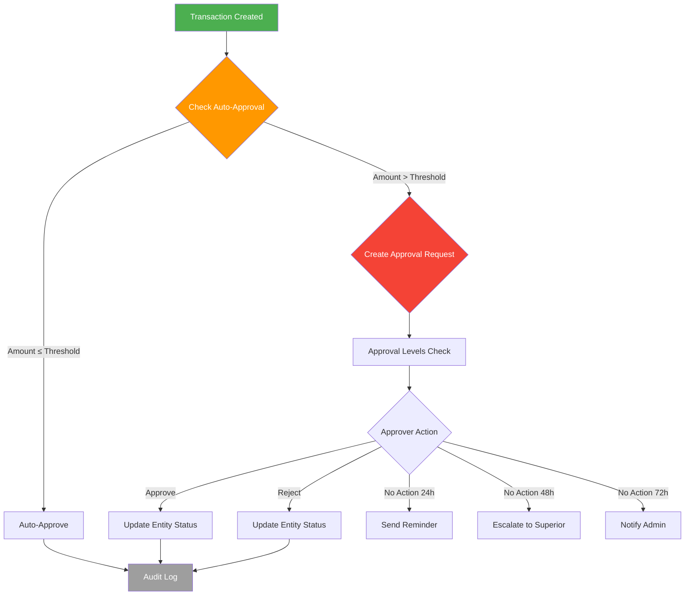
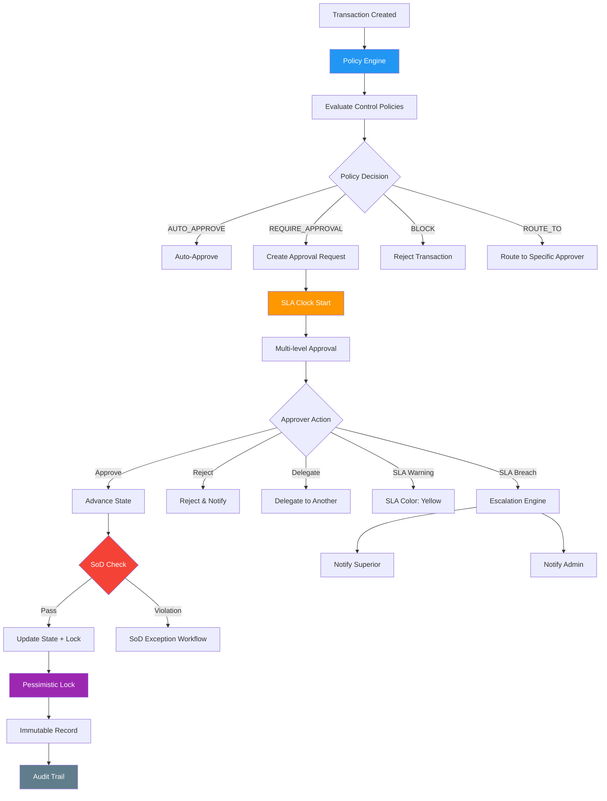
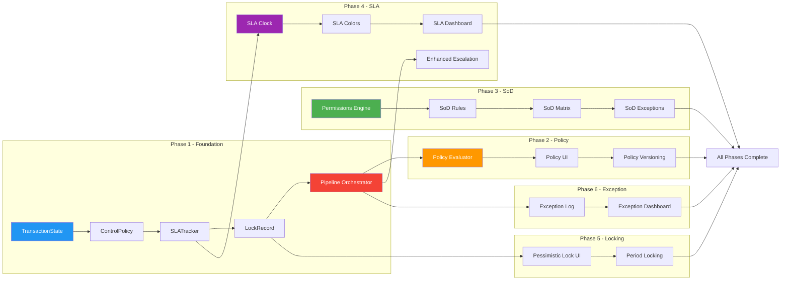

# Unified Control Engine — Architecture Analysis & Implementation Plan

> **Scope:** Policy Engine, Separation of Duties (SoD), SLA Tracking, Record Locking
> **Date:** 26 September 2026
> **Mode:** Analysis Only — No Implementation
> **Reference:** `docs/REMAINING-WORK.md` items UCE-01 through UCE-39

---

## Table of Contents

1. [Executive Summary](#1-executive-summary)
2. [Current State Analysis](#2-current-state-analysis)
3. [Gap Analysis per Component](#3-gap-analysis-per-component)
4. [Mermaid Architecture Diagram](#4-architecture-diagram)
5. [Prisma Schema Gap Analysis](#5-prisma-schema-gap-analysis)
6. [Implementation Plan](#6-implementation-plan)
7. [Dependencies & Critical Path](#7-dependencies--critical-path)
8. [Risk Assessment](#8-risk-assessment)

---

## 1. Executive Summary

Unified Control Engine (UCE) adalah pipeline transaksi: **Transaction → Policy → Workflow → Approval → Escalation → Notification → Locking → Audit**. Dari 39 item work yang tercatat di [`docs/REMAINING-WORK.md`](docs/REMAINING-WORK.md), hanya **4 item yang sudah DONE** (UCE-10 Approval Chains, UCE-37/38/39 Period Closing), sementara **10 item partial** dan **25 item belum dikerjakan (0%)**.

### Komponen yang Sudah Ada vs Gap

| Komponen | Status | Keterangan |
|----------|--------|------------|
| **Control Engine Core** | ✅ Partial | Config management via `Tenant.settings` JSON — bukan pipeline engine |
| **Multi-level Approval** | ✅ Done | [`approval.ts`](apps/web/lib/approval.ts) — fully functional |
| **Auto-Approval (Amount)** | ✅ Partial | [`auto-approval.ts`](apps/web/lib/auto-approval.ts) — threshold rules, disabled by default |
| **Optimistic Locking (OCC)** | ✅ Partial | [`optimistic-lock.ts`](apps/web/lib/optimistic-lock.ts) — version-based, 7 tables |
| **Approval Escalation** | ✅ Partial | [`approval-escalation.ts`](apps/web/lib/approval-escalation.ts) — SLA-based, cron-driven |
| **Work Inbox** | ✅ Partial | [`inbox/page.tsx`](apps/web/app/dashboard/inbox/page.tsx) — basic UI, no filtering engine |
| **Policy Engine** | ❌ Missing | Tidak ada `ControlPolicy` model, tidak ada policy evaluation pipeline |
| **Separation of Duties** | ❌ Missing | Tidak ada `SegregationOfDuty` model, tidak ada SoD matrix |
| **SLA Tracking** | ❌ Missing | Tidak ada `SLATracker` model — escalation ada tapi tidak ada SLA clock |
| **Record Locking (Pessimistic)** | ❌ Missing | Hanya OCC — tidak ada pessimistic locking / record freeze |
| **Delegation Framework** | ❌ Missing | Tidak ada `Delegation` model |
| **Exception Center** | ❌ Missing | Tidak ada `ExceptionLog` model |
| **Transaction Lifecycle** | ❌ Missing | Tidak ada centralized state machine untuk transaction lifecycle |

---

## 2. Current State Analysis

### 2.1 Control Engine Core — [`control-engine.ts`](apps/web/lib/control-engine.ts)

**Apa yang ada:**
- Config management menggunakan `Tenant.settings` JSON field
- 6 kategori config: `workflow | fields | modules | permissions | dashboard | approvals`
- CRUD operations: `getControlConfigs`, `updateControlConfig`, `resetToDefaults`
- History tracking via `controlHistory` array di settings
- Export/import functionality
- Industry-aware defaults (11 industry packs)
- Validation per kategori

**Keterbatasan:**
- Bukan pipeline engine — hanya config store
- Tidak ada policy evaluation logic
- Tidak ada transaction state tracking
- History disimpan di JSON (bukan audit table terpisah)
- Tidak ada versioning untuk config changes

### 2.2 Module Control — [`module-control.ts`](apps/web/lib/controls/module-control.ts)

**Apa yang ada:**
- 10 modul: finance, crm, hr, inventory, pos, projects, analytics, ai, field-service, operations
- Core modules (finance, crm, hr, inventory) tidak bisa dinonaktifkan
- Feature-level toggle per modul
- Per-tenant configuration

**Keterbatasan:**
- Tidak ada dampak ke control policies saat module di-toggle
- Tidak ada validation terhadap dependencies antar modul

### 2.3 Workflow Control — [`workflow-control.ts`](apps/web/lib/controls/workflow-control.ts)

**Apa yang ada:**
- Workflow definition management via `WorkflowDefinition` Prisma model
- State dan transition management
- Default approval rules untuk invoice dan purchase_order
- Per-tenant workflow customization

**Keterbatasan:**
- Tidak ada workflow engine integration yang komprehensif
- `@qalcuity/workflow` package ada tapi belum terhubung ke control engine pipeline

### 2.4 Approval Engine — [`approval.ts`](apps/web/lib/approval.ts)

**Apa yang ada (UCE-10 DONE):**
- Multi-level approval: `getApprovalLevels`, `createApprovalRequest`
- Approve/reject: `approveRequest`, `rejectRequest`
- Status tracking: `getRequestStatus`, `getPendingApprovalCount`
- Permission check: `canUserApprove`
- Entity types: INVOICE, PURCHASE_ORDER, QUOTATION
- Prisma models: `ApprovalLevel`, `ApprovalRequest`

**Keterbatasan:**
- Hanya 3 entity types (invoice, PO, quotation)
- Tidak ada approval chain yang configurable via UI
- Tidak ada parallel approval (hanya sequential)
- Tidak ada approval delegation
- Tidak ada conditional routing (berdasarkan amount, department, dll)

### 2.5 Auto-Approval — [`auto-approval.ts`](apps/web/lib/auto-approval.ts)

**Apa yang ada:**
- Amount threshold rules: INVOICE ≤5M, PO ≤10M, QUOTATION ≤20M
- Save/load rules dari `Tenant.settings.autoApproval`
- `checkAutoApproval` function

**Keterbatasan:**
- Semua rules disabled by default
- Hanya threshold-based — tidak ada rule complexity lain
- Tidak ada integration dengan policy engine

### 2.6 Optimistic Locking — [`optimistic-lock.ts`](apps/web/lib/optimistic-lock.ts)

**Apa yang ada:**
- OCC via raw SQL `UPDATE ... WHERE version = ?`
- `ConflictError` class (HTTP 409)
- `optimisticUpdateRaw` dan `verifyVersion` functions
- 7 tabel ter-cover: invoice, payment, purchaseOrder, quotation, deal, product, employee

**Keterbatasan:**
- Hanya optimistic — tidak ada pessimistic locking
- Tidak ada lock duration / auto-expiry
- Tidak ada lock ownership tracking
- Tidak ada UI indication untuk locked records
- Raw SQL approach — tidak terintegrasi dengan Prisma client

### 2.7 Approval Escalation — [`approval-escalation.ts`](apps/web/lib/approval-escalation)

**Apa yang ada:**
- SLA config: reminderHours=24, escalateHours=48, adminNotifyHours=72
- Email notifications: reminder, escalation, admin notification
- In-app notifications via `Notification` model
- Superior detection untuk escalation chain
- Cron-driven via `runApprovalEscalation()`
- Per-tenant SLA config via `Tenant.settings.escalationSLA`

**Keterbatasan:**
- SLA hanya untuk approval — tidak ada SLA tracking untuk transaction stages lain
- Tidak ada SLA clock model (start/pause/resume/complete)
- Tidak ada SLA color coding di UI
- Tidak ada SLA metrics / reporting
- Escalation hanya email + notification — tidak ada auto-reassign

### 2.8 Work Inbox — [`inbox/page.tsx`](apps/web/app/dashboard/inbox/page.tsx)

**Apa yang ada (UCE-22 partial):**
- UI menampilkan tasks, pending approvals, overdue items
- Approve/reject actions
- Basic filtering

**Keterbatasan:**
- Tidak ada dedicated `WorkInbox` model
- Tidak ada priority-based sorting
- Tidak ada SLA-aware coloring
- Tidak ada delegation-aware filtering

---

## 3. Gap Analysis per Component

### 3.1 Policy Engine (UCE-04, UCE-05, UCE-06, UCE-07)

#### Current State
- **Tidak ada** `ControlPolicy` Prisma model
- **Tidak ada** policy evaluation logic
- Auto-approval rules ada tapi sangat basic (hanya amount threshold)
- Config disimpan di `Tenant.settings` JSON — bukan dedicated policy table

#### Gap Detail

| Aspect | What's Needed | What Exists | Gap |
|--------|--------------|-------------|-----|
| Policy Model | `ControlPolicy` table with rules, conditions, actions | None | 🔴 Full gap |
| Policy Evaluation Pipeline | Transaction → evaluate policies → determine action | None | 🔴 Full gap |
| Policy Conditions | Amount ranges, user roles, departments, entity types, custom expressions | Amount threshold only | 🟠 Partial |
| Policy Actions | APPROVE, REJECT, ROUTE_TO, REQUIRE_APPROVAL, ESCALATE, BLOCK | Auto-approve only | 🟠 Partial |
| Policy Versioning | Version history, effective dates, rollback | None | 🔴 Full gap |
| Policy UI | Visual policy builder, drag-and-drop conditions | None | 🔴 Full gap |
| Policy Testing | Dry-run mode, simulate policy against test transactions | None | 🔴 Full gap |
| Policy Conflicts | Conflict detection between overlapping policies | None | 🔴 Full gap |

#### UCE Items Affected
- **UCE-01** Unified Control Engine core pipeline — 0%
- **UCE-02** Centralized State Model — 0%
- **UCE-03** Pipeline Traceability — 0%
- **UCE-04** Policy Engine — 0%
- **UCE-05** Amount Threshold Approvals — Partial (auto-approval exists)
- **UCE-06** Policy Configuration UI — 0%
- **UCE-07** Policy Versioning — 0%
- **UCE-11** Amount-based Routing — Partial (threshold exists, routing doesn't)

---

### 3.2 Separation of Duties — SoD (UCE-13, UCE-14, UCE-15)

#### Current State
- **Tidak ada** `SegregationOfDuty` atau `SoDRule` Prisma model
- **Tidak ada** SoD matrix
- RBAC ada di [`@qalcuity/permissions`](packages/permissions/) tapi tidak ada SoD enforcement
- Permission engine ([`packages/permissions/src/engine.ts`](packages/permissions/src/engine.ts)) hanya check single permission — tidak ada cross-role conflict detection

#### Gap Detail

| Aspect | What's Needed | What Exists | Gap |
|--------|--------------|-------------|-----|
| SoD Rule Model | `SoDRule` table: conflicting roles, entity types, actions | None | 🔴 Full gap |
| SoD Matrix UI | Visual matrix showing role conflicts per entity/action | None | 🔴 Full gap |
| SoD Enforcement | Check before action: "can user X with role Y do action Z on entity?" | RBAC `can()` only | 🟠 Partial |
| SoD Violation Detection | Real-time detection when SoD conflict occurs | None | 🔴 Full gap |
| SoD Exception Workflow | Request exception, approve by admin, time-limited | None | 🔴 Full gap |
| SoD Audit Trail | Log all SoD violations and exceptions | AuditLog exists | 🟡 Minor gap |
| SoD Reporting | Dashboard showing SoD compliance status | None | 🔴 Full gap |
| Cross-tenant Isolation | SoD rules per-tenant | None | 🔴 Full gap |

#### UCE Items Affected
- **UCE-13** SoD Engine — 0%
- **UCE-14** SoD Matrix — 0%
- **UCE-15** SoD Exception Workflow — 0%
- **UCE-25** SoD Configuration UI — 0%
- **UCE-26** SoD Reporting — 0%

---

### 3.3 SLA Tracking (UCE-16, UCE-17, UCE-18)

#### Current State
- Escalation mechanism ada di [`approval-escalation.ts`](apps/web/lib/approval-escalation.ts)
- SLA config: 24h reminder → 48h escalate → 72h admin notify
- Per-tenant config via `Tenant.settings.escalationSLA`
- Email + in-app notifications

#### Gap Detail

| Aspect | What's Needed | What Exists | Gap |
|--------|--------------|-------------|-----|
| SLA Clock Model | `SLATracker` table: start, pause, resume, complete, breach | None | 🔴 Full gap |
| SLA per Transaction Stage | SLA for each workflow stage (draft→review→approved→posted) | Approval SLA only | 🟠 Partial |
| SLA Color Coding | Green/Yellow/Orange/Red based on remaining time | None | 🔴 Full gap |
| SLA Metrics | Average resolution time, breach rate, bottleneck analysis | None | 🔴 Full gap |
| SLA Reporting | Dashboard with SLA compliance charts | None | 🔴 Full gap |
| SLA Pause/Resume | Pause SLA clock (e.g., weekend, holidays) | None | 🔴 Full gap |
| SLA Templates | Per-entity-type SLA templates | Hardcoded config only | 🟠 Partial |
| SLA Notification Rules | Configurable notification at X% of SLA remaining | Fixed 24/48/72h | 🟡 Minor gap |

#### UCE Items Affected
- **UCE-16** SLA Engine — 0%
- **UCE-17** SLA Color Coding — 0%
- **UCE-18** Escalation Engine — Partial (email escalation exists)
- **UCE-28** SLA Dashboard — 0%
- **UCE-29** SLA Reports — 0%

---

### 3.4 Record Locking (UCE-23, UCE-24)

#### Current State
- Optimistic locking via [`optimistic-lock.ts`](apps/web/lib/optimistic-lock.ts)
- Version-based conflict detection (raw SQL)
- `ConflictError` class (HTTP 409)
- 7 tabel ter-cover

#### Gap Detail

| Aspect | What's Needed | What Exists | Gap |
|--------|--------------|-------------|-----|
| Pessimistic Locking | `LockRecord` table: lock owner, lock type, expiry | None | 🔴 Full gap |
| Lock Duration | Configurable lock timeout with auto-expiry | None | 🔴 Full gap |
| Lock Ownership | Track who locked, when, why | None | 🔴 Full gap |
| Lock UI Indicators | Visual "locked by X" badge on records | None | 🔴 Full gap |
| Lock Release | Manual release, auto-release on timeout | None | 🔴 Full gap |
| Period Lock | Lock accounting period for editing | `AccountingPeriod` model exists | 🟡 Minor gap |
| Record Freeze | Freeze specific records (e.g., finalized invoices) | None | 🔴 Full gap |
| Lock Conflict Resolution | Queue system when record is locked | None | 🔴 Full gap |
| OCC Integration | Combine OCC with pessimistic locking | OCC exists, no pessimistic | 🟠 Partial |

#### UCE Items Affected
- **UCE-23** Record Locking Engine — 0%
- **UCE-24** Period Locking — Partial (AccountingPeriod exists)
- **UCE-30** Lock UI Components — 0%

---

### 3.5 Additional Gaps (Not in Primary Scope but Related)

#### Delegation Framework (UCE-12, UCE-19, UCE-20, UCE-21)

| Aspect | Status | Gap |
|--------|--------|-----|
| Delegation Model | ❌ Missing | No `Delegation` table |
| Approval Delegation | ❌ Missing | Cannot delegate approval authority |
| Time-limited Delegation | ❌ Missing | No start/end dates for delegation |
| Delegation Audit | ❌ Missing | No tracking of delegated actions |

#### Exception Center (UCE-31, UCE-32, UCE-33, UCE-34, UCE-35, UCE-36)

| Aspect | Status | Gap |
|--------|--------|-----|
| Exception Log Model | ❌ Missing | No `ExceptionLog` table |
| Exception Classification | ❌ Missing | No severity/categorization |
| Exception Workflow | ❌ Missing | No resolution workflow |
| Exception Dashboard | ❌ Missing | No exception overview page |
| Exception Metrics | ❌ Missing | No exception analytics |

#### Transaction Lifecycle (UCE-08, UCE-09)

| Aspect | Status | Gap |
|--------|--------|-----|
| Centralized State Model | ❌ Missing | Each entity has its own status field |
| State Transition Rules | ❌ Missing | No centralized transition validation |
| Immutable Transactions | ❌ Missing | No immutability enforcement |
| Audit Trail per Transition | ❌ Partial | AuditLog exists but not per-transition |

---

## 4. Architecture Diagram

### Current Architecture

### Target Architecture (UCE Pipeline)

---

## 5. Prisma Schema Gap Analysis

### Models yang Sudah Ada (Control-Related)

| Model | Location | Usage |
|-------|----------|-------|
| `ApprovalLevel` | [`schema.prisma:1939`](packages/db/prisma/schema.prisma:1939) | Multi-level approval config |
| `ApprovalRequest` | [`schema.prisma:1955`](packages/db/prisma/schema.prisma:1955) | Approval request tracking |
| `AccountingPeriod` | [`schema.prisma:1916`](packages/db/prisma/schema.prisma:1916) | Period closing/locking |
| `WorkflowDefinition` | schema.prisma | Workflow state definitions |
| `WorkflowHistory` | schema.prisma | Workflow state change history |
| `AuditLog` | schema.prisma | General audit trail |
| `Tenant.settings` | schema.prisma (JSON field) | Control engine config storage |

### Models yang HARUS Dibuat

| Model | Purpose | Priority | Dependencies |
|-------|---------|----------|-------------|
| `ControlPolicy` | Policy rules, conditions, actions, versioning | P0 | Tenant |
| `ControlPolicyVersion` | Policy version history | P0 | ControlPolicy |
| `SoDRule` | Separation of duties conflict rules | P1 | Tenant |
| `SoDViolation` | Log of SoD violations detected | P1 | SoDRule |
| `SoDException` | Approved SoD exceptions with expiry | P1 | SoDRule |
| `SLATracker` | SLA clock per transaction per stage | P0 | Tenant |
| `SLATemplate` | SLA templates per entity type | P1 | Tenant |
| `LockRecord` | Pessimistic lock tracking | P0 | Tenant |
| `Delegation` | Approval delegation rules | P2 | Tenant, User |
| `ExceptionLog` | Control engine exception tracking | P2 | Tenant |
| `TransactionState` | Centralized transaction state model | P0 | Tenant |

### Migration Strategy

- **Batch 1 (P0):** `ControlPolicy`, `ControlPolicyVersion`, `SLATracker`, `LockRecord`, `TransactionState`
- **Batch 2 (P1):** `SoDRule`, `SoDViolation`, `SoDException`, `SLATemplate`
- **Batch 3 (P2):** `Delegation`, `ExceptionLog`

---

## 6. Implementation Plan

### Phase 1: Foundation (P0 — Core Pipeline)

> **Goal:** Bangun foundation pipeline yang semua komponen lain bergantung padanya.

#### 1A. Centralized State Model (UCE-02)
- Buat `TransactionState` Prisma model
- Definisikan state enum: DRAFT, PENDING_REVIEW, PENDING_APPROVAL, APPROVED, REJECTED, POSTED, CANCELLED, LOCKED
- Buat state transition rules engine
- Integrasikan dengan `@qalcuity/workflow` package

#### 1B. Control Policy Model (UCE-04)
- Buat `ControlPolicy` Prisma model
- Fields: name, description, entityType, conditions (JSON), actions (JSON), priority, isActive, version
- Buat `ControlPolicyVersion` model untuk versioning
- Buat policy evaluation engine: `evaluatePolicies(entityType, context) → PolicyDecision`

#### 1C. SLA Clock Model (UCE-16)
- Buat `SLATracker` Prisma model
- Fields: entityId, entityType, stage, startedAt, pausedAt, resumedAt, completedAt, breachedAt, slaMinutes, status
- Buat SLA clock functions: `startSLA`, `pauseSLA`, `resumeSLA`, `completeSLA`
- Integrasikan dengan existing escalation di [`approval-escalation.ts`](apps/web/lib/approval-escalation.ts)

#### 1D. Record Locking Model (UCE-23)
- Buat `LockRecord` Prisma model
- Fields: entityId, entityType, lockType (OPTIMISTIC/PESSIMISTIC/FREEZE), lockedBy, lockedAt, expiresAt, reason
- Buat lock functions: `acquireLock`, `releaseLock`, `checkLock`, `extendLock`
- Integrasi dengan existing [`optimistic-lock.ts`](apps/web/lib/optimistic-lock.ts)

#### 1E. UCE Pipeline Orchestrator (UCE-01)
- Buat `apps/web/lib/control-engine-pipeline.ts`
- Pipeline: `processTransaction(entity) → policy → sla → workflow → approval → lock → audit`
- Setiap stage logging ke `AuditLog`
- Pipeline traceability: setiap transaksi punya execution log

### Phase 2: Policy Engine (P0)

> **Goal:** Policy engine yang configurable per tenant, per entity type.

#### 2A. Policy Evaluation Engine (UCE-04 continued)
- Implementasi condition evaluator: amount range, role check, department check, custom expressions
- Implementasi action executor: AUTO_APPROVE, REQUIRE_APPROVAL, ROUTE_TO, ESCALATE, BLOCK
- Conflict detection: detect overlapping policies
- Policy priority resolution

#### 2B. Policy Configuration UI (UCE-06)
- Visual policy builder di settings page
- Drag-and-drop condition builder
- Policy preview / test mode (dry-run)
- Policy enable/disable toggle

#### 2C. Policy Versioning (UCE-07)
- Version history dengan effective dates
- Rollback capability
- Audit trail per policy change

#### 2D. Amount-based Routing (UCE-11)
- Route to different approvers based on amount ranges
- Integrasikan dengan existing auto-approval thresholds
- Configurable per entity type

### Phase 3: SoD Engine (P1)

> **Goal:** Separation of Duties enforcement untuk compliance.

#### 3A. SoD Rule Model (UCE-13)
- Buat `SoDRule` Prisma model
- Define conflicting roles per entity type per action
- Integrasikan dengan `@qalcuity/permissions` engine

#### 3B. SoD Enforcement
- Check sebelum action dieksekusi
- Real-time violation detection
- Block action jika SoD conflict

#### 3C. SoD Matrix UI (UCE-14)
- Visual matrix: rows = roles, columns = entity types/actions
- Color-coded conflict indicators
- Easy rule creation via matrix clicks

#### 3D. SoD Exception Workflow (UCE-15)
- Request exception dengan justifikasi
- Admin approval workflow
- Time-limited exceptions dengan auto-expiry
- Exception audit trail

### Phase 4: SLA & Escalation Enhancement (P1)

> **Goal:** SLA tracking yang komprehensif, bukan hanya untuk approval.

#### 4A. SLA Color Coding (UCE-17)
- Green (>50% time remaining)
- Yellow (25-50% time remaining)
- Orange (10-25% time remaining)
- Red (<10% time remaining or breached)
- Integrasi ke UI: badges, dashboard widgets

#### 4B. SLA Templates (UCE-16 continued)
- Per-entity-type SLA templates
- Configurable per stage within entity lifecycle
- Default templates: Invoice 48h, PO 72h, Quotation 24h

#### 4C. SLA Dashboard & Reporting (UCE-28, UCE-29)
- SLA compliance overview widget
- Average resolution time chart
- Breach rate by department/entity type
- Bottleneck analysis (which stage takes longest)

#### 4D. Enhanced Escalation (UCE-18 continued)
- Auto-reassign on escalation (not just notify)
- Escalation chain configuration
- Weekend/holiday SLA pause

### Phase 5: Locking & Delegation (P1-P2)

> **Goal:** Pessimistic locking dan delegation framework.

#### 5A. Pessimistic Locking UI (UCE-30)
- "Locked by X" badge di record pages
- Lock/unlock buttons
- Lock expiry indicator
- Queue system for locked records

#### 5B. Period Locking Enhancement (UCE-24)
- Integrasikan dengan `AccountingPeriod` model
- Lock all transactions in closed period
- Period lock/unlock UI

#### 5C. Delegation Framework (UCE-12, UCE-19, UCE-20, UCE-21)
- `Delegation` Prisma model
- Time-limited delegation rules
- Approval delegation: delegate authority to another user
- Delegation audit trail

### Phase 6: Exception Center & Dashboard (P2)

> **Goal:** Centralized exception management dan control dashboard.

#### 6A. Exception Center (UCE-31 through UCE-36)
- `ExceptionLog` Prisma model
- Exception classification: policy violation, SoD conflict, SLA breach, lock conflict
- Exception resolution workflow
- Exception metrics

#### 6B. Control Dashboard (UCE-27)
- Overview: active policies, SoD compliance, SLA status, lock status
- Drill-down capabilities
- Export functionality

#### 6C. Access Review (UCE-35, UCE-36)
- Periodic access review workflow
- Role assignment audit
- Permission conflict detection

---

## 7. Dependencies & Critical Path

### Critical Path
1. **TransactionState** → wajib ada sebelum pipeline bisa berjalan
2. **ControlPolicy + Evaluator** → core dari semua control decisions
3. **SLATracker** → dependency untuk SLA coloring, dashboard, enhanced escalation
4. **LockRecord** → dependency untuk pessimistic locking UI
5. **Pipeline Orchestrator** → menghubungkan semua komponen

### Cross-cutting Concerns
- **Tenant isolation:** Semua models harus punya `tenantId` field
- **Audit trail:** Setiap perubahan state harus log ke `AuditLog`
- **i18n:** Semua UI text harus bilingual (ID/EN)
- **RBAC:** Setiap action harus check permission via `@qalcuity/permissions`
- **Zod validation:** Semua API input harus validated

---

## 8. Risk Assessment

### High Risk

| Risk | Impact | Mitigation |
|------|--------|-----------|
| Schema migration breaks existing data | Production downtime | Test migrations on staging first, rollback plan ready |
| Pipeline orchestration performance | Slow transaction processing | Async processing, caching, batch operations |
| SoD false positives | User frustration, workflow blockage | Exception workflow, configurable strictness levels |

### Medium Risk

| Risk | Impact | Mitigation |
|------|--------|-----------|
| Policy engine complexity | Hard to debug | Policy testing/dry-run mode, detailed logging |
| SLA clock accuracy | Incorrect escalation timing | Use database timestamps, timezone handling |
| Lock contention | Users waiting for locked records | Reasonable lock timeouts, notification system |

### Low Risk

| Risk | Impact | Mitigation |
|------|--------|-----------|
| i18n coverage gaps | Incomplete translations | Add keys incrementally, use translation memory |
| UI responsiveness | Slow page loads | Pagination, lazy loading, virtual scrolling |

---

## Appendix: UCE Item Status Summary

| Item | Description | Status | Phase |
|------|-------------|--------|-------|
| UCE-01 | Unified Control Engine core pipeline | ❌ 0% | Phase 1 |
| UCE-02 | Centralized State Model | ❌ 0% | Phase 1 |
| UCE-03 | Pipeline Traceability | ❌ 0% | Phase 1 |
| UCE-04 | Policy Engine | ❌ 0% | Phase 2 |
| UCE-05 | Amount Threshold Approvals | 🟡 Partial | Phase 2 |
| UCE-06 | Policy Configuration UI | ❌ 0% | Phase 2 |
| UCE-07 | Policy Versioning | ❌ 0% | Phase 2 |
| UCE-08 | Transaction Lifecycle | ❌ 0% | Phase 1 |
| UCE-09 | Immutable Transactions | ❌ 0% | Phase 1 |
| UCE-10 | Multi-level Approval Chains | ✅ DONE | — |
| UCE-11 | Amount-based Routing | 🟡 Partial | Phase 2 |
| UCE-12 | Delegation | ❌ 0% | Phase 5 |
| UCE-13 | SoD Engine | ❌ 0% | Phase 3 |
| UCE-14 | SoD Matrix | ❌ 0% | Phase 3 |
| UCE-15 | SoD Exception Workflow | ❌ 0% | Phase 3 |
| UCE-16 | SLA Engine | ❌ 0% | Phase 4 |
| UCE-17 | SLA Color Coding | ❌ 0% | Phase 4 |
| UCE-18 | Escalation Engine | 🟡 Partial | Phase 4 |
| UCE-19 | Delegation - Time Limits | ❌ 0% | Phase 5 |
| UCE-20 | Delegation - Audit | ❌ 0% | Phase 5 |
| UCE-21 | Delegation - UI | ❌ 0% | Phase 5 |
| UCE-22 | My Work Inbox | 🟡 Partial | Phase 6 |
| UCE-23 | Record Locking Engine | ❌ 0% | Phase 5 |
| UCE-24 | Period Locking | 🟡 Partial | Phase 5 |
| UCE-25 | SoD Configuration UI | ❌ 0% | Phase 3 |
| UCE-26 | SoD Reporting | ❌ 0% | Phase 3 |
| UCE-27 | Control Dashboard | ❌ 0% | Phase 6 |
| UCE-28 | SLA Dashboard | ❌ 0% | Phase 4 |
| UCE-29 | SLA Reports | ❌ 0% | Phase 4 |
| UCE-30 | Lock UI Components | ❌ 0% | Phase 5 |
| UCE-31 | Exception Center | ❌ 0% | Phase 6 |
| UCE-32 | Exception Classification | ❌ 0% | Phase 6 |
| UCE-33 | Exception Workflow | ❌ 0% | Phase 6 |
| UCE-34 | Exception Dashboard | ❌ 0% | Phase 6 |
| UCE-35 | Access Review | ❌ 0% | Phase 6 |
| UCE-36 | Access Review Reporting | ❌ 0% | Phase 6 |
| UCE-37 | Period Closing | ✅ DONE | — |
| UCE-38 | Period Close Validation | ✅ DONE | — |
| UCE-39 | Period Close UI | ✅ DONE | — |

### Summary Statistics

| Category | Count |
|----------|-------|
| Total UCE Items | 39 |
| ✅ DONE | 4 (10%) |
| 🟡 Partial | 8 (21%) |
| ❌ Not Started | 25 (64%) |
| New Prisma Models Needed | 11 |
| New API Routes Needed | ~25-30 |
| New UI Pages Needed | ~8-10 |
| Estimated Phases | 6 |

---

> **Document Version:** 1.0
> **Author:** Qalcuity AI Architect
> **Status:** Analysis Complete — Ready for Review
