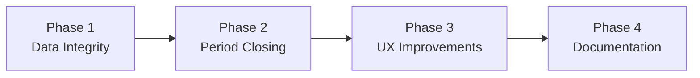

# Finance GL (General Ledger) — Architecture Analysis & Implementation Plan

> **Tanggal Analisis:** 26 September 2026
> **Status:** Analisis lengkap — rekomendasi improvement & gap filling
> **Catatan Penting:** Modul GL sudah **signifikan lebih lengkap** daripada yang terdokumentasi di `docs/REMAINING-WORK.md`. Item FIN-GL-01 s/d FIN-GL-04 sudah diimplementasi.

---

## 1. Current State Analysis

### 1.1 Prisma Models (GL-Related)

| Model | Status | Deskripsi |
|-------|--------|-----------|
| [`CoAAccount`](packages/db/prisma/schema.prisma:1051) | ✅ **Lengkap** | Chart of Accounts — hierarchy via `parentId`, 5 tipe (ASSET/LIABILITY/EQUITY/REVENUE/EXPENSE), unique `[tenantId, code]` |
| [`JournalEntry`](packages/db/prisma/schema.prisma:1770) | ✅ **Lengkap** | Header journal entry — `entryNumber` unique, `sourceType` (manual/invoice/payment/purchase_order/payroll), status (DRAFT/POSTED/VOID) |
| [`JournalEntryItem`](packages/db/prisma/schema.prisma:1796) | ✅ **Lengkap** | Line items — `debit`/`credit` Decimal(19,4), relasi ke `CoAAccount` |
| [`BankTransaction`](packages/db/prisma/schema.prisma:1075) | ✅ **Lengkap** | Bank transactions untuk reconciliation — status (unmatched/matched/discrepancy) |
| [`AccountingPeriod`](packages/db/prisma/schema.prisma:1916) | ✅ **Lengkap** | Period management — status (OPEN/CLOSING/CLOSED), pre-close checks |

**Total: 5 models — Semua sudah ada dan berfungsi.**

### 1.2 API Routes (GL-Related)

| Route | Status | Lines | Deskripsi |
|-------|--------|-------|-----------|
| [`/api/finance/accounts`](apps/web/app/api/finance/accounts/route.ts) | ✅ **Full CRUD** | 331 | GET (list+filter), POST (create), PUT (update), DELETE |
| [`/api/finance/journal-entries`](apps/web/app/api/finance/journal-entries/route.ts) | ✅ **Full CRUD** | 245 | GET (list+filter), POST (create) |
| [`/api/finance/journal-entries/[id]`](apps/web/app/api/finance/journal-entries/[id]/route.ts) | ✅ **Full CRUD** | — | GET (detail), PUT (update), DELETE |
| [`/api/finance/periods`](apps/web/app/api/finance/periods/route.ts) | ✅ **Full CRUD** | 178 | GET (list), POST (create/generate yearly) |
| [`/api/finance/periods/[id]`](apps/web/app/api/finance/periods/[id]/route.ts) | ✅ **Full CRUD** | — | GET, PUT, DELETE |
| [`/api/finance/periods/[id]/close`](apps/web/app/api/finance/periods/[id]/close/route.ts) | ✅ **Implemented** | — | Pre-close checks + closing |
| [`/api/finance/reconciliation`](apps/web/app/api/finance/reconciliation/route.ts) | ✅ **Implemented** | — | Bank reconciliation |
| [`/api/finance/reports/trial-balance`](apps/web/app/api/finance/reports/trial-balance/route.ts) | ✅ **Implemented** | 221 | Trial balance with date filter |
| [`/api/finance/reports/balance-sheet`](apps/web/app/api/finance/reports/balance-sheet/route.ts) | ✅ **Implemented** | 292 | Balance sheet (current/non-current assets, liabilities, equity) |
| [`/api/finance/reports/income-statement`](apps/web/app/api/finance/reports/income-statement/route.ts) | ✅ **Implemented** | 408 | P&L (revenue, COGS, expenses, net income) |
| [`/api/finance/reports/general-ledger`](apps/web/app/api/finance/reports/general-ledger/route.ts) | ✅ **Implemented** | 194 | GL report with running balance |
| [`/api/finance/reports/cash-flow`](apps/web/app/api/finance/reports/cash-flow/route.ts) | ✅ **Implemented** | — | Cash flow statement |

**Total: 12 routes — Semua sudah ada dan berfungsi.**

### 1.3 Frontend Pages (GL-Related)

| Page | Status | Lines | Deskripsi |
|------|--------|-------|-----------|
| [`/dashboard/finance/accounts/page.tsx`](apps/web/app/dashboard/finance/accounts/page.tsx) | ✅ **Production Ready** | 1070 | Tree view, CRUD, import/export, filtering by type |
| [`/dashboard/finance/journal-entries/page.tsx`](apps/web/app/dashboard/finance/journal-entries/page.tsx) | ✅ **Implemented** | 821 | List with status filters, search, create/post/void |
| [`/dashboard/finance/journal-entries/[id]/page.tsx`](apps/web/app/dashboard/finance/journal-entries/[id]/page.tsx) | ✅ **Implemented** | 509 | Detail view with line items, post/void actions |
| [`/dashboard/finance/periods/page.tsx`](apps/web/app/dashboard/finance/periods/page.tsx) | ✅ **Implemented** | 923 | Period management, pre-close checks, closing wizard |
| [`/dashboard/finance/reconciliation/page.tsx`](apps/web/app/dashboard/finance/reconciliation/page.tsx) | ✅ **Production Ready** | 883 | Bank reconciliation with matching |
| [`/dashboard/finance/reports/trial-balance/page.tsx`](apps/web/app/dashboard/finance/reports/trial-balance/page.tsx) | ✅ **Implemented** | 294 | Trial balance report + CSV export |
| [`/dashboard/finance/reports/balance-sheet/page.tsx`](apps/web/app/dashboard/finance/reports/balance-sheet/page.tsx) | ✅ **Implemented** | 341 | Balance sheet report + CSV export |
| [`/dashboard/finance/reports/income-statement/page.tsx`](apps/web/app/dashboard/finance/reports/income-statement/page.tsx) | ✅ **Implemented** | 317 | Income statement + CSV export |
| [`/dashboard/finance/reports/general-ledger/page.tsx`](apps/web/app/dashboard/finance/reports/general-ledger/page.tsx) | ✅ **Implemented** | 333 | General ledger with account filter + CSV export |

**Total: 9 pages — Semua sudah ada dan berfungsi.**

### 1.4 Libraries & Integrations

| Library | Status | Lines | Deskripsi |
|---------|--------|-------|-----------|
| [`auto-journal.ts`](apps/web/lib/auto-journal.ts) | ✅ **Production Ready** | 617 | Auto journal entry: Invoice→PAID, PO→RECEIVED/PAID, Payment→COMPLETED |
| [`period-closing.ts`](apps/web/lib/period-closing.ts) | ✅ **Implemented** | 193 | Pre-close checks, generate yearly periods |
| [`validation-schemas.ts`](apps/web/lib/validation-schemas.ts) | ✅ **Implemented** | — | `createCoAAccountSchema`, `updateCoAAccountSchema`, `createJournalEntrySchema`, `updateJournalEntrySchema`, `createPeriodSchema`, `generatePeriodsSchema` |
| [`route-permissions.ts`](apps/web/lib/route-permissions.ts) | ✅ **Implemented** | — | 17 finance GL routes covered |

### 1.5 Summary — Coverage Matrix

| Component | Schema | API Route | Frontend Page | Validation | RBAC | Status |
|-----------|--------|-----------|---------------|------------|------|--------|
| Chart of Accounts | ✅ | ✅ | ✅ (tree view) | ✅ | ✅ | **Production Ready** |
| Journal Entry (manual) | ✅ | ✅ | ✅ (list + detail) | ✅ | ✅ | **Implemented** |
| Journal Entry (auto) | ✅ | ✅ (via auto-journal) | — | ✅ | ✅ | **Production Ready** |
| Trial Balance | ✅ (derived) | ✅ | ✅ | — | ✅ | **Implemented** |
| Balance Sheet | ✅ (derived) | ✅ | ✅ | — | ✅ | **Implemented** |
| Income Statement | ✅ (derived) | ✅ | ✅ | — | ✅ | **Implemented** |
| General Ledger Report | ✅ (derived) | ✅ | ✅ | — | ✅ | **Implemented** |
| Cash Flow Statement | ✅ (derived) | ✅ | ✅ | — | ✅ | **Implemented** |
| Accounting Period | ✅ | ✅ | ✅ (wizard) | ✅ | ✅ | **Implemented** |
| Bank Reconciliation | ✅ (BankTransaction) | ✅ | ✅ | — | ✅ | **Production Ready** |

---

## 2. Gap Analysis — Apa Yang Kurang

### 2.1 Functional Gaps (Belum Ada)

| ID | Gap | Priority | Complexity | Deskripsi |
|----|-----|----------|------------|-----------|
| **GL-GAP-01** | Closing Entry (Year-End) | 🟠 High | Medium | Tidak ada otomasi closing entry di akhir tahun — laba/rugi harus dipindah ke modal secara manual. Seharusnya ada fungsi `generateClosingEntries()` yang menutup semua akun Revenue & Expense ke Income Summary, lalu ke Retained Earnings. |
| **GL-GAP-02** | Account Balance Auto-Sync | 🟠 High | Medium | Field `balance` pada `CoAAccount` tidak otomatis ter-update saat journal entry diposting. Balance bisa diverifikasi manual tapi berisiko drift dari actual journal entry sum. Perlu trigger atau periodic sync. |
| **GL-GAP-03** | Period Closing Approval | 🟡 Medium | Low | Closing approval belum terhubung ke approval engine. Saat ini siapapun yang punya akses bisa close period. Perlu role check: only FINANCE_MANAGER+ bisa close. |
| **GL-GAP-04** | Period Report | 🟡 Medium | Low | Tidak ada ringkasan otomatis saat period ditutup — total entries, total debit/credit, outstanding items. |
| **GL-GAP-05** | Journal Entry Edit | 🟡 Medium | Low | Journal entry yang sudah dibuat bisa di-edit (description, items) selama status DRAFT. Saat ini edit capability terbatas. |
| **GL-GAP-06** | Account Transaction Drill-Down | 🔵 Low | Low | Tidak ada halaman khusus untuk melihat semua transaksi di satu akun tertentu dari halaman Chart of Accounts. User harus ke GL Report dan filter manual. |
| **GL-GAP-07** | Multi-Currency Support | 🔵 Low | High | Tidak ada support multi-currency untuk transaksi lintas negara. |
| **GL-GAP-08** | Budget vs Actual | 🔵 Low | Medium | Tidak ada tracking budget per akun untuk perbandingan actual vs budget. |

### 2.2 Data Integrity Gaps

| ID | Gap | Severity | Deskripsi |
|----|-----|----------|-----------|
| **GL-DI-01** | Balance Drift Risk | 🟠 Medium | `CoAAccount.balance` field tidak auto-sync dengan sum of `JournalEntryItem` debits/credits. Bisa drift jika ada bug atau manual edit. |
| **GL-DI-02** | No Reversing Entry Support | 🟡 Low | Tidak ada mekanisme reversing entry untuk membatalkan journal entry yang salah — hanya bisa VOID. |

### 2.3 REMAINING-WORK.md vs Actual — Inconsistency

> ⚠️ **Penting:** `docs/REMAINING-WORK.md` mencatat FIN-GL-01 s/d FIN-GL-04 sebagai **belum dikerjakan**. Namun dari analisis kode, **semua sudah diimplementasi**. Dokumen ini perlu di-update.

| Item di REMAINING-WORK | Status Tercatat | Status Aktual (Kode) |
|------------------------|-----------------|----------------------|
| FIN-GL-01: General Ledger | ❌ Belum | ✅ Implemented |
| FIN-GL-02: Journal Entry | ❌ Belum | ✅ Implemented |
| FIN-GL-03: Trial Balance | ❌ Belum | ✅ Implemented |
| FIN-GL-04: Financial Statements | ❌ Belum | ✅ Production Ready |

---

## 3. Architecture Diagram — Current State

```mermaid
graph TB
    subgraph "Frontend Pages"
        COA[Chart of Accounts<br/>Tree View + CRUD]
        JE[Journal Entry<br/>List + Detail + Create]
        PER[Accounting Period<br/>Wizard + Closing]
        RECON[Bank Reconciliation<br/>Matching UI]
        TB[Trial Balance<br/>Report + CSV]
        BS[Balance Sheet<br/>Report + CSV]
        IS[Income Statement<br/>Report + CSV]
        GLR[General Ledger<br/>Report + CSV]
        CF[Cash Flow<br/>Report + CSV]
    end

    subgraph "API Routes"
        ACCT_API[/api/finance/accounts]
        JE_API[/api/finance/journal-entries]
        PER_API[/api/finance/periods]
        CLOSE_API[/api/finance/periods/close]
        RECON_API[/api/finance/reconciliation]
        RPT_TB[/api/finance/reports/trial-balance]
        RPT_BS[/api/finance/reports/balance-sheet]
        RPT_IS[/api/finance/reports/income-statement]
        RPT_GL[/api/finance/reports/general-ledger]
        RPT_CF[/api/finance/reports/cash-flow]
    end

    subgraph "Libraries"
        AUTO_JOURNAL[auto-journal.ts<br/>Invoice/PO/Payment → JE]
        PERIOD_CLOSE[period-closing.ts<br/>Pre-close Checks]
        VALIDATION[validation-schemas.ts<br/>6 schemas]
        PERMISSIONS[route-permissions.ts<br/>17 entries]
    end

    subgraph "Database Models"
        COA_M[(CoAAccount)]
        JE_M[(JournalEntry)]
        JEI_M[(JournalEntryItem)]
        BT_M[(BankTransaction)]
        AP_M[(AccountingPeriod)]
    end

    subgraph "Auto-Journal Sources"
        INV[Invoice → PAID]
        PO[PurchaseOrder → RECEIVED/PAID]
        PAY[Payment → COMPLETED]
    end

    COA --> ACCT_API
    JE --> JE_API
    PER --> PER_API
    RECON --> RECON_API
    TB --> RPT_TB
    BS --> RPT_BS
    IS --> RPT_IS
    GLR --> RPT_GL
    CF --> RPT_CF

    ACCT_API --> COA_M
    JE_API --> JE_M
    JE_API --> JEI_M
    JE_API --> COA_M
    PER_API --> AP_M
    RECON_API --> BT_M

    INV --> AUTO_JOURNAL
    PO --> AUTO_JOURNAL
    PAY --> AUTO_JOURNAL
    AUTO_JOURNAL --> JE_M
    AUTO_JOURNAL --> COA_M
```

---

## 4. Implementation Plan — Improvement & Gap Filling

### Phase 1: Data Integrity Fixes 🔴

> **Tujuan:** Memastikan data GL selalu konsisten dan akurat.

| Step | Task | Files | Complexity |
|------|------|-------|------------|
| 1.1 | **Implement Account Balance Auto-Sync** — Update `CoAAccount.balance` setiap kali journal entry diposting/di-void. Tambahkan function `syncAccountBalance(accountId, tenantId)` yang menghitung ulang balance dari `JournalEntryItem`. Panggil dari auto-journal.ts dan journal-entries POST/PUT. | [`apps/web/lib/account-balance-sync.ts`](apps/web/lib/account-balance-sync.ts) (baru), [`apps/web/lib/auto-journal.ts`](apps/web/lib/auto-journal.ts), [`apps/web/app/api/finance/journal-entries/route.ts`](apps/web/app/api/finance/journal-entries/route.ts) | Medium |
| 1.2 | **Add Balance Verification Endpoint** — API `GET /api/finance/accounts/[id]/balance-check` yang membandingkan `CoAAccount.balance` vs actual sum dari `JournalEntryItem`. Return discrepancy info. | [`apps/web/app/api/finance/accounts/[id]/balance-check/route.ts`](apps/web/app/api/finance/accounts/[id]/balance-check/route.ts) (baru) | Low |
| 1.3 | **Add Reversing Entry Support** — Function `createReversingEntry(originalEntryId)` yang membuat journal entry pembalik (swap debit/credit) dengan sourceType `reversing`. Tambahkan tombol "Reverse" di detail page. | [`apps/web/lib/auto-journal.ts`](apps/web/lib/auto-journal.ts), [`apps/web/app/dashboard/finance/journal-entries/[id]/page.tsx`](apps/web/app/dashboard/finance/journal-entries/[id]/page.tsx) | Medium |

### Phase 2: Period Closing Improvements 🟡

> **Tujuan:** Period closing lebih robust dengan approval dan reporting.

| Step | Task | Files | Complexity |
|------|------|-------|------------|
| 2.1 | **Add Period Closing Approval** — Hubungkan period closing ke approval engine. Hanya `finance:approve` permission yang bisa close period. Tambahkan approval level check di [`periods/[id]/close/route.ts`](apps/web/app/api/finance/periods/[id]/close/route.ts). | [`apps/web/app/api/finance/periods/[id]/close/route.ts`](apps/web/app/api/finance/periods/[id]/close/route.ts) | Low |
| 2.2 | **Generate Period Summary Report** — Setelah period ditutup, generate ringkasan: total entries, total debit/credit, breakdown per account type, outstanding items. Simpan di `AccountingPeriod` sebagai JSON field `closeSummary`. | [`apps/web/lib/period-closing.ts`](apps/web/lib/period-closing.ts), [`packages/db/prisma/schema.prisma`](packages/db/prisma/schema.prisma) (add `closeSummary Json?` field) | Low |
| 2.3 | **Closing Entry Generator** — Function `generateClosingEntries(tenantId, periodId, userId)` yang menutup semua akun Revenue & Expense ke Income Summary, lalu ke Retained Earnings. Ini Year-End closing. | [`apps/web/lib/closing-entries.ts`](apps/web/lib/closing-entries.ts) (baru), [`apps/web/app/api/finance/periods/[id]/close/route.ts`](apps/web/app/api/finance/periods/[id]/close/route.ts) | Medium |

### Phase 3: UX Improvements 🔵

> **Tujuan:** Meningkatkan usability untuk accountant dan finance team.

| Step | Task | Files | Complexity |
|------|------|-------|------------|
| 3.1 | **Journal Entry Edit for DRAFT** — Allow editing draft journal entries (description, add/remove/edit line items). Update PUT handler di [`journal-entries/[id]/route.ts`](apps/web/app/api/finance/journal-entries/[id]/route.ts). Tambahkan edit mode di [`journal-entries/[id]/page.tsx`](apps/web/app/dashboard/finance/journal-entries/[id]/page.tsx). | [`apps/web/app/api/finance/journal-entries/[id]/route.ts`](apps/web/app/api/finance/journal-entries/[id]/route.ts), [`apps/web/app/dashboard/finance/journal-entries/[id]/page.tsx`](apps/web/app/dashboard/finance/journal-entries/[id]/page.tsx) | Medium |
| 3.2 | **Account Transaction Drill-Down** — Tambahkan link di Chart of Accounts page yang navigate ke GL Report dengan filter akun otomatis. Atau buat sub-route `/dashboard/finance/accounts/[id]/transactions` yang menampilkan semua transaksi akun. | [`apps/web/app/dashboard/finance/accounts/[id]/transactions/page.tsx`](apps/web/app/dashboard/finance/accounts/[id]/transactions/page.tsx) (baru) | Low |
| 3.3 | **Balance Indicator di CoA** — Tampilkan indikator visual (⚠️) jika account balance tidak sync dengan journal entry sum. Tambahkan kolom "Variance" di accounts page. | [`apps/web/app/dashboard/finance/accounts/page.tsx`](apps/web/app/dashboard/finance/accounts/page.tsx) | Low |

### Phase 4: Documentation & Cleanup 📝

> **Tujuan:** Memastikan dokumentasi akurat dan konsisten.

| Step | Task | Files | Complexity |
|------|------|-------|------------|
| 4.1 | **Update REMAINING-WORK.md** — Tandai FIN-GL-01 s/d FIN-GL-04 sebagai completed. Tambahkan gap items baru (GL-GAP-01 s/d GL-GAP-08). | [`docs/REMAINING-WORK.md`](docs/REMAINING-WORK.md) | Low |
| 4.2 | **Update FEATURES.md** — Update status section 2.1 Core Accounting untuk mencerminkan aktual state. | [`FEATURES.md`](FEATURES.md) | Low |
| 4.3 | **Update CURRENT.md** — Catatan bahwa GL module sudah implemented dengan gaps yang teridentifikasi. | [`CURRENT.md`](CURRENT.md) | Low |

---

## 5. Recommended Implementation Order



### Priority Rationale

1. **Phase 1 (Data Integrity)** — Paling kritis karena menyangkut akurasi data keuangan. Balance drift bisa menyebabkan laporan salah.
2. **Phase 2 (Period Closing)** — Penting untuk compliance dan audit trail. Closing entry diperlukan untuk year-end reporting.
3. **Phase 3 (UX)** — Meningkatkan produktivitas user tapi tidak mengancam integritas data.
4. **Phase 4 (Documentation)** — Housekeeping, bisa dilakukan kapan saja.

---

## 6. What NOT To Build (Confirmed Existing)

> ⚠️ **Jangan buat ulang** hal-hal berikut — sudah ada dan berfungsi:

| Component | File | Status |
|-----------|------|--------|
| CoA CRUD + Tree View | [`accounts/page.tsx`](apps/web/app/dashboard/finance/accounts/page.tsx) (1070 lines) | ✅ Production Ready |
| Journal Entry CRUD | [`journal-entries/page.tsx`](apps/web/app/dashboard/finance/journal-entries/page.tsx) (821 lines) | ✅ Implemented |
| JE Detail + Post/Void | [`journal-entries/[id]/page.tsx`](apps/web/app/dashboard/finance/journal-entries/[id]/page.tsx) (509 lines) | ✅ Implemented |
| Auto-Journal (3 sources) | [`auto-journal.ts`](apps/web/lib/auto-journal.ts) (617 lines) | ✅ Production Ready |
| Period Wizard (4-step) | [`periods/page.tsx`](apps/web/app/dashboard/finance/periods/page.tsx) (923 lines) | ✅ Implemented |
| Pre-Close Checks | [`period-closing.ts`](apps/web/lib/period-closing.ts) (193 lines) | ✅ Implemented |
| Trial Balance Report | [`reports/trial-balance/page.tsx`](apps/web/app/dashboard/finance/reports/trial-balance/page.tsx) | ✅ Implemented |
| Balance Sheet Report | [`reports/balance-sheet/page.tsx`](apps/web/app/dashboard/finance/reports/balance-sheet/page.tsx) | ✅ Implemented |
| Income Statement | [`reports/income-statement/page.tsx`](apps/web/app/dashboard/finance/reports/income-statement/page.tsx) | ✅ Implemented |
| General Ledger Report | [`reports/general-ledger/page.tsx`](apps/web/app/dashboard/finance/reports/general-ledger/page.tsx) | ✅ Implemented |
| Cash Flow Statement | [`reports/cash-flow/route.ts`](apps/web/app/api/finance/reports/cash-flow/route.ts) | ✅ Implemented |
| Bank Reconciliation | [`reconciliation/page.tsx`](apps/web/app/dashboard/finance/reconciliation/page.tsx) (883 lines) | ✅ Production Ready |

---

## 7. Schema Changes Required

Hanya ada 1 schema change yang direkomendasikan:

```prisma
// Tambahkan ke AccountingPeriod model:
closeSummary Json? // Ringkasan saat closing: { totalEntries, totalDebit, totalCredit, breakdown }
```

Dan 1 model baru (opsional, untuk balance tracking):

```prisma
model AccountBalanceLog {
  id          String   @id @default(cuid())
  tenantId    String
  accountId   String
  journalEntryId String?
  previousBalance Decimal @db.Decimal(19, 4)
  adjustment      Decimal @db.Decimal(19, 4)
  newBalance      Decimal @db.Decimal(19, 4)
  reason          String  // 'journal_post', 'journal_void', 'manual_adjustment', 'closing_entry'
  createdAt       DateTime @default(now())

  tenant   Tenant      @relation(fields: [tenantId], references: [id])
  account  CoAAccount  @relation(fields: [accountId], references: [id])

  @@index([tenantId, accountId])
  @@index([createdAt])
}
```

> **Catatan:** Model `AccountBalanceLog` bersifat optional — hanya diperlukan jika ingin audit trail perubahan balance akun. Jika tidak, cukup sync `CoAAccount.balance` langsung tanpa log.

---

## 8. Multi-Tenant Compliance Checklist

Semua improvement harus mematuhi:

- [ ] Setiap query filter `tenantId` — tidak ada exception
- [ ] Auto-journal hanya beroperasi dalam scope `tenantId` yang sama
- [ ] Closing entries hanya untuk period yang memiliki `tenantId` yang sama
- [ ] Balance sync hanya menghitung `JournalEntryItem` dengan `tenantId` yang sama
- [ ] RBAC check di setiap endpoint baru (`finance:view`, `finance:approve`)
- [ ] Input validation dengan Zod schema
- [ ] Audit logging untuk semua mutations
- [ ] Rate limiting di semua endpoint baru

---

## 9. Effort Estimate Summary

| Phase | Items | Complexity |
|-------|-------|------------|
| Phase 1: Data Integrity | 3 items | 1 Medium + 1 Low + 1 Medium |
| Phase 2: Period Closing | 3 items | 2 Low + 1 Medium |
| Phase 3: UX Improvements | 3 items | 1 Medium + 2 Low |
| Phase 4: Documentation | 3 items | 3 Low |
| **Total** | **12 items** | **3 Medium + 9 Low** |

---

**Document Version:** 1.0
**Created:** 26 September 2026
**Author:** Roo (Architect Mode)
