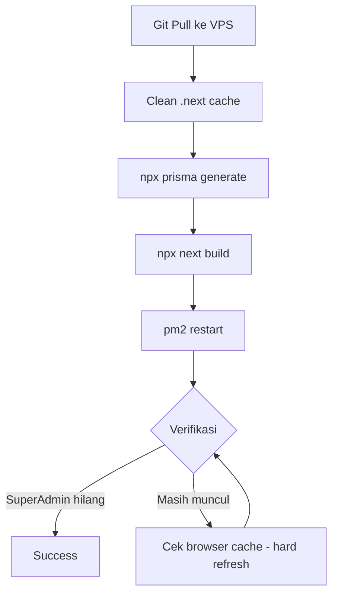

# Rencana Perbaikan VPS Deployment Issues

## Masalah yang Ditemukan

### Issue 1: SuperAdmin masih muncul di UI — Root Cause: Build belum dijalankan

**Gejala:**
- Dropdown "Peran" di invite modal: Super Admin, Admin, Anggota, Pengamat (4 opsi)
- Bagian "Peran" di bawah: Super Admin, Pemilik, Admin, Anggota, Pengamat (5 role)

**Root Cause:**
- User menjalankan `git pull` + `pm2 restart` secara manual
- TAPI tidak menjalankan `next build`
- File `.next` yang lama (dengan SuperAdmin) masih disajikan ke browser

**Evidence:**
- Kode terbaru di [`team/page.tsx`](apps/web/app/dashboard/settings/team/page.tsx:23) hanya punya 3 role: admin, member, viewer
- Screenshot menampilkan 5 role = old build aktif

**Fix:**
Jalankan di VPS:
```bash
cd /www/wwwroot/qalcuity
rm -rf apps/web/.next
export PRISMA_QUERY_ENGINE_TYPE=library
npx prisma generate
cd apps/web && npx next build
pm2 restart qalcuity-web --update-env
```

Atau lebih baik, gunakan `update.sh` yang sudah include semua step:
```bash
cd /www/wwwroot/qalcuity && bash update.sh
```

### Issue 2: Google OAuth ETIMEDOUT

**Error:**
```
AggregateError [ETIMEDOUT]
providerId: 'google'
```

**Root Cause:**
VPS tidak bisa terhubung ke `accounts.google.com` (port 443). Kemungkinan:
1. Firewall VPS memblokir outbound HTTPS
2. DNS resolution gagal
3. Network restriction di VPS provider

**Fix Options:**

**Option A — Disable Google OAuth (Recommended untuk sekarang):**
Karena ini B2B SaaS dan registration sudah pakai email/password, Google OAuth tidak wajib.
- Hapus atau kosongkan `GOOGLE_CLIENT_ID` dan `GOOGLE_CLIENT_SECRET` di VPS `.env`
- Code di [`auth.ts`](apps/web/lib/auth.ts:23) sudah handle: jika env kosong, Google provider tidak ditambahkan

```bash
# Di VPS, edit .env:
# GOOGLE_CLIENT_ID=""
# GOOGLE_CLIENT_SECRET=""
```

**Option B — Fix firewall:**
```bash
# Cek apakah port 443 outbound bisa diakses
curl -v https://accounts.google.com 2>&1 | head -20
# Jika timeout, perlu buka firewall
ufw allow out 443/tcp  # atau sesuaikan dengan firewall VPS
```

**Rekomendasi:** Option A (disable Google OAuth) — lebih cepat dan aman. Bisa diaktifkan lagi nanti ketika network issue resolved.

### Issue 3: Email SSL Error

**Error:**
```
SSL routines:tls_validate_record_header:wrong version number
```

**Root Cause:**
Konfigurasi SMTP di [`.env.production`](apps/web/.env.production:46):
```
SMTP_PORT=587
SMTP_SECURE=true   ← INI MASALAHNYA
```

Port 587 menggunakan **STARTTLS** (upgrade connection ke TLS setelah connect awal).
`SMTP_SECURE=true` berarti **implicit TLS** (langsung TLS dari awal).
Ini mismatch — server menerima plain text tapi client langsung kirim TLS handshake.

**Fix:**
Ubah `SMTP_SECURE=true` menjadi `SMTP_SECURE=false` untuk port 587.

Port 587 = STARTTLS → `SMTP_SECURE=false`
Port 465 = Implicit TLS → `SMTP_SECURE=true`

**Option A — Fix di .env.production (Recommended):**
```bash
# Di VPS, edit .env.production:
SMTP_SECURE=false
```

**Option B — Ganti ke port 465:**
```bash
SMTP_PORT=465
SMTP_SECURE=true
```

**Rekomendasi:** Option A — ganti `SMTP_SECURE=false` karena port 587 sudah dikonfigurasi.

---

## Execution Plan

### Step 1: Fix Email SSL (code change + deploy)
- Update [`apps/web/.env.production`](apps/web/.env.production:50): `SMTP_SECURE=false`
- Commit & push
- Di VPS: update .env.production manually (karena gitignored)

### Step 2: Disable Google OAuth di VPS
- Di VPS: kosongkan `GOOGLE_CLIENT_ID` dan `GOOGLE_CLIENT_SECRET` di `.env`
- Atau tambahkan flag di code untuk graceful disable

### Step 3: Build & Restart di VPS
- Jalankan `update.sh` ATAU manual: clean .next, prisma generate, next build, pm2 restart
- Verifikasi SuperAdmin tidak lagi muncul di Team Settings

### Step 4: Verifikasi
- Buka https://qalcuity.com/dashboard/settings/team
- Cek dropdown "Peran" hanya: Admin, Anggota, Pengamat
- Cek bagian "Peran" di bawah hanya: Admin, Anggota, Pengamat
- Cek email notification berhasil terkirim

---

## Diagram Alur Deployment


