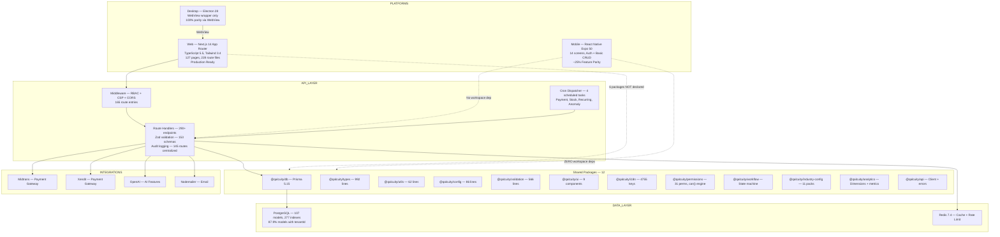
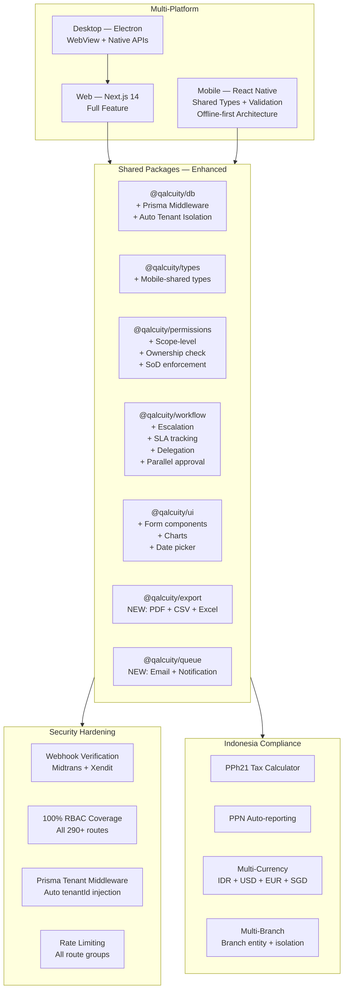
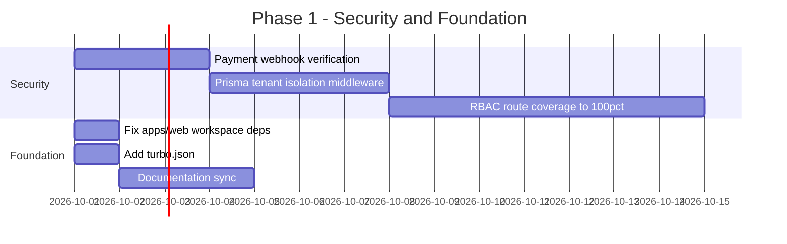

# QALCUITY — MASTER PROJECT AUDIT & PRODUCT ALIGNMENT REPORT

> **Tanggal:** 23 September 2026
> **Auditor:** Senior ERP Product Architect & Technical Product Manager
> **Metode:** Read-only code inspection + documentation cross-reference
> **Scope:** 10 phase audit konsolidasi — Fondasi, Database, Permissions, API, Frontend, Platform, Subscription, Workflow, POS, AI
> **Code is source of truth** — jika dokumentasi bilang X tapi code bilang Y, percaya code.

---

## A. EXECUTIVE SUMMARY

Qalcuity adalah Business Operating System berbasis monorepo (pnpm workspaces) dengan 12 shared packages, 3 apps (web, mobile, desktop), 107 Prisma models, ~290+ API endpoints, dan 11 industry packs. Platform ini telah mencapai **fase MVP production-ready** untuk web app dengan fitur ERP yang komprehensif: double-entry bookkeeping, auto-journaling, approval engine, POS integration, CRM, HR, inventory, billing, dan foundation untuk AI agents.

Namun, **signifikan gaps** masih ada antara apa yang diklaim di dokumentasi vs apa yang benar-benar terimplementasi. Permission engine hanya aktif untuk ~35% routes. Mobile app memiliki ~25% feature parity dan zero integrasi dengan shared packages. Workflow engine belum memiliki escalation, SLA tracking, atau delegation. POS belum punya offline mode. Beberapa fitur kritis seperti multi-currency, multi-branch, PPh21, dan PDF/CSV export belum ada. Security gaps meliputi webhook payment yang tidak terverifikasi dan trial enforcement yang belum jalan.

Secara keseluruhan, Qalcuity berada di **posisi kuat untuk ERP kelas SMB Indonesia** dengan arsitektur yang scalable, tapi perlu significant investment di area integrasi cross-platform, permission hardening, workflow completeness, dan mobile maturity sebelum bisa bersaing dengan pemain established seperti Accurate, Mekari, atau ERPNext.

---

## B. ACTUAL ARCHITECTURE

> Berdasarkan code inspection, bukan dokumentasi.

### Tech Stack Summary

| Layer | Technology | Version | Status |
|-------|-----------|---------|--------|
| Framework | Next.js 14 (App Router) | 14.x | ✅ Production |
| Language | TypeScript | 5.5 | ✅ Strict |
| Styling | Tailwind CSS | 3.4 | ✅ Active |
| Icons | Lucide React | 1.31 | ✅ Active |
| ORM | Prisma | 5.15 | ✅ Active |
| Database | PostgreSQL | 18.4 (local) | ✅ Active |
| Cache | Redis | 7.4 | ✅ Active |
| Auth | NextAuth (JWT) | 4.24 | ✅ Active |
| Validation | Zod | 4.5 | ✅ Active |
| Monorepo | pnpm workspaces | 9.0 | ✅ Active |
| Build | Turbo | 2.0 | ⚠️ No turbo.json |
| Mobile | React Native / Expo | 50 | ⚠️ Partial |
| Desktop | Electron | 28 | ⚠️ Placeholder |
| Payment | Midtrans + Xendit | — | ✅ Dual gateway |
| AI | OpenAI | 7.8 | ⚠️ Mock/basic |
| Testing | Vitest | 5.0 | ✅ Active |

### Key Statistics (Code Truth)

| Metric | Value | Source |
|--------|-------|--------|
| App Version | 11.25.0 | package.json root |
| Web App Version | 11.24.0 | apps/web/package.json |
| Prisma Models | 107 | schema.prisma (2807 lines) |
| TypeScript Files | 727 (web) + 52 (packages) | Codebase scan |
| API Route Files | 228 | Codebase scan |
| API Endpoints | 290+ | Phase 4 analysis |
| RBAC Route Entries | 165 | route-permissions.ts |
| Shared Packages | 12 | Repository inspection |
| Industry Packs | 11 | industry-config/src/packs/ |
| Zod Schemas | 153 | validation-schemas.ts |
| i18n Keys | 4755 | AGENT.md |
| UI Components | 9 | packages/ui |
| Database Indexes | 277 | @@index + @@unique |
| Web Pages | 127 | Codebase scan |
| Mobile Screens | 14 | Codebase scan |
| E2E Tests | 78 | Codebase scan |
| Unit Tests | 189 | Codebase scan |

---

## C. PRODUCT CAPABILITY MAP

| # | Capability | Status | Evidence | Gap | Priority |
|---|-----------|--------|----------|-----|----------|
| 1 | **Double-Entry Bookkeeping** | ✅ Working | Auto-journaling di semua transaksi keuangan, journal entry + items | — | — |
| 2 | **Invoice Management** | ✅ Working | Full CRUD + auto-numbering + approval workflow | No PDF export | P1 |
| 3 | **Purchase Order** | ✅ Working | Full CRUD + approval workflow | No 3-way matching | P2 |
| 4 | **Expense Management** | ✅ Working | Full CRUD + categorization + approval | — | — |
| 5 | **Financial Reports** | ✅ Working | 5 reports — NERaca, Laba Rugi, Arus Kas, Perubahan Ekuitas, Jurnal Umum | No drill-down, no export | P2 |
| 6 | **Chart of Accounts** | ✅ Working | Full CRUD + balance tracking + reconciliation support | — | — |
| 7 | **General Ledger** | ✅ Working | Journal entries + posting | No period close enforcement | P2 |
| 8 | **Bank Reconciliation** | ✅ Working | Match + unmatched + balance calculation | No auto-matching AI | P3 |
| 9 | **CRM — Leads** | ✅ Working | Full CRUD + stage pipeline + scoring | No auto-enrichment | P3 |
| 10 | **CRM — Contacts** | ✅ Working | Full CRUD + company linking | No duplicate detection | P2 |
| 11 | **CRM — Deals** | ✅ Working | Full CRUD + pipeline stages + probability | No win/loss analytics | P3 |
| 12 | **CRM — Activities** | ✅ Working | Full CRUD + scheduling | No email integration | P3 |
| 13 | **HR — Employees** | ✅ Working | Full CRUD + org chart | No PPh21 calculation | P1 |
| 14 | **HR — Leave Management** | ✅ Working | Full CRUD + approval workflow | No leave balance accrual engine | P2 |
| 15 | **HR — Attendance** | ✅ Working | Full CRUD + check-in/out | No shift scheduling | P2 |
| 16 | **HR — Payroll** | ⚠️ Partial | Basic payroll structure | No auto-calculation, no PPh21, no BPJS | P1 |
| 17 | **Inventory — Products** | ✅ Working | Full CRUD + categories + variants | — | — |
| 18 | **Inventory — Stock** | ✅ Working | Stock tracking + mutation history | No multi-warehouse routing | P2 |
| 19 | **Inventory — Stock Opname** | ✅ Working | Full CRUD + approval workflow | No barcode scanning | P3 |
| 20 | **POS — Transactions** | ✅ Working | Full transaction flow + payment split | No offline mode | P1 |
| 21 | **POS — Kitchen Display** | ✅ Working | SSE real-time + order status | No bump bar integration | P3 |
| 22 | **POS — Table Management** | ✅ Working | CRUD + floor plan + status | No reservation system | P3 |
| 23 | **Billing — Subscriptions** | ✅ Working | Entitlement engine — 25+ feature keys | No dunning, no trial enforcement | P1 |
| 24 | **Billing — Payments** | ✅ Working | Dual gateway — Midtrans + Xendit | No webhook verification | P0 |
| 25 | **Approval Engine** | ⚠️ Partial | Multi-level approval + auto-approval rules | No escalation, no SLA, no delegation, no parallel | P1 |
| 26 | **Permission Engine** | ⚠️ Partial | 31 permissions, 4 roles, can() function | Only ~35% routes use it, no custom role support client-side | P0 |
| 27 | **Workflow Engine** | ⚠️ Partial | State machine + transitions + guards | No transaction locking, no closing rules | P1 |
| 28 | **Multi-Currency** | ❌ Not Ready | Hardcoded IDR everywhere | Full multi-currency engine needed | P2 |
| 29 | **Multi-Branch** | ❌ Not Ready | No branch entity, no branch-level data isolation | Full multi-branch architecture needed | P2 |
| 30 | **Tax Engine** | ⚠️ Partial | Tax rate CRUD + basic calculation | No PPh21, no PPN auto-report, no tax mapping | P1 |
| 31 | **AI — NLU Parser** | ⚠️ Partial | 903 lines, 7 intent types, NER extraction | Conversation in-memory only, no persistence | P2 |
| 32 | **AI — Anomaly Detection** | ⚠️ Partial | 2394 lines, rule-based + ML scoring | No real-time alerting, no model training | P2 |
| 33 | **AI — Document Extraction** | ⚠️ Partial | PDF upload + field extraction | No batch processing, limited accuracy | P2 |
| 34 | **Analytics — Dashboard** | ✅ Working | Dashboard config + widget system | No real-time streaming | P3 |
| 35 | **Platform — Superadmin** | ✅ Working | Tenant CRUD + user management + audit logs | No impersonation, no feature flags, no real support tickets | P1 |
| 36 | **Platform — Entitlements** | ✅ Working | 25+ feature keys + plan-based | No usage-based billing, no trial countdown | P1 |
| 37 | **Email — Notifications** | ⚠️ Partial | Nodemailer setup + templates | No email queue, no delivery tracking | P2 |
| 38 | **Audit Trail** | ✅ Working | AuditLog model + logging in 145 routes | No export, no advanced filtering | P2 |
| 39 | **i18n** | ✅ Working | 4755 keys, ID + EN, custom provider | No RTL support, no regional formatting | P3 |
| 40 | **Dark Mode** | ✅ Working | Tailwind dark class + toggle | — | — |

---

## D. ERP BENCHMARK GAP

> Perbandingan dengan kelas ERP modern: Accurate, Mekari, SAP Business One, Dynamics 365, NetSuite, Odoo, ERPNext

### Qalcuity PUNYA (Competitive Features)

| Feature | Qalcuity | Benchmark Comparison |
|---------|----------|---------------------|
| Double-entry bookkeeping | ✅ Auto-journaling | Setara dengan Accurate, Odoo, ERPNext |
| Multi-module (Finance, CRM, HR, Inventory, POS) | ✅ Full suite | Setara dengan Odoo, ERPNext |
| 11 Industry packs | ✅ Configurable | Lebih baik dari Accurate, setara Odoo |
| Multi-tenant SaaS | ✅ Architecture | Setara dengan Mekari, NetSuite |
| Entitlement engine (25+ feature keys) | ✅ Billing-based | Unik — kombinasi SaaS + ERP |
| Dual payment gateway | ✅ Midtrans + Xendit | Lebih baik dari kebanyakan (ID-specific) |
| POS with kitchen display | ✅ SSE real-time | Lebih baik dari ERPNext POS |
| Approval engine (multi-level) | ✅ Configurable | Setara dengan SAP B1, Dynamics |
| Workflow engine (state machine) | ✅ Foundation | Foundation — perlu extension |
| Dark mode | ✅ Full support | Lebih baik dari kebanyakan ERP |
| Responsive web (mobile cards + desktop tables) | ✅ Dual layout | Setara dengan modern SaaS |
| Cron scheduler (unified) | ✅ Laravel-style | Lebih baik dari ERPNext |

### Qalcuity BELUM PUNYA (Critical Gaps vs Competitors)

| Feature | Qalcuity | Siapa yang punya | Impact |
|---------|----------|-----------------|--------|
| PDF export (invoices, reports) | ❌ None | Semua kompetitor | 🔴 High — must have |
| CSV/Excel export | ❌ None (xlsx package ada tapi unused) | Semua kompetitor | 🔴 High — must have |
| Multi-currency | ❌ Hardcoded IDR | Accurate, SAP, Dynamics, NetSuite | 🟠 High — limits to Indonesia |
| Multi-branch | ❌ No branch entity | Accurate, SAP, Mekari | 🟠 High — limits to single company |
| PPh21 Tax Calculation | ❌ Not implemented | Accurate, SAP, Mekari | 🟠 High — Indonesia compliance |
| PPN Auto-reporting | ❌ Not implemented | Accurate, Mekari | 🟠 High — Indonesia compliance |
| Bank auto-reconciliation | ❌ Manual only | SAP, NetSuite, Accurate | 🟡 Medium — efficiency |
| Inventory valuation methods (FIFO/LIFO/Weighted Avg) | ❌ Not implemented | Accurate, SAP, ERPNext | 🟡 Medium — accounting requirement |
| Fixed assets management | ❌ Not implemented | SAP, Dynamics, NetSuite | 🟡 Medium — ERP standard |
| Budget management | ❌ Not implemented | SAP, Dynamics, Odoo | 🟡 Medium — financial control |
| Inter-company transactions | ❌ Not implemented | SAP, NetSuite | 🟡 Medium — multi-entity |
| Email queue + delivery tracking | ❌ Direct send only | Modern SaaS standard | 🟡 Medium — reliability |
| Batch import (products, contacts, CoA) | ❌ Not implemented | All competitors | 🟠 High — onboarding |
| Barcode/QR scanning | ❌ Not implemented | Accurate, Mekari, ERPNext | 🟡 Medium — POS/inventory |
| Recurring journal entries | ❌ Not implemented | SAP, Accurate | 🟢 Low — convenience |

### Qalcuity BERBEDA (Unique Approaches)

| Aspect | Qalcuity | Standard ERP |
|--------|----------|-------------|
| **Permission model** | 31 permissions + fallback to role string | Usually fine-grained ACL |
| **Industry configuration** | Code-based industry packs | Usually marketplace addons |
| **POS integration** | Built-in with SSE kitchen display | Usually separate module or 3rd party |
| **Payment** | Dual gateway (Midtrans+Xendit) — tenant-managed | Usually single gateway, platform-managed |
| **AI** | Built-in (mock/basic) — included in subscription | Usually separate paid service |
| **Workflow** | Code-based state machine | Usually configurable via UI |

### Qalcuity PERLU (Priority Actions)

| Action | Why | Depends On |
|--------|-----|-----------|
| PDF export engine | Invoices, reports, documents — table stakes | Nothing — can start now |
| CSV/Excel export | Data portability — regulatory + user expectation | Nothing — xlsx package available |
| Multi-currency engine | Indonesia market OK, but limits growth | Exchange rate service integration |
| Multi-branch architecture | Most businesses have multiple locations | Branch entity + data isolation |
| PPh21 calculator | Legal requirement for Indonesian businesses | Tax rules engine |
| Batch import | Critical for onboarding new tenants | CSV parser (already exists in tests) |
| Inventory valuation | Accounting compliance | Valuation method in Product model |
| Email queue | Reliability + delivery tracking | Redis queue (already available) |

---

## E. MULTI-INDUSTRY READINESS

> 11 industry packs exist di `@qalcuity/industry-config`, tapi readiness berbeda-beda.

| # | Industry | Readiness | What's Working | What's Missing |
|---|---------|-----------|---------------|----------------|
| 1 | **Retail** | ⚠️ PARTIAL | Product catalog, inventory, POS, invoicing, CRM | Multi-outlet, loyalty program, barcode scanning, shelf management, omnichannel |
| 2 | **Distribution** | ⚠️ PARTIAL | Inventory, purchase order, sales order, warehouse | Fleet management, route optimization, delivery tracking, 3-way matching |
| 3 | **Manufacturing** | ⚠️ PARTIAL | Product catalog, BOM structure (basic), inventory | Work orders, MRP, shop floor control, quality control, capacity planning |
| 4 | **Construction** | ⚠️ PARTIAL | Project tracking (basic), invoicing, HR | Project costing, progress billing, equipment management, subcontractor mgmt |
| 5 | **Services** | ✅ MOSTLY READY | CRM, invoicing, HR, attendance, leave | Time tracking, project billing, resource allocation, SLA management |
| 6 | **Logistics** | ⚠️ PARTIAL | Basic CRUD operations | Fleet tracking, route planning, warehouse zones, shipment tracking |
| 7 | **Education** | ⚠️ PARTIAL | HR (employee), basic invoicing | Student management, academic calendar, grading, enrollment |
| 8 | **Healthcare** | ⚠️ PARTIAL | HR (employee), basic operations | Patient management, appointment scheduling, medical records, insurance |
| 9 | **Hospitality** | ⚠️ PARTIAL | POS (with kitchen display), table management, invoicing | Room management, booking engine, housekeeping, guest profiles |
| 10 | **Automotive** | ❌ NOT READY | Basic inventory only | Workshop management, parts catalog, service history, warranty tracking |
| 11 | **Restaurant** | ✅ MOSTLY READY | POS, kitchen display, table management, inventory, invoicing | Recipe management, food cost analysis, delivery integration, multi-outlet |

### Industry Pack Architecture Status

| Pack | File | Config Depth | Integration Level |
|------|------|-------------|-------------------|
| retail.ts | ✅ | Fields + workflows + reports | Low — config only, no special logic |
| construction.ts | ✅ | Fields + workflows + reports | Low — config only |
| manufacturing.ts | ✅ | Fields + workflows + reports | Low — config only |
| restaurant.ts | ✅ | Fields + workflows + reports | Medium — POS integration exists |
| healthcare.ts | ✅ | Fields + workflows + reports | Low — config only |
| education.ts | ✅ | Fields + workflows + reports | Low — config only |
| logistics.ts | ✅ | Fields + workflows + reports | Low — config only |
| hospitality.ts | ✅ | Fields + workflows + reports | Low — config only |
| professional-services.ts | ✅ | Fields + workflows + reports | Low — config only |
| agriculture.ts | ✅ | Fields + workflows + reports | Low — config only |

> **Key Finding:** Industry packs saat ini hanya berisi **configuration data** (fields, workflow statuses, report templates). Belum ada **industry-specific business logic** yang terintegrasi dengan core modules. Untuk benar-benar support industri tertentu, perlu ada module-level integration.

---

## F. ARCHITECTURAL GAPS

> Fundamental architecture problems yang menghambat scalability dan maintainability.

### F1: CRITICAL — Workspace Dependency Disconnect

**6 shared packages TIDAK dideklarasikan di apps/web/package.json:**
- `@qalcuity/ui`
- `@qalcuity/utils`
- `@qalcuity/validation`
- `@qalcuity/i18n`
- `@qalcuity/types`
- `@qalcuity/db`

**Impact:** Packages ini mungkin tidak benar-benar digunakan, atau apps/web memiliki duplikasi code lokal. Ini melanggar DRY principle dan membuat maintenance sulit.

### F2: CRITICAL — Mobile Zero Integration

apps/mobile memiliki **ZERO workspace dependencies**. Tidak menggunakan shared types, validation, permissions, atau package apapun.

**Impact:** Mobile app adalah standalone application yang tidak terhubung dengan ekosistem monorepo. Setiap perubahan di shared packages tidak otomatis ter-reflect di mobile.

### F3: CRITICAL — Documentation-Code Version Drift

| Source | Version | Delta |
|--------|---------|-------|
| package.json root | 11.25.0 | — (truth) |
| apps/web/package.json | 11.24.0 | -1 |
| CURRENT.md | v11.40.0 | +15 |
| ROADMAP.md | v11.30.0 | +5 |

Documentation mengklaim versi 15 release lebih tinggi dari actual code. Tidak ada single source of truth untuk versioning.

### F4: HIGH — No Prisma Middleware for Auto Tenant Isolation

Tidak ada Prisma middleware yang otomatis menyuntikkan `tenantId` ke setiap query. Setiap API route harus manual filter `tenantId`. Ini rentan human error — satu route yang lupa = data leak.

### F5: HIGH — No turbo.json Configuration

Root package.json menggunakan `turbo dev`, `turbo build`, `turbo lint` tapi tidak ada `turbo.json` di root. Build pipeline tidak terkonfigurasi dengan proper dependency graph.

### F6: MEDIUM — No Shared Component Library Beyond 9 Primitives

`@qalcuity/ui` hanya punya 9 basic components (Button, Input, Select, Table, Modal, Card, Badge, Alert, Spinner). Tidak ada form components, date picker, file upload, rich text editor, charts, atau layout components.

### F7: MEDIUM — Analytics Package Underutilized

`@qalcuity/analytics` memiliki aspirational documentation (15+ source files) tapi actual implementation hanya 6 files (index, types, engine, dimensions, metrics, utils). Gap besar antara aspirasi dan realitas.

---

## G. SECURITY GAPS

> Security vulnerabilities dan concerns berdasarkan code inspection.

| # | Gap | Severity | Status | Description |
|---|-----|----------|--------|-------------|
| G1 | **Payment Webhook No Verification** | 🔴 Critical | ❌ Open | Midtrans/Xendit webhooks tidak diverifikasi. Penjahat bisa forge webhook untuk menandai pembayaran palsu sebagai lunas. |
| G2 | **No Prisma Auto Tenant Isolation** | 🔴 Critical | ❌ Open | Setiap route harus manual filter tenantId. Human error = cross-tenant data leak. |
| G3 | **No RBAC on ~65% Routes** | 🔴 Critical | ⚠️ Partial | ~105 dari ~290 routes tidak melewati permission engine. Fallback ke basic role check. |
| G4 | **No Rate Limiting on All Routes** | 🟠 High | ⚠️ Partial | Rate limiting hanya ada di 5 route groups. 60%+ routes unprotected. |
| G5 | **No CSP Report-Only → Enforcement** | 🟠 Medium | ✅ Fixed | CSP sudah di-middleware + next.config.js |
| G6 | **No CORS Config** | 🟠 Medium | ✅ Fixed | Explicit CORS di middleware.ts + next.config.js |
| G7 | **Prisma Logging Uncontrolled** | 🟡 Low | ✅ Fixed | Toggle via ENABLE_PRISMA_LOGGING env var |
| G8 | **Rate Limiter In-Memory Fallback** | 🟡 Low | ✅ Fixed | Redis-backed with in-memory fallback |
| G9 | **No 2FA Enforcement** | 🟠 High | ❌ Open | 2FA model ada di DB tapi tidak ada enforcement untuk admin accounts. |
| G10 | **No IP Whitelisting for Admin** | 🟡 Medium | ❌ Open | Superadmin panel bisa diakses dari IP manapun. |
| G11 | **Session Token Rotation** | 🟡 Medium | ⚠️ Partial | JWT strategy — no explicit rotation. Refresh token not implemented. |
| G12 | **No Audit Log Immutability** | 🟡 Medium | ❌ Open | Audit logs bisa di-deleted oleh admin. Perlu append-only policy. |

### Security Score

| Category | Score | Notes |
|----------|-------|-------|
| Authentication | 7/10 | JWT + bcrypt, tapi no 2FA enforcement |
| Authorization | 4/10 | Engine exists, tapi only ~35% coverage |
| Data Isolation | 6/10 | Manual tenantId filtering, no middleware |
| Input Validation | 8/10 | 153 Zod schemas, comprehensive |
| Payment Security | 3/10 | No webhook verification |
| Infrastructure | 7/10 | CSP + CORS + rate limiting (partial) |
| **Overall** | **5.8/10** | **Needs significant hardening** |

---

## H. PERMISSION GAPS

> Authorization shortcomings berdasarkan Phase 3 analysis.

### Current Permission Engine

| Component | Status | Detail |
|-----------|--------|--------|
| Permission definitions | ✅ 31 perms | 8 modules — finance, crm, hr, inventory, pos, billing, platform, system |
| Role definitions | ✅ 4 system roles | SUPERADMIN, ADMIN, MEMBER, VIEWER |
| can() function | ✅ Working | Permission check with role hierarchy |
| Scope-level permission | ❌ Not implemented | No department/project-level scoping |
| Ownership check | ❌ Not implemented | No "own data only" permission |
| Separation of Duties | ❌ Not implemented | No conflicting permission prevention |
| Custom roles (DB) | ⚠️ Schema only | CustomRole model exists but client-side not functional |
| Route integration | ⚠️ ~35% | Only ~105 of ~290 routes use permission engine |

### Permission Coverage Map

| Module | Routes | With Permission Check | Coverage |
|--------|--------|----------------------|----------|
| Finance | ~60 | ~45 | 75% |
| CRM | ~30 | ~20 | 67% |
| HR | ~40 | ~30 | 75% |
| Inventory | ~25 | ~18 | 72% |
| POS | ~20 | ~8 | 40% |
| Billing | ~15 | ~12 | 80% |
| Platform | ~50 | ~40 | 80% |
| System/Settings | ~30 | ~22 | 73% |
| AI | ~10 | ~5 | 50% |
| Cron | ~5 | ~5 | 100% |
| **Total** | **~290** | **~105** | **~36%** |

### Critical Permission Gaps

1. **No route-level RBAC enforcement** — Hanya middleware-level route protection, tidak ada per-handler permission check untuk 65% routes
2. **Custom roles tidak berfungsi di client** — CustomRole model ada di DB tapi UI tidak membaca/gunakan
3. **No scope-level isolation** — USER tidak bisa di-scoped ke departemen tertentu
4. **VIEWER role tidak enforced di semua routes** — Beberapa routes tidak check role sebelum mutation
5. **No permission audit trail** — Tidak ada log untuk permission denied events

---

## I. SUPERADMIN / PLATFORM GAPS

> SaaS Control Center shortcomings berdasarkan Phase 6 analysis.

### Current Superadmin Capabilities

| Feature | Status | Quality |
|---------|--------|---------|
| Tenant management (CRUD) | ✅ | B |
| User management | ✅ | B |
| System settings | ✅ | B |
| Audit log viewer | ✅ | B |
| Dashboard metrics | ✅ | B- |
| Plan management | ✅ | B |

### Missing Superadmin Capabilities

| # | Capability | Priority | Impact |
|---|-----------|----------|--------|
| I1 | **Tenant impersonation** | P1 | Support agent tidak bisa "masuk" ke tenant untuk troubleshooting |
| I2 | **Real support tickets** | P1 | Current tickets "palsu" — derived from AuditLog, bukan real ticket system |
| I3 | **Feature flags** | P1 | Tidak bisa roll out fitur baru secara gradual per tenant |
| I4 | **Tenant health dashboard** | P2 | No real-time monitoring per tenant (API usage, error rate, latency) |
| I5 | **Bulk operations** | P2 | No bulk tenant migration, bulk plan upgrade, bulk notification |
| I6 | **Tenant lifecycle management** | P2 | No suspension, reactivation, data export, account deletion workflow |
| I7 | **Usage analytics** | P2 | No per-tenant feature usage tracking |
| I8 | **Notification center** | P3 | No platform-wide announcement/notification system |
| I9 | **Maintenance mode** | P3 | No ability to put specific tenants in maintenance mode |
| I10 | **API key management** | P3 | No tenant-level API key generation for integrations |

---

## J. ERP WORKFLOW GAPS

> Approval, escalation, SLA, locking, closing, audit gaps berdasarkan Phase 9 analysis.

### Current Workflow Engine

| Component | Status | Detail |
|-----------|--------|--------|
| State machine | ✅ Working | Transaction lifecycle management |
| Multi-level approval | ✅ Working | Configurable approval levels |
| Auto-approval rules | ✅ Working | Amount-based auto-approval |
| Workflow definitions | ✅ Working | Configurable per entity type |

### Missing Workflow Capabilities

| # | Gap | Priority | Impact | Competitor Comparison |
|---|-----|----------|--------|----------------------|
| J1 | **No escalation rules** | P1 | Approvals can stall indefinitely. No auto-escalation to next level when SLA breached. | SAP B1, Dynamics — standard |
| J2 | **No SLA tracking** | P1 | No time-based targets for approval completion. No alerts for overdue approvals. | SAP, NetSuite — standard |
| J3 | **No transaction locking** | P1 | Two users can edit same transaction simultaneously. Race conditions possible. | Standard ERP — pessimistic locking |
| J4 | **No delegation** | P2 | Users cannot delegate approval authority during absence (e.g., leave). | SAP, Dynamics — standard |
| J5 | **No parallel approval** | P2 | Only sequential approval. Cannot require approval from Finance AND Manager simultaneously. | SAP B1, NetSuite — standard |
| J6 | **No period closing enforcement** | P2 | Accounting periods can be modified without proper closing procedure. | SAP, Accurate — mandatory |
| J7 | **No draft → pending → posted workflow** | P2 | Transactions don't have clear lifecycle stages. | ERPNext — standard |
| J8 | **No reversal/correction workflow** | P2 | No formal way to reverse posted transactions. Manual adjustments only. | SAP, Accurate — standard |
| J9 | **No approval matrix** | P3 | No matrix of who can approve what based on amount + department + type. | SAP B1, Dynamics — standard |

---

## K. MOBILE GAPS

> Web/Mobile discrepancies berdasarkan Phase 5 analysis.

### Mobile App Current State

| Aspect | Status | Detail |
|--------|--------|--------|
| Framework | React Native / Expo 50 | Functional |
| Authentication | ✅ Working | JWT-based, matches web |
| Screens | 14 | ~25% of web's 127 pages |
| Workspace deps | ❌ ZERO | Completely isolated |
| API connection | ❌ Hardcoded URL | No environment-based config |

### Mobile vs Web Feature Parity

| Feature | Web | Mobile | Parity |
|---------|-----|--------|--------|
| Auth (login/register) | ✅ | ✅ | 100% |
| Dashboard | ✅ | ✅ | ~30% |
| Invoices | ✅ | ✅ | ~20% |
| Contacts | ✅ | ✅ | ~20% |
| Products | ✅ | ✅ | ~20% |
| Employees | ✅ | ❌ | 0% |
| POS | ✅ | ❌ | 0% |
| Reports | ✅ | ❌ | 0% |
| Settings | ✅ | ❌ | 0% |
| CRM | ✅ | ❌ | 0% |
| HR | ✅ | ❌ | 0% |
| Inventory | ✅ | ❌ | 0% |
| Billing | ✅ | ❌ | 0% |
| **Overall** | **127 pages** | **14 screens** | **~25%** |

### Critical Mobile Gaps

| # | Gap | Priority | Impact |
|---|-----|----------|--------|
| K1 | **No bottom tab navigation** | P1 | Mobile UX mengikuti web sidebar pattern, bukan mobile-native |
| K2 | **Hardcoded API URL** | P1 | Tidak bisa environment switching (dev/staging/prod) |
| K3 | **No offline mode** | P2 | Mobile useless without internet — kritical untuk field users |
| K4 | **No shared code with web** | P2 | Setiap change di shared logic harus di-sync manual |
| K5 | **No push notifications** | P2 | No real-time alerts untuk approvals, payments, etc. |
| K6 | **No camera/barcode integration** | P3 | No POS barcode scanning, no document capture |
| K7 | **No biometric auth** | P3 | No fingerprint/face ID support |
| K8 | **No dark mode** | P3 | Web has dark mode, mobile doesn't |
| K9 | **No i18n** | P3 | Hardcoded strings, no language switching |

---

## L. POS GAPS

> POS dependency dan gaps berdasarkan Phase 9 analysis.

### POS Current State

| Component | Status | Quality |
|-----------|--------|---------|
| Transaction flow | ✅ | B+ |
| Payment split | ✅ | B+ |
| Kitchen display (SSE) | ✅ | B |
| Table management | ✅ | B- |
| Session management | ✅ | B |
| Refund processing | ✅ | B- |

### POS Missing Capabilities

| # | Gap | Priority | Impact |
|---|-----|----------|--------|
| L1 | **No offline mode** | P1 | POS useless when internet down — kritical untuk F&B/Retail |
| L2 | **No inventory sync** | P1 | POS transactions tidak auto-deduct inventory |
| L3 | **No CRM sync** | P2 | Customer data dari POS tidak sync ke CRM contacts |
| L4 | **No loyalty integration** | P2 | Loyalty models ada di DB tapi tidak integrated dengan POS |
| L5 | **No barcode scanning** | P2 | Cashier harus manual cari produk |
| L6 | **No multi-payment method** | P2 | Split bayar terbatas |
| L7 | **No receipt printer integration** | P3 | No thermal printer support |
| L8 | **No cash drawer control** | P3 | No hardware integration |
| L9 | **No end-of-day reconciliation** | P2 | No automatic Z-report |
| L10 | **No discount/coupon engine** | P3 | Basic discount only, no coupon codes |

---

## M. DOCUMENTATION GAPS

> Documentation vs implementation discrepancies berdasarkan Phase 1 analysis.

### Version Drift

| Document | Claimed Version | Code Version | Drift |
|----------|----------------|-------------|-------|
| CURRENT.md | v11.40.0 | 11.25.0 | **+15 versions** |
| ROADMAP.md | v11.30.0 | 11.25.0 | **+5 versions** |
| apps/web/package.json | 11.24.0 | 11.25.0 | **-1 version** |

### Metric Inconsistencies

| Metric | Source A | Source B | Drift |
|--------|----------|---------|-------|
| DB Indexes | DATABASE.md: 275 | AGENT.md: 277 | ±2 |
| Zod Schemas | SECURITY.md: 144 | AGENT.md: 153 | ±9 |
| i18n Keys | UI_UX.md: 200+ | AGENT.md: 4755 | ~4555 |
| Loading Files | UI_UX.md: 116 | AGENT.md: 117 | ±1 |

### Documentation Structure Issues

| Issue | Impact |
|-------|--------|
| No single versioning strategy | Every document has different version format (v8.0, v30.0, v5.0.0, v11.40.0) |
| DATABASE.md only covers ~60% of models | POS, analytics, workflow, entitlement, approval models not documented |
| UI_UX.md severely stale | i18n keys documented as 200+ when actual is 4755 |
| ANALYTICS.md describes aspirational architecture | 15+ source files documented, only 6 exist |
| No API documentation | 290+ endpoints with no OpenAPI/Swagger spec |
| No changelog | No record of what changed between versions |

---

## N. TECHNICAL DEBT

> Ordered by risk (highest risk first).

| # | Debt Item | Risk | Impact | Effort to Fix |
|---|-----------|------|--------|---------------|
| 1 | **Payment webhook no verification** | 🔴 Critical | Financial fraud risk | Low — add signature verification |
| 2 | **65% routes without RBAC** | 🔴 Critical | Data breach risk | High — systematic route audit |
| 3 | **No Prisma auto tenant isolation** | 🔴 Critical | Cross-tenant data leak | Medium — add middleware |
| 4 | **6 packages not declared in apps/web** | 🟠 High | DRY violation, maintenance hell | Low — add workspace deps |
| 5 | **Mobile zero shared code** | 🟠 High | Divergence cost grows linearly | High — architecture redesign |
| 6 | **Documentation version drift (+15)** | 🟠 High | Misleading for new developers | Medium — sync all docs |
| 7 | **No turbo.json** | 🟠 High | Build pipeline unconfigured | Low — create file |
| 8 | **Custom roles DB but not functional** | 🟠 High | Feature promise vs reality | Medium — implement client support |
| 9 | **POS hardcoded stats** | 🟡 Medium | Misleading dashboard data | Low — dynamic calculation |
| 10 | **Analytics package underutilized** | 🟡 Medium | Dead code, maintenance cost | Medium — align or remove |
| 11 | **Mobile hardcoded API URL** | 🟡 Medium | Environment switching impossible | Low — use env config |
| 12 | **No period closing enforcement** | 🟡 Medium | Accounting integrity risk | Medium — implement closing flow |
| 13 | **In-memory AI conversation** | 🟡 Medium | Data loss on restart | Medium — persist to DB |
| 14 | **No CSV/Excel export** | 🟡 Medium | User productivity loss | Low — xlsx package available |
| 15 | **No email queue** | 🟡 Low | Email delivery unreliability | Medium — add queue system |

---

## O. PRIORITY MATRIX

### P0 — Blocker / Fundamental (Harus selesai SEBELUM production scaling)

| # | Item | Phase | Dependencies | Risk if Deferred |
|---|------|-------|-------------|-----------------|
| 1 | Payment webhook verification (Midtrans + Xendit) | Security | None | Financial fraud — unverifiable payments |
| 2 | Prisma middleware for auto tenant isolation | Architecture | None | Cross-tenant data leak — one missed filter = breach |
| 3 | RBAC coverage to 100% routes | Security | Permission engine fixes | Unauthorized access to any unprotected route |

### P1 — Critical (Harus selesai dalam 1-2 sprint)

| # | Item | Phase | Dependencies | Risk if Deferred |
|---|------|-------|-------------|-----------------|
| 4 | Fix apps/web workspace dependencies | Foundation | None | DRY violation, phantom packages |
| 5 | Add turbo.json configuration | Foundation | None | Build pipeline undefined |
| 6 | PDF export engine (invoices + reports) | Feature | None | Table stakes for ERP — users expect PDF |
| 7 | CSV/Excel export | Feature | None | Data portability — regulatory concern |
| 8 | Approval escalation + SLA tracking | Workflow | Approval engine | Approval bottlenecks, no accountability |
| 9 | Transaction locking | Workflow | None | Race conditions, data corruption |
| 10 | PPh21 tax calculation | Compliance | Tax engine | Legal requirement for Indonesian businesses |
| 11 | Mobile bottom tab navigation | Mobile UX | None | Poor mobile adoption |
| 12 | Mobile environment config (no hardcoded URL) | Mobile | None | Cannot deploy to staging/prod |
| 13 | POS offline mode | POS | Architecture redesign | POS useless when internet down |
| 14 | POS inventory sync | POS | Inventory module | Stock discrepancies |
| 15 | Superadmin tenant impersonation | Platform | None | Support cannot troubleshoot tenant issues |
| 16 | Real support ticket system | Platform | None | Current "tickets" are fake (derived from AuditLog) |
| 17 | Feature flags system | Platform | None | Cannot gradually roll out features |
| 18 | Documentation sync (version + metrics) | Documentation | None | Developer confusion, onboarding failure |

### P2 — Important (Sprint 3-4)

| # | Item | Phase | Dependencies |
|---|------|-------|-------------|
| 19 | Multi-currency engine | Architecture | Exchange rate service |
| 20 | Multi-branch architecture | Architecture | Branch entity + data isolation |
| 21 | Inventory valuation methods (FIFO/LIFO) | Feature | Product model extension |
| 22 | Batch import (products, contacts, CoA) | Feature | CSV parser |
| 23 | Mobile offline mode | Mobile | Local storage strategy |
| 24 | Mobile push notifications | Mobile | Firebase/APNs setup |
| 25 | Delegation engine | Workflow | User + approval model |
| 26 | Parallel approval | Workflow | Workflow engine extension |
| 27 | Period closing enforcement | Accounting | AccountingPeriod workflow |
| 28 | Custom roles client-side support | Permission | UI + API integration |
| 29 | Email queue + delivery tracking | Infrastructure | Redis queue |
| 30 | No duplication detection (contacts) | CRM | Fuzzy matching |
| 31 | POS end-of-day reconciliation | POS | Reporting engine |
| 32 | 2FA enforcement for admin accounts | Security | Auth flow extension |
| 33 | Tenant health dashboard | Platform | Metrics collection |

### P3 — Enhancement (Backlog)

| # | Item | Phase |
|---|------|-------|
| 34 | Real-time analytics streaming | Analytics |
| 35 | AI conversation persistence | AI |
| 36 | AI model training pipeline | AI |
| 37 | Mobile biometric auth | Mobile |
| 38 | Mobile barcode/camera integration | Mobile |
| 39 | Mobile dark mode | Mobile |
| 40 | Mobile i18n | Mobile |
| 41 | Receipt printer integration | POS |
| 42 | Cash drawer control | POS |
| 43 | Loyalty program integration | POS |
| 44 | Budget management | Finance |
| 45 | Fixed assets management | Finance |
| 46 | Inter-company transactions | Finance |
| 47 | API documentation (OpenAPI/Swagger) | Documentation |
| 48 | Changelog maintenance | Documentation |

---

## P. RECOMMENDED TARGET ARCHITECTURE

### Target State (Post-Remediation)

### Key Architecture Principles (Target)

1. **Shared Code First** — All platforms (web, mobile, desktop) consume shared packages for types, validation, permissions
2. **Middleware-level Tenant Isolation** — Prisma middleware auto-injects tenantId, eliminating human error
3. **100% RBAC Coverage** — Every API route passes through permission engine
4. **Offline-First Mobile** — Local database sync strategy for field users
5. **Event-Driven Architecture** — Email, notifications, webhooks via queue system
6. **Configuration over Code** — Industry-specific logic via config, not if-else
7. **Export-First Design** — Every data view should support PDF/CSV/Excel export
8. **Indonesia Compliance Built-in** — PPh21, PPN, NPWP validation as core features

---

## Q. RECOMMENDED ROADMAP

### Phase 1: Security & Foundation Hardening (P0 Items)

> Goal: Eliminate critical security risks and fix foundational issues.

**Deliverables:**
- [ ] Webhook signature verification for Midtrans + Xendit
- [ ] Prisma middleware for automatic tenantId injection
- [ ] 100% RBAC coverage across all 290+ routes
- [ ] All 6 workspace dependencies declared in apps/web
- [ ] turbo.json created with proper pipeline config
- [ ] All documentation synced to actual code version

### Phase 2: ERP Essentials (P1 Items — High Business Value)

> Goal: Add table-stakes ERP features and critical workflow improvements.

**Deliverables:**
- [ ] PDF export engine (invoices, reports, documents)
- [ ] CSV/Excel export for all list views
- [ ] Approval escalation rules + SLA tracking
- [ ] Transaction locking (pessimistic)
- [ ] PPh21 tax calculation engine
- [ ] Batch import (products, contacts, Chart of Accounts)
- [ ] Inventory valuation methods (FIFO, Weighted Average)
- [ ] Period closing enforcement
- [ ] Email queue with delivery tracking
- [ ] Mobile bottom tab navigation
- [ ] Mobile environment configuration (dev/staging/prod)
- [ ] POS offline mode architecture
- [ ] POS inventory sync
- [ ] POS end-of-day reconciliation (Z-report)
- [ ] Superadmin tenant impersonation
- [ ] Real support ticket system
- [ ] Feature flags system
- [ ] 2FA enforcement for admin accounts

### Phase 3: Platform Expansion (P2 Items)

> Goal: Multi-currency, multi-branch, mobile maturity, workflow completeness.

**Deliverables:**
- [ ] Multi-currency engine with exchange rate service
- [ ] Multi-branch architecture with data isolation
- [ ] Mobile offline mode (local DB + sync)
- [ ] Mobile push notifications (Firebase/APNs)
- [ ] Delegation engine (approval delegation during absence)
- [ ] Parallel approval support
- [ ] Custom roles client-side support
- [ ] Tenant health dashboard
- [ ] Contact duplicate detection
- [ ] Mobile shared code integration (@qalcuity/types, @qalcuity/validation)
- [ ] No-duplication detection for contacts
- [ ] PPN auto-reporting
- [ ] API documentation (OpenAPI/Swagger)
- [ ] Usage analytics per tenant

### Phase 4: Competitive Features (P3 Items)

> Goal: Feature parity with established ERP competitors + differentiation.

**Deliverables:**
- [ ] Budget management module
- [ ] Fixed assets management
- [ ] Inter-company transactions
- [ ] AI conversation persistence
- [ ] AI model training pipeline
- [ ] Mobile biometric auth
- [ ] Mobile barcode/camera integration
- [ ] Mobile dark mode + i18n
- [ ] Receipt printer integration
- [ ] Loyalty program integration
- [ ] Real-time analytics streaming
- [ ] Changelog maintenance system
- [ ] Industry-specific business logic (beyond config)
- [ ] Shift scheduling for HR
- [ ] Email integration for CRM activities

---

## APPENDIX: AUDIT PHASE REFERENCE

| Phase | Focus Area | Key Finding | Grade |
|-------|-----------|-------------|-------|
| 1 | Foundation | 12 packages, 3 apps, monorepo — structurally sound but documentation drift | B+ |
| 2 | Database & Multi-tenancy | 107 models, 87.9% tenantId, no auto isolation middleware | B |
| 3 | Permission Engine | 31 perms, 4 roles, only ~35% route coverage | C+ |
| 4 | API Routes & Business Logic | 290+ endpoints, strong finance/POS, missing multi-currency/PDF | B+ |
| 5 | Frontend | Web B+, Mobile C+, Desktop B — significant parity gap | B- |
| 6 | Platform/Superadmin | Solid CRUD, missing impersonation/tickets/feature flags | B |
| 7 | Subscription/Billing | Strong entitlements, missing webhook verification/trial enforcement | B |
| 8 | Workflow/Approval | State machine + multi-level approval, missing escalation/SLA/locking | C+ |
| 9 | POS Integration | Full transaction flow + kitchen display, missing offline/inventory sync | B- |
| 10 | AI/Observability | NLU + anomaly detection, conversation in-memory, no error tracking | B+ |

### Overall Platform Grade: **B- (Solid Foundation, Significant Gaps)**

> Qalcuity has built a remarkably comprehensive ERP platform in a short time. The monorepo architecture, shared packages, and configurable engines show good engineering judgment. However, the gap between "built" and "production-ready at scale" is significant — particularly in security hardening, permission completeness, mobile maturity, and ERP workflow completeness. The recommended roadmap prioritizes security first, then table-stakes ERP features, then platform expansion.

---

**Audit Selesai:** 23 September 2026
**Total Phases Konsolidasi:** 10
**Total Items in Priority Matrix:** 48
**P0 Items:** 3 (Security blockers)
**P1 Items:** 15 (Critical features)
**P2 Items:** 15 (Important enhancements)
**P3 Items:** 15 (Backlog items)
