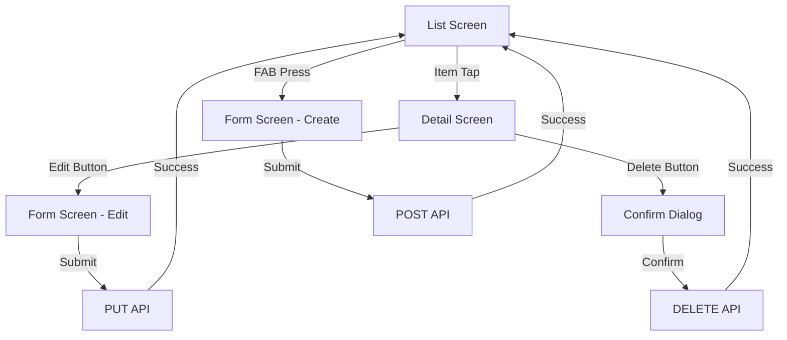
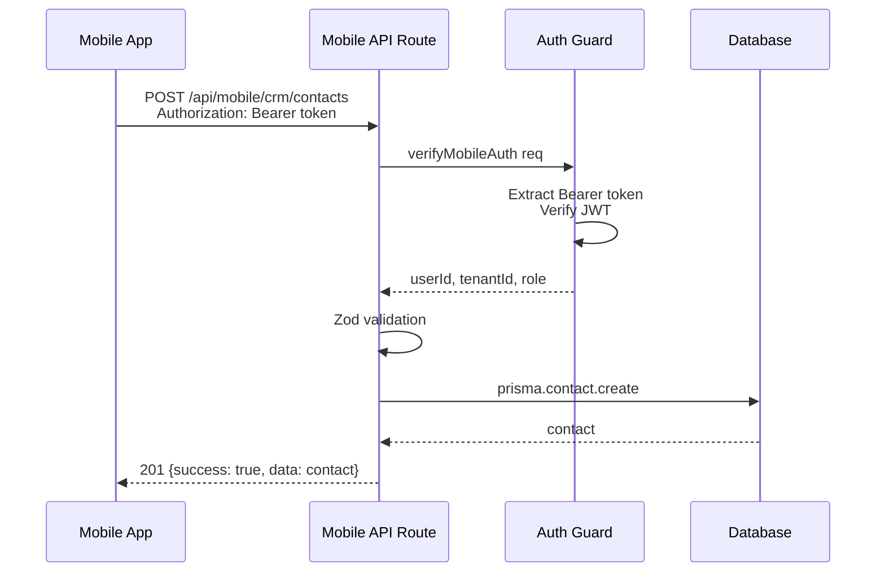

# Mobile CRUD — Analisis & Rencana Implementasi

> **Tanggal:** 2026-09-26
> **Status:** DRAFT — Menunggu approval
> **Scope:** Analisis dan perencanaan CRUD operations untuk mobile app

---

## 📋 Daftar Isi

1. [Current State Analysis](#1-current-state-analysis)
2. [Critical Blocker: Auth Mismatch](#2-critical-blocker-auth-mismatch)
3. [Priority Screens](#3-priority-screens)
4. [Form Fields Analysis](#4-form-fields-analysis)
5. [API Client Updates](#5-api-client-updates)
6. [UI/UX Decisions](#6-uiux-decisions)
7. [Implementation Plan](#7-implementation-plan)
8. [Mermaid Diagrams](#8-mermaid-diagrams)

---

## 1. Current State Analysis

### Mobile App Structure

| Component | Status | Notes |
|-----------|--------|-------|
| **Screens** | 14 files | All read-only (0% CRUD) |
| **API Client** | `apps/mobile/lib/api.ts` | 681 lines, GET-only |
| **Auth** | JWT Bearer token | Via `/api/mobile/auth/*` |
| **Navigation** | React Navigation v6 | Native Stack Navigator |
| **Dependencies** | Expo 50, React Native 0.73 | No form libraries installed |

### Existing Mobile Screens

| Screen | Module | Current State | CRUD Priority |
|--------|--------|---------------|---------------|
| [`ContactDetailScreen.tsx`](apps/mobile/screens/ContactDetailScreen.tsx) | CRM | Read-only detail | ⭐ **P1** — Create/Edit/Delete |
| [`ProductDetailScreen.tsx`](apps/mobile/screens/ProductDetailScreen.tsx) | Inventory | Read-only detail | ⭐ **P1** — Create/Edit/Delete |
| [`InvoiceDetailScreen.tsx`](apps/mobile/screens/InvoiceDetailScreen.tsx) | Finance | Read-only detail | ⭐ **P2** — Create only |
| [`EmployeeDetailScreen.tsx`](apps/mobile/screens/EmployeeDetailScreen.tsx) | HR | Read-only detail | ⭐ **P2** — Create/Edit |
| [`CRMScreen.tsx`](apps/mobile/screens/CRMScreen.tsx) | CRM | List with tabs | Needs FAB button |
| [`InventoryScreen.tsx`](apps/mobile/screens/InventoryScreen.tsx) | Inventory | List with tabs | Needs FAB button |
| [`FinanceScreen.tsx`](apps/mobile/screens/FinanceScreen.tsx) | Finance | List with tabs | Needs FAB button |
| [`HRScreen.tsx`](apps/mobile/screens/HRScreen.tsx) | HR | List with tabs | Needs FAB button |
| [`DashboardScreen.tsx`](apps/mobile/screens/DashboardScreen.tsx) | Dashboard | Read-only | No CRUD needed |
| [`HomeScreen.tsx`](apps/mobile/screens/HomeScreen.tsx) | Home | Read-only | No CRUD needed |
| [`LeadDetailScreen.tsx`](apps/mobile/screens/LeadDetailScreen.tsx) | CRM | Read-only | Deferred |
| [`DealDetailScreen.tsx`](apps/mobile/screens/DealDetailScreen.tsx) | CRM | Read-only | Deferred |
| [`LoginScreen.tsx`](apps/mobile/screens/LoginScreen.tsx) | Auth | Functional | No change |
| [`RegisterScreen.tsx`](apps/mobile/screens/RegisterScreen.tsx) | Auth | Functional | No change |

### Web API Endpoints (Sudah Ada)

| Entity | GET | POST | PUT | DELETE | Validation Schema |
|--------|-----|------|-----|--------|-------------------|
| **Contacts** | ✅ `/api/crm/contacts` | ✅ | ❌ | ✅ `[id]` | [`createContactSchema`](apps/web/lib/validation-schemas.ts:11) |
| **Products** | ✅ `/api/inventory/products` | ✅ | ✅ | ✅ `[id]` | [`createProductSchema`](apps/web/lib/validation-schemas.ts:353), [`updateProductSchema`](apps/web/lib/validation-schemas.ts:368) |
| **Invoices** | ✅ `/api/finance/invoices` | ✅ | ✅ | ❌ | [`createInvoiceSchema`](apps/web/lib/validation-schemas.ts:120), [`updateInvoiceSchema`](apps/web/lib/validation-schemas.ts:136) |
| **Employees** | ✅ `/api/hr/employees` | ✅ | ✅ | ❌ | [`createEmployeeSchema`](apps/web/lib/validation-schemas.ts:239), [`updateEmployeeSchema`](apps/web/lib/validation-schemas.ts:250) |

> **Catatan:** Contact PUT endpoint belum ada di `[id]/route.ts` — hanya GET dan DELETE. Perlu ditambahkan.

---

## 2. Critical Blocker: Auth Mismatch

### Problem

Mobile app menggunakan **JWT Bearer token** untuk autentikasi, tapi web API routes menggunakan **NextAuth cookie-based session** via `getServerSession(authOptions)`.

```
Mobile App:
  Authorization: Bearer <jwt_token>
  ↓
Web API Route:
  requirePermissionForRoute(req)
    → getServerSession(authOptions)  ← reads COOKIES, not Bearer token
    → returns null (no session cookie)
    → 401 Unauthorized
```

### Evidence

1. [`apps/mobile/lib/api.ts`](apps/mobile/lib/api.ts:187) — Mengirim `Authorization: Bearer ${token}`
2. [`apps/web/lib/session.ts`](apps/web/lib/session.ts:172) — `requirePermissionForRoute` menggunakan `getServerSession(authOptions)`
3. [`apps/web/middleware.ts`](apps/web/middleware.ts:65) — `withAuth` mendukung Bearer token, tapi `getServerSession` di API routes tidak

### Impact

- **Saat ini:** Mobile GET requests ke business data kemungkinan besar GAGAL (401)
- **Untuk CRUD:** POST/PUT/DELETE pasti akan gagal juga
- **Solusi yang diperlukan:** Shared auth helper yang mendukung both cookie dan Bearer token

### Proposed Solution

Buat [`apps/web/lib/mobile-auth-guard.ts`](apps/web/lib/mobile-auth-guard.ts) — helper yang:
1. Cek Bearer token dari `Authorization` header → verify JWT → return user info
2. Fallback ke `getServerSession` jika tidak ada Bearer token
3. Return type yang sama dengan `requirePermissionForRoute`

**Alternatif (lebih clean):** Buat mobile-specific API routes di `/api/mobile/` yang menggunakan `getMobileUserFromToken` dari [`apps/web/lib/mobile-auth.ts`](apps/web/lib/mobile-auth.ts).

**Rekomendasi:** Gunakan **mobile-specific API routes** — lebih secure, clearer separation, dan tidak memodifikasi auth system yang existing (Rule 5: Do Not Touch).

---

## 3. Priority Screens

### P1 — Core CRUD (Wajib)

#### Screen 1: ContactFormScreen (NEW) — Create/Edit Contact

**Alasan:** Contact adalah entitas paling dasar di CRM. Tanpa kontak, invoice dan deal tidak bisa dibuat.

**Fields (dari [`createContactSchema`](apps/web/lib/validation-schemas.ts:11)):**

| Field | Type | Required | Notes |
|-------|------|----------|-------|
| name | string | ✅ | Max 255 chars |
| email | string | ❌ | Email format |
| phone | string | ❌ | Max 50 chars |
| type | string | ❌ | CUSTOMER/SUPPLIER/LEAD |
| company | string | ❌ | Max 255 chars |
| position | string | ❌ | Max 255 chars |
| address | string | ❌ | Text area |
| city | string | ❌ | Max 100 chars |
| province | string | ❌ | Max 100 chars |
| postalCode | string | ❌ | Max 10 chars |
| taxId | string | ❌ | Max 50 chars (NPWP) |
| notes | string | ❌ | Text area |

**API Endpoints Needed:**
- POST `/api/mobile/crm/contacts` — Create
- PUT `/api/mobile/crm/contacts/[id]` — Update
- DELETE `/api/mobile/crm/contacts/[id]` — Delete

**Minimal Fields (Mobile-Optimized):** name, email, phone, type, company, address

---

#### Screen 2: ProductFormScreen (NEW) — Create/Edit Product

**Alasan:** Product adalah entitas inti Inventory. Stok management membutuhkan produk yang bisa di-crud dari mobile.

**Fields (dari [`createProductSchema`](apps/web/lib/validation-schemas.ts:353)):**

| Field | Type | Required | Notes |
|-------|------|----------|-------|
| sku | string | ✅ | Regex: `^[A-Za-z0-9_-]+$`, max 50 |
| name | string | ✅ | Max 255 chars |
| description | string | ❌ | Text area |
| unit | string | ❌ | Default: pcs |
| price | number | ❌ | Min 0 |
| cost | number | ❌ | Min 0 |
| stock | number | ❌ | Integer, min 0 |
| minStock | number | ❌ | Integer, min 0 |
| categoryId | string | ❌ | FK to Category |

**API Endpoints Needed:**
- POST `/api/mobile/inventory/products` — Create
- PUT `/api/mobile/inventory/products/[id]` — Update
- DELETE `/api/mobile/inventory/products/[id]` — Delete

**Minimal Fields (Mobile-Optimized):** sku, name, price, stock, minStock, unit, categoryId

---

### P2 — Extended CRUD

#### Screen 3: InvoiceFormScreen (NEW) — Create Invoice

**Alasan:** Sales team di lapangan perlu buat invoice langsung dari mobile setelah meeting dengan klien.

**Fields (dari [`createInvoiceSchema`](apps/web/lib/validation-schemas.ts:120)):**

| Field | Type | Required | Notes |
|-------|------|----------|-------|
| contactId | string | ❌ | FK to Contact (atau customerName) |
| customerName | string | ✅* | *if no contactId |
| customerEmail | string | ❌ | Email format |
| customerPhone | string | ❌ | Max 50 chars |
| customerAddress | string | ❌ | Text area |
| items | array | ✅ | Min 1 item |
| items[].description | string | ✅ | Item description |
| items[].quantity | number | ✅ | Min 1 |
| items[].unitPrice | number | ✅ | Min 0 |
| dueDate | string | ❌ | Date picker |
| taxRate | number | ❌ | 0-100% |
| notes | string | ❌ | Text area |

**API Endpoints Needed:**
- POST `/api/mobile/finance/invoices` — Create

**Minimal Fields (Mobile-Optimized):** contactId (dropdown), items (dynamic list), dueDate, notes

---

#### Screen 4: EmployeeFormScreen (NEW) — Create/Edit Employee

**Alasan:** HR perlu onboarding karyawan baru dari mobile, terutama untuk perusahaan dengan banyak cabang.

**Fields (dari [`createEmployeeSchema`](apps/web/lib/validation-schemas.ts:239)):**

| Field | Type | Required | Notes |
|-------|------|----------|-------|
| name | string | ✅ | Min 2, max 255 chars |
| email | string | ✅ | Email format, unique per tenant |
| phone | string | ❌ | Max 50 chars |
| position | string | ✅ | Max 255 chars |
| department | string | ✅ | Max 255 chars |
| joinDate | string | ✅ | Date picker |
| salary | number | ❌ | Min 0 |
| status | string | ❌ | ACTIVE/INACTIVE/ON_LEAVE |

**API Endpoints Needed:**
- POST `/api/mobile/hr/employees` — Create
- PUT `/api/mobile/hr/employees/[id]` — Update

**Minimal Fields (Mobile-Optimized):** name, email, phone, position, department, joinDate

---

## 4. Form Fields Analysis — Detailed

### ContactFormScreen Fields

```
┌─────────────────────────────┐
│  📝 Form Kontak              │
├─────────────────────────────┤
│  [Required]                 │
│  Nama *        [_________]  │
│                              │
│  [Optional - Compact]        │
│  Email         [_________]  │
│  Telepon       [_________]  │
│  Tipe          [Dropdown ▼] │
│    - Customer                │
│    - Supplier                │
│    - Lead                    │
│  Perusahaan    [_________]  │
│                              │
│  [Optional - Expandable]     │
│  ▸ Alamat Lengkap           │
│    Alamat     [_________]   │
│    Kota       [_________]   │
│    Provinsi   [_________]   │
│    Kode Pos   [_________]   │
│                              │
│  ▸ Informasi Lain            │
│    Posisi     [_________]   │
│    NPWP       [_________]   │
│    Catatan    [___________] │
│                              │
│  [💾 Simpan]  [❌ Batal]     │
└─────────────────────────────┘
```

### ProductFormScreen Fields

```
┌─────────────────────────────┐
│  📦 Form Produk              │
├─────────────────────────────┤
│  [Required]                 │
│  SKU *         [_________]  │
│  Nama Produk * [_________]  │
│                              │
│  [Core Fields]              │
│  Harga Jual    [_________]  │
│  Harga Beli    [_________]  │
│  Satuan        [Dropdown ▼] │
│    - pcs, kg, liter, box,   │
│      pack, unit             │
│  Kategori      [Dropdown ▼] │
│    (load from API)          │
│                              │
│  [Stock Fields]             │
│  Stok Saat Ini [_________]  │
│  Stok Minimum  [_________]  │
│                              │
│  [Optional]                 │
│  Deskripsi     [___________]│
│                              │
│  [💾 Simpan]  [❌ Batal]     │
└─────────────────────────────┘
```

### InvoiceFormScreen Fields

```
┌─────────────────────────────┐
│  🧾 Form Invoice             │
├─────────────────────────────┤
│  [Customer]                 │
│  Pelanggan      [Search ▼]  │
│    (existing contacts)      │
│  — atau —                   │
│  Nama Baru      [_________] │
│  Email          [_________] │
│  Telepon        [_________] │
│                              │
│  [Items]                    │
│  + [Tambah Item]            │
│  ┌──────────────────────┐   │
│  │ Deskripsi  [________]│   │
│  │ Qty x Harga [__]x[__]│   │
│  │ Total: Rp xxx.xxx    │   │
│  │              [🗑️]     │   │
│  └──────────────────────┘   │
│                              │
│  Subtotal:      Rp xxx.xxx  │
│  PPN (10%):     Rp xxx.xxx  │
│  TOTAL:         Rp xxx.xxx  │
│                              │
│  Jatuh Tempo    [📅 Date]   │
│  Catatan        [_________] │
│                              │
│  [💾 Simpan]  [❌ Batal]     │
└─────────────────────────────┘
```

### EmployeeFormScreen Fields

```
┌─────────────────────────────┐
│  👤 Form Karyawan            │
├─────────────────────────────┤
│  [Required]                 │
│  Nama *         [_________]  │
│  Email *        [_________]  │
│  Posisi *       [_________]  │
│  Departemen *   [Dropdown ▼] │
│  Tgl Bergabung * [📅 Date]  │
│                              │
│  [Optional]                 │
│  Telepon        [_________]  │
│  Gaji Pokok     [_________]  │
│  Status         [Dropdown ▼] │
│    - Active                  │
│    - On Leave                │
│    - Inactive                │
│                              │
│  [💾 Simpan]  [❌ Batal]     │
└─────────────────────────────┘
```

---

## 5. API Client Updates

### Current API Client: [`apps/mobile/lib/api.ts`](apps/mobile/lib/api.ts)

**Saat ini:** Hanya 12 GET functions + auth functions
**Yang perlu ditambah:** POST/PUT/DELETE functions untuk 4 entities

### Functions yang Perlu Ditambah

```typescript
// ═══ Contact CRUD ═══
export async function createContact(data: CreateContactInput): Promise<ContactData>
export async function updateContact(id: string, data: UpdateContactInput): Promise<ContactData>
export async function deleteContact(id: string): Promise<void>

// ═══ Product CRUD ═══
export async function createProduct(data: CreateProductInput): Promise<ProductData>
export async function updateProduct(id: string, data: UpdateProductInput): Promise<ProductData>
export async function deleteProduct(id: string): Promise<void>

// ═══ Invoice CRUD ═══
export async function createInvoice(data: CreateInvoiceInput): Promise<InvoiceDetailData>

// ═══ Employee CRUD ═══
export async function createEmployee(data: CreateEmployeeInput): Promise<EmployeeData>
export async function updateEmployee(id: string, data: UpdateEmployeeInput): Promise<EmployeeData>
```

### Input Types yang Perlu Ditambah

```typescript
export interface CreateContactInput {
    name: string;
    email?: string;
    phone?: string;
    type?: string;
    company?: string;
    address?: string;
    city?: string;
    province?: string;
    postalCode?: string;
    taxId?: string;
    notes?: string;
}

export interface CreateProductInput {
    sku: string;
    name: string;
    description?: string;
    unit?: string;
    price?: number;
    cost?: number;
    stock?: number;
    minStock?: number;
    categoryId?: string;
}

export interface CreateInvoiceInput {
    contactId?: string;
    customerName?: string;
    customerEmail?: string;
    customerPhone?: string;
    customerAddress?: string;
    items: Array<{
        description: string;
        quantity: number;
        unitPrice: number;
    }>;
    dueDate?: string;
    taxRate?: number;
    notes?: string;
}

export interface CreateEmployeeInput {
    name: string;
    email: string;
    phone?: string;
    position: string;
    department: string;
    joinDate: string;
    salary?: number;
    status?: string;
}
```

### Generic Mutation Helper

Tambahkan helper untuk POST/PUT/DELETE:

```typescript
async function mutateAPI<T>(
    endpoint: string,
    method: 'POST' | 'PUT' | 'DELETE',
    body?: unknown
): Promise<T> {
    // Similar to fetchAPI but with method + body
    // Same auth token handling
    // Same auto-refresh on 401
}
```

---

## 6. UI/UX Decisions

### 6.1 Navigation Pattern: New Screen (bukan Modal)

**Keputusan:** Gunakan **new screen** (push navigation) untuk form, bukan modal.

**Alasan:**
- Form yang kompleks (invoice dengan multiple items) butuh full screen
- Konsisten dengan pattern existing di app
- Navigation stack natural — user bisa swipe back
- Keyboard handling lebih baik di full screen

### 6.2 FAB (Floating Action Button) di List Screens

**Keputusan:** Tambahkan FAB di pojok kanan bawah untuk setiap list screen.

```
┌──────────────────────┐
│  📋 Daftar Kontak     │
│  ─────────────────── │
│  │ Item 1        → │
│  │ Item 2        → │
│  │ Item 3        → │
│  │                  │
│  │           [➕]   │ ← FAB
└──────────────────────┘
```

### 6.3 Edit/Delete di Detail Screen

**Keputusan:** Tombol Edit dan Delete di header detail screen.

```
┌──────────────────────┐
│  ← Detail Kontak  [✏️][🗑️] │
│  ─────────────────── │
│  │ Name: John Doe   │
│  │ Email: ...       │
│  │                  │
└──────────────────────┘
```

### 6.4 Confirmation Dialog

**Keputusan:** Alert.alert() untuk konfirmasi delete (native pattern).

```typescript
Alert.alert(
    'Hapus Kontak',
    'Apakah Anda yakin ingin menghapus kontak ini?',
    [
        { text: 'Batal', style: 'cancel' },
        { text: 'Hapus', style: 'destructive', onPress: handleDelete },
    ]
);
```

### 6.5 Loading & Feedback

- **Loading:** `ActivityIndicator` saat submit form
- **Success:** `Alert.alert('Berhasil', '...')` + navigate back
- **Error:** `Alert.alert('Gagal', errorMessage)` + remain di form
- **Validation:** Inline error messages di bawah field

### 6.6 Responsive Design

- Form fields: full width dengan padding konsisten (16px)
- KeyboardAvoidingView untuk iOS
- ScrollView untuk form panjang
- Date picker: native DatePickerAndroid / ActionSheetIOS

---

## 7. Implementation Plan

### Phase 0: Auth Infrastructure (PREREQUISITE)

> ⚠️ **BLOCKER** — Harus selesai sebelum Phase 1

| Step | Task | Files |
|------|------|-------|
| 0.1 | Buat [`apps/web/lib/mobile-auth-guard.ts`](apps/web/lib/mobile-auth-guard.ts) — auth helper untuk mobile API routes | NEW: `mobile-auth-guard.ts` |
| 0.2 | Buat mobile API route group: `/api/mobile/crm/contacts/`, `/api/mobile/inventory/products/`, `/api/mobile/finance/invoices/`, `/api/mobile/hr/employees/` | NEW: 8+ route files |
| 0.3 | Register mobile routes di [`apps/web/lib/route-permissions.ts`](apps/web/lib/route-permissions.ts) | MODIFY: `route-permissions.ts` |
| 0.4 | Tambah Contact PUT endpoint di [`apps/web/app/api/crm/contacts/[id]/route.ts`](apps/web/app/api/crm/contacts/[id]/route.ts) | MODIFY: `[id]/route.ts` |

### Phase 1: API Client Updates

| Step | Task | Files |
|------|------|-------|
| 1.1 | Tambah `mutateAPI()` generic helper di [`apps/mobile/lib/api.ts`](apps/mobile/lib/api.ts) | MODIFY: `api.ts` |
| 1.2 | Tambah input types (CreateContactInput, dll) | MODIFY: `api.ts` |
| 1.3 | Tambah CRUD functions (createContact, updateContact, deleteContact, dll) | MODIFY: `api.ts` |
| 1.4 | Tambah fetchCategories() untuk product form dropdown | MODIFY: `api.ts` |
| 1.5 | Tambah fetchContacts() untuk invoice form contact picker | SUDAH ADA |

### Phase 2: Shared Form Components

| Step | Task | Files |
|------|------|-------|
| 2.1 | Buat [`apps/mobile/components/FormInput.tsx`](apps/mobile/components/FormInput.tsx) — reusable text input dengan label + error | NEW |
| 2.2 | Buat [`apps/mobile/components/FormSelect.tsx`](apps/mobile/components/FormSelect.tsx) — dropdown picker | NEW |
| 2.3 | Buat [`apps/mobile/components/FormDatePicker.tsx`](apps/mobile/components/FormDatePicker.tsx) — date picker wrapper | NEW |
| 2.4 | Buat [`apps/mobile/components/ConfirmDialog.tsx`](apps/mobile/components/ConfirmDialog.tsx) — confirmation alert wrapper | NEW |

### Phase 3: Contact CRUD

| Step | Task | Files |
|------|------|-------|
| 3.1 | Buat [`apps/mobile/screens/ContactFormScreen.tsx`](apps/mobile/screens/ContactFormScreen.tsx) — Create/Edit form | NEW |
| 3.2 | Update [`apps/mobile/screens/ContactDetailScreen.tsx`](apps/mobile/screens/ContactDetailScreen.tsx) — tambah Edit/Delete buttons | MODIFY |
| 3.3 | Update [`apps/mobile/screens/CRMScreen.tsx`](apps/mobile/screens/CRMScreen.tsx) — tambah FAB untuk create | MODIFY |
| 3.4 | Update [`apps/mobile/App.tsx`](apps/mobile/App.tsx) — register ContactForm route | MODIFY |

### Phase 4: Product CRUD

| Step | Task | Files |
|------|------|-------|
| 4.1 | Buat [`apps/mobile/screens/ProductFormScreen.tsx`](apps/mobile/screens/ProductFormScreen.tsx) — Create/Edit form | NEW |
| 4.2 | Update [`apps/mobile/screens/ProductDetailScreen.tsx`](apps/mobile/screens/ProductDetailScreen.tsx) — tambah Edit/Delete buttons | MODIFY |
| 4.3 | Update [`apps/mobile/screens/InventoryScreen.tsx`](apps/mobile/screens/InventoryScreen.tsx) — tambah FAB untuk create | MODIFY |
| 4.4 | Update [`apps/mobile/App.tsx`](apps/mobile/App.tsx) — register ProductForm route | MODIFY |

### Phase 5: Invoice Create

| Step | Task | Files |
|------|------|-------|
| 5.1 | Buat [`apps/mobile/screens/InvoiceFormScreen.tsx`](apps/mobile/screens/InvoiceFormScreen.tsx) — Create form | NEW |
| 5.2 | Update [`apps/mobile/screens/FinanceScreen.tsx`](apps/mobile/screens/FinanceScreen.tsx) — tambah FAB untuk create | MODIFY |
| 5.3 | Update [`apps/mobile/App.tsx`](apps/mobile/App.tsx) — register InvoiceForm route | MODIFY |

### Phase 6: Employee CRUD

| Step | Task | Files |
|------|------|-------|
| 6.1 | Buat [`apps/mobile/screens/EmployeeFormScreen.tsx`](apps/mobile/screens/EmployeeFormScreen.tsx) — Create/Edit form | NEW |
| 6.2 | Update [`apps/mobile/screens/EmployeeDetailScreen.tsx`](apps/mobile/screens/EmployeeDetailScreen.tsx) — tambah Edit button | MODIFY |
| 6.3 | Update [`apps/mobile/screens/HRScreen.tsx`](apps/mobile/screens/HRScreen.tsx) — tambah FAB untuk create | MODIFY |
| 6.4 | Update [`apps/mobile/App.tsx`](apps/mobile/App.tsx) — register EmployeeForm route | MODIFY |

### Phase 7: Testing & Polish

| Step | Task | Files |
|------|------|-------|
| 7.1 | TypeScript check: `npx tsc --noEmit` di `apps/mobile/` | — |
| 7.2 | Test happy path CRUD untuk semua entities | — |
| 7.3 | Test validation error handling | — |
| 7.4 | Test auth error handling (token expired) | — |
| 7.5 | Test responsive layout (small/large screens) | — |
| 7.6 | Update [`CURRENT.md`](CURRENT.md) dan [`FEATURES.md`](FEATURES.md) | MODIFY |

---

## 8. Mermaid Diagrams

### Navigation Flow — CRUD Pattern



### Auth Flow — Mobile CRUD



### File Structure — New Files

```mermaid
graph TD
    subgraph "apps/web/lib"
        A[mobile-auth-guard.ts]
    end
    subgraph "apps/web/app/api/mobile"
        B[crm/contacts/route.ts]
        C[crm/contacts/[id]/route.ts]
        D[inventory/products/route.ts]
        E[inventory/products/[id]/route.ts]
        F[finance/invoices/route.ts]
        G[hr/employees/route.ts]
        H[hr/employees/[id]/route.ts]
    end
    subgraph "apps/mobile/components"
        I[FormInput.tsx]
        J[FormSelect.tsx]
        K[FormDatePicker.tsx]
        L[ConfirmDialog.tsx]
    end
    subgraph "apps/mobile/screens"
        M[ContactFormScreen.tsx]
        N[ProductFormScreen.tsx]
        O[InvoiceFormScreen.tsx]
        P[EmployeeFormScreen.tsx]
    end
    A --> B
    A --> C
    A --> D
    A --> E
    A --> F
    A --> G
    A --> H
    I --> M
    I --> N
    I --> O
    I --> P
    J --> M
    J --> N
    J --> P
    K --> O
    K --> P
```

---

## Complexity Assessment

| Phase | New Files | Modified Files | Complexity | Dependencies |
|-------|-----------|----------------|------------|--------------|
| Phase 0 | 8+ | 2 | 🔴 High | Auth system |
| Phase 1 | 0 | 1 | 🟡 Medium | Phase 0 |
| Phase 2 | 4 | 0 | 🟢 Low | None |
| Phase 3 | 1 | 3 | 🟡 Medium | Phase 1, 2 |
| Phase 4 | 1 | 3 | 🟡 Medium | Phase 1, 2 |
| Phase 5 | 1 | 2 | 🟡 Medium | Phase 1, 2 |
| Phase 6 | 1 | 3 | 🟡 Medium | Phase 1, 2 |
| Phase 7 | 0 | 2 | 🟢 Low | All phases |

**Total:** 16 new files, 16 modified files

---

## Key Risks

| Risk | Severity | Mitigation |
|------|----------|------------|
| Auth mismatch blocker | 🔴 High | Phase 0 priority — buat mobile API routes |
| No form libraries in dependencies | 🟡 Medium | Use basic RN inputs, add libraries if needed |
| Contact PUT endpoint missing | 🟡 Medium | Add in Phase 0 |
| Invoice form complexity (dynamic items) | 🟡 Medium | Start with simple item list, iterate |
| No category API for product form | 🟡 Medium | Add fetchCategories in Phase 1 |

---

**Document Version:** 1.0
**Author:** Roo (Architect Mode)
**Last Updated:** 2026-09-26
