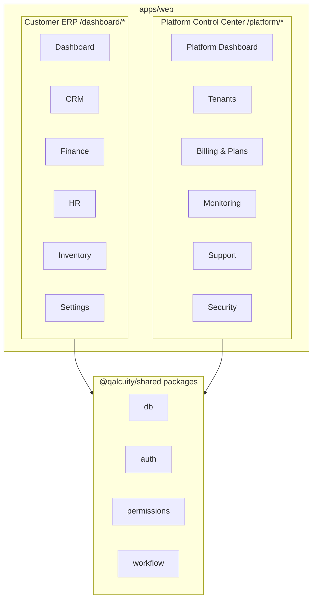
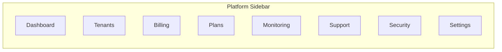
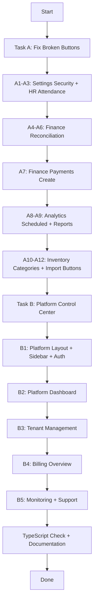

# Phase 14: Button Fixes + Platform Control Center (Superadmin Dashboard)

> **Tanggal:** 1 September 2026
> **Status:** Draft — Menunggu Approval
> **Referensi:** [`docs/ARCHITECTURE.md`](docs/ARCHITECTURE.md:1580) Section 23, [`docs/REMAINING-WORK.md`](docs/REMAINING-WORK.md:1727)

---

## 📋 Ringkasan

Dua task utama:
1. **Fix Broken Buttons** — 12 tombol di berbagai halaman tidak memiliki `onClick` handler
2. **Platform Control Center** — Dashboard superadmin terpisah dari customer ERP

---

## TASK A: Fix Broken Buttons (12 tombol)

### Daftar Tombol yang Rusak

| # | Halaman | Tombol | File | Fix Strategy |
|---|---------|--------|------|-------------|
| A1 | Settings > Security | "Aktifkan 2FA" | [`settings/security/page.tsx`](apps/web/app/dashboard/settings/security/page.tsx:255) | Implement 2FA toggle flow (enable/disable) |
| A2 | HR > Attendance | "Detail" (mobile) | [`hr/attendance/page.tsx`](apps/web/app/dashboard/hr/attendance/page.tsx:302) | Tambah modal detail kehadiran karyawan |
| A3 | HR > Attendance | "Detail" (desktop) | [`hr/attendance/page.tsx`](apps/web/app/dashboard/hr/attendance/page.tsx:356) | Sama dengan A2 — shared modal |
| A4 | Finance > Reconciliation | "Detail" (mobile) | [`finance/reconciliation/page.tsx`](apps/web/app/dashboard/finance/reconciliation/page.tsx:563) | Tambah modal detail transaksi bank |
| A5 | Finance > Reconciliation | "Detail" (desktop) | [`finance/reconciliation/page.tsx`](apps/web/app/dashboard/finance/reconciliation/page.tsx:676) | Sama dengan A4 — shared modal |
| A6 | Finance > Reconciliation | "Browse" file upload | [`finance/reconciliation/page.tsx`](apps/web/app/dashboard/finance/reconciliation/page.tsx:714) | Implement file input trigger |
| A7 | Finance > Payments | "Record Payment" (create) | [`finance/payments/page.tsx`](apps/web/app/dashboard/finance/payments/page.tsx:141) | Implement create payment modal/form |
| A8 | Analytics > Scheduled | "Create Scheduled Report" | [`analytics/scheduled/page.tsx`](apps/web/app/dashboard/analytics/scheduled/page.tsx:211) | Implement create scheduled report modal |
| A9 | Analytics > Reports | "Edit" & "Share" menu | [`analytics/reports/page.tsx`](apps/web/app/dashboard/analytics/reports/page.tsx:420) | Implement edit form + share dialog |
| A10 | Inventory > Categories | "MoreHorizontal" menu | [`inventory/categories/page.tsx`](apps/web/app/dashboard/inventory/categories/page.tsx:224) | Tambah dropdown menu (Edit, Hapus) |
| A11 | Inventory > Products | "Import" button | [`inventory/products/page.tsx`](apps/web/app/dashboard/inventory/products/page.tsx:315) | Implement file upload modal untuk import CSV/Excel |
| A12 | Finance > Accounts | "Import" button | [`finance/accounts/page.tsx`](apps/web/app/dashboard/finance/accounts/page.tsx:589) | Implement file upload modal untuk import CSV |

### Pendekatan Implementasi

Setiap fix mengikuti pola yang sudah ada di codebase:
- **State-driven modals** dengan `showXxxModal` state
- **Form validation** sebelum submit
- **API call** ke endpoint yang sesuai
- **Toast notification** untuk success/error
- **Loading state** dengan `Loader2` spinner

---

## TASK B: Platform Control Center (Superadmin Dashboard)

### Arsitektur

> **Keputusan:** Implement sebagai routes `/platform/*` dalam `apps/web` (bukan app terpisah `apps/platform-admin/`). Alasan:
> 1. Menghindari duplikasi config (Next.js, Tailwind, auth, dll)
> 2. Memanfaatkan shared packages yang sudah ada
> 3. Lebih cepat diimplementasi
> 4. Nanti bisa di-extract ke app terpisah jika diperlukan

### Route Structure

| Route | Description | Priority |
|-------|-------------|----------|
| `/platform` | Platform Dashboard — overview stats | P0 |
| `/platform/tenants` | Tenant List — semua tenant | P0 |
| `/platform/tenants/[id]` | Tenant Detail — single tenant | P0 |
| `/platform/billing` | Billing Overview — payments & subscriptions | P0 |
| `/platform/billing/plans` | Plan Management — CRUD plans | P1 |
| `/platform/monitoring` | System Health Dashboard | P1 |
| `/platform/support` | Support Tickets | P1 |
| `/platform/security` | Security Events & Audit | P2 |
| `/platform/settings` | Platform Settings | P2 |

### API Routes

| Route | Method | Description |
|-------|--------|-------------|
| `/api/platform/tenants` | GET | List all tenants with stats |
| `/api/platform/tenants/[id]` | GET | Tenant detail |
| `/api/platform/tenants/[id]` | PUT | Update tenant (suspend, reactivate) |
| `/api/platform/stats` | GET | Platform-wide statistics |
| `/api/platform/health` | GET | System health check |
| `/api/platform/billing` | GET | Billing overview |

### Sidebar Navigation

Sidebar khusus untuk `/platform/*` — terpisah dari sidebar customer ERP:

### Auth & RBAC

- Hanya user dengan role `SUPERADMIN` yang bisa akses `/platform/*`
- Middleware check: redirect ke `/dashboard` jika bukan SUPERADMIN
- Session check di setiap API route

### UI Design

Platform Dashboard menampilkan:
1. **Overview Stats**: Total tenants, MRR, active users, system health
2. **Tenant Table**: List semua tenant dengan status, plan, usage
3. **Recent Activity**: Aktivitas terbaru di platform
4. **System Health**: API latency, error rate, uptime

---

## Execution Order

### Phase Breakdown

| Phase | Description | Files |
|-------|-------------|-------|
| **14a** | Fix Settings Security 2FA button | `settings/security/page.tsx` |
| **14b** | Fix HR Attendance Detail buttons | `hr/attendance/page.tsx` |
| **14c** | Fix Finance Reconciliation Detail + Browse buttons | `finance/reconciliation/page.tsx` |
| **14d** | Fix Finance Payments Create button | `finance/payments/page.tsx` |
| **14e** | Fix Analytics Scheduled Create + Reports Edit/Share | `analytics/scheduled/page.tsx`, `analytics/reports/page.tsx` |
| **14f** | Fix Inventory Categories menu + Import buttons | `inventory/categories/page.tsx`, `inventory/products/page.tsx`, `finance/accounts/page.tsx` |
| **14g** | Platform Layout + Sidebar + Auth Middleware | `app/platform/layout.tsx`, `components/layout/platform-sidebar.tsx`, `middleware.ts` |
| **14h** | Platform Dashboard page | `app/platform/page.tsx` |
| **14i** | Platform Tenants Management | `app/platform/tenants/page.tsx`, `app/platform/tenants/[id]/page.tsx` |
| **14j** | Platform Billing Overview | `app/platform/billing/page.tsx` |
| **14k** | Platform Monitoring + Support + Security | `app/platform/monitoring/page.tsx`, `app/platform/support/page.tsx`, `app/platform/security/page.tsx` |
| **14l** | Platform API Routes | `app/api/platform/*/route.ts` |
| **14m** | TypeScript Check + Documentation Update | `CURRENT.md`, `FEATURES.md` |

---

## Open Questions

1. **2FA Implementation**: Apakah perlu integrasi TOTP provider (seperti `speakeasy`), atau cukup toggle UI placeholder dulu?
2. **Import CSV/Excel**: Apakah perlu library seperti `xlsx`/`papaparse`, atau cukup file input + parsing manual?
3. **Platform Monitoring**: Data dari mana? Apakah perlu new Prisma models untuk system health data?

> **Recommendation:** 
> - 2FA: Placeholder UI toggle (backend integration di phase berikutnya)
> - Import: Gunakan `papaparse` untuk CSV parsing (sudah ringan)
> - Monitoring: Mock data dulu, real integration di Phase 15
