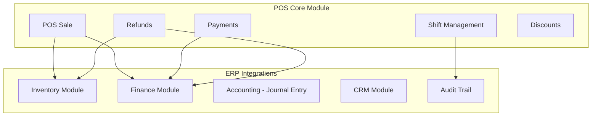
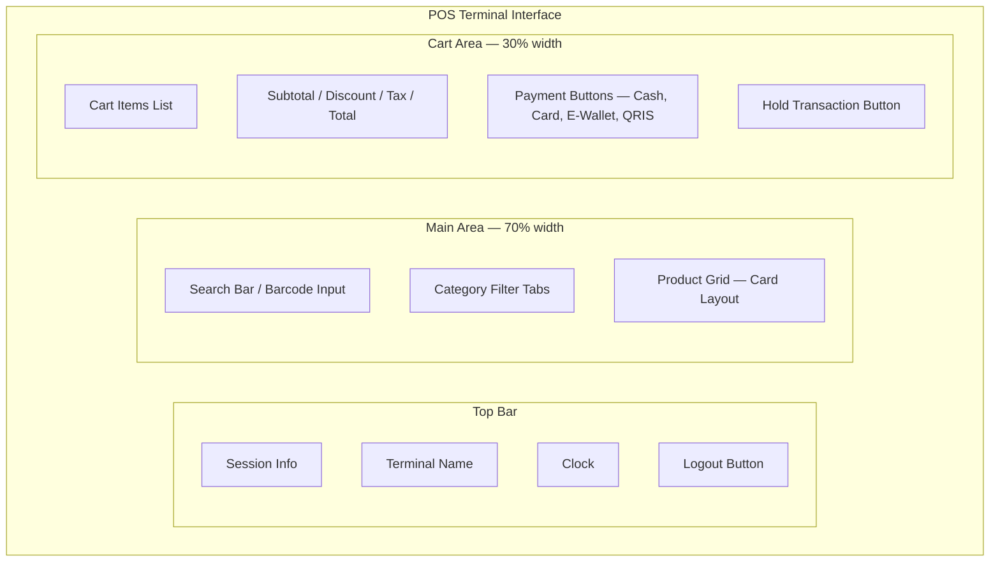

# 🛒 POS (Point of Sale) — Architecture & Implementation Plan

> **Qalcuity BOS — POS Module**
> Created: 4 September 2026
> Status: Architecture Plan — Ready for Implementation
> Ref: [`docs/ARCHITECTURE.md`](docs/ARCHITECTURE.md) Section 22, [`docs/REMAINING-WORK.md`](docs/REMAINING-WORK.md) POS Module

---

## 📋 Daftar Isi

1. [Overview](#1-overview)
2. [Database Schema — Prisma Models](#2-database-schema--prisma-models)
3. [API Routes Specification](#3-api-routes-specification)
4. [UI Pages — Page Structure & Wireframes](#4-ui-pages--page-structure--wireframes)
5. [Integration Points](#5-integration-points)
6. [Permission & RBAC](#6-permission--rbac)
7. [Implementation Phases](#7-implementation-phases)

---

## 1. Overview

### 1.1 Business Context

POS (Point of Sale) adalah **Core Module** yang terintegrasi langsung ke ERP Qalcuity. POS memungkinkan user melakukan transaksi penjualan langsung (retail/F&B) dengan fitur kasir, manajemen shift, multi metode pembayaran, dan integrasi otomatis ke modul Inventory, Finance, dan Accounting.

### 1.2 Architecture Position



### 1.3 Key Design Decisions

| Decision | Choice | Rationale |
|----------|--------|-----------|
| **Schema naming** | `PosSession`, `PosTransaction`, etc. | Consistent with existing naming: PascalCase, short prefix `Pos` |
| **Status enums** | String fields (not Prisma enums) | Follows existing pattern (Invoice.status uses String, not enum) |
| **Decimal types** | `@db.Decimal(19, 4)` for monetary | Matches existing Invoice/Payment patterns |
| **Multi-tenant** | `tenantId` on every model | Mandatory per AGENT.md Rule 7 |
| **Audit trail** | `createdBy` field + `logAudit()` | Follows existing audit pattern |
| **Numbering** | `POS-YYYY-{random}` format | Follows INV-{year}-{hash} pattern |

---

## 2. Database Schema — Prisma Models

### 2.1 Prisma Model Definitions

> **Catatan:** Tambahkan models berikut ke file [`packages/db/prisma/schema.prisma`](packages/db/prisma/schema.prisma) di section "POS MODULE" baru.

```prisma
// ============================================
// POS MODULE
// ============================================

model PosTerminal {
  id          String   @id @default(cuid())
  name        String                          // "Kasir 1", "Kasir Utama"
  code        String                          // "TERM-001"
  location    String?                         // "Lantai 1", "Food Court"
  status      String   @default("ACTIVE")     // ACTIVE, INACTIVE, MAINTENANCE
  isActive    Boolean  @default(true)
  createdAt   DateTime @default(now())
  updatedAt   DateTime @updatedAt

  tenantId    String
  tenant      Tenant   @relation(fields: [tenantId], references: [id])

  sessions    PosSession[]

  @@unique([code, tenantId])
  @@index([tenantId])
  @@index([tenantId, status])
}

model PosSession {
  id              String   @id @default(cuid())
  tenantId        String
  tenant          Tenant   @relation(fields: [tenantId], references: [id])
  terminalId      String
  terminal        PosTerminal @relation(fields: [terminalId], references: [id])
  cashierId       String                          // userId of cashier
  shiftNumber     Int      @default(1)
  startTime       DateTime @default(now())
  endTime         DateTime?
  status          String   @default("OPEN")       // OPEN, CLOSED
  openingCash     Decimal  @default(0) @db.Decimal(19, 4)
  closingCash     Decimal?  @db.Decimal(19, 4)
  expectedCash    Decimal?  @db.Decimal(19, 4)    // Calculated: openingCash + cashSales - cashRefunds
  variance        Decimal?  @db.Decimal(19, 4)    // closingCash - expectedCash
  totalSales      Decimal  @default(0) @db.Decimal(19, 4)
  totalRefunds    Decimal  @default(0) @db.Decimal(19, 4)
  totalDiscounts  Decimal  @default(0) @db.Decimal(19, 4)
  transactionCount Int     @default(0)
  notes           String?
  createdAt       DateTime @default(now())
  updatedAt       DateTime @updatedAt

  transactions    PosTransaction[]

  @@index([tenantId, status])
  @@index([tenantId, cashierId])
  @@index([tenantId, terminalId])
  @@index([tenantId, startTime])
}

model PosTransaction {
  id                String   @id @default(cuid())
  tenantId          String
  tenant            Tenant   @relation(fields: [tenantId], references: [id])
  sessionId         String
  session           PosSession @relation(fields: [sessionId], references: [id])
  transactionNumber String                          // "POS-2026-A1B2C3"
  customerId        String?                         // Optional contact reference
  customerName      String?                         // Snapshot for receipt
  subtotal          Decimal  @default(0) @db.Decimal(19, 4)
  discountAmount    Decimal  @default(0) @db.Decimal(19, 4)
  discountPercent   Decimal  @default(0) @db.Decimal(5, 2)
  taxRate           Decimal  @default(0) @db.Decimal(5, 2)
  taxAmount         Decimal  @default(0) @db.Decimal(19, 4)
  totalAmount       Decimal  @default(0) @db.Decimal(19, 4)
  status            String   @default("COMPLETED")   // COMPLETED, VOIDED, REFUNDED
  notes             String?
  createdBy         String                           // userId
  createdAt         DateTime @default(now())
  updatedAt         DateTime @updatedAt

  items             PosTransactionItem[]
  payments          PosPayment[]
  refunds           PosRefund[]

  @@unique([tenantId, transactionNumber])
  @@index([tenantId, sessionId])
  @@index([tenantId, createdAt])
  @@index([tenantId, customerId])
  @@index([tenantId, status])
}

model PosTransactionItem {
  id              String   @id @default(cuid())
  tenantId        String
  tenant          Tenant   @relation(fields: [tenantId], references: [id])
  transactionId   String
  transaction     PosTransaction @relation(fields: [transactionId], references: [id], onDelete: Cascade)
  productId       String
  productName     String                               // Snapshot for receipt
  productSku      String?                              // Snapshot for receipt
  quantity        Decimal  @default(1) @db.Decimal(10, 2)
  unitPrice       Decimal  @default(0) @db.Decimal(19, 4)
  costPrice       Decimal  @default(0) @db.Decimal(19, 4)  // Snapshot for profit calc
  discountPercent Decimal  @default(0) @db.Decimal(5, 2)
  discountAmount  Decimal  @default(0) @db.Decimal(19, 4)
  taxRate         Decimal  @default(0) @db.Decimal(5, 2)
  taxAmount       Decimal  @default(0) @db.Decimal(19, 4)
  lineTotal       Decimal  @default(0) @db.Decimal(19, 4)  // quantity * unitPrice - discount + tax
  createdAt       DateTime @default(now())

  @@index([tenantId, transactionId])
  @@index([tenantId, productId])
}

model PosPayment {
  id              String   @id @default(cuid())
  tenantId        String
  tenant          Tenant   @relation(fields: [tenantId], references: [id])
  transactionId   String
  transaction     PosTransaction @relation(fields: [transactionId], references: [id], onDelete: Cascade)
  method          String   @default("CASH")        // CASH, CREDIT_CARD, DEBIT_CARD, E_WALLET, QRIS, BANK_TRANSFER
  amount          Decimal  @default(0) @db.Decimal(19, 4)
  reference       String?                          // Card number last 4, e-wallet ref, etc.
  status          String   @default("COMPLETED")   // COMPLETED, PENDING, FAILED
  createdAt       DateTime @default(now())

  @@index([tenantId, transactionId])
  @@index([tenantId, method])
  @@index([tenantId, createdAt])
}

model PosRefund {
  id              String   @id @default(cuid())
  tenantId        String
  tenant          Tenant   @relation(fields: [tenantId], references: [id])
  transactionId   String
  transaction     PosTransaction @relation(fields: [transactionId], references: [id])
  refundNumber    String                           // "REF-2026-A1B2C3"
  amount          Decimal  @default(0) @db.Decimal(19, 4)
  reason          String
  status          String   @default("PENDING")     // PENDING, APPROVED, REJECTED, COMPLETED
  approvedBy      String?                          // userId of approver
  approvedAt      DateTime?
  createdBy       String                           // userId
  createdAt       DateTime @default(now())
  updatedAt       DateTime @updatedAt

  @@unique([tenantId, refundNumber])
  @@index([tenantId, transactionId])
  @@index([tenantId, status])
  @@index([tenantId, createdAt])
}
```

### 2.2 Tenant Model Updates

Tambahkan relasi berikut ke model `Tenant` yang sudah ada:

```prisma
// Tambahkan ke model Tenant:
posTerminals     PosTerminal[]
posSessions      PosSession[]
posTransactions  PosTransaction[]
posRefunds       PosRefund[]
```

### 2.3 Schema Summary

| Model | Fields | Indexes | Purpose |
|-------|--------|---------|---------|
| **PosTerminal** | 9 | `code+tenantId`, `tenantId`, `tenantId+status` | Terminal kasir |
| **PosSession** | 16 | `tenantId+status`, `tenantId+cashierId`, `tenantId+terminalId`, `tenantId+startTime` | Sesi shift |
| **PosTransaction** | 18 | `tenantId+transactionNumber`, `tenantId+sessionId`, `tenantId+createdAt`, `tenantId+customerId`, `tenantId+status` | Header transaksi |
| **PosTransactionItem** | 15 | `tenantId+transactionId`, `tenantId+productId` | Item transaksi |
| **PosPayment** | 8 | `tenantId+transactionId`, `tenantId+method`, `tenantId+createdAt` | Pembayaran |
| **PosRefund** | 12 | `tenantId+refundNumber`, `tenantId+transactionId`, `tenantId+status`, `tenantId+createdAt` | Refund |

### 2.4 Migration Steps

```bash
# 1. Generate migration
cd packages/db && npx prisma migrate dev --name add-pos-module

# 2. Generate Prisma Client
cd packages/db && npx prisma generate

# 3. Verify
npx tsc --noEmit
```

---

## 3. API Routes Specification

### 3.1 Route Map

| Method | Endpoint | Description | Auth | Permission |
|--------|----------|-------------|------|------------|
| **POST** | `/api/pos/terminals` | Buat terminal baru | `requirePermissionForRoute` | `pos.terminal` |
| **GET** | `/api/pos/terminals` | List semua terminal | `requirePermissionForRoute` | `pos.terminal` |
| **PUT** | `/api/pos/terminals/[id]` | Update terminal | `requirePermissionForRoute` | `pos.terminal` |
| **POST** | `/api/pos/sessions` | Buka sesi shift | `requirePermissionForRoute` | `pos.session` |
| **GET** | `/api/pos/sessions` | List sesi shift | `requirePermissionForRoute` | `pos.session` |
| **GET** | `/api/pos/sessions/[id]` | Detail sesi shift | `requirePermissionForRoute` | `pos.session` |
| **PUT** | `/api/pos/sessions/[id]/close` | Tutup sesi shift | `requirePermissionForRoute` | `pos.session` |
| **POST** | `/api/pos/transactions` | Buat transaksi baru | `requirePermissionForRoute` | `pos.transaction` |
| **GET** | `/api/pos/transactions` | List transaksi | `requirePermissionForRoute` | `pos.transaction` |
| **GET** | `/api/pos/transactions/[id]` | Detail transaksi | `requirePermissionForRoute` | `pos.transaction` |
| **PUT** | `/api/pos/transactions/[id]/void` | Void transaksi | `requirePermissionForRoute` | `pos.transaction` |
| **POST** | `/api/pos/refunds` | Buat refund | `requirePermissionForRoute` | `pos.refund` |
| **GET** | `/api/pos/refunds` | List refund | `requirePermissionForRoute` | `pos.refund` |
| **PUT** | `/api/pos/refunds/[id]/approve` | Approve refund | `requirePermissionForRoute` | `pos.refund` |
| **GET** | `/api/pos/dashboard` | Dashboard summary | `requirePermissionForRoute` | `pos.dashboard` |
| **GET** | `/api/pos/products` | Produk untuk POS | `requirePermissionForRoute` | `pos.product` |

### 3.2 Route Permission Mapping

Tambahkan ke [`apps/web/lib/route-permissions.ts`](apps/web/lib/route-permissions.ts):

```typescript
// ─── POS Module ────────────────────────────────────────────────────────────
'/api/pos/terminals': { permission: 'pos.terminal', fallbackRole: 'ADMIN' },
'/api/pos/sessions': { permission: 'pos.session', fallbackRole: 'ADMIN' },
'/api/pos/transactions': { permission: 'pos.transaction', fallbackRole: 'ADMIN' },
'/api/pos/refunds': { permission: 'pos.refund', fallbackRole: 'ADMIN' },
'/api/pos/dashboard': { permission: 'pos.dashboard', fallbackRole: 'ADMIN' },
'/api/pos/products': { permission: 'pos.product', fallbackRole: 'MEMBER' },
```

### 3.3 Zod Validation Schemas

Tambahkan ke [`apps/web/lib/validation-schemas.ts`](apps/web/lib/validation-schemas.ts):

```typescript
// ============================================
// POS Schemas
// ============================================

export const createPosTerminalSchema = z.object({
    name: z.string().min(1, 'Nama terminal wajib diisi').max(100),
    code: z.string().min(1, 'Kode terminal wajib diisi').max(50),
    location: z.string().max(255).optional().nullable(),
});

export const updatePosTerminalSchema = z.object({
    name: z.string().min(1).max(100).optional(),
    code: z.string().min(1).max(50).optional(),
    location: z.string().max(255).optional().nullable(),
    status: z.enum(['ACTIVE', 'INACTIVE', 'MAINTENANCE']).optional(),
    isActive: z.boolean().optional(),
});

export const openPosSessionSchema = z.object({
    terminalId: z.string().min(1, 'Terminal wajib dipilih'),
    openingCash: z.number().min(0, 'Saldo awal tidak boleh negatif'),
});

export const closePosSessionSchema = z.object({
    closingCash: z.number().min(0, 'Saldo akhir tidak boleh negatif'),
    notes: z.string().optional().nullable(),
});

const posTransactionItemSchema = z.object({
    productId: z.string().min(1, 'Produk wajib dipilih'),
    quantity: z.number().positive('Jumlah harus lebih dari 0'),
    unitPrice: z.number().min(0, 'Harga satuan tidak boleh negatif'),
    discountPercent: z.number().min(0).max(100).optional(),
    discountAmount: z.number().min(0).optional(),
});

export const createPosTransactionSchema = z.object({
    sessionId: z.string().min(1, 'Sesi kasir wajib dipilih'),
    customerId: z.string().optional().nullable(),
    customerName: z.string().max(255).optional().nullable(),
    items: z.array(posTransactionItemSchema).min(1, 'Minimal 1 item wajib diisi'),
    discountPercent: z.number().min(0).max(100).optional(),
    discountAmount: z.number().min(0).optional(),
    taxRate: z.number().min(0).max(100).optional(),
    payments: z.array(z.object({
        method: z.enum(['CASH', 'CREDIT_CARD', 'DEBIT_CARD', 'E_WALLET', 'QRIS', 'BANK_TRANSFER']),
        amount: z.number().positive('Jumlah pembayaran harus lebih dari 0'),
        reference: z.string().max(255).optional().nullable(),
    })).min(1, 'Minimal 1 metode pembayaran'),
    notes: z.string().optional().nullable(),
});

export const voidPosTransactionSchema = z.object({
    reason: z.string().min(1, 'Alasan void wajib diisi').max(500),
});

export const createPosRefundSchema = z.object({
    transactionId: z.string().min(1, 'Transaksi wajib dipilih'),
    amount: z.number().positive('Jumlah refund harus lebih dari 0'),
    reason: z.string().min(1, 'Alasan refund wajib diisi').max(500),
});
```

### 3.4 API Route Implementation Details

#### 3.4.1 `POST /api/pos/sessions` — Buka Sesi

```typescript
// Flow:
// 1. Validate: terminalId, openingCash
// 2. Check terminal exists and is ACTIVE
// 3. Check no existing OPEN session for this terminal
// 4. Auto-increment shiftNumber from last session for this terminal
// 5. Create PosSession with status OPEN
// 6. Log audit
```

#### 3.4.2 `PUT /api/pos/sessions/[id]/close` — Tutup Sesi

```typescript
// Flow:
// 1. Validate: closingCash
// 2. Find session, verify status === OPEN
// 3. Calculate expectedCash from transactions
// 4. Calculate variance = closingCash - expectedCash
// 5. Update session: status CLOSED, closingCash, expectedCash, variance, endTime
// 6. Log audit
```

#### 3.4.3 `POST /api/pos/transactions` — Buat Transaksi

```typescript
// Flow (inside prisma.$transaction):
// 1. Validate session exists, status OPEN, belongs to tenant
// 2. Validate all products exist, have sufficient stock
// 3. Generate transactionNumber: POS-{year}-{random}
// 4. Calculate line totals per item
// 5. Calculate subtotal, discount, tax, totalAmount
// 6. Validate payments cover totalAmount
// 7. Create PosTransaction + PosTransactionItem + PosPayment
// 8. Deduct stock: create StockMovement type OUT for each product
// 9. Update session totals: totalSales, transactionCount, totalDiscounts
// 10. Log audit
```

#### 3.4.4 `GET /api/pos/dashboard` — Dashboard Summary

```typescript
// Response shape:
{
  today: {
    totalSales: number,
    transactionCount: number,
    averageTransaction: number,
    topProducts: Array<{ name, quantity, revenue }>,
    paymentMethodBreakdown: Array<{ method, count, total }>,
    hourlySales: Array<{ hour, total }>,
  },
  currentSession: PosSession | null,
  recentTransactions: PosTransaction[],
}
```

#### 3.4.5 `GET /api/pos/products` — Produk untuk POS

```typescript
// Flow:
// 1. Query Product where tenantId, isActive=true, stock > 0
// 2. Support search by name/SKU
// 3. Support filter by categoryId
// 4. Return: id, sku, name, price, stock, unit, categoryName, imageUrl
```

### 3.5 File Structure — API Routes

```
apps/web/app/api/pos/
├── terminals/
│   ├── route.ts              # GET list, POST create
│   └── [id]/
│       └── route.ts          # PUT update
├── sessions/
│   ├── route.ts              # GET list, POST open
│   └── [id]/
│       ├── route.ts          # GET detail
│       └── close/
│           └── route.ts      # PUT close
├── transactions/
│   ├── route.ts              # GET list, POST create
│   └── [id]/
│       ├── route.ts          # GET detail
│       └── void/
│           └── route.ts      # PUT void
├── refunds/
│   ├── route.ts              # GET list, POST create
│   └── [id]/
│       └── approve/
│           └── route.ts      # PUT approve
├── dashboard/
│   └── route.ts              # GET summary
└── products/
    └── route.ts              # GET products for POS
```

---

## 4. UI Pages — Page Structure & Wireframes

### 4.1 Page Map

| Route | Page | Description |
|-------|------|-------------|
| `/dashboard/pos` | POS Overview | Dashboard summary + quick actions |
| `/dashboard/pos/terminal` | POS Terminal | **Main cashier interface** — product grid, cart, payment |
| `/dashboard/pos/sessions` | POS Sessions | Riwayat sesi shift kasir |
| `/dashboard/pos/transactions` | POS Transactions | Riwayat semua transaksi |
| `/dashboard/pos/refunds` | POS Refunds | Riwayat refund/retur |
| `/dashboard/pos/terminals` | POS Terminals | Manajemen terminal kasir |
| `/dashboard/pos/reports` | POS Reports | Laporan penjualan POS |

### 4.2 Sidebar Navigation

Tambahkan menu POS ke [`apps/web/components/layout/sidebar.tsx`](apps/web/components/layout/sidebar.tsx):

```typescript
{
    label: t("nav.pos") || "POS",
    href: "/dashboard/pos",
    icon: "ShoppingCart",
    permission: "pos.view",
    children: [
        { label: t("nav.overview") || "Overview", href: "/dashboard/pos" },
        { label: t("nav.terminal") || "Terminal", href: "/dashboard/pos/terminal" },
        { label: t("nav.sessions") || "Sessions", href: "/dashboard/pos/sessions" },
        { label: t("nav.transactions") || "Transactions", href: "/dashboard/pos/transactions" },
        { label: t("nav.refunds") || "Refunds", href: "/dashboard/pos/refunds" },
        { label: t("nav.terminals") || "Terminals", href: "/dashboard/pos/terminals" },
        { label: t("nav.reports") || "Reports", href: "/dashboard/pos/reports" },
    ],
},
```

### 4.3 Page Details

#### 4.3.1 POS Terminal — Main Cashier Interface (`/dashboard/pos/terminal`)

> **Ini adalah halaman utama POS — interface kasir yang optimal untuk touchscreen.**

**Layout:** Full-width, no sidebar (dedicated POS mode)



**Wireframe Description:**

```
┌──────────────────────────────────────────────────────────────────┐
│ 🛒 POS Terminal    Terminal: Kasir 1    🕐 14:32    👤 Budi    │
├───────────────────────────────────┬──────────────────────────────┤
│ 🔍 [Search product or scan...]   │ 🛍️ Cart (3 items)           │
│ [All] [Food] [Drink] [Snack]     │                              │
│                                   │ ┌──────────────────────────┐ │
│ ┌─────┐ ┌─────┐ ┌─────┐ ┌─────┐ │ │ Coffee    2 x 25.00  50 │ │
│ │ ☕  │ │ 🍕  │ │ 🥤  │ │ 🍪  │ │ │ Pizza     1 x 45.00  45 │ │
│ │Coff.│ │Pizz.│ │Cola │ │Cook.│ │ │ Cookie    3 x 12.00  36 │ │
│ │25K  │ │45K  │ │15K  │ │12K  │ │ └──────────────────────────┘ │
│ │stk: │ │stk: │ │stk: │ │stk: │ │                              │
│ │ 45  │ │ 12  │ │ 30  │ │ 20  │ │ Subtotal:          Rp 131.00 │
│ └─────┘ └─────┘ └─────┘ └─────┘ │ Discount (10%):   - Rp 13.10 │
│                                   │ Tax (11%):        + Rp 12.98 │
│ ┌─────┐ ┌─────┐ ┌─────┐ ┌─────┐ │ ──────────────────────────── │
│ │ ... │ │ ... │ │ ... │ │ ... │ │ TOTAL:            Rp 130.88  │
│ └─────┘ └─────┘ └─────┘ └─────┘ │                              │
│                                   │ [💵 Cash] [💳 Card] [📱 QR] │
│                                   │ [📥 Hold] [🔄 Clear]        │
└───────────────────────────────────┴──────────────────────────────┘
```

**Key Components:**

| Component | Description |
|-----------|-------------|
| `PosProductGrid` | Grid produk dengan search, filter kategori, card layout |
| `PosCart` | Keranjang belanja dengan quantity adjust, remove item |
| `PosPaymentBar` | Tombol metode pembayaran (Cash, Card, E-Wallet, QRIS) |
| `PosPaymentModal` | Modal pembayaran — input jumlah bayar, hitung kembalian |
| `PosReceiptPreview` | Preview struk sebelum cetak |
| `PosSessionBar` | Info sesi aktif, tombol tutup sesi |

**Payment Flow:**

```
1. User pilih metode pembayaran → buka PosPaymentModal
2. Input jumlah bayar (auto-fill untuk cash = total)
3. Hitung kembalian (cash) atau input referensi (card/e-wallet)
4. Konfirmasi → POST /api/pos/transactions
5. Tampilkan receipt → opsi cetak
6. Reset cart → siap transaksi berikutnya
```

#### 4.3.2 POS Overview (`/dashboard/pos`)

**Wireframe Description:**

```
┌──────────────────────────────────────────────────────────────────┐
│ POS Overview                                                     │
├──────────────────────────────────────────────────────────────────┤
│                                                                  │
│ ┌──────────┐ ┌──────────┐ ┌──────────┐ ┌──────────┐            │
│ │ 💰       │ │ 🧾       │ │ 📊       │ │ 🔄       │            │
│ │ Total    │ │ Trans-   │ │ Average  │ │ Active   │            │
│ │ Sales    │ │ actions  │ │ Value    │ │ Session  │            │
│ │ 12.5M    │ │ 85       │ │ 147K     │ │ Yes      │            │
│ └──────────┘ └──────────┘ └──────────┘ └──────────┘            │
│                                                                  │
│ ┌────────────────────────────┐ ┌────────────────────────────┐   │
│ │ ⏰ Hourly Sales Chart      │ │ 🏆 Top Products Today      │   │
│ │ [Bar chart: 8am-8pm]       │ │ 1. Coffee — 45 units       │   │
│ │                             │ │ 2. Pizza — 32 units        │   │
│ │                             │ │ 3. Cola — 28 units         │   │
│ └────────────────────────────┘ └────────────────────────────┘   │
│                                                                  │
│ ┌────────────────────────────┐ ┌────────────────────────────┐   │
│ │ 💳 Payment Methods         │ │ 🕐 Recent Transactions     │   │
│ │ Cash: 45 (5.2M)           │ │ POS-2026-A1B2 — 14:32     │   │
│ │ Card: 25 (3.8M)           │ │ POS-2026-A1B3 — 14:28     │   │
│ │ QRIS: 15 (3.5M)           │ │ POS-2026-A1B4 — 14:15     │   │
│ └────────────────────────────┘ └────────────────────────────┘   │
└──────────────────────────────────────────────────────────────────┘
```

#### 4.3.3 POS Sessions (`/dashboard/pos/sessions`)

Follows existing list page pattern (dual layout: desktop table + mobile cards).

**Table Columns:**

| Column | Description |
|--------|-------------|
| Shift # | Nomor shift |
| Terminal | Nama terminal |
| Cashier | Nama kasir |
| Open Time | Waktu buka |
| Close Time | Waktu tutup |
| Status | OPEN / CLOSED (badge) |
| Total Sales | Total penjualan |
| Transactions | Jumlah transaksi |
| Variance | Selisih cash |

#### 4.3.4 POS Transactions (`/dashboard/pos/transactions`)

**Table Columns:**

| Column | Description |
|--------|-------------|
| Transaction # | Nomor transaksi |
| Date & Time | Waktu transaksi |
| Cashier | Nama kasir |
| Items | Jumlah item |
| Subtotal | Subtotal |
| Discount | Diskon |
| Tax | Pajak |
| Total | Total bayar |
| Payment | Metode bayar |
| Status | COMPLETED / VOIDED |

#### 4.3.5 POS Terminals (`/dashboard/pos/terminals`)

**Table Columns:**

| Column | Description |
|--------|-------------|
| Code | Kode terminal |
| Name | Nama terminal |
| Location | Lokasi |
| Status | ACTIVE / INACTIVE / MAINTENANCE |
| Current Session | Sesi aktif (jika ada) |
| Actions | Edit, Toggle Active |

#### 4.3.6 POS Reports (`/dashboard/pos/reports`)

**Report Sections:**

| Report | Description |
|--------|-------------|
| **Daily Summary** | Total sales, transactions, items sold, avg transaction |
| **Payment Breakdown** | Sales by payment method |
| **Product Performance** | Top selling products by quantity and revenue |
| **Hourly Analysis** | Sales distribution by hour |
| **Cashier Performance** | Sales per cashier |
| **Refund Summary** | Total refunds, reasons |
| **Date Range Picker** | Filter by date range |

### 4.4 File Structure — UI Pages

```
apps/web/app/dashboard/pos/
├── page.tsx                          # POS Overview
├── loading.tsx                       # Loading skeleton
├── error.tsx                         # Error boundary
├── layout.tsx                        # POS layout
├── terminal/
│   └── page.tsx                      # Main POS Terminal
├── sessions/
│   ├── page.tsx                      # Sessions list
│   └── loading.tsx
├── transactions/
│   ├── page.tsx                      # Transactions list
│   ├── loading.tsx
│   └── [id]/
│       ├── page.tsx                  # Transaction detail
│       └── loading.tsx
├── refunds/
│   ├── page.tsx                      # Refunds list
│   └── loading.tsx
├── terminals/
│   ├── page.tsx                      # Terminals management
│   └── loading.tsx
└── reports/
    └── page.tsx                      # POS Reports

apps/web/components/pos/
├── pos-product-grid.tsx              # Product grid with search/filter
├── pos-cart.tsx                      # Shopping cart component
├── pos-payment-modal.tsx             # Payment modal
├── pos-receipt.tsx                   # Receipt template
├── pos-session-bar.tsx               # Active session indicator
└── pos-summary-cards.tsx             # Dashboard summary cards
```

---

## 5. Integration Points

### 5.1 Inventory Integration

| Action | Effect |
|--------|--------|
| **POS Transaction** | Deduct stock via `StockMovement` type `OUT` |
| **POS Refund** | Restore stock via `StockMovement` type `IN` |
| **Stock Check** | POS validates stock > 0 before adding to cart |

```typescript
// Stock deduction flow (inside PosTransaction creation):
for (const item of transaction.items) {
    await tx.stockMovement.create({
        data: {
            type: 'OUT',
            quantity: item.quantity,
            reference: transaction.transactionNumber,
            notes: `POS Sale - ${transaction.transactionNumber}`,
            productId: item.productId,
            tenantId,
        }
    });
    await tx.product.update({
        where: { id: item.productId },
        data: { stock: { decrement: item.quantity } }
    });
}
```

### 5.2 Finance Integration

| Action | Effect |
|--------|--------|
| **POS Payment** | Record payment in Finance (optional: create Invoice + Payment automatically) |
| **POS Refund** | Create refund entry in Finance |
| **Journal Entry** | Auto-create journal entry for revenue recognition |

> **Phase 1:** POS transactions are self-contained (not auto-creating Finance invoices).
> **Phase 2:** Auto-create Invoice + Payment in Finance for accounting reconciliation.

### 5.3 Audit Trail Integration

```typescript
// Every POS mutation logs audit:
void logAudit({
    userId, tenantId,
    action: 'CREATE',      // CREATE, UPDATE, DELETE, VOID
    entity: 'PosTransaction',
    entityId: transaction.id,
    newValues: { ... },
    request,
});
```

### 5.4 CRM Integration (Phase 2)

- Optional `customerId` on PosTransaction → links to Contact
- Track customer purchase history
- Enable loyalty points (future)

---

## 6. Permission & RBAC

### 6.1 Permission Definitions

```typescript
// POS Permissions — add to @qalcuity/permissions package
const POS_PERMISSIONS = {
    // Terminal Management
    'pos.terminal': ['view', 'create', 'update', 'delete'],

    // Session Management
    'pos.session': ['view', 'create', 'close'],

    // Transaction Management
    'pos.transaction': ['view', 'create', 'void'],

    // Refund Management
    'pos.refund': ['view', 'create', 'approve'],

    // Dashboard & Reports
    'pos.dashboard': ['view'],
    'pos.report': ['view'],

    // Product Access
    'pos.product': ['view'],

    // Discount Override
    'pos.discount.override': ['up_to_10', 'unlimited'],
};
```

### 6.2 Default Role Mapping

| Role | Permissions |
|------|-------------|
| **ADMIN** | All POS permissions |
| **MEMBER** | `pos.transaction:create`, `pos.session:create`, `pos.product:view`, `pos.dashboard:view` |
| **VIEWER** | `pos.dashboard:view`, `pos.transaction:view`, `pos.session:view` |

### 6.3 POS-Specific Guards

| Rule | Description |
|------|-------------|
| **Cashier** | Can create transactions, receive payments. Cannot void or refund. |
| **Supervisor** | Can void transactions, create refunds. Discount override up to 10%. |
| **Manager** | Can approve refunds, close shifts, change prices, full discount override. |

---

## 7. Implementation Phases

### Phase 1: Core POS (Foundation)

> **Milestone: Kasir bisa buka sesi, transaksi, bayar, tutup sesi.**

| Step | Task | Files |
|------|------|-------|
| 1.1 | Prisma schema: tambah 6 models POS | [`packages/db/prisma/schema.prisma`](packages/db/prisma/schema.prisma) |
| 1.2 | Prisma migration + generate | `packages/db/` |
| 1.3 | Zod schemas: 6 schemas POS | [`apps/web/lib/validation-schemas.ts`](apps/web/lib/validation-schemas.ts) |
| 1.4 | Route permissions: 6 entries | [`apps/web/lib/route-permissions.ts`](apps/web/lib/route-permissions.ts) |
| 1.5 | API: `POST /api/pos/terminals`, `GET /api/pos/terminals` | `apps/web/app/api/pos/terminals/route.ts` |
| 1.6 | API: `POST /api/pos/sessions`, `GET /api/pos/sessions` | `apps/web/app/api/pos/sessions/route.ts` |
| 1.7 | API: `GET /api/pos/sessions/[id]`, `PUT /api/pos/sessions/[id]/close` | `apps/web/app/api/pos/sessions/[id]/` |
| 1.8 | API: `GET /api/pos/products` | `apps/web/app/api/pos/products/route.ts` |
| 1.9 | API: `POST /api/pos/transactions`, `GET /api/pos/transactions` | `apps/web/app/api/pos/transactions/route.ts` |
| 1.10 | API: `GET /api/pos/transactions/[id]` | `apps/web/app/api/pos/transactions/[id]/route.ts` |
| 1.11 | UI: POS Terminal page (product grid + cart + payment) | `apps/web/app/dashboard/pos/terminal/page.tsx` |
| 1.12 | UI: POS Components (ProductGrid, Cart, PaymentModal) | `apps/web/components/pos/` |
| 1.13 | Sidebar: tambah menu POS | [`apps/web/components/layout/sidebar.tsx`](apps/web/components/layout/sidebar.tsx) |
| 1.14 | i18n: tambah keys POS | `apps/web/messages/id.json`, `apps/web/messages/en.json` |
| 1.15 | Loading states + error boundaries | `apps/web/app/dashboard/pos/*/loading.tsx` |
| 1.16 | TypeScript check: `npx tsc --noEmit` | — |
| 1.17 | Update docs: [`CURRENT.md`](CURRENT.md), [`FEATURES.md`](FEATURES.md) | — |

### Phase 2: Advanced POS

> **Milestone: Void, refund, reports, closing, multi-payment.**

| Step | Task | Files |
|------|------|-------|
| 2.1 | API: `PUT /api/pos/transactions/[id]/void` | `apps/web/app/api/pos/transactions/[id]/void/route.ts` |
| 2.2 | API: `POST /api/pos/refunds`, `GET /api/pos/refunds` | `apps/web/app/api/pos/refunds/route.ts` |
| 2.3 | API: `PUT /api/pos/refunds/[id]/approve` | `apps/web/app/api/pos/refunds/[id]/approve/route.ts` |
| 2.4 | API: `PUT /api/pos/terminals/[id]` | `apps/web/app/api/pos/terminals/[id]/route.ts` |
| 2.5 | API: `GET /api/pos/dashboard` | `apps/web/app/api/pos/dashboard/route.ts` |
| 2.6 | UI: POS Sessions list page | `apps/web/app/dashboard/pos/sessions/page.tsx` |
| 2.7 | UI: POS Transactions list page | `apps/web/app/dashboard/pos/transactions/page.tsx` |
| 2.8 | UI: POS Transaction detail page | `apps/web/app/dashboard/pos/transactions/[id]/page.tsx` |
| 2.9 | UI: POS Refunds list page | `apps/web/app/dashboard/pos/refunds/page.tsx` |
| 2.10 | UI: POS Terminals management page | `apps/web/app/dashboard/pos/terminals/page.tsx` |
| 2.11 | UI: POS Reports page | `apps/web/app/dashboard/pos/reports/page.tsx` |
| 2.12 | UI: POS Overview dashboard | `apps/web/app/dashboard/pos/page.tsx` |
| 2.13 | Receipt template component | `apps/web/components/pos/pos-receipt.tsx` |
| 2.14 | Session closing flow with variance calculation | — |

### Phase 3: Integration & Polish

> **Milestone: Full ERP integration, multi-payment, barcode scanning.**

| Step | Task |
|------|------|
| 3.1 | Finance integration: auto-create Invoice + Payment |
| 3.2 | Journal Entry integration: revenue recognition |
| 3.3 | Barcode scanner support (WebUSB / camera) |
| 3.4 | Multi-payment (split payment: cash + card) |
| 3.5 | Discount rules engine (percentage, nominal, BOGO) |
| 3.6 | Receipt printing (thermal printer API) |
| 3.7 | POS Closing with approval workflow |
| 3.8 | Industry configuration for POS flows |
| 3.9 | Performance optimization (product cache, lazy loading) |
| 3.10 | E2E testing |

### Phase 4: Advanced Features

> **Milestone: Offline mode, multi-terminal, analytics.**

| Step | Task |
|------|------|
| 4.1 | Offline mode (IndexedDB + background sync) |
| 4.2 | Multi-terminal management dashboard |
| 4.3 | Real-time sync between terminals |
| 4.4 | Customer display integration |
| 4.5 | Kitchen display (F&B) |
| 4.6 | Table management (F&B) |
| 4.7 | Loyalty points program |
| 4.8 | POS analytics & insights |
| 4.9 | Mobile POS (tablet-optimized) |

---

## 📊 Summary

### File Count Estimate

| Category | Files | Notes |
|----------|-------|-------|
| **Prisma schema** | 1 | Extended with 6 models |
| **API routes** | 16 | 8 route files (GET/POST/PUT per file) |
| **UI pages** | 12 | 7 pages + 5 loading states |
| **Components** | 6 | POS-specific components |
| **Validation schemas** | 1 | Extended with 6 schemas |
| **Route permissions** | 1 | Extended with 6 entries |
| **Sidebar** | 1 | Extended with POS menu |
| **i18n** | 2 | EN + ID messages |
| **Documentation** | 3 | CURRENT.md, FEATURES.md, this plan |
| **TOTAL** | ~43 | Files to create/modify |

### Key Risks & Mitigations

| Risk | Mitigation |
|------|------------|
| **Stock race condition** | Use `prisma.$transaction` with atomic decrement |
| **Concurrent payments** | Idempotency key per transaction |
| **Offline sync conflicts** | Last-write-win + manual resolution UI |
| **Receipt printing** | Browser print API as fallback, thermal printer as enhancement |
| **Multi-terminal conflicts** | Each terminal has own session, no shared state |

---

**Next Steps:** Review this plan, then switch to Code mode to begin Phase 1 implementation starting with Step 1.1 (Prisma schema).
