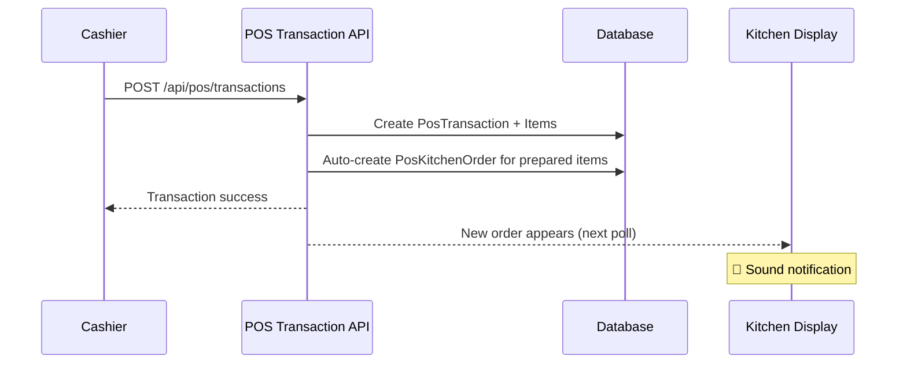
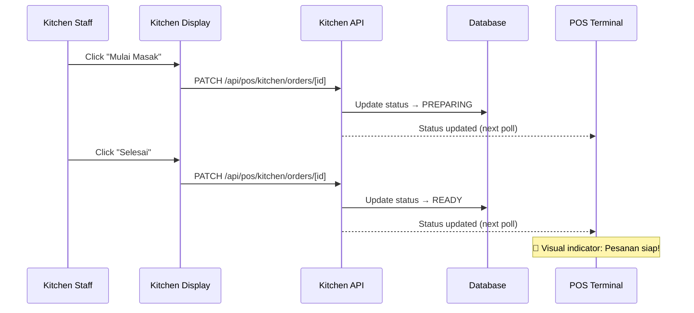
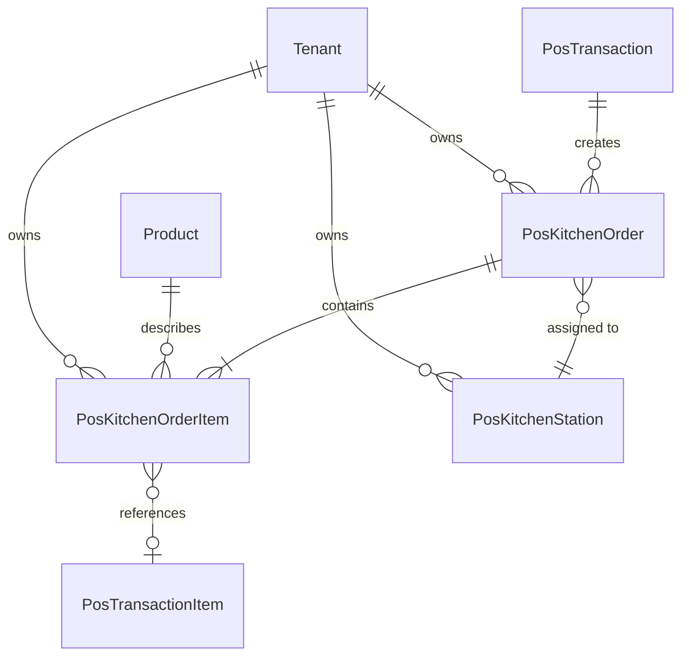
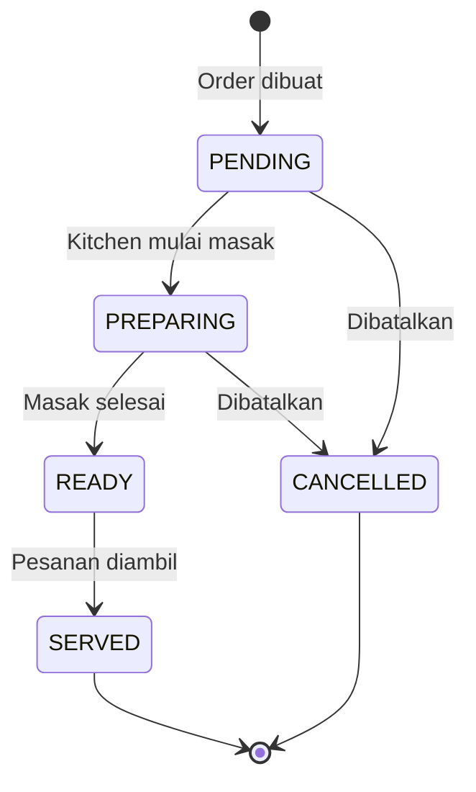
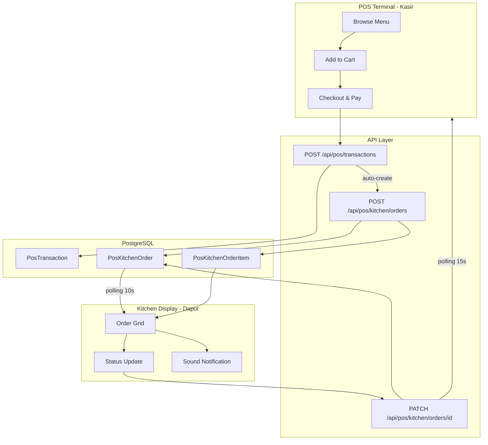

# 🍳 Kitchen Display System — Arsitektur

> **Qalcuity BOS — POS Module**
> Created: 5 September 2026
> Status: Architecture Plan — Ready for Implementation
> Ref: [`plans/pos-offline-mode-architecture.md`](plans/pos-offline-mode-architecture.md), [`AGENT.md`](AGENT.md) Section 15

---

## 📋 Daftar Isi

1. [Overview](#1-overview)
2. [Current State Analysis](#2-current-state-analysis)
3. [Database Design](#3-database-design)
4. [API Routes Spec](#4-api-routes-spec)
5. [UI Pages Spec](#5-ui-pages-spec)
6. [Integration Flow](#6-integration-flow)
7. [Real-time Strategy](#7-real-time-strategy)
8. [Sound Notification](#8-sound-notification)
9. [RBAC & Multi-tenant](#9-rbac--multi-tenant)
10. [File Structure](#10-file-structure)
11. [Implementation Phases](#11-implementation-phases)
12. [Mermaid Diagrams](#12-mermaid-diagrams)

---

## 1. Overview

### 1.1 Business Context

Kitchen Display System adalah layar tampilan di dapur/masak yang menampilkan antrian pesanan secara real-time. Alur kerja:

```
Kasir buat transaksi → Item pesanan muncul di layar dapur → Staf dapur memproses → Menandai selesai → Kasir tahu pesanan siap diambil
```

### 1.2 Goals

| Goal | Description |
|------|-------------|
| **Real-time Visibility** | Pesanan muncul instan di layar dapur |
| **Order Tracking** | Status pesanan terpantau dari kasir |
| **Efficiency** | Kurangi waktu komunikasi kasir-dapur |
| **Configurable** | Station dan workflow bisa dikonfigurasi per tenant |
| **Multi-station** | Mendukung beberapa stasiun dapur |

### 1.3 Scope

| In Scope | Out of Scope |
|----------|-------------|
| Kitchen order creation dari transaksi | Production planning |
| Status tracking: PENDING → PREPARING → READY → SERVED | Inventory deduction otomatis |
| Kitchen station management | Employee scheduling |
| Auto-refresh real-time | Mobile push notifications |
| Sound notification order baru | Barcode/QR scanning di dapur |
| Timer dan overdue detection | Recipe management |
| Priority & special notes | Multi-kitchen location |

---

## 2. Current State Analysis

### 2.1 Model POS yang Sudah Ada

| Model | Fields Relevan | Keterangan |
|-------|---------------|------------|
| [`Product`](packages/db/prisma/schema.prisma:545) | `id`, `name`, `sku`, `categoryId` | **Tidak ada** `preparationTime` — perlu ditambahkan |
| [`Category`](packages/db/prisma/schema.prisma:506) | `id`, `name` | Bisa dipakai untuk filtering menu di KDS |
| [`PosTransaction`](packages/db/prisma/schema.prisma:1877) | `id`, `transactionNo`, `status`, `customerName`, `notes` | **Belum ada** relasi ke kitchen order |
| [`PosTransactionItem`](packages/db/prisma/schema.prisma:1912) | `id`, `productId`, `productName`, `quantity`, `notes` | Snapshot item — **belum ada** `itemNotes` untuk instruksi khusus |

### 2.2 Temuan Penting

1. **Product tidak punya `preparationTime`** — Perlu ditambahkan untuk estimasi waktu masak
2. **PosTransactionItem tidak punya field notes** — Perlu untuk instruksi khusus per item (e.g., "tidak pedas", "extra keju")
3. **Tidak ada model kitchen** — Harus buat baru
4. **Tidak ada kode KDS existing** — Fresh implementation
5. **Route permissions belum ada POS-specific entries** — Perlu ditambahkan

---

## 3. Database Design

### 3.1 Keputusan Desain

**Pendekatan: Model Terpisah (Separate Models)**

Alasan memilih model baru daripada extend model existing:
- **Separation of concerns** — Kitchen lifecycle terpisah dari payment lifecycle
- **Independensi** — Order bisa masuk dapur sebelum bayar (dine-in) atau sesudah bayar (takeaway)
- **Fleksibilitas** — Mendukung multi-station, priority, dan timing yang berbeda
- **Tidak melanggar Rule 7** — Menggunakan configuration engine, bukan hardcoded

### 3.2 Model Baru: `PosKitchenOrder`

```prisma
model PosKitchenOrder {
  id              String   @id @default(cuid())
  tenantId        String
  tenant          Tenant   @relation(fields: [tenantId], references: [id])

  // ─── Reference ──────────────────────────────────
  transactionId   String
  transaction     PosTransaction @relation(fields: [transactionId], references: [id])
  stationId       String?
  station         PosKitchenStation? @relation(fields: [stationId], references: [id])

  // ─── Order Info ──────────────────────────────────
  orderNumber     String   // Auto-generated: KO-YYYYMMDD-XXXX
  orderType       String   @default("DINE_IN") // DINE_IN, TAKEAWAY, DELIVERY
  tableNumber     String?
  priority        String   @default("NORMAL") // LOW, NORMAL, HIGH, URGENT
  status          String   @default("PENDING") // PENDING, PREPARING, READY, SERVED, CANCELLED

  // ─── Timing ─────────────────────────────────────
  estimatedMinutes Int?    // Estimasi waktu dalam menit
  startedAt       DateTime?
  readyAt         DateTime?
  servedAt        DateTime?

  // ─── Assignment ─────────────────────────────────
  assignedTo      String?  // User ID staf dapur yang memproses

  // ─── Notes ──────────────────────────────────────
  notes           String?  // Instruksi khusus untuk order keseluruhan
  cancelReason    String?

  createdAt       DateTime @default(now())
  updatedAt       DateTime @updatedAt

  // ─── Relations ──────────────────────────────────
  items           PosKitchenOrderItem[]

  @@unique([tenantId, orderNumber])
  @@index([tenantId])
  @@index([tenantId, status])
  @@index([tenantId, stationId])
  @@index([tenantId, createdAt])
  @@index([transactionId])
}
```

### 3.3 Model Baru: `PosKitchenOrderItem`

```prisma
model PosKitchenOrderItem {
  id                String   @id @default(cuid())
  tenantId          String
  tenant            Tenant   @relation(fields: [tenantId], references: [id])

  kitchenOrderId    String
  kitchenOrder      PosKitchenOrder @relation(fields: [kitchenOrderId], references: [id], onDelete: Cascade)

  // ─── Item Snapshot ──────────────────────────────
  transactionItemId String?
  productId         String
  productName       String
  quantity          Int      @default(1)
  itemNotes         String?  // Instruksi khusus per item (tidak pedas, extra keju, dll)

  // ─── Item Status ────────────────────────────────
  status            String   @default("PENDING") // PENDING, PREPARING, READY

  createdAt         DateTime @default(now())

  @@index([tenantId])
  @@index([kitchenOrderId])
  @@index([tenantId, status])
}
```

### 3.4 Model Baru: `PosKitchenStation`

```prisma
model PosKitchenStation {
  id            String   @id @default(cuid())
  tenantId      String
  tenant        Tenant   @relation(fields: [tenantId], references: [id])

  name          String   // "Hot Kitchen", "Cold Bar", "Grill", "Pastry"
  description   String?
  isActive      Boolean  @default(true)
  sortOrder     Int      @default(0)

  createdAt     DateTime @default(now())
  updatedAt     DateTime @updatedAt

  // ─── Relations ──────────────────────────────────
  orders        PosKitchenOrder[]

  @@unique([tenantId, name])
  @@index([tenantId])
}
```

### 3.5 Extend Model Existing: `Product`

Tambahkan field untuk estimasi waktu persiapan:

```prisma
// Tambahan di model Product
model Product {
  // ... existing fields ...

  // ─── Kitchen Fields ─────────────────────────────
  preparationMinutes Int?    // Estimasi waktu persiapan dalam menit
  kitchenStation     String? // Default station untuk produk ini (e.g., "HOT_KITCHEN")
  isPreparedItem     Boolean @default(false) // true jika produk perlu diproses di dapur
}
```

### 3.6 Extend Model Existing: `PosTransactionItem`

Tambahkan field untuk instruksi khusus per item:

```prisma
// Tambahan di model PosTransactionItem
model PosTransactionItem {
  // ... existing fields ...

  // ─── Kitchen Fields ─────────────────────────────
  itemNotes          String?  // Instruksi khusus dari kasir ke dapur
  kitchenStatus      String?  // Status kitchen: null, PENDING, PREPARING, READY, SERVED
  kitchenOrderId     String?  // Reference ke kitchen order
}
```

### 3.7 Extend Model Tenant

Tambahkan relasi ke model baru:

```prisma
model Tenant {
  // ... existing fields ...

  // ─── POS Kitchen ────────────────────────────────
  posKitchenOrders    PosKitchenOrder[]
  posKitchenStations  PosKitchenStation[]
}
```

### 3.8 Migration SQL

```sql
-- Migration: Add Kitchen Display System

-- 1. Extend Product
ALTER TABLE "Product" ADD COLUMN "preparationMinutes" INTEGER;
ALTER TABLE "Product" ADD COLUMN "kitchenStation" TEXT;
ALTER TABLE "Product" ADD COLUMN "isPreparedItem" BOOLEAN NOT NULL DEFAULT false;

-- 2. Extend PosTransactionItem
ALTER TABLE "PosTransactionItem" ADD COLUMN "itemNotes" TEXT;
ALTER TABLE "PosTransactionItem" ADD COLUMN "kitchenStatus" TEXT;
ALTER TABLE "PosTransactionItem" ADD COLUMN "kitchenOrderId" TEXT;

-- 3. Create PosKitchenStation
CREATE TABLE "PosKitchenStation" (
    "id" TEXT NOT NULL,
    "tenantId" TEXT NOT NULL,
    "name" TEXT NOT NULL,
    "description" TEXT,
    "isActive" BOOLEAN NOT NULL DEFAULT true,
    "sortOrder" INTEGER NOT NULL DEFAULT 0,
    "createdAt" TIMESTAMP(3) NOT NULL DEFAULT CURRENT_TIMESTAMP,
    "updatedAt" TIMESTAMP(3) NOT NULL,
    CONSTRAINT "PosKitchenStation_pkey" PRIMARY KEY ("id")
);
CREATE UNIQUE INDEX "PosKitchenStation_tenantId_name_key" ON "PosKitchenStation"("tenantId", "name");
CREATE INDEX "PosKitchenStation_tenantId_idx" ON "PosKitchenStation"("tenantId");

-- 4. Create PosKitchenOrder
CREATE TABLE "PosKitchenOrder" (
    "id" TEXT NOT NULL,
    "tenantId" TEXT NOT NULL,
    "transactionId" TEXT NOT NULL,
    "stationId" TEXT,
    "orderNumber" TEXT NOT NULL,
    "orderType" TEXT NOT NULL DEFAULT 'DINE_IN',
    "tableNumber" TEXT,
    "priority" TEXT NOT NULL DEFAULT 'NORMAL',
    "status" TEXT NOT NULL DEFAULT 'PENDING',
    "estimatedMinutes" INTEGER,
    "startedAt" TIMESTAMP(3),
    "readyAt" TIMESTAMP(3),
    "servedAt" TIMESTAMP(3),
    "assignedTo" TEXT,
    "notes" TEXT,
    "cancelReason" TEXT,
    "createdAt" TIMESTAMP(3) NOT NULL DEFAULT CURRENT_TIMESTAMP,
    "updatedAt" TIMESTAMP(3) NOT NULL,
    CONSTRAINT "PosKitchenOrder_pkey" PRIMARY KEY ("id"),
    CONSTRAINT "PosKitchenOrder_tenantId_fkey" FOREIGN KEY ("tenantId") REFERENCES "Tenant"("id"),
    CONSTRAINT "PosKitchenOrder_transactionId_fkey" FOREIGN KEY ("transactionId") REFERENCES "PosTransaction"("id"),
    CONSTRAINT "PosKitchenOrder_stationId_fkey" FOREIGN KEY ("stationId") REFERENCES "PosKitchenStation"("id")
);
CREATE UNIQUE INDEX "PosKitchenOrder_tenantId_orderNumber_key" ON "PosKitchenOrder"("tenantId", "orderNumber");
CREATE INDEX "PosKitchenOrder_tenantId_idx" ON "PosKitchenOrder"("tenantId");
CREATE INDEX "PosKitchenOrder_tenantId_status_idx" ON "PosKitchenOrder"("tenantId", "status");
CREATE INDEX "PosKitchenOrder_tenantId_stationId_idx" ON "PosKitchenOrder"("tenantId", "stationId");
CREATE INDEX "PosKitchenOrder_tenantId_createdAt_idx" ON "PosKitchenOrder"("tenantId", "createdAt");
CREATE INDEX "PosKitchenOrder_transactionId_idx" ON "PosKitchenOrder"("transactionId");

-- 5. Create PosKitchenOrderItem
CREATE TABLE "PosKitchenOrderItem" (
    "id" TEXT NOT NULL,
    "tenantId" TEXT NOT NULL,
    "kitchenOrderId" TEXT NOT NULL,
    "transactionItemId" TEXT,
    "productId" TEXT NOT NULL,
    "productName" TEXT NOT NULL,
    "quantity" INTEGER NOT NULL DEFAULT 1,
    "itemNotes" TEXT,
    "status" TEXT NOT NULL DEFAULT 'PENDING',
    "createdAt" TIMESTAMP(3) NOT NULL DEFAULT CURRENT_TIMESTAMP,
    CONSTRAINT "PosKitchenOrderItem_pkey" PRIMARY KEY ("id"),
    CONSTRAINT "PosKitchenOrderItem_tenantId_fkey" FOREIGN KEY ("tenantId") REFERENCES "Tenant"("id"),
    CONSTRAINT "PosKitchenOrderItem_kitchenOrderId_fkey" FOREIGN KEY ("kitchenOrderId") REFERENCES "PosKitchenOrder"("id") ON DELETE CASCADE
);
CREATE INDEX "PosKitchenOrderItem_tenantId_idx" ON "PosKitchenOrderItem"("tenantId");
CREATE INDEX "PosKitchenOrderItem_kitchenOrderId_idx" ON "PosKitchenOrderItem"("kitchenOrderId");
CREATE INDEX "PosKitchenOrderItem_tenantId_status_idx" ON "PosKitchenOrderItem"("tenantId", "status");

-- 6. Add FK from PosTransactionItem to PosKitchenOrder
ALTER TABLE "PosTransactionItem" ADD CONSTRAINT "PosTransactionItem_kitchenOrderId_fkey"
    FOREIGN KEY ("kitchenOrderId") REFERENCES "PosKitchenOrder"("id") ON DELETE SET NULL;
```

---

## 4. API Routes Spec

### 4.1 Endpoint Summary

| Method | Endpoint | Description | Auth |
|--------|----------|-------------|------|
| `GET` | `/api/pos/kitchen/orders` | Ambil orders berdasarkan status/station | MEMBER+ |
| `POST` | `/api/pos/kitchen/orders` | Buat kitchen order dari transaksi | MEMBER+ |
| `GET` | `/api/pos/kitchen/orders/[id]` | Detail kitchen order | MEMBER+ |
| `PATCH` | `/api/pos/kitchen/orders/[id]` | Update status order | MEMBER+ |
| `GET` | `/api/pos/kitchen/stations` | Daftar station | MEMBER+ |
| `POST` | `/api/pos/kitchen/stations` | Buat station baru | ADMIN+ |
| `PATCH` | `/api/pos/kitchen/stations/[id]` | Update station | ADMIN+ |
| `DELETE` | `/api/pos/kitchen/stations/[id]` | Hapus station | ADMIN+ |
| `GET` | `/api/pos/kitchen/stats` | Statistik kitchen | ADMIN+ |

### 4.2 Detail: `GET /api/pos/kitchen/orders`

**Query Parameters:**

| Param | Type | Default | Description |
|-------|------|---------|-------------|
| `status` | string | all | Filter: `PENDING`, `PREPARING`, `READY`, `SERVED`, `CANCELLED` |
| `stationId` | string | all | Filter by station |
| `orderType` | string | all | Filter: `DINE_IN`, `TAKEAWAY`, `DELIVERY` |
| `priority` | string | all | Filter: `LOW`, `NORMAL`, `HIGH`, `URGENT` |
| `page` | number | 1 | Halaman |
| `limit` | number | 50 | Jumlah per halaman |

**Response 200:**

```json
{
  "success": true,
  "data": [
    {
      "id": "cuid",
      "orderNumber": "KO-20260905-0001",
      "transactionNo": "TRX-2026-000042",
      "orderType": "DINE_IN",
      "tableNumber": "5",
      "priority": "NORMAL",
      "status": "PREPARING",
      "estimatedMinutes": 15,
      "startedAt": "2026-09-05T13:30:00Z",
      "readyAt": null,
      "servedAt": null,
      "assignedTo": "user-cuid",
      "assignedName": "Chef Budi",
      "station": {
        "id": "cuid",
        "name": "Hot Kitchen"
      },
      "notes": "Tidak pedas",
      "customerName": "Pak Joko",
      "items": [
        {
          "id": "cuid",
          "productName": "Nasi Goreng Spesial",
          "quantity": 2,
          "itemNotes": "Extra pedas",
          "status": "PREPARING"
        }
      ],
      "elapsedMinutes": 5,
      "isOverdue": false,
      "createdAt": "2026-09-05T13:25:00Z"
    }
  ],
  "total": 12,
  "stats": {
    "pending": 3,
    "preparing": 5,
    "ready": 2,
    "served": 20,
    "overdue": 1
  },
  "page": 1,
  "limit": 50,
  "totalPages": 1
}
```

### 4.3 Detail: `POST /api/pos/kitchen/orders`

Dipanggil otomatis saat kasir membuat transaksi (atau manual).

**Request Body:**

```json
{
  "transactionId": "cuid",
  "orderType": "DINE_IN",
  "tableNumber": "5",
  "priority": "NORMAL",
  "stationId": "cuid",
  "notes": "Tidak pedas",
  "itemNotes": {
    "transactionItemId1": "Extra pedas",
    "transactionItemId2": "Tidak pakai bawang"
  }
}
```

**Response 201:**

```json
{
  "success": true,
  "data": {
    "id": "cuid",
    "orderNumber": "KO-20260905-0001",
    "status": "PENDING",
    "items": [...]
  }
}
```

**Validasi:**
- `transactionId` harus valid dan milik tenant
- Transaction harus dalam status `COMPLETED`
- Transaction tidak boleh sudah punya kitchen order aktif (status bukan `SERVED`/`CANCELLED`)

### 4.4 Detail: `PATCH /api/pos/kitchen/orders/[id]`

Update status order atau item.

**Request Body — Update Status Order:**

```json
{
  "status": "PREPARING",
  "assignedTo": "user-cuid"
}
```

**Request Body — Update Status Item:**

```json
{
  "itemId": "cuid",
  "itemStatus": "READY"
}
```

**Request Body — Mark Ready:**

```json
{
  "status": "READY"
}
```

**Request Body — Mark Served:**

```json
{
  "status": "SERVED"
}
```

**Validasi Status Transitions:**

| Current Status | Allowed Next | Actor |
|---------------|-------------|-------|
| `PENDING` | `PREPARING`, `CANCELLED` | Kitchen staff |
| `PREPARING` | `READY`, `CANCELLED` | Kitchen staff |
| `READY` | `SERVED` | Kitchen staff / Cashier |
| `SERVED` | — (terminal) | — |
| `CANCELLED` | — (terminal) | — |

**Response 200:**

```json
{
  "success": true,
  "data": {
    "id": "cuid",
    "status": "PREPARING",
    "startedAt": "2026-09-05T13:30:00Z",
    "items": [...]
  }
}
```

### 4.5 Detail: `GET /api/pos/kitchen/stations`

**Response 200:**

```json
{
  "success": true,
  "data": [
    {
      "id": "cuid",
      "name": "Hot Kitchen",
      "description": "Masakan panas dan utama",
      "isActive": true,
      "sortOrder": 0,
      "activeOrders": 3
    }
  ]
}
```

### 4.6 Detail: `GET /api/pos/kitchen/stats`

**Query Parameters:**

| Param | Type | Default | Description |
|-------|------|---------|-------------|
| `dateFrom` | string | today | Tanggal awal (ISO format) |
| `dateTo` | string | today | Tanggal akhir (ISO format) |
| `stationId` | string | all | Filter by station |

**Response 200:**

```json
{
  "success": true,
  "data": {
    "totalOrders": 45,
    "avgPreparationMinutes": 12.5,
    "ordersPerHour": 5.6,
    "onTimeRate": 0.89,
    "byStatus": {
      "PENDING": 3,
      "PREPARING": 5,
      "READY": 2,
      "SERVED": 35,
      "CANCELLED": 0
    },
    "byStation": [
      {
        "stationId": "cuid",
        "stationName": "Hot Kitchen",
        "orderCount": 25,
        "avgMinutes": 15.2
      }
    ],
    "busiestHour": 12,
    "topItems": [
      { "productName": "Nasi Goreng", "count": 15 }
    ]
  }
}
```

### 4.7 Validation Schemas

Tambahkan ke [`apps/web/lib/validation-schemas.ts`](apps/web/lib/validation-schemas.ts):

```typescript
// ============================================
// POS Kitchen Schemas
// ============================================

export const createPosKitchenOrderSchema = z.object({
    transactionId: z.string().min(1, 'ID transaksi wajib diisi'),
    orderType: z.enum(['DINE_IN', 'TAKEAWAY', 'DELIVERY'], {
        message: 'Tipe order tidak valid'
    }).optional(),
    tableNumber: z.string().max(20, 'Nomor meja maksimal 20 karakter').optional().nullable(),
    priority: z.enum(['LOW', 'NORMAL', 'HIGH', 'URGENT'], {
        message: 'Priority tidak valid'
    }).optional(),
    stationId: z.string().optional().nullable(),
    notes: z.string().max(500, 'Catatan maksimal 500 karakter').optional().nullable(),
    itemNotes: z.record(z.string(), z.string().max(200)).optional(),
});

export const updatePosKitchenOrderSchema = z.object({
    status: z.enum(['PREPARING', 'READY', 'SERVED', 'CANCELLED'], {
        message: 'Status tidak valid'
    }).optional(),
    assignedTo: z.string().optional().nullable(),
    stationId: z.string().optional().nullable(),
    priority: z.enum(['LOW', 'NORMAL', 'HIGH', 'URGENT']).optional(),
    notes: z.string().max(500).optional().nullable(),
    cancelReason: z.string().max(500).optional().nullable(),
    itemId: z.string().optional(),
    itemStatus: z.enum(['PREPARING', 'READY']).optional(),
});

export const createPosKitchenStationSchema = z.object({
    name: z.string().min(1, 'Nama station wajib diisi').max(100, 'Nama station maksimal 100 karakter'),
    description: z.string().max(255, 'Deskripsi maksimal 255 karakter').optional().nullable(),
    sortOrder: z.number().int().min(0).optional(),
});

export const updatePosKitchenStationSchema = z.object({
    name: z.string().min(1).max(100).optional(),
    description: z.string().max(255).optional().nullable(),
    isActive: z.boolean().optional(),
    sortOrder: z.number().int().min(0).optional(),
});
```

### 4.8 Route Permissions

Tambahkan ke [`apps/web/lib/route-permissions.ts`](apps/web/lib/route-permissions.ts):

```typescript
// ─── POS Kitchen ──────────────────────────────────
'/api/pos/kitchen/orders': { permission: 'pos.kitchen_order', fallbackRole: 'MEMBER' },
'/api/pos/kitchen/stations': { permission: 'pos.kitchen_station', fallbackRole: 'ADMIN' },
'/api/pos/kitchen/stats': { permission: 'pos.kitchen_stats', fallbackRole: 'ADMIN' },
```

---

## 5. UI Pages Spec

### 5.1 Halaman Utama: `/dashboard/pos/kitchen`

**Layout:** Grid card-based, full-width, auto-refresh

**Deskripsi:** Halaman utama KDS yang ditampilkan di layar dapur. Menampilkan semua order aktif dalam grid card. Dirancang untuk layar besar (monitor/TV dapur).

#### 5.1.1 Layout Structure

```
┌─────────────────────────────────────────────────────────────┐
│ Header: Kitchen Display  │ Station Filter │ Auto-refresh    │
├─────────────────────────────────────────────────────────────┤
│ Status Tabs: [All] [Pending(3)] [Preparing(5)] [Ready(2)] │
├─────────────────────────────────────────────────────────────┤
│                                                             │
│  ┌──────────┐  ┌──────────┐  ┌──────────┐  ┌──────────┐   │
│  │ KO-0001  │  │ KO-0002  │  │ KO-0003  │  │ KO-0004  │   │
│  │ Table 5  │  │ Takeaway │  │ Table 12 │  │ Table 3  │   │
│  │ ──────── │  │ ──────── │  │ ──────── │  │ ──────── │   │
│  │ 🟡 NEW   │  │ 🟠 COOKING│ │ 🟢 READY │  │ 🔴 OVERDUE│   │
│  │          │  │          │  │          │  │          │   │
│  │ 2x Nasi  │  │ 1x Ayam  │  │ 3x Es    │  │ 1x Steak │   │
│  │  Goreng  │  │  Bakar   │  │  Teh     │  │  Medium  │   │
│  │          │  │          │  │          │  │          │   │
│  │ ⏱ 0:00  │  │ ⏱ 8:32  │  │ ⏱ 3:15  │  │ ⏱ 18:45 │   │
│  │ [Mulai]  │  │ [Selesai]│  │ [Siap]   │  │ [Mulai]  │   │
│  └──────────┘  └──────────┘  └──────────┘  └──────────┘   │
│                                                             │
│  ┌──────────┐  ┌──────────┐                                │
│  │ KO-0005  │  │ KO-0006  │                                │
│  │ ...      │  │ ...      │                                │
│  └──────────┘  └──────────┘                                │
│                                                             │
└─────────────────────────────────────────────────────────────┘
```

#### 5.1.2 Component Breakdown

| Component | File | Deskripsi |
|-----------|------|-----------|
| `KitchenPage` | `app/dashboard/pos/kitchen/page.tsx` | Main page, client component |
| `KitchenOrderCard` | `components/pos/kitchen/kitchen-order-card.tsx` | Card untuk setiap order |
| `KitchenHeader` | `components/pos/kitchen/kitchen-header.tsx` | Header dengan filter dan stats |
| `KitchenStationFilter` | `components/pos/kitchen/kitchen-station-filter.tsx` | Filter berdasarkan station |
| `KitchenTimer` | `components/pos/kitchen/kitchen-timer.tsx` | Timer yang berjalan real-time |
| `KitchenSoundNotification` | `components/pos/kitchen/kitchen-sound-notification.tsx` | Sound notification |

#### 5.1.3 Order Card Detail

```
┌─────────────────────────┐
│ KO-20260905-0001    🔴  │  ← Order number + Priority badge
│ ─────────────────────── │
│ Table 5 • Dine-in       │  ← Table + Order type
│ Customer: Pak Joko       │  ← Customer name
│ ─────────────────────── │
│ 2x Nasi Goreng Spesial  │  ← Item list
│   ↳ Extra pedas         │     with item notes
│ 1x Es Teh Manis         │
│ ─────────────────────── │
│ ⏱ 15:42 / 15:00        │  ← Elapsed / Estimated (RED if overdue)
│ ─────────────────────── │
│ Tidak pedas             │  ← Order notes
│ ─────────────────────── │
│ [🟢 Mulai Masak]        │  ← Action button (context-aware)
└─────────────────────────┘
```

#### 5.1.4 Color Coding

| Status | Warna Card | Badge | Icon |
|--------|-----------|-------|------|
| `PENDING` | Kuning muda (`bg-yellow-50`) | `bg-yellow-500` | `Clock` |
| `PREPARING` | Oranye muda (`bg-orange-50`) | `bg-orange-500` | `Flame` |
| `READY` | Hijau muda (`bg-green-50`) | `bg-green-500` | `CheckCircle` |
| `SERVED` | Abu muda (`bg-gray-50`) | `bg-gray-400` | `PackageCheck` |
| `CANCELLED` | Merah muda (`bg-red-50`) | `bg-red-400` | `XCircle` |
| **Overdue** | Border merah (`border-red-500`) | — | `AlertTriangle` |

#### 5.1.5 Action Buttons per Status

| Status | Button Label | Next Status | Notes |
|--------|-------------|-------------|-------|
| `PENDING` | "Mulai Masak" | `PREPARING` | Set `startedAt` |
| `PREPARING` | "Selesai" | `READY` | Set `readyAt` |
| `READY` | "Sudah Diambil" | `SERVED` | Set `servedAt` |
| `PENDING`/`PREPARING` | "Batal" | `CANCELLED` | Minta alasan |

#### 5.1.6 Auto-Refresh

- Polling interval: **10 detik** (configurable)
- Trigger refresh saat tab/focus kembali
- Visual indicator: "Last updated: 5s ago"
- Tombol manual refresh

### 5.2 Sidebar Tab

Tambahkan tab baru di [`apps/web/app/dashboard/pos/layout.tsx`](apps/web/app/dashboard/pos/layout.tsx):

```typescript
{ href: '/dashboard/pos/kitchen', labelKey: 'pos.layout.tabs.kitchen', icon: ChefHat },
```

### 5.3 Loading State

File: `app/dashboard/pos/kitchen/loading.tsx`

Skeleton grid 6 cards dengan shimmer effect. Setiap card menampilkan:
- Order number placeholder
- 2-3 item placeholder lines
- Timer placeholder
- Button placeholder

---

## 6. Integration Flow

### 6.1 Flow: Kasir → Kitchen



### 6.2 Flow: Kitchen → Cashier



### 6.3 Auto-Creation Logic

Ketika transaksi POS dibuat, kitchen order dibuat **otomatis** jika:

1. Produk memiliki `isPreparedItem = true`
2. Minimal 1 item dalam transaksi adalah prepared item

```typescript
// Logic di POST /api/pos/transactions (after transaction created)
const preparedItems = validatedData.items.filter(item => {
    const product = productsMap.get(item.productId);
    return product?.isPreparedItem;
});

if (preparedItems.length > 0) {
    // Auto-create kitchen order
    await tx.posKitchenOrder.create({
        data: {
            tenantId,
            transactionId: trx.id,
            orderNumber: generateKitchenOrderNumber(tenantId),
            orderType: 'DINE_IN', // Default, bisa di-override
            status: 'PENDING',
            estimatedMinutes: calculateEstimatedTime(preparedItems),
            items: {
                create: preparedItems.map(item => ({
                    tenantId,
                    transactionItemId: item.id,
                    productId: item.productId,
                    productName: item.productName,
                    quantity: Math.round(item.quantity),
                    itemNotes: item.itemNotes || null,
                    status: 'PENDING',
                })),
            },
        },
    });

    // Update PosTransactionItem with kitchenOrderId
    await tx.posTransactionItem.updateMany({
        where: {
            transactionId: trx.id,
            productId: { in: preparedItems.map(i => i.productId) },
        },
        data: {
            kitchenOrderId: kitchenOrder.id,
            kitchenStatus: 'PENDING',
        },
    });
}
```

### 6.4 Notification ke Kasir

Ketika kitchen order berubah status, kasir perlu tahu:

| Event | Notification | Display |
|-------|-------------|---------|
| Order → `READY` | Toast "Pesanan KO-0001 siap diambil!" | POS Terminal page |
| Order → `CANCELLED` | Toast "Pesanan KO-0001 dibatalkan" | POS Terminal page |

Implementasi: **Polling** ke endpoint `/api/pos/kitchen/orders?status=READY` setiap 15 detik di POS Terminal page. Jika ada order baru `READY`, tampilkan toast notification.

---

## 7. Real-time Strategy

### 7.1 Pendekatan: HTTP Polling

**Alasan memilih polling daripada WebSocket/SSE:**

1. **Konsisten dengan pola existing** — Qalcuity belum menggunakan WebSocket
2. **Simpel** — Tidak perlu infrastructure tambahan
3. **Reliable** — HTTP lebih reliable di network yang tidak stabil
4. **Cache-friendly** — Bisa pakai HTTP caching headers

### 7.2 Polling Configuration

| Endpoint | Interval | Notes |
|----------|----------|-------|
| Kitchen page orders | 10 detik | Active orders only |
| POS terminal pending | 15 detik | Check for READY orders |
| Kitchen stats | 60 detik | Dashboard stats |

### 7.3 Implementation Pattern

```typescript
// Custom hook untuk kitchen polling
function useKitchenOrders(stationId?: string) {
    const [orders, setOrders] = useState<KitchenOrder[]>([]);
    const [loading, setLoading] = useState(true);

    useEffect(() => {
        let isCancelled = false;

        async function fetchOrders() {
            try {
                const params = new URLSearchParams();
                if (stationId) params.set('stationId', stationId);
                // Only fetch active orders (not SERVED/CANCELLED older than 30 min)
                params.set('active', 'true');

                const res = await fetch(`/api/pos/kitchen/orders?${params}`);
                const data = await res.json();
                if (!isCancelled && data.success) {
                    setOrders(data.data);
                }
            } catch {
                // Silent fail — will retry on next interval
            } finally {
                if (!isCancelled) setLoading(false);
            }
        }

        fetchOrders();
        const interval = setInterval(fetchOrders, 10000);

        // Refresh on window focus
        const handleFocus = () => fetchOrders();
        window.addEventListener('focus', handleFocus);

        return () => {
            isCancelled = true;
            clearInterval(interval);
            window.removeEventListener('focus', handleFocus);
        };
    }, [stationId]);

    return { orders, loading, refetch: () => { /* manual refetch */ } };
}
```

---

## 8. Sound Notification

### 8.1 Strategy

Gunakan **Web Audio API** untuk memainkan suara notifikasi. Tidak perlu library tambahan.

### 8.2 Sound Events

| Event | Sound | Deskripsi |
|-------|-------|-----------|
| Order baru | Ding pendek | "Ting!" — Pesanan masuk |
| Order overdue | Beep berulang | "Ting-ting-ting!" — Pesanan terlambat |
| Order siap (di POS) | Chime | "Ding-dong!" — Pesanan siap diambil |

### 8.3 Implementation

```typescript
// apps/web/lib/kitchen-sound.ts
class KitchenSound {
    private audioContext: AudioContext | null = null;

    private getContext() {
        if (!this.audioContext) {
            this.audioContext = new AudioContext();
        }
        return this.audioContext;
    }

    playNewOrder() {
        const ctx = this.getContext();
        const oscillator = ctx.createOscillator();
        const gainNode = ctx.createGain();

        oscillator.connect(gainNode);
        gainNode.connect(ctx.destination);

        oscillator.frequency.value = 800;
        oscillator.type = 'sine';
        gainNode.gain.value = 0.3;

        oscillator.start();
        gainNode.gain.exponentialRampToValueAtTime(0.001, ctx.currentTime + 0.5);
        oscillator.stop(ctx.currentTime + 0.5);
    }

    playOverdue() {
        // 3 beeps pattern
        const ctx = this.getContext();
        for (let i = 0; i < 3; i++) {
            const osc = ctx.createOscillator();
            const gain = ctx.createGain();
            osc.connect(gain);
            gain.connect(ctx.destination);
            osc.frequency.value = 1000;
            osc.type = 'square';
            gain.gain.value = 0.2;
            osc.start(ctx.currentTime + i * 0.3);
            gain.gain.exponentialRampToValueAtTime(0.001, ctx.currentTime + i * 0.3 + 0.15);
            osc.stop(ctx.currentTime + i * 0.3 + 0.15);
        }
    }

    playOrderReady() {
        const ctx = this.getContext();
        // Two-tone chime
        [523, 659].forEach((freq, i) => {
            const osc = ctx.createOscillator();
            const gain = ctx.createGain();
            osc.connect(gain);
            gain.connect(ctx.destination);
            osc.frequency.value = freq;
            osc.type = 'sine';
            gain.gain.value = 0.3;
            osc.start(ctx.currentTime + i * 0.2);
            gain.gain.exponentialRampToValueAtTime(0.001, ctx.currentTime + i * 0.2 + 0.4);
            osc.stop(ctx.currentTime + i * 0.2 + 0.4);
        });
    }
}

export const kitchenSound = new KitchenSound();
```

---

## 9. RBAC & Multi-tenant

### 9.1 Role Access

| Role | Kitchen Orders | Kitchen Stations | Kitchen Stats |
|------|---------------|-----------------|---------------|
| **SUPERADMIN** | Full CRUD | Full CRUD | View |
| **ADMIN** | Full CRUD | Full CRUD | View |
| **MEMBER** | View, Update Status | View | — |
| **VIEWER** | View only | View | — |

### 9.2 Multi-tenant Rules

Semua query WAJIB filter `tenantId`:

```typescript
// Pattern yang WAJIB diikuti
const { tenantId } = auth;
const where = { tenantId };

const orders = await prisma.posKitchenOrder.findMany({
    where: { tenantId, ...filters },
});
```

### 9.3 Tenant Settings

Konfigurasi KDS per tenant disimpan di `Tenant.settings` (JSON field):

```json
{
  "kitchen": {
    "enabled": true,
    "pollingInterval": 10,
    "soundEnabled": true,
    "defaultOrderType": "DINE_IN",
    "overdueThresholdMinutes": 15,
    "autoCreateKitchenOrder": true
  }
}
```

---

## 10. File Structure

### 10.1 File Baru

```
packages/db/prisma/schema.prisma          ← Extend (3 models baru + 2 extend)
packages/db/prisma/migrations/            ← Migration SQL

apps/web/app/api/pos/kitchen/
  ├── orders/route.ts                     ← GET (list), POST (create)
  ├── orders/[id]/route.ts               ← GET (detail), PATCH (update status)
  ├── stations/route.ts                   ← GET (list), POST (create)
  ├── stations/[id]/route.ts             ← PATCH, DELETE
  └── stats/route.ts                      ← GET (statistik)

apps/web/app/dashboard/pos/kitchen/
  ├── page.tsx                            ← Main kitchen display page
  └── loading.tsx                         ← Loading skeleton

apps/web/components/pos/kitchen/
  ├── kitchen-order-card.tsx              ← Order card component
  ├── kitchen-header.tsx                  ← Header with filters
  ├── kitchen-station-filter.tsx          ← Station filter tabs
  ├── kitchen-timer.tsx                   ← Live timer component
  └── kitchen-sound-notification.tsx      ← Sound notification wrapper

apps/web/hooks/
  └── use-kitchen-orders.ts              ← Custom hook for polling

apps/web/lib/
  └── kitchen-sound.ts                    ← Sound generation utility

apps/web/lib/validation-schemas.ts        ← Extend (4 new schemas)
apps/web/lib/route-permissions.ts         ← Extend (3 new routes)
apps/web/messages/id.json                 ← Extend (i18n keys)
apps/web/messages/en.json                 ← Extend (i18n keys)
```

### 10.2 File yang Dimodifikasi

| File | Perubahan |
|------|-----------|
| [`packages/db/prisma/schema.prisma`](packages/db/prisma/schema.prisma) | +3 models, +2 model extends, +1 Tenant extend |
| [`apps/web/app/dashboard/pos/layout.tsx`](apps/web/app/dashboard/pos/layout.tsx) | +1 tab (Kitchen) |
| [`apps/web/app/api/pos/transactions/route.ts`](apps/web/app/api/pos/transactions/route.ts) | +auto-create kitchen order logic |
| [`apps/web/lib/validation-schemas.ts`](apps/web/lib/validation-schemas.ts) | +4 Zod schemas |
| [`apps/web/lib/route-permissions.ts`](apps/web/lib/route-permissions.ts) | +3 permission entries |
| [`apps/web/messages/id.json`](apps/web/messages/id.json) | +i18n keys untuk KDS |
| [`apps/web/messages/en.json`](apps/web/messages/en.json) | +i18n keys untuk KDS |

---

## 11. Implementation Phases

### Phase 1: Database & Core API

- [ ] Tambahkan field ke model `Product` (`preparationMinutes`, `kitchenStation`, `isPreparedItem`)
- [ ] Tambahkan field ke model `PosTransactionItem` (`itemNotes`, `kitchenStatus`, `kitchenOrderId`)
- [ ] Buat model `PosKitchenStation`
- [ ] Buat model `PosKitchenOrder` + `PosKitchenOrderItem`
- [ ] Extend model `Tenant` dengan relasi kitchen
- [ ] Jalankan Prisma migration
- [ ] Buat Zod schemas untuk kitchen
- [ ] Tambahkan route permissions
- [ ] Buat API `GET/POST /api/pos/kitchen/orders`
- [ ] Buat API `GET/PATCH /api/pos/kitchen/orders/[id]`
- [ ] Buat API `GET/POST /api/pos/kitchen/stations`
- [ ] Buat API `GET/PATCH/DELETE /api/pos/kitchen/stations/[id]`
- [ ] Buat API `GET /api/pos/kitchen/stats`
- [ ] Extend `POST /api/pos/transactions` dengan auto-create kitchen order

### Phase 2: Kitchen UI

- [ ] Buat page `app/dashboard/pos/kitchen/page.tsx`
- [ ] Buat `loading.tsx` untuk kitchen page
- [ ] Buat component `KitchenOrderCard`
- [ ] Buat component `KitchenHeader`
- [ ] Buat component `KitchenStationFilter`
- [ ] Buat component `KitchenTimer`
- [ ] Buat custom hook `useKitchenOrders`
- [ ] Tambahkan tab Kitchen ke POS layout
- [ ] Implementasi color coding dan status badges
- [ ] Implementasi action buttons per status

### Phase 3: Integration & Polish

- [ ] Buat `kitchen-sound.ts` utility
- [ ] Buat component `KitchenSoundNotification`
- [ ] Integrasi sound ke kitchen page
- [ ] Tambahkan overdue detection dan visual indicator
- [ ] Tambahkan ready notification ke POS Terminal page
- [ ] Implementasi i18n keys (id + en)
- [ ] Test TypeScript compilation (`npx tsc --noEmit`)
- [ ] Test happy path, validation, permission, tenant isolation
- [ ] Update `CURRENT.md` dan `FEATURES.md`

---

## 12. Mermaid Diagrams

### 12.1 Entity Relationship



### 12.2 Order Lifecycle State Machine



### 12.3 System Architecture



---

**Last Updated:** September 5, 2026
**Maintainer:** Qalcuity AI Team
**Document Version:** 1.0 — Initial Architecture
