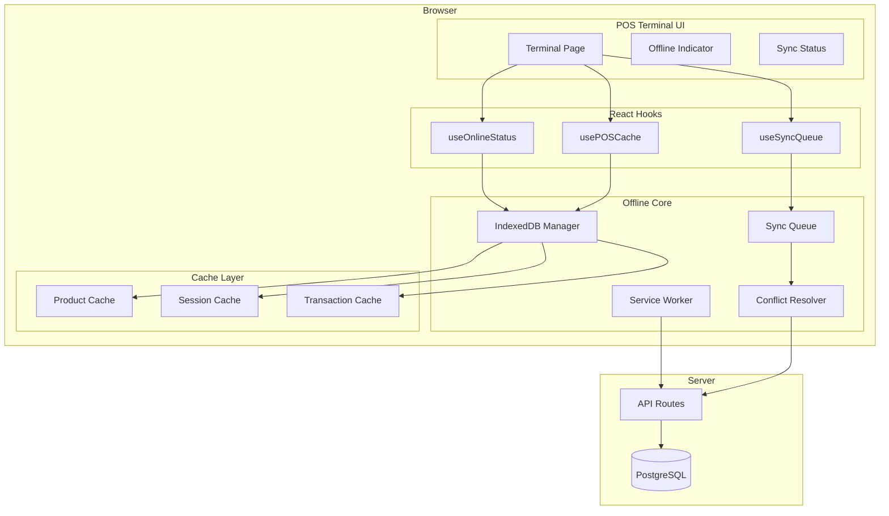
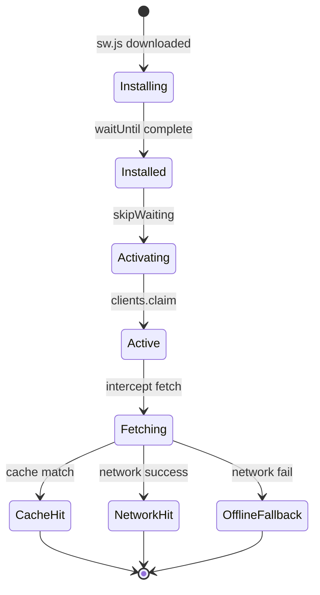
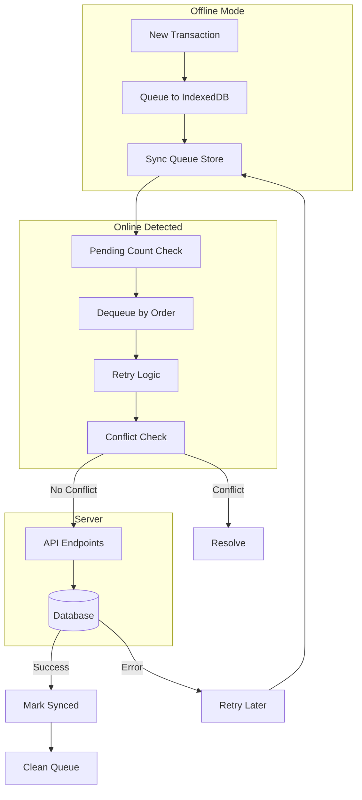
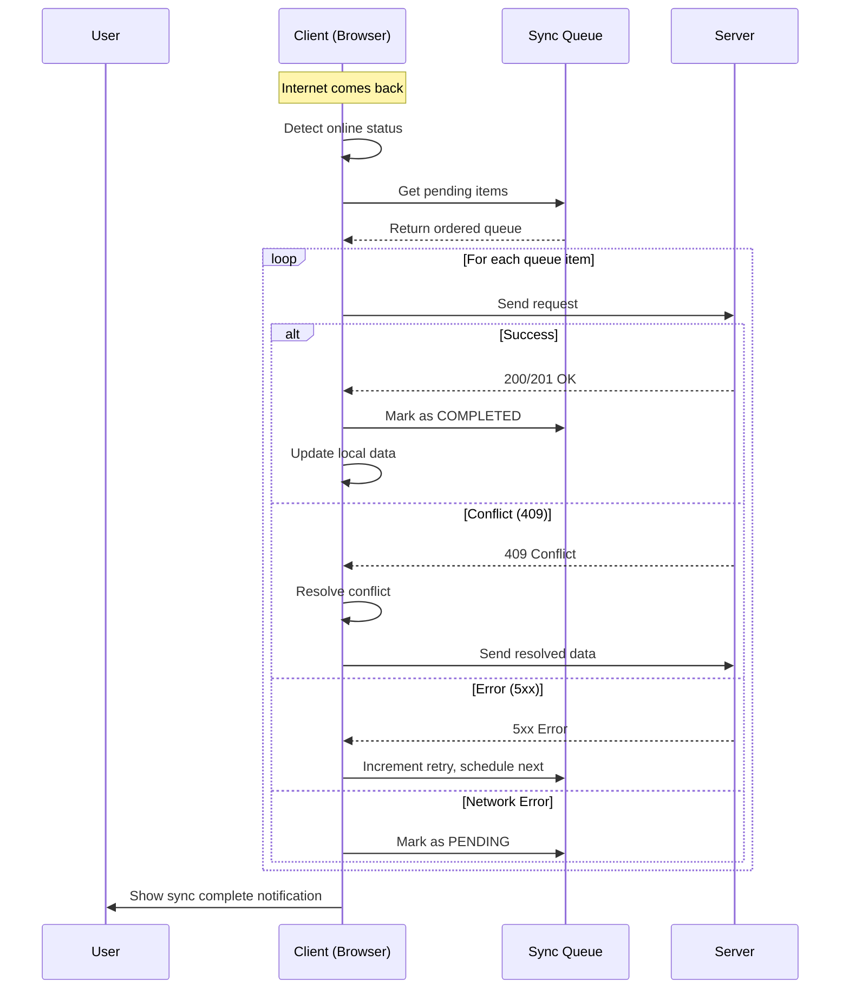
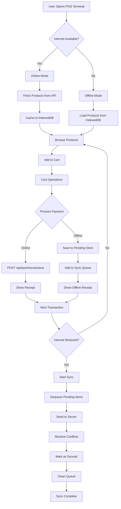
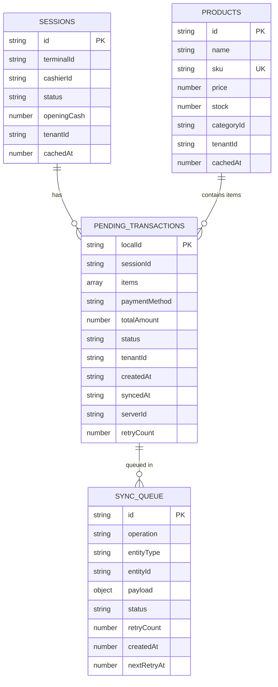
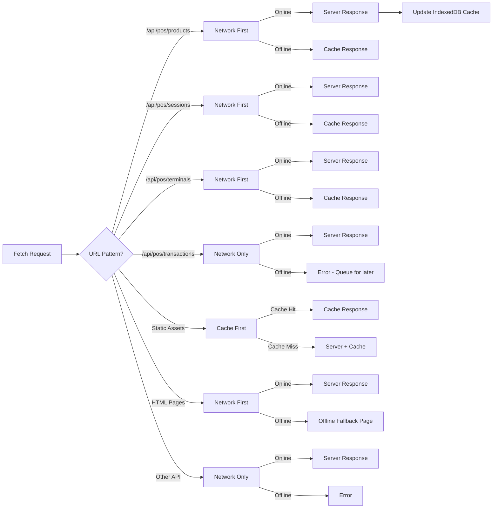

# 🏪 POS Phase 5 — Offline Mode Architecture

> **Qalcuity BOS — POS Module**
> Created: 5 September 2026
> Status: Architecture Plan — Ready for Implementation
> Ref: [`plans/pos-feature-plan.md`](plans/pos-feature-plan.md), [`AGENT.md`](AGENT.md) Section 15

---

## 📋 Daftar Isi

1. [Overview](#1-overview)
2. [Current State Analysis](#2-current-state-analysis)
3. [Architecture Design](#3-architecture-design)
4. [IndexedDB Schema](#4-indexeddb-schema)
5. [Service Worker Strategy](#5-service-worker-strategy)
6. [Sync Mechanism](#6-sync-mechanism)
7. [Conflict Resolution](#7-conflict-resolution)
8. [UI/UX Changes](#8-uiux-changes)
9. [File Structure](#9-file-structure)
10. [Implementation Plan](#10-implementation-plan)
11. [Risk Analysis](#11-risk-analysis)
12. [Mermaid Diagrams](#12-mermaid-diagrams)

---

## 1. Overview

### 1.1 Business Context

POS (Point of Sale) adalah modul kritis yang harus beroperasi 24/7. Gangguan internet tidak boleh menghentikan operasi kasir. **Offline Mode** memungkinkan POS tetap bertransaksi saat internet putus, dengan sinkronisasi otomatis saat koneksi pulih.

### 1.2 Goals

| Goal | Description |
|------|-------------|
| **Continuity** | POS tetap berfungsi tanpa internet |
| **Data Integrity** | Tidak ada transaksi yang hilang |
| **Conflict Resolution** | Penanganan konflik data yang elegan |
| **User Experience** | Indikator offline yang jelas, transisi mulus |
| **Minimal Dependencies** | Native IndexedDB API, tanpa library berat |

### 1.3 Scope

| In Scope | Out of Scope |
|----------|-------------|
| POS Terminal page offline | Module lain (CRM, HR, Finance) |
| Product browsing offline | Real-time stock sync |
| Transaction creation offline | Payment gateway offline (QRIS, E-Wallet) |
| Session management offline | Refund offline |
| Sync queue dengan retry | Offline reporting/analytics |
| Offline indicator UI | Offline loyalty redemption |

### 1.4 Key Design Decisions

| Decision | Choice | Rationale |
|----------|--------|-----------|
| **Storage** | Native IndexedDB via wrapper | Tanpa library berat, full control |
| **Service Worker** | Workbox via `next-pwa` pattern | Kompatibel dengan Next.js 14 |
| **Sync Strategy** | Queue-based with retry | Reliable, ordered, debuggable |
| **Conflict Resolution** | Server-wins for products, Client-wins for transactions | Products = shared data, Transactions = local creation |
| **Cache Scope** | Products + Current Session only | Terbatas, tidak memakan storage banyak |
| **Offline Indicator** | React hook + banner component | Terintegrasi dengan existing UI |

---

## 2. Current State Analysis

### 2.1 Current POS Architecture

```mermaid
graph LR
    subgraph CLIENT["Browser - Client"]
        TP[Terminal Page]
        CF[fetch() calls]
    end

    subgraph API["Next.js API Routes"]
        P[/api/pos/products]
        S[/api/pos/sessions]
        T[/api/pos/transactions]
        TM[/api/pos/terminals]
    end

    subgraph DB["PostgreSQL"]
        PR[Product]
        PS[PosSession]
        PT[PosTransaction]
        PTI[PosTransactionItem]
        PP[PosPayment]
    end

    TP --> CF
    CF --> P
    CF --> S
    CF --> T
    CF --> TM
    P --> PR
    S --> PS
    T --> PT
    T --> PTI
    T --> PP
```

### 2.2 Current Data Flow

1. **Terminal Page** ([`apps/web/app/dashboard/pos/terminal/page.tsx`](apps/web/app/dashboard/pos/terminal/page.tsx)) — 754 baris, `'use client'` component
2. **Fetch Products** — `fetch('/api/pos/products')` → Product grid
3. **Fetch Terminals** — `fetch('/api/pos/terminals')` → Terminal selection
4. **Open Session** — `POST /api/pos/sessions` → Session state
5. **Process Payment** — `POST /api/pos/transactions` → Transaction + Items + Payment

### 2.3 Current Pain Points

| Issue | Impact |
|-------|--------|
| No offline support | POS mati saat internet putus |
| No service worker | Tidak ada asset caching |
| No data caching | Setiap visit harus fetch ulang |
| No sync mechanism | Transaksi hilang saat offline |
| No offline indicator | User tidak tahu status koneksi |

---

## 3. Architecture Design

### 3.1 High-Level Architecture



### 3.2 Module Architecture

```
apps/web/
├── lib/
│   └── pos-offline/
│       ├── index.ts              # Public API exports
│       ├── indexeddb.ts           # IndexedDB wrapper (open, read, write, delete)
│       ├── schema.ts             # IndexedDB schema definition & migration
│       ├── product-cache.ts      # Product cache operations
│       ├── session-cache.ts      # Session cache operations
│       ├── sync-queue.ts         # Sync queue management
│       ├── sync-worker.ts        # Sync processing logic
│       ├── conflict-resolver.ts  # Conflict resolution strategies
│       └── online-status.ts      # Online/offline detection
├── hooks/
│   ├── use-online-status.ts      # React hook: online status
│   ├── use-pos-cache.ts          # React hook: POS cache operations
│   └── use-sync-queue.ts         # React hook: sync queue status
├── components/
│   └── pos/
│       ├── offline-indicator.tsx  # Offline banner component
│       └── sync-status.tsx       # Sync queue status component
└── public/
    └── sw.js                     # Service Worker (generated by build)
```

---

## 4. IndexedDB Schema

### 4.1 Database Configuration

| Property | Value |
|----------|-------|
| **Database Name** | `qalcuity-pos-offline` |
| **Version** | `1` |
| **Storage Limit** | ~50MB (browser default) |
| **Retention** | Products: 7 days, Transactions: until synced |

### 4.2 Store Definitions

#### Store: `products`

> Cache produk untuk browsing offline.

| Field | Type | Indexed | Description |
|-------|------|---------|-------------|
| `id` | `string` | Primary Key | Product ID (server) |
| `name` | `string` | Yes | Product name |
| `sku` | `string` | Yes | Product SKU |
| `price` | `number` | No | Current price |
| `cost` | `number` | No | Cost price |
| `stock` | `number` | No | Cached stock (last known) |
| `minStock` | `number` | No | Minimum stock |
| `unit` | `string` | No | Unit of measure |
| `description` | `string \| null` | No | Description |
| `categoryId` | `string \| null` | Yes | Category ID |
| `categoryName` | `string \| null` | No | Category name |
| `isActive` | `boolean` | No | Active status |
| `tenantId` | `string` | Yes | Tenant isolation |
| `cachedAt` | `number` | No | Cache timestamp (Date.now) |

**Indexes:**
- `id` (primary key)
- `tenantId`
- `sku`
- `name`
- `categoryId`

#### Store: `sessions`

> Cache sesi POS aktif untuk operasi offline.

| Field | Type | Indexed | Description |
|-------|------|---------|-------------|
| `id` | `string` | Primary Key | Session ID (server) |
| `terminalId` | `string` | Yes | Terminal ID |
| `terminalName` | `string` | No | Terminal name |
| `terminalCode` | `string` | No | Terminal code |
| `cashierId` | `string` | No | Cashier user ID |
| `cashierName` | `string` | No | Cashier name |
| `status` | `string` | Yes | OPEN / CLOSED |
| `openingCash` | `number` | No | Opening cash amount |
| `openedAt` | `string` | No | Open timestamp |
| `tenantId` | `string` | Yes | Tenant isolation |
| `cachedAt` | `number` | No | Cache timestamp |

**Indexes:**
- `id` (primary key)
- `terminalId`
- `status`
- `tenantId`

#### Store: `pending-transactions`

> Transaksi yang dibuat offline, menunggu sync ke server.

| Field | Type | Indexed | Description |
|-------|------|---------|-------------|
| `localId` | `string` | Primary Key | Local UUID (client-generated) |
| `sessionId` | `string` | Yes | Session ID |
| `terminalId` | `string` | No | Terminal ID |
| `items` | `array` | No | Transaction items array |
| `paymentMethod` | `string` | No | Payment method |
| `paidAmount` | `number` | No | Paid amount |
| `subtotal` | `number` | No | Calculated subtotal |
| `discountAmount` | `number` | No | Discount |
| `taxAmount` | `number` | No | Tax |
| `totalAmount` | `number` | No | Total |
| `changeAmount` | `number` | No | Change |
| `notes` | `string \| null` | No | Notes |
| `status` | `string` | Yes | PENDING / SYNCED / FAILED |
| `tenantId` | `string` | Yes | Tenant isolation |
| `createdBy` | `string` | No | User ID |
| `createdAt` | `string` | No | Local creation timestamp |
| `syncedAt` | `string \| null` | No | Sync timestamp |
| `serverId` | `string \| null` | No | Server ID after sync |
| `serverTransactionNo` | `string \| null` | No | Server transaction number |
| `syncError` | `string \| null` | No | Last sync error message |
| `retryCount` | `number` | No | Number of sync retries |

**Indexes:**
- `localId` (primary key)
- `status`
- `sessionId`
- `tenantId`
- `createdAt`

#### Store: `sync-queue`

> Antrian operasi sync yang perlu dilakukan ke server.

| Field | Type | Indexed | Description |
|-------|------|---------|-------------|
| `id` | `string` | Primary Key | Queue item ID (UUID) |
| `operation` | `string` | Yes | CREATE_TRANSACTION, CLOSE_SESSION, etc. |
| `entityType` | `string` | Yes | transaction, session |
| `entityId` | `string` | No | Local entity ID |
| `payload` | `object` | No | Request body to send |
| `endpoint` | `string` | No | API endpoint URL |
| `method` | `string` | No | HTTP method |
| `status` | `string` | Yes | PENDING / PROCESSING / COMPLETED / FAILED |
| `retryCount` | `number` | No | Current retry count |
| `maxRetries` | `number` | No | Max retries (default: 5) |
| `lastError` | `string \| null` | No | Last error message |
| `createdAt` | `number` | Yes | Creation timestamp |
| `nextRetryAt` | `number` | Yes | Next retry timestamp |

**Indexes:**
- `id` (primary key)
- `status`
- `operation`
- `createdAt`
- `nextRetryAt`

#### Store: `config`

> Konfigurasi dan metadata offline mode.

| Field | Type | Indexed | Description |
|-------|------|---------|-------------|
| `key` | `string` | Primary Key | Config key |
| `value` | `any` | No | Config value |
| `updatedAt` | `number` | No | Last update timestamp |

**Predefined Keys:**
- `lastProductSync` — Timestamp of last product cache refresh
- `lastSessionSync` — Timestamp of last session cache refresh
- `offlineModeEnabled` — Boolean flag
- `syncInProgress` — Boolean flag
- `pendingCount` — Number of pending sync items

### 4.3 Schema Migration Strategy

```typescript
// Schema versioning approach
const DB_VERSION = 1;

// On version upgrade:
// v1 -> v2: Add new stores or indexes
// Never delete stores — mark as deprecated
// Always handle graceful fallback
```

---

## 5. Service Worker Strategy

### 5.1 Strategy Matrix

| Resource Type | Strategy | Fallback | TTL |
|--------------|----------|----------|-----|
| **Static Assets** (JS, CSS, fonts) | Cache-First | Network | 30 days |
| **Images** (logos, icons) | Cache-First | Placeholder | 30 days |
| **POS Products API** | Network-First | Cache | 1 hour |
| **POS Sessions API** | Network-First | Cache | Current |
| **POS Terminals API** | Network-First | Cache | 1 hour |
| **POS Transactions API** | Network-Only | Offline queue | None |
| **Other API Routes** | Network-Only | Error page | None |
| **HTML Pages** | Network-First | Offline fallback | 1 day |

### 5.2 Cache Names

| Cache Name | Purpose | Max Entries |
|------------|---------|-------------|
| `qalcuity-static-v1` | Static assets | 100 |
| `qalcuity-api-products-v1` | Products API response | 1 |
| `qalcuity-api-sessions-v1` | Sessions API response | 1 |
| `qalcuity-api-terminals-v1` | Terminals API response | 1 |
| `qalcuity-pages-v1` | HTML pages | 10 |

### 5.3 Service Worker Lifecycle



### 5.4 Interception Rules

```typescript
// Pseudo-code for service worker fetch handler
self.addEventListener('fetch', (event) => {
  const url = new URL(event.request.url);

  // Rule 1: Static assets -> Cache-First
  if (isStaticAsset(url)) {
    event.respondWith(cacheFirst(event.request, 'qalcuity-static-v1'));
    return;
  }

  // Rule 2: POS Products API -> Network-First with cache fallback
  if (url.pathname === '/api/pos/products') {
    event.respondWith(
      networkFirstWithCache(event.request, 'qalcuity-api-products-v1', 3600000)
    );
    return;
  }

  // Rule 3: POS Sessions API -> Network-First with cache fallback
  if (url.pathname === '/api/pos/sessions') {
    event.respondWith(
      networkFirstWithCache(event.request, 'qalcuity-api-sessions-v1', Infinity)
    );
    return;
  }

  // Rule 4: POS Terminals API -> Network-First with cache fallback
  if (url.pathname === '/api/pos/terminals') {
    event.respondWith(
      networkFirstWithCache(event.request, 'qalcuity-api-terminals-v1', 3600000)
    );
    return;
  }

  // Rule 5: Other API routes -> Network-Only (no cache)
  if (url.pathname.startsWith('/api/')) {
    event.respondWith(networkOnly(event.request));
    return;
  }

  // Rule 6: HTML pages -> Network-First with offline fallback
  if (event.request.mode === 'navigate') {
    event.respondWith(
      networkFirstWithFallback(event.request, '/offline.html')
    );
    return;
  }

  // Default: Network-First
  event.respondWith(networkFirst(event.request));
});
```

### 5.5 Next.js Integration

```typescript
// next.config.js addition
const withPWA = require('next-pwa')({
  dest: 'public',
  register: true,
  skipWaiting: true,
  disable: process.env.NODE_ENV === 'development',
  runtimeCaching: [
    // ... runtime caching config
  ],
});

module.exports = withPWA(nextConfig);
```

**Alternative: Manual Service Worker** (Pilihan ini lebih fleksibel)

```
public/
├── sw.js              # Custom service worker
├── manifest.json      # PWA manifest
└── offline.html       # Offline fallback page
```

> **Recommendation:** Gunakan custom service worker tanpa `next-pwa` untuk kontrol penuh. Next.js 14 App Router memiliki internal caching yang bisa konflik dengan PWA library. Custom SW lebih predictable.

---

## 6. Sync Mechanism

### 6.1 Sync Queue Architecture



### 6.2 Sync Operations

| Operation | Endpoint | Method | Trigger |
|-----------|----------|--------|---------|
| `CREATE_TRANSACTION` | `/api/pos/transactions` | POST | Transaction created offline |
| `OPEN_SESSION` | `/api/pos/sessions` | POST | Session opened offline |
| `CLOSE_SESSION` | `/api/pos/sessions/{id}` | PUT | Session closed offline |

### 6.3 Sync Flow



### 6.4 Retry Strategy

| Retry # | Delay | Backoff |
|---------|-------|---------|
| 1 | 5 seconds | — |
| 2 | 15 seconds | x3 |
| 3 | 45 seconds | x3 |
| 4 | 2 minutes | x2.7 |
| 5 | 5 minutes | x2.5 |
| 6+ | 10 minutes | capped |

**Max Retries:** 10
**Retry Condition:** Network online + nextRetryAt passed
**Give Up:** After 10 retries → mark as FAILED, notify user

### 6.5 Transaction Number Generation

**Problem:** Transaction numbers (`TRX-YYYY-XXXXXX`) are server-generated using `COUNT + 1`. Offline, we can't get the count.

**Solution:** Hybrid numbering

```
Offline:  OFF-TRX-{YYYY}-{UUID-6chars}  →  OFF-TRX-2026-A3F2K9
Online:   TRX-{YYYY}-{server-count}     →  TRX-2026-000042
```

- Offline transactions get a temporary `OFF-` prefix
- After sync, server assigns real `TRX-` number
- UI shows `OFF-` prefix for unsynced transactions
- Receipt shows "(Menunggu sync)" badge

### 6.6 Sync Status Display

```typescript
// Sync status enum
type SyncStatus = {
  isOnline: boolean;
  pendingCount: number;
  syncingCount: number;
  failedCount: number;
  lastSyncAt: string | null;
  currentSyncItem: string | null;
};
```

---

## 7. Conflict Resolution

### 7.1 Conflict Types

| Conflict | Scenario | Resolution |
|----------|----------|------------|
| **Product Stock** | Stock changed on server while offline | Server-wins: Update local cache with server value |
| **Product Price** | Price changed on server while offline | Server-wins: Use server price for new transactions |
| **Session Status** | Session closed on another terminal | Server-wins: Close local session |
| **Transaction** | Same transaction created on server | Client-wins: Server accepts offline transaction |
| **Duplicate Transaction** | Same transaction synced twice | Idempotency key: Check `localId` |

### 7.2 Resolution Strategies

#### Strategy: Server-Wins (Products, Sessions)

```typescript
// When sync completes, overwrite local cache
async function resolveProductConflict(local: Product, server: Product): Promise<Product> {
  // Server data is authoritative
  return {
    ...server,
    cachedAt: Date.now(),
  };
}
```

#### Strategy: Client-Wins (Transactions)

```typescript
// Offline transactions are always accepted by server
// Server generates real transactionNo, returns server ID
async function resolveTransactionConflict(
  local: PendingTransaction,
  serverResponse: TransactionResponse
): Promise<void> {
  // Update local record with server-assigned IDs
  local.serverId = serverResponse.id;
  local.serverTransactionNo = serverResponse.transactionNo;
  local.status = 'SYNCED';
  local.syncedAt = new Date().toISOString();
}
```

#### Strategy: Deduplication (Idempotency)

```typescript
// Each offline operation includes a unique idempotency key
const idempotencyKey = `offline-${localId}-${createdAt}`;

// Server checks: if idempotencyKey already exists, return existing result
// Prevents duplicate transactions from retry logic
```

### 7.3 Server-Side Changes Required

> **Note:** Server API routes need minor modifications to support offline sync.

```typescript
// Add to POST /api/pos/transactions
const idempotencyKey = body.idempotencyKey;
if (idempotencyKey) {
  const existing = await prisma.posTransaction.findFirst({
    where: { idempotencyKey, tenantId }
  });
  if (existing) {
    // Return existing transaction (dedup)
    return NextResponse.json({ success: true, data: existing });
  }
}
```

**Required Server Changes:**
1. Add `idempotencyKey` field to `PosTransaction` model (optional, nullable)
2. Add unique index on `(tenantId, idempotencyKey)` where idempotencyKey IS NOT NULL
3. Add dedup check in POST `/api/pos/transactions`
4. Return transactionNo in POST response (already done)

---

## 8. UI/UX Changes

### 8.1 Offline Indicator Banner

**Location:** Top of POS Terminal page, below header

**States:**

| State | Visual | Behavior |
|-------|--------|----------|
| **Online** | No banner (hidden) | Normal operation |
| **Offline** | Red banner with wifi-off icon | Shows "Mode Offline — Transaksi akan disinkronisasi saat online" |
| **Syncing** | Yellow banner with sync icon | Shows "Menyinkronkan... 3 transaksi tersisa" |
| **Sync Complete** | Green banner (auto-hide 3s) | Shows "3 transaksi berhasil disinkronisasi" |
| **Sync Failed** | Orange banner with retry button | Shows "Gagal menyinkronkan 2 transaksi. [Coba Lagi]" |

**Component:** [`apps/web/components/pos/offline-indicator.tsx`](apps/web/components/pos/offline-indicator.tsx)

```tsx
// Visual design
<div className="flex items-center justify-between px-4 py-2 text-sm">
  <div className="flex items-center gap-2">
    <WifiOff className="h-4 w-4" />
    <span>Mode Offline</span>
    <span className="text-xs opacity-75">
      3 transaksi menunggu sync
    </span>
  </div>
  <button onClick={forceSyncNow} className="text-xs underline">
    Sinkronkan Sekarang
  </button>
</div>
```

### 8.2 Sync Status Badge

**Location:** Cart header area, next to session indicator

**Visual:**
```tsx
// Pending sync count badge
<span className="inline-flex items-center gap-1 rounded-full bg-orange-100 px-2 py-0.5 text-xs font-medium text-orange-700">
  <Loader2 className="h-3 w-3 animate-spin" /> {/* or Clock icon when not syncing */}
  3 menunggu sync
</span>
```

### 8.3 Offline Product Card Modifications

| Change | Description |
|--------|-------------|
| **Stock indicator** | Show "(cached)" label on stock number |
| **Synced badge** | Products from cache show "Data di-cache" tooltip |
| **Stale warning** | If cache > 1 hour old, show warning icon |

### 8.4 Transaction Receipt Modifications

| Change | Description |
|--------|-------------|
| **Offline badge** | Show "OFFLINE" badge on receipt |
| **Temporary number** | Display `OFF-TRX-...` with explanation |
| **Sync status** | Show "Menunggu sinkronisasi" after receipt |
| **Print note** | Add "Transaksi ini akan disinkronisasi saat online" |

### 8.5 Graceful Degradation

| Feature | Online | Offline | UI Treatment |
|---------|--------|---------|-------------|
| Browse products | ✅ Full | ✅ Cached | Stock may be stale |
| Add to cart | ✅ Full | ✅ Full | No change |
| Process payment | ✅ Full | ✅ Local only | Receipt shows offline badge |
| Open session | ✅ Full | ✅ Local only | Session stored locally |
| Close session | ✅ Full | ⚠️ Deferred | "Akan ditutup saat online" |
| Refund | ✅ Full | ❌ Disabled | Button disabled + tooltip |
| Void transaction | ✅ Full | ❌ Disabled | Button disabled + tooltip |
| Loyalty redemption | ✅ Full | ❌ Disabled | Button disabled + tooltip |
| Print receipt | ✅ Full | ✅ Full | Receipt shows offline note |

### 8.6 Notification Toasts

```typescript
// Offline mode notifications
const OFFLINE_NOTIFICATIONS = {
  offlineDetected: {
    title: 'Koneksi Terputus',
    message: 'POS beralih ke mode offline. Transaksi akan disinkronisasi saat online.',
    type: 'warning',
  },
  onlineRestored: {
    title: 'Koneksi Pulih',
    message: 'Menyinkronkan transaksi offline...',
    type: 'info',
  },
  syncComplete: {
    title: 'Sinkronisasi Berhasil',
    message: '{count} transaksi berhasil disinkronisasi.',
    type: 'success',
  },
  syncFailed: {
    title: 'Sinkronisasi Gagal',
    message: '{count} transaksi gagal disinkronisasi. Akan mencoba lagi.',
    type: 'error',
  },
};
```

---

## 9. File Structure

### 9.1 New Files to Create

```
apps/web/
├── lib/
│   └── pos-offline/
│       ├── index.ts                    # Public API exports
│       ├── indexeddb.ts                 # IndexedDB wrapper
│       ├── schema.ts                   # DB schema & migration
│       ├── product-cache.ts            # Product cache ops
│       ├── session-cache.ts            # Session cache ops
│       ├── sync-queue.ts               # Sync queue management
│       ├── sync-worker.ts              # Sync processing
│       ├── conflict-resolver.ts        # Conflict resolution
│       └── online-status.ts            # Online detection
├── hooks/
│   ├── use-online-status.ts            # Online status hook
│   ├── use-pos-cache.ts                # POS cache hook
│   └── use-sync-queue.ts               # Sync queue hook
├── components/
│   └── pos/
│       ├── offline-indicator.tsx        # Offline banner
│       └── sync-status.tsx             # Sync status badge
└── public/
    ├── sw.js                           # Service Worker
    ├── manifest.json                   # PWA manifest
    └── offline.html                    # Offline fallback page
```

### 9.2 Files to Modify

| File | Change |
|------|--------|
| [`apps/web/app/dashboard/pos/terminal/page.tsx`](apps/web/app/dashboard/pos/terminal/page.tsx) | Integrate offline hooks, add offline indicator, modify payment flow |
| [`apps/web/next.config.js`](apps/web/next.config.js) | Add service worker headers, CSP updates |
| [`apps/web/app/layout.tsx`](apps/web/app/layout.tsx) | Register service worker |
| [`apps/web/app/api/pos/transactions/route.ts`](apps/web/app/api/pos/transactions/route.ts) | Add idempotency check |
| [`apps/web/lib/validation-schemas.ts`](apps/web/lib/validation-schemas.ts) | Add idempotencyKey to transaction schema |
| [`packages/db/prisma/schema.prisma`](packages/db/prisma/schema.prisma) | Add idempotencyKey field to PosTransaction |
| [`apps/web/messages/id.json`](apps/web/messages/id.json) | Add offline-related i18n keys |
| [`apps/web/messages/en.json`](apps/web/messages/en.json) | Add offline-related i18n keys |

### 9.3 Dependencies

**No new npm dependencies required.** All implementations use:

| Dependency | Usage | Required? |
|-----------|-------|-----------|
| Native IndexedDB | Client-side storage | ✅ Built-in |
| Navigator.onLine | Online detection | ✅ Built-in |
| `online`/`offline` events | Network status | ✅ Built-in |
| `navigator.serviceWorker` | SW registration | ✅ Built-in |
| `crypto.randomUUID()` | UUID generation | ✅ Built-in |

> **Note:** `crypto.randomUUID()` requires HTTPS or localhost. In development, use `Math.random()` fallback.

---

## 10. Implementation Plan

### Phase 5A: IndexedDB Core

**Goal:** IndexedDB wrapper dan schema yang berfungsi.

- [ ] 5A-1: Buat [`apps/web/lib/pos-offline/schema.ts`](apps/web/lib/pos-offline/schema.ts) — Database schema definition
- [ ] 5A-2: Buat [`apps/web/lib/pos-offline/indexeddb.ts`](apps/web/lib/pos-offline/indexeddb.ts) — Generic IndexedDB wrapper (open, get, put, delete, getAll)
- [ ] 5A-3: Buat [`apps/web/lib/pos-offline/product-cache.ts`](apps/web/lib/pos-offline/product-cache.ts) — Product cache operations
- [ ] 5A-4: Buat [`apps/web/lib/pos-offline/session-cache.ts`](apps/web/lib/pos-offline/session-cache.ts) — Session cache operations
- [ ] 5A-5: Buat [`apps/web/lib/pos-offline/index.ts`](apps/web/lib/pos-offline/index.ts) — Public API exports

### Phase 5B: Sync Queue

**Goal:** Sync queue yang reliable dengan retry logic.

- [ ] 5B-1: Buat [`apps/web/lib/pos-offline/sync-queue.ts`](apps/web/lib/pos-offline/sync-queue.ts) — Queue management (enqueue, dequeue, mark)
- [ ] 5B-2: Buat [`apps/web/lib/pos-offline/sync-worker.ts`](apps/web/lib/pos-offline/sync-worker.ts) — Sync processing with retry
- [ ] 5B-3: Buat [`apps/web/lib/pos-offline/conflict-resolver.ts`](apps/web/lib/pos-offline/conflict-resolver.ts) — Conflict resolution strategies
- [ ] 5B-4: Buat [`apps/web/lib/pos-offline/online-status.ts`](apps/web/lib/pos-offline/online-status.ts) — Online detection utility

### Phase 5C: React Hooks

**Goal:** React hooks yang menghubungkan offline core ke UI.

- [ ] 5C-1: Buat [`apps/web/hooks/use-online-status.ts`](apps/web/hooks/use-online-status.ts) — Online status hook
- [ ] 5C-2: Buat [`apps/web/hooks/use-pos-cache.ts`](apps/web/hooks/use-pos-cache.ts) — POS cache hook
- [ ] 5C-3: Buat [`apps/web/hooks/use-sync-queue.ts`](apps/web/hooks/use-sync-queue.ts) — Sync queue status hook

### Phase 5D: UI Components

**Goal:** Offline indicator dan sync status UI.

- [ ] 5D-1: Buat [`apps/web/components/pos/offline-indicator.tsx`](apps/web/components/pos/offline-indicator.tsx) — Offline banner component
- [ ] 5D-2: Buat [`apps/web/components/pos/sync-status.tsx`](apps/web/components/pos/sync-status.tsx) — Sync status badge
- [ ] 5D-3: Update [`apps/web/messages/id.json`](apps/web/messages/id.json) — Add i18n keys
- [ ] 5D-4: Update [`apps/web/messages/en.json`](apps/web/messages/en.json) — Add i18n keys

### Phase 5E: Service Worker

**Goal:** Service Worker untuk asset caching dan API caching.

- [ ] 5E-1: Buat [`apps/web/public/sw.js`](apps/web/public/sw.js) — Custom service worker
- [ ] 5E-2: Buat [`apps/web/public/manifest.json`](apps/web/public/manifest.json) — PWA manifest
- [ ] 5E-3: Buat [`apps/web/public/offline.html`](apps/web/public/offline.html) — Offline fallback page
- [ ] 5E-4: Update [`apps/web/next.config.js`](apps/web/next.config.js) — Add SW headers and CSP
- [ ] 5E-5: Update [`apps/web/app/layout.tsx`](apps/web/app/layout.tsx) — Register service worker

### Phase 5F: Integration

**Goal:** Integrasikan offline mode ke POS Terminal page.

- [ ] 5F-1: Update [`apps/web/app/dashboard/pos/terminal/page.tsx`](apps/web/app/dashboard/pos/terminal/page.tsx) — Integrate offline hooks, modify payment flow
- [ ] 5F-2: Update [`apps/web/app/api/pos/transactions/route.ts`](apps/web/app/api/pos/transactions/route.ts) — Add idempotency support
- [ ] 5F-3: Update [`apps/web/lib/validation-schemas.ts`](apps/web/lib/validation-schemas.ts) — Add idempotencyKey field
- [ ] 5F-4: Update [`packages/db/prisma/schema.prisma`](packages/db/prisma/schema.prisma) — Add idempotencyKey field

### Phase 5G: Testing & Documentation

**Goal:** Testing dan dokumentasi.

- [ ] 5G-1: Test offline mode — Putus koneksi, buat transaksi, sambung ulang
- [ ] 5G-2: Test sync queue — Verifikasi urutan dan retry
- [ ] 5G-3: Test conflict resolution — Simulasikan perubahan data di server
- [ ] 5G-4: Test graceful degradation — Fitur yang disabled saat offline
- [ ] 5G-5: Update [`CURRENT.md`](CURRENT.md) — Update status
- [ ] 5G-6: Update [`FEATURES.md`](FEATURES.md) — Update feature status

---

## 11. Risk Analysis

### 11.1 Technical Risks

| Risk | Severity | Probability | Mitigation |
|------|----------|-------------|------------|
| **IndexedDB storage limit** | Medium | Low | Products cache limited to 100 items, auto-cleanup old entries |
| **Service Worker caching conflicts with Next.js** | High | Medium | Custom SW with explicit URL matching, test thoroughly |
| **Browser compatibility** | Medium | Low | IndexedDB supported in all modern browsers, graceful fallback |
| **Sync ordering issues** | High | Low | Queue-based with strict ordering, process sequentially |
| **Data loss on browser clear** | High | Medium | Warn user, periodic server backup, sync prompt |
| **Race conditions in sync** | Medium | Low | Mutex lock on sync worker, single-threaded processing |

### 11.2 Business Risks

| Risk | Severity | Probability | Mitigation |
|------|----------|-------------|------------|
| **Duplicate transactions** | High | Low | Idempotency key, server-side dedup |
| **Incorrect stock after offline** | Medium | High | Show "cached stock" label, refresh on reconnect |
| **Session mismatch** | Medium | Low | Server validates session status on sync |
| **Long offline period** | Medium | Low | Cap offline transactions at 50, warn user |

### 11.3 Storage Budget

| Store | Max Entries | Approx Size |
|-------|-------------|-------------|
| `products` | 100 | ~100KB |
| `sessions` | 5 | ~5KB |
| `pending-transactions` | 50 | ~500KB |
| `sync-queue` | 100 | ~100KB |
| `config` | 10 | ~1KB |
| **Total** | — | **~756KB** |

> Well within browser IndexedDB limits (typically 50MB+).

---

## 12. Mermaid Diagrams

### 12.1 Complete Offline Mode Flow



### 12.2 IndexedDB Data Model



### 12.3 Service Worker Cache Strategy



---

## Appendix A: IndexedDB Wrapper API

```typescript
// apps/web/lib/pos-offline/indexeddb.ts

interface IDBWrapper {
  open(dbName: string, version: number, stores: StoreConfig[]): Promise<IDBDatabase>;
  get<T>(db: IDBDatabase, storeName: string, key: string): Promise<T | undefined>;
  getAll<T>(db: IDBDatabase, storeName: string, indexName?: string, query?: IDBKeyRange): Promise<T[]>;
  put<T>(db: IDBDatabase, storeName: string, value: T): Promise<void>;
  putMany<T>(db: IDBDatabase, storeName: string, values: T[]): Promise<void>;
  delete(db: IDBDatabase, storeName: string, key: string): Promise<void>;
  clear(db: IDBDatabase, storeName: string): Promise<void>;
  count(db: IDBDatabase, storeName: string): Promise<number>;
}

interface StoreConfig {
  name: string;
  keyPath: string;
  indexes?: { name: string; keyPath: string | string[]; options?: IDBIndexParameters }[];
}
```

## Appendix B: i18n Keys

```json
{
  "pos": {
    "offline": {
      "banner": {
        "offline": "Mode Offline",
        "offlineDescription": "Transaksi akan disinkronisasi saat online",
        "syncing": "Menyinkronkan...",
        "syncingCount": "{count} transaksi tersisa",
        "syncComplete": "Sinkronisasi berhasil",
        "syncCompleteCount": "{count} transaksi disinkronisasi",
        "syncFailed": "Sinkronisasi gagal",
        "syncFailedCount": "{count} transaksi gagal disinkronisasi",
        "retry": "Coba Lagi",
        "syncNow": "Sinkronkan Sekarang"
      },
      "status": {
        "cached": "Data di-cache",
        "pendingSync": "Menunggu sinkronisasi",
        "offlineTransaction": "Transaksi Offline",
        "offlineNumber": "Nomor sementara: {number}",
        "willSync": "Akan disinkronisasi saat online"
      },
      "degradation": {
        "refundDisabled": "Refund tidak tersedia saat offline",
        "voidDisabled": "Void tidak tersedia saat offline",
        "loyaltyDisabled": "Loyalty tidak tersedia saat offline",
        "sessionCloseDeferred": "Penutupan sesi ditunda hingga online"
      },
      "notification": {
        "detected": "Koneksi terputus — POS beralih ke mode offline",
        "restored": "Koneksi pulih — Menyinkronkan transaksi...",
        "complete": "{count} transaksi berhasil disinkronisasi",
        "failed": "{count} transaksi gagal disinkronisasi"
      }
    }
  }
}
```

## Appendix C: CSP Updates for Service Worker

```javascript
// next.config.js CSP additions
value: [
  // ... existing CSP ...
  "worker-src 'self'",
  "manifest-src 'self'",
].join('; ')
```

---

**Last Updated:** 5 September 2026
**Author:** Qalcuity AI Architect
**Document Version:** 1.0 — Architecture Plan
