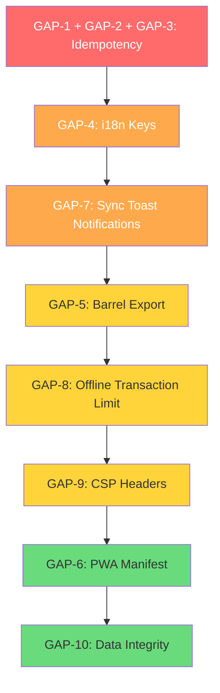
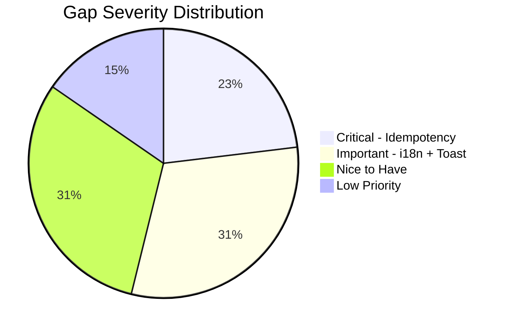
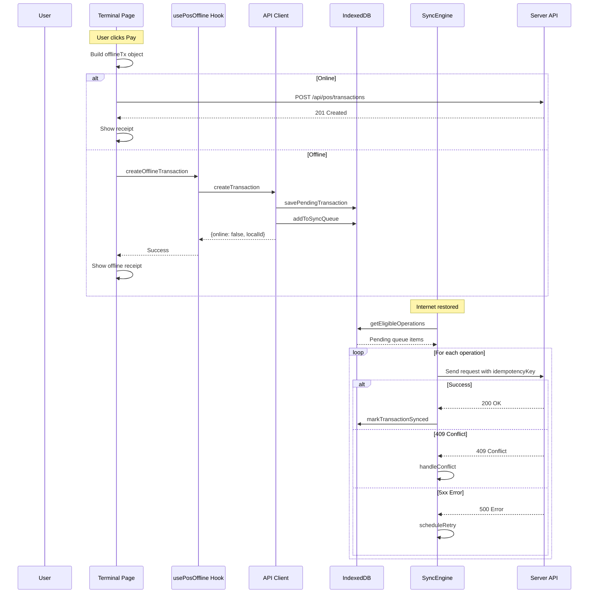
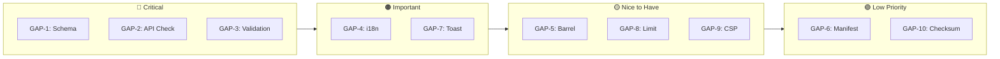

# 🏪 POS Offline Mode — Gap Analysis & Implementation Plan

> **Qalcuity BOS — POS Module**
> Created: 26 September 2026
> Status: Implementation Plan — Ready for Execution
> Ref: [`plans/pos-offline-mode-architecture.md`](plans/pos-offline-mode-architecture.md)

---

## 📋 Daftar Isi

1. [Executive Summary](#1-executive-summary)
2. [Gap Analysis — What Exists vs What's Missing](#2-gap-analysis)
3. [Implementation Plan](#3-implementation-plan)
4. [File Reference](#4-file-reference)
5. [Mermaid Diagrams](#5-mermaid-diagrams)

---

## 1. Executive Summary

POS Offline Mode architecture sudah **~85% terbangun**. Core components (IndexedDB, SyncEngine, Service Worker, React Hooks, UI Components) sudah ada dan functional. Yang belum fully functional adalah **server-side idempotency support** dan **beberapa integration gaps**.

### Completion Status (Updated — Session 67)

| Layer | Status | Notes |
|-------|--------|-------|
| **IndexedDB Core** | ✅ Complete | Full CRUD, 5 stores, indexes (DB_VERSION 2: +type/tenantId indexes on sync-queue) |
| **Sync Engine** | ✅ Complete | Mutex, retry, exponential backoff, conflict resolution, tenant filter, payload validation, manual retry (bulk + per-op) |
| **API Client** | ✅ Complete | Online/offline aware, cache fallback, tenantId stamped on all 5 syncOp sites |
| **Service Worker** | ✅ Complete | 6 cache stores, 3 strategies, auth bypass, `sync` event handler (Background Sync, CACHE_VERSION v4) |
| **React Hooks** | ✅ Complete | usePosOffline (retry actions + SW message listener), usePosProducts |
| **UI Components** | ✅ Complete | OfflineIndicator + SyncStatusBadge — full i18n, per-transaction status list, manual per-op retry, retry-all button |
| **Terminal Integration** | ✅ Complete | Offline payment flow, receipt, banners, onSyncComplete/onSyncFailed toasts, setSyncTenantContext wiring |
| **Server Idempotency** | ✅ Complete | `idempotencyKey` + `@@unique([tenantId, idempotencyKey])` already in schema; route returns `duplicate: true` alongside `idempotent: true` (Session 67) |
| **i18n Keys** | ✅ Complete | `pos.offlineIndicator.*` (8 keys) + `pos.syncBadge.*` (19 keys) in en.json + id.json (Session 67) |
| **PWA Manifest** | ✅ Complete | [`apps/web/public/manifest.json`](apps/web/public/manifest.json) exists — "Qalcuity POS", start_url `/dashboard/pos` |
| **Barrel Export** | ✅ Complete | [`apps/web/lib/pos-offline/index.ts`](apps/web/lib/pos-offline/index.ts) — full barrel incl. sync standalone exports + registerBackgroundSync (Session 67) |
| **Sync Notifications** | ✅ Complete | Toast on sync complete/fail wired in terminal page via onSyncComplete/onSyncFailed callbacks (Session 67) |
| **Offline Limits** | ✅ Complete | OFFLINE_TRANSACTION_LIMIT = 50 in api-client |
| **Data Integrity** | ✅ Complete | `validateOperationPayload()` before sync — invalid payload marked FAILED (no retry loop). Checksums intentionally omitted: POS transaction route does not mutate stock (separate endpoint), so idempotency dedup fully prevents double effects |

---

## 2. Gap Analysis

### 2.1 ✅ What Already Exists (Fully Functional)

#### [`apps/web/lib/pos-offline/types.ts`](apps/web/lib/pos-offline/types.ts:1)
- Product, Session, PendingTransaction, SyncOperation, OfflineConfig types
- DBStoreMap, StoreName, StorageUsage types
- DB_NAME, DB_VERSION, STORES constants

#### [`apps/web/lib/pos-offline/db.ts`](apps/web/lib/pos-offline/db.ts:1) — 533 lines
- `openDB()` — Singleton IndexedDB connection with schema creation
- `cacheProducts()`, `getCachedProducts()`, `searchCachedProducts()`
- `cacheSession()`, `getCachedSession()`, `getActiveSession()`
- `savePendingTransaction()`, `getPendingTransactions()`, `markTransactionSynced()`, `deletePendingTransaction()`
- `addToSyncQueue()`, `getSyncQueue()`, `removeSyncOperation()`
- `getConfig()`, `setConfig()`
- `clearAllData()`, `getStorageUsage()`

#### [`apps/web/lib/pos-offline/api-client.ts`](apps/web/lib/pos-offline/api-client.ts:1) — 542 lines
- `posFetch<T>()` — Fetch wrapper with offline detection
- `fetchProducts()` — Online fetch + cache fallback
- `fetchSession()`, `fetchActiveSession()` — Session fetch + cache
- `createTransaction()` — Online direct OR offline queue
- `closeSession()` — Online direct OR offline queue
- `syncProductsToCache()`, `syncSessionToCache()`
- `clearOfflineCache()`, `getPendingSyncCount()`, `triggerSyncNow()`

#### [`apps/web/lib/pos-offline/sync.ts`](apps/web/lib/pos-offline/sync.ts:1) — 778 lines
- `SyncEngine` singleton class
- Mutex lock (prevents concurrent sync runs)
- `processQueue()` — FIFO sequential processing
- `processOperation()` — HTTP request with idempotency header
- `handleConflict()` — Server-wins (products/sessions), Client-wins (transactions)
- `scheduleRetry()` — Exponential backoff (1s → 60s, max 10 retries)
- `handleSyncSuccess()` — Mark pending transactions as synced
- `markOperationFailed()` — Mark as FAILED after max retries
- Online/offline event listeners + periodic polling (30s)
- Status listeners for React UI consumption

#### [`apps/web/lib/pos-offline/service-worker.ts`](apps/web/lib/pos-offline/service-worker.ts:1) — 349 lines
- `registerServiceWorker()`, `unregisterServiceWorker()`
- `getCacheUsage()`, `clearAllCaches()`, `clearCache()`
- `updateServiceWorker()`, `isServiceWorkerActive()`
- `onSWStateChange()` — SW state change listener
- MessageChannel-based SW communication

#### [`apps/web/public/sw.js`](apps/web/public/sw.js:1) — 584 lines
- 6 cache stores with versioning (v3)
- Cache-First strategy for static assets
- Network-First strategy for POS APIs (products, sessions, terminals)
- Network-Only for transaction API
- Auth bypass (`/api/auth/` and non-POS APIs)
- LRU eviction with configurable max entries
- TTL management
- Offline fallback HTML page
- Install/Activate lifecycle

#### [`apps/web/hooks/use-pos-offline.ts`](apps/web/hooks/use-pos-offline.ts:1) — 276 lines
- Online/offline status tracking via `navigator.onLine`
- SyncEngine lifecycle (start/stop on mount/unmount)
- Auto-sync on reconnect
- Actions: syncNow, getOfflineProducts, searchOfflineProducts, createOfflineTransaction, refreshSyncStatus

#### [`apps/web/hooks/use-pos-products.ts`](apps/web/hooks/use-pos-products.ts:1) — 295 lines
- Online/offline product fetching via api-client
- Auto-refresh every 5 minutes
- IndexedDB search (works offline)
- Cache refresh capability
- `fromCache` flag for UI indication

#### [`apps/web/components/pos/offline-indicator.tsx`](apps/web/components/pos/offline-indicator.tsx:1) — 190 lines
- 5 visual states: online (green dot), offline (amber), syncing (blue), error (red), error+online (red)
- Dismissible offline banner
- Retry button for failed syncs

#### [`apps/web/components/pos/sync-status-badge.tsx`](apps/web/components/pos/sync-status-badge.tsx:1) — 241 lines
- Badge with pending count in cart area
- Color-coded by status (amber=offline, blue=syncing, red=failed)
- Modal with sync details and retry action

#### [`apps/web/app/dashboard/pos/terminal/page.tsx`](apps/web/app/dashboard/pos/terminal/page.tsx:1) — 1706 lines
- Full integration with `usePosOffline` and `usePosProducts`
- OfflineIndicator and SyncStatusBadge components rendered
- Offline transaction creation flow (lines 538-618)
- Graceful degradation warnings (tables, kitchen, stock)
- Cached products indicator
- Pending sync banner

#### [`apps/web/app/dashboard/pos/layout.tsx`](apps/web/app/dashboard/pos/layout.tsx:1)
- Service Worker registration on mount
- SW update check on startup

---

### 2.2 ❌ What's Missing (Gaps to Fill)

#### GAP-1: `idempotencyKey` Field in Prisma Schema
**Severity:** 🔴 High
**Impact:** Duplicate transactions possible on retry

The [`PosTransaction`](packages/db/prisma/schema.prisma:2066) model has NO `idempotencyKey` field. The client sends `X-Idempotency-Key` header, but the server ignores it completely.

**Current State:**
```prisma
model PosTransaction {
  id              String     @id @default(cuid())
  tenantId        String
  // ... no idempotencyKey field
}
```

**Required:**
```prisma
model PosTransaction {
  id              String     @id @default(cuid())
  tenantId        String
  idempotencyKey  String?    // For offline dedup
  // ...
  @@unique([tenantId, idempotencyKey], name: "idx_pos_transaction_idempotency")
}
```

#### GAP-2: No Idempotency Check in Transaction API
**Severity:** 🔴 High
**Impact:** Duplicate transactions on sync retry

[`apps/web/app/api/pos/transactions/route.ts`](apps/web/app/api/pos/transactions/route.ts:130) POST handler does NOT check for idempotency keys. When a sync retry sends the same transaction, it creates a duplicate.

**Required:** Add dedup check at the start of POST handler:
```typescript
// Check idempotency key for offline dedup
const idempotencyKey = request.headers.get('X-Idempotency-Key');
if (idempotencyKey) {
  const existing = await prisma.posTransaction.findFirst({
    where: { idempotencyKey, tenantId }
  });
  if (existing) {
    return NextResponse.json({ success: true, data: { id: existing.id, transactionNo: existing.transactionNo } });
  }
}
```

#### GAP-3: No `idempotencyKey` in Validation Schema
**Severity:** 🟠 Medium
**Impact:** Server cannot validate/store idempotency key

[`apps/web/lib/validation-schemas.ts`](apps/web/lib/validation-schemas.ts:1021) `createPosTransactionSchema` does not include `idempotencyKey` field.

**Required:** Add to schema:
```typescript
export const createPosTransactionSchema = z.object({
  // ... existing fields
  idempotencyKey: z.string().optional(),
});
```

#### GAP-4: Missing i18n Keys for Offline Mode
**Severity:** 🟠 Medium
**Impact:** UI shows raw keys instead of translated strings

The terminal page references these i18n keys that don't exist in [`apps/web/messages/id.json`](apps/web/messages/id.json) or [`apps/web/messages/en.json`](apps/web/messages/en.json):

| Missing Key | Context |
|-------------|---------|
| `pos.terminal.offline.savedLocally` | Toast after offline transaction |
| `pos.terminal.offline.willSync` | Toast message + pending banner |
| `pos.terminal.offline.cachedProducts` | Cached products indicator |
| `pos.terminal.offline.mode` | Graceful degradation header |
| `pos.terminal.offline.tableDisabled` | Table feature disabled |
| `pos.terminal.offline.kitchenDisabled` | Kitchen feature disabled |
| `pos.terminal.offline.stockUnavailable` | Stock data unavailable |

#### GAP-5: No `index.ts` Barrel Export
**Severity:** 🟡 Low
**Impact:** Messy imports, not following architecture plan

The [`plans/pos-offline-mode-architecture.md`](plans/pos-offline-mode-architecture.md:818) specifies `apps/web/lib/pos-offline/index.ts` as a public API export, but it doesn't exist. Currently each file imports directly from specific modules.

#### GAP-6: No PWA `manifest.json`
**Severity:** 🟡 Low
**Impact:** No "Add to Home Screen" capability on mobile

The architecture plan mentions `public/manifest.json` but it doesn't exist. Not critical for desktop POS, but useful for tablet/mobile POS.

#### GAP-7: No Sync Completion Toast Notifications
**Severity:** 🟡 Low
**Impact:** User doesn't get notified when sync completes or fails

The architecture plan defines toast notifications for sync events, but the [`SyncEngine`](apps/web/lib/pos-offline/sync.ts:88) only notifies via status listeners. No toast is shown when sync completes or fails.

#### GAP-8: No Offline Transaction Limit
**Severity:** 🟡 Low
**Impact:** Unlimited offline transactions could cause storage issues

The architecture plan mentions capping at 50 offline transactions, but no limit is enforced.

#### GAP-9: No CSP `worker-src` Header
**Severity:** 🟡 Low
**Impact:** Service Worker might not work in strict CSP environments

[`apps/web/next.config.js`](apps/web/next.config.js) does not include `worker-src 'self'` in CSP headers. The SW still works because it's in `public/`, but explicit CSP is best practice.

#### GAP-10: No Data Integrity Checksum
**Severity:** 🟢 Very Low
**Impact:** Corrupted offline data could sync to server

No checksum/hash is computed on offline transactions before sync. Corrupted IndexedDB data would sync as-is.

---

## 3. Implementation Plan

### Priority Order



---

### Phase 1: Idempotency Support (🔴 Critical)

**Goal:** Prevent duplicate transactions during sync retry.

#### Step 1.1: Add `idempotencyKey` to Prisma Schema

**File:** [`packages/db/prisma/schema.prisma`](packages/db/prisma/schema.prisma:2066)

**Changes:**
- Add `idempotencyKey String?` field to `PosTransaction` model
- Add `@@unique([tenantId, idempotencyKey], name: "idx_pos_transaction_idempotency")` index
- Run `npx prisma migrate dev` to create migration

**Complexity:** Low

#### Step 1.2: Add `idempotencyKey` to Validation Schema

**File:** [`apps/web/lib/validation-schemas.ts`](apps/web/lib/validation-schemas.ts:1021)

**Changes:**
- Add `idempotencyKey: z.string().max(255).optional()` to `createPosTransactionSchema`

**Complexity:** Low

#### Step 1.3: Add Idempotency Check in Transaction API

**File:** [`apps/web/app/api/pos/transactions/route.ts`](apps/web/app/api/pos/transactions/route.ts:130)

**Changes:**
- After auth check, extract `X-Idempotency-Key` header
- Query `posTransaction` for existing record with same `idempotencyKey` + `tenantId`
- If found, return existing transaction (dedup)
- If not found, proceed with creation, store `idempotencyKey` in new transaction

**Complexity:** Medium

---

### Phase 2: i18n Keys (🟠 Important)

**Goal:** All offline UI strings are properly translated.

#### Step 2.1: Add Indonesian Keys

**File:** [`apps/web/messages/id.json`](apps/web/messages/id.json)

**Changes:** Add `pos.terminal.offline` section:
```json
{
  "pos": {
    "terminal": {
      "offline": {
        "savedLocally": "Transaksi tersimpan secara lokal",
        "willSync": "akan disinkronkan saat online",
        "cachedProducts": "Data produk dari cache — stok mungkin tidak terkini",
        "mode": "Mode Offline",
        "tableDisabled": "Meja tidak tersedia",
        "kitchenDisabled": "Dapur tidak tersedia",
        "stockUnavailable": "Stok tidak tersedia"
      }
    }
  }
}
```

#### Step 2.2: Add English Keys

**File:** [`apps/web/messages/en.json`](apps/web/messages/en.json)

**Changes:** Add corresponding English translations.

**Complexity:** Low

---

### Phase 3: Sync Toast Notifications (🟠 Important)

**Goal:** User is notified when sync completes or fails.

#### Step 3.1: Add Sync Event Callbacks to usePosOffline

**File:** [`apps/web/hooks/use-pos-offline.ts`](apps/web/hooks/use-pos-offline.ts:1)

**Changes:**
- Add `onSyncComplete` and `onSyncFailed` callback props
- Or: expose `lastSyncResult` state that terminal page can watch
- Terminal page shows toast when sync result changes

**Complexity:** Medium

#### Step 3.2: Add Toast Integration in Terminal Page

**File:** [`apps/web/app/dashboard/pos/terminal/page.tsx`](apps/web/app/dashboard/pos/terminal/page.tsx:1)

**Changes:**
- Watch sync status changes
- Show toast on sync complete (green) with count
- Show toast on sync failed (red) with count

**Complexity:** Low

---

### Phase 4: Barrel Export (🟡 Nice to Have)

**Goal:** Clean public API for the pos-offline module.

#### Step 4.1: Create `index.ts`

**File (NEW):** `apps/web/lib/pos-offline/index.ts`

**Changes:**
- Re-export all public functions from db.ts, api-client.ts, sync.ts, service-worker.ts, types.ts
- Organize exports by category (types, db, api, sync, sw)

**Complexity:** Low

---

### Phase 5: Offline Transaction Limit (🟡 Nice to Have)

**Goal:** Cap offline transactions to prevent storage issues.

#### Step 5.1: Add Limit Check in createTransaction

**File:** [`apps/web/lib/pos-offline/api-client.ts`](apps/web/lib/pos-offline/api-client.ts:229)

**Changes:**
- Before creating offline transaction, count pending transactions in IndexedDB
- If count >= 50, throw error with user-friendly message
- Terminal page shows warning when approaching limit

**Complexity:** Low

---

### Phase 6: CSP & PWA (🟢 Low Priority)

#### Step 6.1: Add `worker-src` to CSP

**File:** [`apps/web/next.config.js`](apps/web/next.config.js)

**Changes:** Add `"worker-src 'self'"` to CSP header value.

#### Step 6.2: Create `manifest.json`

**File (NEW):** `apps/web/public/manifest.json`

**Changes:** Basic PWA manifest with app name, icons, theme color, display: standalone.

**Complexity:** Low

---

## 4. File Reference

### Files to MODIFY

| File | Changes | Priority |
|------|---------|----------|
| [`packages/db/prisma/schema.prisma`](packages/db/prisma/schema.prisma:2066) | Add `idempotencyKey` field + unique index to `PosTransaction` | 🔴 Critical |
| [`apps/web/lib/validation-schemas.ts`](apps/web/lib/validation-schemas.ts:1021) | Add `idempotencyKey` to `createPosTransactionSchema` | 🔴 Critical |
| [`apps/web/app/api/pos/transactions/route.ts`](apps/web/app/api/pos/transactions/route.ts:130) | Add idempotency check in POST handler | 🔴 Critical |
| [`apps/web/messages/id.json`](apps/web/messages/id.json) | Add `pos.terminal.offline.*` i18n keys | 🟠 Important |
| [`apps/web/messages/en.json`](apps/web/messages/en.json) | Add `pos.terminal.offline.*` i18n keys | 🟠 Important |
| [`apps/web/hooks/use-pos-offline.ts`](apps/web/hooks/use-pos-offline.ts:1) | Add sync event callbacks for toast notifications | 🟠 Important |
| [`apps/web/app/dashboard/pos/terminal/page.tsx`](apps/web/app/dashboard/pos/terminal/page.tsx:1) | Add sync toast integration | 🟠 Important |
| [`apps/web/lib/pos-offline/api-client.ts`](apps/web/lib/pos-offline/api-client.ts:229) | Add offline transaction limit check | 🟡 Nice to Have |
| [`apps/web/next.config.js`](apps/web/next.config.js) | Add `worker-src 'self'` to CSP | 🟢 Low Priority |

### Files to CREATE

| File | Purpose | Priority |
|------|---------|----------|
| `apps/web/lib/pos-offline/index.ts` | Barrel export for pos-offline module | 🟡 Nice to Have |
| `apps/web/public/manifest.json` | PWA manifest | 🟢 Low Priority |

### Files Already Complete (No Changes Needed)

| File | Status |
|------|--------|
| [`apps/web/lib/pos-offline/types.ts`](apps/web/lib/pos-offline/types.ts:1) | ✅ Complete |
| [`apps/web/lib/pos-offline/db.ts`](apps/web/lib/pos-offline/db.ts:1) | ✅ Complete |
| [`apps/web/lib/pos-offline/sync.ts`](apps/web/lib/pos-offline/sync.ts:1) | ✅ Complete |
| [`apps/web/lib/pos-offline/service-worker.ts`](apps/web/lib/pos-offline/service-worker.ts:1) | ✅ Complete |
| [`apps/web/public/sw.js`](apps/web/public/sw.js:1) | ✅ Complete |
| [`apps/web/hooks/use-pos-products.ts`](apps/web/hooks/use-pos-products.ts:1) | ✅ Complete |
| [`apps/web/components/pos/offline-indicator.tsx`](apps/web/components/pos/offline-indicator.tsx:1) | ✅ Complete |
| [`apps/web/components/pos/sync-status-badge.tsx`](apps/web/components/pos/sync-status-badge.tsx:1) | ✅ Complete |
| [`apps/web/app/dashboard/pos/layout.tsx`](apps/web/app/dashboard/pos/layout.tsx:1) | ✅ Complete (SW registration) |

---

## 5. Mermaid Diagrams

### 5.1 Gap Distribution by Severity



### 5.2 Current Offline Transaction Flow



### 5.3 Implementation Priority Flow



---

**Last Updated:** 26 September 2026
**Author:** Qalcuity AI Architect
**Document Version:** 1.0 — Gap Analysis & Implementation Plan
