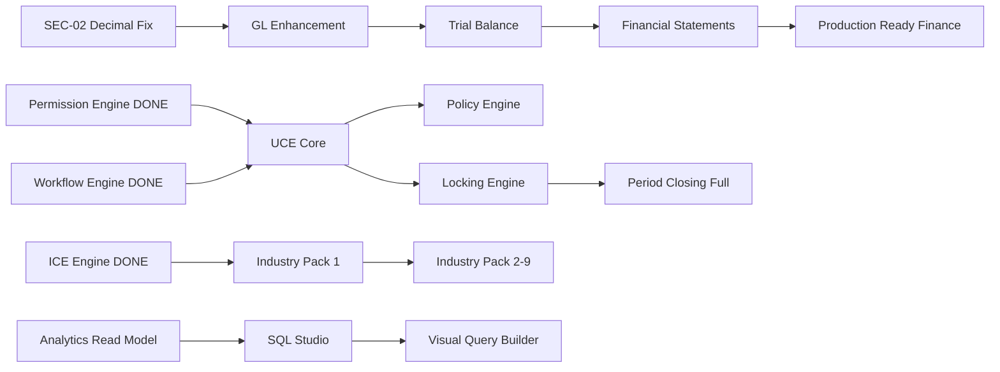
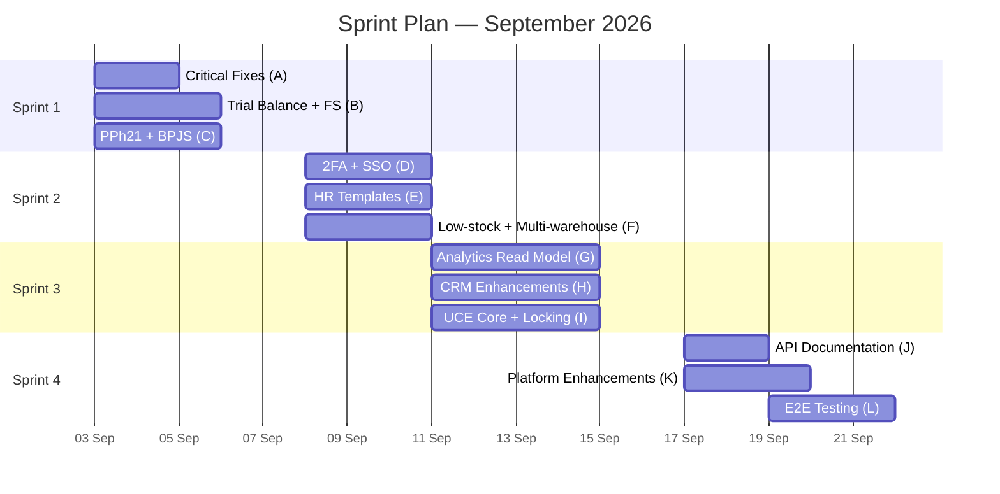

# 📊 Qalcuity — Comprehensive Remaining Features Analysis

> **Dokumen ini berisi analisis komprehensif SEMUA fitur yang tersisa di Qalcuity.**
> **Created:** 2 September 2026
> **Target:** End of September 2026
> **Data Sources:** FEATURES.md, CURRENT.md, docs/REMAINING-WORK.md, codebase scan

---

## 📋 Daftar Isi

1. [Summary Table](#1-summary-table--semua-fitur-dengan-status)
2. [Gap Analysis](#2-gap-analysis--fitur-yang-perlu-implementasi)
3. [Priority Ranking](#3-priority-ranking--fitur-paling-kritis)
4. [Estimated Effort](#4-estimated-effort--estimasi-work-per-fitur)
5. [Dependency Map](#5-dependency-map--peta-dependensi)
6. [Recommended Batch Plan](#6-recommended-batch-plan--rencana-parallel-execution)
7. [Blockers](#7-blockers--yang-menghalangi-percepatan)

---

## 1. Summary Table — Semua Fitur dengan Status

### 1.1 Ringkasan per Modul

| # | Module | production_ready | implemented | partial | planned | Total | Progress |
|---|--------|:---:|:---:|:---:|:---:|:---:|:---:|
| 1 | Core Platform & SaaS | 20 | 1 | 1 | 2 | 24 | 87% |
| 2 | Finance & Accounting | 5 | 1 | 3 | 16 | 25 | 25% |
| 3 | Sales & CRM | 5 | 0 | 4 | 12 | 21 | 24% |
| 4 | Inventory & Supply Chain | 4 | 0 | 0 | 14 | 18 | 22% |
| 5 | HR & People Ops | 4 | 0 | 4 | 16 | 24 | 17% |
| 6 | Operations & Project | 0 | 0 | 0 | 16 | 16 | 0% |
| 7 | Customer Support | 1 | 0 | 0 | 14 | 15 | 7% |
| 8 | Analytics Studio | 12 | 3 | 5 | 15 | 35 | 44% |
| 9 | AI Features | 0 | 1 | 3 | 14 | 18 | 6% |
| 10 | Integration & Ecosystem | 2 | 3 | 2 | 14 | 21 | 24% |
| 11 | Admin & Security | 3 | 2 | 2 | 13 | 20 | 25% |
| 12 | Unified Control Engine | 0 | 3 | 0 | 50+ | 53+ | 6% |
| 13 | Architecture Engines | 25 | 5 | 2 | 2 | 34 | 88% |
| 14 | Industry Packs | 0 | 0 | 0 | 50+ | 50+ | 0% |
| 15 | POS Module | 0 | 0 | 0 | 17 | 17 | 0% |
| 16 | Mobile | 0 | 3 | 0 | 2 | 5 | 60% |
| 17 | Desktop | 0 | 0 | 1 | 1 | 2 | 25% |
| 18 | Platform Control Center | 0 | 15 | 1 | 50+ | 66+ | 24% |
| | **TOTAL** | **~80** | **~37** | **~38** | **~270+** | **~425+** | **~27%** |

### 1.2 Status Global

| Status | Count | Percentage |
|--------|:-----:|:----------:|
| 🚀 production_ready | ~80 | ~19% |
| ✅ implemented | ~37 | ~9% |
| ✔️ verified | 1 | ~0% |
| 🔄 partial | ~38 | ~9% |
| 📋 planned | ~270+ | ~63% |
| **Total** | **~425+** | **100%** |

> **Catatan:** Total fitur meningkat dari ~269 (FEATURES.md) menjadi ~425+ karena REMAINING-WORK.md mendokumentasikan item-item granular yang lebih detail, terutama untuk Unified Control Engine (50+ items), Analytics Studio (50+ items), Platform Control Center (65+ items), dan Industry Packs (50+ items).

### 1.3 Detail Fitur per Modul — Status Lengkap

#### 1. Core Platform & SaaS (87%)

| Fitur | Status | Keterangan |
|-------|--------|------------|
| Tenant Management | 🚀 | Multi-tenant isolation, tenantId on all queries |
| User Management | 🚀 | CRUD, role assignment, tenant-scoped |
| Auth (NextAuth.js) | 🚀 | JWT + CredentialsProvider, bcryptjs |
| RBAC (4 Roles) | 🚀 | SUPERADMIN, ADMIN, MEMBER, VIEWER — 3 layers |
| Audit Trail | 🚀 | 132 audit calls across all mutation endpoints |
| Settings (6 Pages) | 🚀 | Company, Profile, Security, Team, Notifications, Billing |
| Demo Data | 🚀 | Comprehensive seed data |
| Dark Mode | 🚀 | Tailwind dark theme |
| Global Search | 🚀 | Ctrl+K shortcut, cross-module |
| i18n (ID/EN) | 🚀 | 433+ keys |
| Responsive Design | 🚀 | Mobile-first |
| Responsive Tables | 🚀 | Dual layout 19 pages |
| Zod Validation | 🚀 | 14+ schemas |
| RBAC Defense-in-depth | 🚀 | 3 layers |
| Lucide Icons | 🚀 | Consistent icon system |
| Empty States | 🚀 | All CRUD pages |
| Toast Notifications | 🚀 | Centralized toast provider |
| Confirmation Dialogs | 🚀 | 24 window.confirm replaced |
| Loading States | 🚀 | 28 loading.tsx files |
| Inline Error Banners | 🚀 | Form error display |
| Security Hardening | 🚀 | .gitignore, .env cleanup |
| Deploy Scripts | 🚀 | PM2 health check |
| E2E Test Suite | 🚀 | 63 tests |
| Performance Indexes | 🚀 | 57 database indexes |
| Subscription | ✅ | Midtrans payment integration |
| Billing | ✅ | Plan selection + Midtrans Snap |
| Notification | 🔄 | Bell ada, belum real-time push |
| Multi-entity & Multi-currency | 📋 | Belum ada kode |

#### 2. Finance & Accounting (25%)

| Fitur | Status | Keterangan |
|-------|--------|------------|
| Chart of Account | 🚀 | Template + custom, multi-level |
| General Ledger | ✅ | Journal Entry CRUD + double-entry |
| Journal Entry | ✅ | CRUD + UI + Zod validation |
| Invoices | 🚀 | Full CRUD, custom template |
| Quotations | 🚀 | Convert to invoice, version tracking |
| Payments | 🚀 | Multi-payment method, partial |
| Purchase Orders | 🚀 | Full CRUD, approval workflow |
| Supplier Management | 🚀 | Full CRUD, rating |
| Bank Reconciliation | 🚀 | Manual reconciliation |
| Tax Rate Management | ✅ | CRUD API + UI, invoice integration |
| Aging Report | 🔄 | Basic, belum 30/60/90 buckets |
| Bills & Expenses | 🔄 | Basic, belum AI categorization |
| Payment Processing | 🔄 | Basic, belum batch/scheduled |
| Period Closing Wizard | ✅ | 4-step wizard, belum 7-step full |
| Approval Engine | ✅ | Multi-level chains, belum delegation/SLA |
| Trial Balance | 📋 | Belum ada kode |
| Financial Statements | 📋 | Balance Sheet, Income Statement, Cash Flow |
| Credit Limit Management | 📋 | Belum ada kode |
| Multi-bank Account | 📋 | Belum ada kode |
| Petty Cash | 📋 | Belum ada kode |
| Bank Feed | 📋 | Belum ada kode |
| Coretax-ready | 📋 | Belum ada kode |
| e-Faktur | 📋 | Belum ada kode |
| PPh 21/23, PPN | 📋 | Belum ada kode |
| Tax Report | 📋 | Belum ada kode |
| Revenue Recognition | 📋 | ASC 606 / IFRS 15 |

#### 3. Sales & CRM (24%)

| Fitur | Status | Keterangan |
|-------|--------|------------|
| Contacts | 🚀 | Full CRUD |
| Deals (Kanban) | 🚀 | 6 stages, drag & drop |
| Pipeline View | 🚀 | List + Kanban |
| Custom Stages | 🚀 | 6 predefined stages |
| Leads | 🚀 | Full CRUD |
| Quote Builder | 🚀 | Custom template, convert to invoice |
| Deal Value Forecasting | 🔄 | Basic weighted, belum AI |
| Lead Source Tracking | 🔄 | Basic field, belum multi-touch |
| Convert to Order | 🔄 | Basic, belum seamless |
| Unified Profile | 🔄 | Basic, belum unified view |
| Transaction History | 🔄 | Invoice history, belum payment/order |
| Multiple Pipelines | 📋 | Belum ada kode |
| Lead Scoring | 📋 | Belum ada kode |
| Lead Assignment | 📋 | Belum ada kode |
| Approval Workflow | 📋 | Quote approval chain |
| Interaction Timeline | 📋 | Belum ada kode |
| Segmentation | 📋 | Belum ada kode |
| Win Probability / Next Best Action | 📋 | AI-powered |
| Sales Forecasting | 📋 | Belum ada kode |
| Competitor Analysis | 📋 | Belum ada kode |
| Commission Calculator | 📋 | Flexible rules |

#### 4. Inventory & Supply Chain (22%)

| Fitur | Status | Keterangan |
|-------|--------|------------|
| Products | 🚀 | Full CRUD, variants |
| Categories | 🚀 | Hierarchical |
| Stock Management | 🚀 | Real-time tracking |
| Stock Movements | 🚀 | In/out tracking |
| Suppliers | 🚀 | Full CRUD, rating |
| Batch/Lot Tracking | 📋 | Belum ada kode |
| Serial Number | 📋 | Belum ada kode |
| Bill of Materials | 📋 | Belum ada kode |
| Multi-warehouse | 📋 | Belum ada kode |
| Stock Opname | 📋 | Belum ada kode |
| Unit of Measure | 📋 | Belum ada kode |
| Auto-generated PO | 📋 | Belum ada kode |
| Goods Receipt | 📋 | Belum ada kode |
| Supplier Price Monitoring | 📋 | Belum ada kode |
| Putaway Rules | 📋 | Belum ada kode |
| Picking Strategy | 📋 | Belum ada kode |
| Barcode/QR Scanning | 📋 | Belum ada kode |
| Shipping Integration | 📋 | Belum adakode |
| Low-stock Alert | 📋 | Belum ada kode |
| Auto-reorder | 📋 | Belum ada kode |
| Demand Forecasting | 📋 | Belum ada kode |
| Dead Stock Detection | 📋 | Belum ada kode |

#### 5. HR & People Ops (17%)

| Fitur | Status | Keterangan |
|-------|--------|------------|
| Employees | 🚀 | Full CRUD |
| Attendance | 🚀 | Check-in/check-out |
| Leaves | 🚀 | Approval workflow |
| Payroll | 🚀 | Auto calculation |
| GPS Check-in | 🔄 | Basic, belum geofencing |
| Leave Balance | 🔄 | Basic, belum real-time |
| PPh 21 (Payroll) | 🔄 | Basic, belum complete |
| BPJS | 🔄 | Basic, belum complete |
| Payroll Report | 🔄 | Basic, belum SPT format |
| Digital Onboarding | 📋 | Belum ada kode |
| Org Chart | 📋 | Belum ada kode |
| Employee Self-Service | 📋 | Belum ada kode |
| Face Recognition | 📋 | Belum ada kode |
| Flexible Schedule | 📋 | Belum ada kode |
| Leave Calendar | 📋 | Belum ada kode |
| Public Holiday | 📋 | Belum ada kode |
| THR | 📋 | Belum ada kode |
| Template Builder (6 dokumen) | 📋 | Offer letter, kontrak, dll |
| OKR / 360 Feedback | 📋 | Performance management |

#### 6. Operations & Project (0%)

> **Seluruh modul ini BELUM ada kode sama sekali.**

| Fitur | Status | Keterangan |
|-------|--------|------------|
| Project Types / Gantt / Kanban | 📋 | 5 items |
| Resource Allocation / Budget | 📋 | 2 items |
| Task Assignment / Time Logging | 📋 | 3 items |
| Field Service (6 items) | 📋 | Job scheduling, checklist, dll |
| Quality & Compliance (4 items) | 📋 | Checklist, non-conformance, dll |

#### 7. Customer Support (7%)

| Fitur | Status | Keterangan |
|-------|--------|------------|
| Email (SMTP) | 🚀 | Nodemailer transport |
| WhatsApp Business | 📋 | Belum ada kode |
| Instagram / Live Chat / Facebook | 📋 | Belum ada kode |
| Ticket System | 📋 | Belum ada kode |
| Knowledge Base | 📋 | Belum ada kode |
| AI Chatbot | 📋 | Belum ada kode |
| Customer Portal | 📋 | Belum ada kode |

#### 8. Analytics Studio (44%)

| Fitur | Status | Keterangan |
|-------|--------|------------|
| Dashboard Stats | ✔️ | Real-time from dynamic API |
| Standard Reports (12 types) | 🚀 | Finance, Sales, HR, Inventory |
| Chart Components | 🚀 | Bar, Pie, Line |
| Export (CSV/Excel/Print) | 🚀 | Built-in export |
| Analytics Overview Dashboard | 🚀 | KPI cards, trend charts |
| Data Explorer | 🚀 | Point-and-click, 15 datasets |
| Analytics API (15 routes) | 🚀 | Complete API layer |
| @qalcuity/analytics package | 🚀 | Types, dimensions, metrics, engine |
| KPI Builder | 🚀 | CRUD + evaluation |
| Data Alerts | 🚀 | Alert rules + severity |
| Saved Reports | 🚀 | CRUD + execute |
| Charts Management | 🚀 | CRUD + create modal |
| Dashboard Builder | ✅ | CRUD dashboards, widget API ready |
| Data Dictionary | ✅ | CRUD entries + UI |
| Query History | ✅ | Search & filter |
| Dataset Explorer | 🔄 | API ada, UI belum |
| Export Engine | 🔄 | Basic export, belum lengkap |
| Metric Builder | 🔄 | Prisma model + API ready |
| Scheduled Queries | 🔄 | Model + API, UI scheduling belum |
| SQL Studio | 📋 | Monaco editor, syntax highlighting |
| Visual Query Builder | 📋 | Drag & drop |
| Chart Builder (visual) | 📋 | Auto-visualize |
| PIVOT Engine | 📋 | OLAP-style |
| Drill-down Analytics | 📋 | Hierarchical |
| Comparative Analysis | 📋 | MoM, QoQ, YoY |
| Data Lineage | 📋 | Track origins |
| Analytics Read Model | 📋 | 12 Materialized Views |
| SQL Parser & Validator | 📋 | Parse, validate, whitelist |
| AI Analyst | 📋 | NL → SQL → Execute |
| Automated Insights | 📋 | AI-generated |
| Industry Analytics | 📋 | Configurable templates |
| Advanced Segmentation | 📋 | RFM, clustering |
| + 24 API routes baru | 📋 | SQL, visual-query, convert, dll |

#### 9. AI Features (6%)

| Fitur | Status | Keterangan |
|-------|--------|------------|
| AI Chat | 🔄 | Mock responses, belum real AI |
| AI Provider (OpenAI/Mock) | ✅ | API route + fallback |
| AI Hub Page | ✅ | Overview dengan feature cards |
| AI Insights | 🔄 | Basic insight cards |
| Finance/Sales/Inventory/HR/Support Agent | 📋 | 5 agents, semua planned |
| NLP Query | 📋 | Belum ada kode |
| PDF Processing / OCR | 📋 | Belum ada kode |
| Auto-validation / Auto-entry | 📋 | Belum ada kode |
| Contract/JD/Email/Report Generator | 📋 | 4 template generators |
| Fraud/Data/Performance Anomaly | 📋 | 3 anomaly types |

#### 10. Integration & Ecosystem (24%)

| Fitur | Status | Keterangan |
|-------|--------|------------|
| Email/SMTP Config | ✅ | Nodemailer |
| Payment Gateway (Midtrans) | ✅ | Snap + webhook |
| Connection Status | ✅ | Dynamic fetch |
| Excel/CSV Export | 🚀 | Any report |
| Excel/CSV Import | ✅ | CSV/Excel parsers |
| REST API (51+ routes) | 🔄 | Belum public docs |
| API Key Management | 📋 | Belum ada kode |
| Xendit | 📋 | Belum ada kode |
| GraphQL | 📋 | Belum ada kode |
| Webhook | 📋 | Belum ada kode |
| API Documentation (OpenAPI) | 📋 | Belum ada kode |
| OAuth 2.0 | 📋 | Belum ada kode |
| Zapier/Make.com/n8n | 📋 | Belum ada kode |
| WhatsApp/Marketplace/Banking | 📋 | Belum ada kode |

#### 11. Admin & Security (25%)

| Fitur | Status | Keterangan |
|-------|--------|------------|
| NextAuth JWT | 🚀 | CredentialsProvider |
| RBAC (4 Roles) | 🚀 | Defense-in-depth |
| Audit Trail | 🚀 | 132 audit calls |
| Multi-tenant | 🚀 | tenantId isolation |
| Password Policy | ✅ | Min 8 chars |
| CSP Headers | ✅ | Content-Security-Policy |
| CORS Configuration | ✅ | Explicit config |
| Approval Workflow | ✅ | Multi-level chains |
| Session Management | 🔄 | JWT, belum multi-device |
| SSO | 📋 | Google, Microsoft |
| 2FA | 📋 | TOTP/HOTP |
| IP Whitelisting | 📋 | Per-tenant |
| Data-level Security | 📋 | Column/row level |
| Encryption at Rest | 📋 | AES-256 |
| Auto-backup | 📋 | Daily automated |
| Data Retention | 📋 | Automated policies |
| GDPR / UU PDP | 📋 | Compliance |
| SOC 2 Type II | 📋 | Target Phase 3 |
| Custom Branding | 📋 | White-label |
| Reseller Portal | 📋 | Belum ada kode |

#### 12. Unified Control Engine (6%)

| Fitur | Status | Keterangan |
|-------|--------|------------|
| Multi-level Approval Chains | ✅ | ApprovalLevel + ApprovalRequest |
| Approval Routing | ✅ | Configurable per entityType |
| Period Closing Wizard | ✅ | 4-step wizard |
| Pre-checks | ✅ | Validate unposted transactions |
| Monthly/Quarterly/Yearly Closing | ✅ | Basic closing |
| Unified Control Engine core | 📋 | Pipeline terpadu |
| Policy Engine (7 items) | 📋 | Rules, threshold, versioning |
| Transaction Lifecycle | 📋 | 7-status state machine |
| Amount-based Routing | 📋 | Route by nominal |
| Delegation (5 items) | 📋 | Framework, scope, audit |
| SoD Engine (5 items) | 📋 | Conflict detection |
| SLA Engine (4 items) | 📋 | Color coding, breach |
| Escalation Engine | 📋 | Deadline-based |
| Work Inbox (8 items) | 📋 | Personal dashboard |
| Locking Engine (4 items) | 📋 | Hierarchical locking |
| Exception Center (9 items) | 📋 | Dashboard anomali |
| Reason & Timeline (6 items) | 📋 | Mandatory reason |
| Adjustment Entries (3 items) | 📋 | Immutable corrections |
| Access Review & Emergency (7 items) | 📋 | Permission review |
| Control Dashboard (4 items) | 📋 | 3-tier dashboards |
| 10 Control Permissions | 📋 | Granular permissions |

#### 13. Architecture Engines (88%)

| Fitur | Status | Keterangan |
|-------|--------|------------|
| Permission Engine (can()) | 🚀 | 9 items production_ready |
| Workflow Engine | 🚀 | 8 items production_ready |
| Industry Config Engine | 🚀 | 9 items production_ready |
| Component Library (11 components) | ✅ | Button, Input, Select, dll |
| Entitlement Engine | ✅ | Plan-based access |
| Redis Rate Limiter | 🚀 | Production-ready |
| Permission Hooks (usePermission) | 📋 | UI-level |
| Workflow Configuration UI | 📋 | Visual editor |
| Industry Pack UI | 📋 | Dashboard config |

#### 14-17. POS, Industry Packs, Mobile, Desktop

| Module | Status | Keterangan |
|--------|--------|------------|
| POS (17 items) | 📋 | 0% — Core, shift, offline, dll |
| Industry Packs (9 packs) | 📋 | 0% — Retail s/d Healthcare |
| Mobile Auth | ✅ | JWT flow (login/register/refresh/me) |
| Mobile Screens | ✅ | 12 screens implemented |
| Mobile Offline | 📋 | Belum ada kode |
| Desktop Auth | 🔄 | Electron wrapper only |
| Desktop Offline | 📋 | Belum ada kode |

#### 18. Platform Control Center (24%)

| Fitur | Status | Keterangan |
|-------|--------|------------|
| Platform Layout (purple theme) | ✅ | Sidebar + header |
| Platform Dashboard | ✅ | Stats, activity, metrics |
| Platform Tenants | ✅ | List + detail |
| Platform Billing | ✅ | MRR/ARR, plan distribution |
| Platform Monitoring | ✅ | Health, services, resources |
| Platform Support | ✅ | Ticket list, search, filter |
| Platform Security | ✅ | Events, stats, filters |
| Tenant Settings Override | 📋 | Platform-level override |
| Plan Management | 📋 | Create/edit/archive |
| Subscription Lifecycle | 📋 | ACTIVE → ARCHIVED |
| Payment Review Workflow | 📋 | Transfer → Review |
| Auto-billing | 📋 | Scheduled billing |
| Usage-based Pricing | 📋 | Metered billing |
| Usage Metering (6 items) | 📋 | User, storage, API, tx |
| Error & Log Center (7 items) | 📋 | Grouping, severity, timeline |
| Queue Health | 📋 | Background job status |
| Support Enhancements (5 items) | 📋 | Auto-attach, notes, SLA |
| Impersonation (5 items) | 📋 | Request, approval, audit |
| Feature Flags (5 items) | 📋 | CRUD, rollout, A/B testing |
| Security Enhancements (4 items) | 📋 | API key, audit, IP, session |
| Superadmin Roles (7 roles) | 📋 | Owner, Admin, Billing, dll |
| Platform Apps (5 items) | 📋 | Separate Next.js app |

---

## 2. Gap Analysis — Fitur yang Perlu Implementasi

### 2.1 Features dengan UI tapi Backend Incomplete

| Fitur | UI Status | Backend Gap | Priority |
|-------|-----------|-------------|----------|
| Dataset Explorer | Page exists | API ready, UI belum connected | 🟠 HIGH |
| Metric Builder | Prisma model + API | UI page belum ada | 🟠 HIGH |
| Scheduled Queries | Prisma model + API | UI scheduling belum ada | 🟠 HIGH |
| Dashboard Builder | CRUD dashboards | Widget drag-drop UI belum | 🟠 HIGH |
| Export Engine | Basic lib/export.ts | CSV/Excel/PDF lengkap belum | 🟡 MEDIUM |
| Aging Report | Basic report | 30/60/90 day buckets belum | 🟡 MEDIUM |
| Bills & Expenses | Basic tracking | AI categorization belum | 🟡 MEDIUM |
| Payment Processing | Basic | Batch/scheduled belum | 🟡 MEDIUM |
| AI Chat | Mock responses | Real DB queries belum | 🟡 MEDIUM |
| AI Insights | Basic cards | Full insight engine belum | 🟡 MEDIUM |
| Session Management | JWT basic | Multi-device control belum | 🟡 MEDIUM |
| Deal Value Forecasting | Basic weighted | AI prediction belum | 🟡 MEDIUM |
| Lead Source Tracking | Basic field | Multi-touch attribution belum | 🟡 MEDIUM |
| GPS Check-in | Basic check-in | Geofencing belum | 🔵 LOW |
| Leave Balance | Basic tracking | Real-time belum | 🔵 LOW |
| PPh 21 / BPJS | Basic calculation | Complete rules belum | 🟠 HIGH |

### 2.2 Features dengan Backend tapi Tidak ada UI

| Fitur | Backend Status | UI Gap | Priority |
|-------|---------------|--------|----------|
| Analytics Read Model | Belum | Materialized Views (12) belum | 🟠 HIGH |
| SQL Parser & Validator | Belum | Core engine belum | 🟠 HIGH |
| Multi-entity | Belum | Entity model + switching belum | 🔵 LOW |
| Multi-currency | Belum | Currency model + conversion belum | 🔵 LOW |
| @qalcuity/api package | Belum | API contract definitions belum | 🟡 MEDIUM |

### 2.3 Features Tidak Implementasi Sama Sekali

| Module | Item Count | Complexity | Dependencies |
|--------|:----------:|:----------:|:------------:|
| Unified Control Engine (Core + Policy + SoD + SLA + Locking + Exception) | ~45 items | Very High | Phase 9-10 |
| Operations & Project | 16 items | High | None |
| Customer Support (Ticket, KB, Portal) | 14 items | High | None |
| POS Module | 17 items | Very High | Inventory + Finance |
| Industry Packs (9 packs) | ~50 items | Very High | ICE engine (done) |
| Platform Control Center (remaining) | ~50 items | High | Phase 9 |
| Finance: Tax Engine (Coretax, e-Faktur, PPh21/23, PPN) | 6 items | Very High | Tax Rate (done) |
| Finance: Revenue Recognition | 1 item | Very High | GL |
| Finance: Financial Statements | 1 item | Very High | GL + JE |
| CRM: AI-powered features | 6 items | High | Historical data |
| HR: Template Builder (6 docs) | 6 items | Medium | Template engine |
| HR: Performance & OKR | 4 items | High | None |
| AI: 5 Agent capabilities | 5 items | Very High | AI provider + modules |
| AI: Document Extraction (4 items) | 4 items | High | ML libraries |
| Integration: WhatsApp/Marketplace/Banking | 4 items | Very High | External APIs |

### 2.4 Features Placeholder/TODO

| Fitur | Keterangan |
|-------|------------|
| Notification | Bell icon ada, tapi belum real-time push |
| AI Chat | Mock responses, belum real AI queries |
| REST API | 51+ routes, tapi belum public API docs |
| Desktop App | Electron wrapper only, belum auth |
| Entitlement Engine | ~75% implemented, belum full lifecycle |

---

## 3. Priority Ranking — Fitur Paling Kritis untuk Production

### 🔴 CRITICAL — Harus Dikerjakan untuk Production-Ready

> **Fitur ini mempengaruhi keamanan, stabilitas, atau minimal viable production readiness.**

| # | ID | Fitur | Module | Alasan |
|---|-----|-------|--------|--------|
| 1 | SEC-02 | TypeScript Decimal type fix | Core | Pre-existing type mismatch, bisa menyebabkan data corruption |
| 2 | SEC-07 | Password policy configurable | Auth | Min 8 chars belum cukup untuk compliance |
| 3 | FIN-TAX-03/04/05 | PPh 21/23 + PPN calculation | Finance | Mandatory untuk bisnis Indonesia |
| 4 | FIN-GL-03 | Trial Balance | Finance | Dasar accounting — tanpa ini financial statements tidak mungkin |
| 5 | FIN-GL-04 | Financial Statements | Finance | Balance Sheet, Income Statement, Cash Flow — kebutuhan utama |
| 6 | UCE-24/25 | Locking Engine | Control | Period closing tanpa locking = data bisa diubah setelah closing |
| 7 | HR-PY-01/02 | PPh 21 complete + BPJS | HR | Kalkulasi pajak dan BPJS harus benar untuk payroll |
| 8 | INV-AI-01 | Low-stock Alert | Inventory | Feature sederhana tapi high impact untuk operasional |

### 🟠 HIGH — Core Business Logic

> **Fitur yang meningkatkan value proposition dan competitive advantage.**

| # | ID | Fitur | Module | Alasan |
|---|-----|-------|--------|--------|
| 9 | FIN-GL-01/02 | Full GL + Journal Entry enhancement | Finance | Fondasi accounting |
| 10 | FIN-AR-01 | Aging Report 30/60/90 | Finance | Cash flow management |
| 11 | FIN-AP-01 | Bills & Expenses | Finance | AP completeness |
| 12 | UCE-01/02 | Unified Control Engine core | Control | Pipeline traceability |
| 13 | UCE-04/05 | Policy Engine + Amount Threshold | Control | Business rules automation |
| 14 | UCE-22/23 | Work Inbox | Control | User productivity |
| 15 | SUP-TK-01 | Ticket System | Support | Customer service basics |
| 16 | CRM-PL-01 | Multiple Pipelines | CRM | Sales team flexibility |
| 17 | CRM-360-01 | Customer 360° | CRM | Customer insight |
| 18 | INV-SM-01 | Multi-warehouse | Inventory | Multi-location businesses |
| 19 | SEC-AUTH-02 | 2FA | Auth | Security baseline |
| 20 | A-FND-01/02 | Analytics Read Model | Analytics | Performance untuk analytics |

### 🟡 MEDIUM — Feature Completeness

> **Fitur yang meningkatkan kedalaman modul.**

| # | ID | Fitur | Module |
|---|-----|-------|--------|
| 21 | FIN-AR-02 | Credit Limit Management | Finance |
| 22 | FIN-AP-02/03 | Batch/Scheduled Payments | Finance |
| 23 | FIN-BC-01/02 | Multi-bank + Petty Cash | Finance |
| 24 | CRM-LM-01/02 | Lead Scoring + Assignment | CRM |
| 25 | CRM-QO-01 | Seamless Convert to Order | CRM |
| 26 | INV-PM-01 | Batch/Lot Tracking | Inventory |
| 27 | INV-PR-01/02 | Auto PO + Goods Receipt | Inventory |
| 28 | HR-EM-01/02 | Digital Onboarding + Org Chart | HR |
| 29 | HR-LV-01/02 | Leave Balance + Calendar | HR |
| 30 | HR-TB-01 | Template Builder (Offer Letter) | HR |
| 31 | SEC-AUTH-01 | SSO (Google) | Auth |
| 32 | SEC-DP-02 | Auto-backup | Security |
| 33 | INT-API-01 | API Documentation (OpenAPI) | Integration |
| 34 | A-SQL-01/03 | SQL Studio | Analytics |
| 35 | A-CHART-01 | Chart Engine | Analytics |

### 🔵 LOW — Advanced Features

> **Fitur advanced, bisa di-defer ke phase berikutnya.**

| # | ID | Fitur | Module |
|---|-----|-------|--------|
| 36 | FIN-REV-01 | Revenue Recognition (ASC 606) | Finance |
| 37 | FIN-TAX-01/02 | Coretax + e-Faktur | Finance |
| 38 | CRM-AI-* | Sales Intelligence (AI) | CRM |
| 39 | CRM-COM-* | Commission Calculator | CRM |
| 40 | OPS-* | Operations & Project (all) | Operations |
| 41 | UCE-13/14/15 | SoD Engine | Control |
| 42 | UCE-16/17/18 | SLA & Escalation | Control |
| 43 | AI-* | All AI features | AI |
| 44 | POS-* | POS Module (all) | POS |
| 45 | IP-* | Industry Packs (all 9) | Industry |
| 46 | PLT-* | Platform Control Center (remaining) | Platform |
| 47 | INT-* | Integration Ecosystem (all) | Integration |
| 48 | Mobile/Desktop Offline | Offline support | Mobile/Desktop |

---

## 4. Estimated Effort — Estimasi Work per Fitur

> **Estimasi berdasarkan complexity rating dari REMAINING-WORK.md.**
> **1 unit = 1 hari kerja efektif (1 developer). Tidak ada estimate waktu — hanya complexity units.**

### 4.1 Per Module Summary

| Module | Total Items | Complexity Distribution | Total Units |
|--------|:----------:|:----------------------:|:-----------:|
| Security Fixes (SEC-02, SEC-07) | 2 | Low x2 | 2 |
| Finance: Core Accounting | 4 | High x2 + Medium x2 | 12 |
| Finance: AR/AP/Bank | 6 | Medium x6 | 12 |
| Finance: Tax (PPh21/23/PPN) | 3 | High x3 | 18 |
| Finance: Tax (Coretax/e-Faktur) | 2 | Very High x2 | 20 |
| Finance: Revenue Recognition | 1 | Very High | 12 |
| Finance: Financial Statements | 1 | Very High | 15 |
| CRM: Pipeline/Lead enhancements | 5 | High x3 + Medium x2 | 21 |
| CRM: Customer 360 | 3 | High x1 + Medium x2 | 11 |
| CRM: AI Intelligence | 4 | High x4 | 24 |
| CRM: Commission | 2 | High x1 + Medium x1 | 8 |
| Inventory: Core extensions | 6 | High x3 + Medium x3 | 27 |
| Inventory: Warehouse | 4 | Medium x4 | 12 |
| Inventory: AI Intelligence | 4 | High x2 + Medium x2 | 16 |
| HR: Employee/Attendance | 6 | High x3 + Medium x3 | 27 |
| HR: Leave/Payroll | 7 | High x3 + Medium x3 + Low x1 | 25 |
| HR: Template Builder | 6 | Medium x3 + Low x3 | 9 |
| HR: Performance/OKR | 4 | High x2 + Medium x2 | 16 |
| Operations & Project | 16 | High x8 + Medium x8 | 96 |
| Customer Support | 14 | High x7 + Medium x7 | 70 |
| Analytics: Foundation | 7 | Very High x2 + High x3 + Medium x2 | 42 |
| Analytics: SQL Studio | 7 | High x3 + Medium x4 | 25 |
| Analytics: Visual Query Builder | 4 | Very High x2 + High x1 + Medium x1 | 33 |
| Analytics: Charts | 4 | High x2 + Medium x2 | 16 |
| Analytics: Dashboard Builder | 6 | Very High x1 + High x1 + Medium x4 | 22 |
| Analytics: Advanced | 6 | High x3 + Medium x3 | 27 |
| Analytics: Intelligence | 6 | Very High x2 + High x4 | 44 |
| Analytics: AI | 5 | Very High x3 + High x2 | 47 |
| Analytics: API Routes (24) | 24 | Medium x24 | 24 |
| AI: Hub/Chat | 3 | High x2 + Medium x1 | 11 |
| AI: Agents (5) | 5 | Very High x5 | 75 |
| AI: Document Extraction | 4 | High x2 + Medium x2 | 16 |
| AI: Template Generator | 4 | High x1 + Medium x3 | 10 |
| AI: Anomaly Detection | 3 | Very High x1 + High x1 + Medium x1 | 15 |
| Unified Control Engine | ~45 | Very High x8 + High x18 + Medium x15 + Low x4 | 250+ |
| POS Module | 17 | Very High x3 + High x5 + Medium x9 | 80 |
| Industry Packs (9) | 50+ | Very High x9 + High x18 + Medium x23 | 250+ |
| Platform Control Center | ~50 | Very High x5 + High x20 + Medium x25 | 225+ |
| Integration & Ecosystem | 14 | Very High x3 + High x5 + Medium x6 | 52 |
| Security (remaining) | 8 | High x5 + Medium x3 | 29 |
| Mobile/Desktop | 4 | Very High x1 + High x2 + Medium x1 | 18 |

### 4.2 Grand Total Complexity Units

| Category | Units |
|----------|:-----:|
| Critical (items 1-8) | ~75 |
| High (items 9-20) | ~230 |
| Medium (items 21-35) | ~210 |
| Low (items 36-48) | ~1,050+ |
| **TOTAL** | **~1,565+** |

---

## 5. Dependency Map — Peta Dependensi

### 5.1 Core Dependency Chains

```mermaid
graph TD
    SEC[Security Fixes] --> GL[General Ledger]
    GL --> TB[Trial Balance]
    GL --> FS[Financial Statements]
    GL --> REV[Revenue Recognition]
    JE[Journal Entry] --> TB
    TB --> FS
    
    GL --> TA[Locking Engine]
    TA --> PC[Period Closing Full]
    
    PE[Permission Engine] --> UCE[Unified Control Engine]
    WE[Workflow Engine] --> UCE
    UCE --> POL[Policy Engine]
    UCE --> SOD[SoD Engine]
    UCE --> SLA_E[SLA Engine]
    UCE --> ESC[Escalation Engine]
    UCE --> WIB[Work Inbox]
    UCE --> LCK[Locking Engine]
    UCE --> EXC[Exception Center]
    
    PE --> ICE[Industry Config]
    
    INV_CORE[Inventory Core] --> MW[Multi-warehouse]
    MW --> SO[Stock Opname]
    MW --> PW[Putaway Rules]
    MW --> PS[Picking Strategy]
    
    FIN_CORE[Finance Core] --> TAX[Tax Engine PPh/PPN]
    FIN_CORE --> AR[Aging Report]
    FIN_CORE --> AP[Bills & Expenses]
    
    HR_CORE[HR Core] --> PPHY[PPh 21 Complete]
    PPHY --> BPJS[BPJS]
    PPHY --> PR[Payroll Report]
    
    TPL[Template Engine] --> TB_T[Template Builder 6 docs]
    
    AI_PROV[AI Provider] --> AG[5 AI Agents]
    AI_PROV --> DOC_EX[Document Extraction]
    AI_PROV --> TPL_AI[AI Template Generator]
    AI_PROV --> ANM[Anomaly Detection]
    
    POS_CORE[POS Core] --> POS_S[POS Shift]
    POS_CORE --> POS_P[POS Payments]
    POS_CORE --> POS_O[POS Offline]
    
    ICE_DONE[Industry Config Engine DONE] --> IP[9 Industry Packs]
    
    A_FND[Analytics Read Model] --> A_SQL[SQL Studio]
    A_FND --> A_VQB[Visual Query Builder]
    A_FND --> A_ADV[Advanced Analytics]
    A_FND --> A_AI[AI Analytics]
    
    API_DOC[API Documentation] --> WEBHOOK[Webhook]
    WEBHOOK --> ZAPIER[Zapier/Make/n8n]
```

### 5.2 Critical Path

### 5.3 Independent Tracks (Parallel Execution Possible)

| Track | Items | Dependencies |
|-------|-------|:------------:|
| **Finance Core** | GL, TB, FS, Aging, Expenses | SEC-02 |
| **Security** | 2FA, SSO, Password Policy | None |
| **CRM Enhancements** | Multiple pipelines, Customer 360, Lead scoring | None |
| **Inventory Extensions** | Multi-warehouse, Batch, BOM | None |
| **HR Extensions** | Onboarding, Org Chart, Templates, PPh21 | None |
| **Analytics Foundation** | Read Model, SQL Parser, SQL Studio | Permission Engine |
| **Operations** | Project Management, Task, Field Service | None |
| **Support** | Ticket System, Knowledge Base | None |
| **Control Engine** | UCE Core, Policy, SLA, Locking | Permission + Workflow |
| **AI Features** | Agents, NLP, Document Extraction | AI Provider |
| **POS** | Core, Shift, Offline | Inventory + Finance |
| **Platform** | Remaining PCC features | Permission Engine |
| **Integration** | API Docs, Webhooks, Connectors | None |

---

## 6. Recommended Batch Plan — Rencana Parallel Execution

> **Mengingat target End of September 2026 (~4 minggu), rencana ini memprioritaskan fitur yang memberikan dampak terbesar.**

### Sprint 1: Critical Fixes + Finance Foundation (Minggu 1)

> **Fokus: Fix bugs + Finance core yang paling dibutuhkan.**

| Batch | Items | Developer | Output |
|-------|-------|:---------:|--------|
| **Batch A: Critical Fixes** | SEC-02 (Decimal fix), SEC-07 (Password policy) | 1 | 2 items, 2 units |
| **Batch B: Trial Balance + Financial Statements** | FIN-GL-03, FIN-GL-04 | 1 | Trial Balance report + 3 financial statements |
| **Batch C: PPh 21 + BPJS Complete** | HR-PY-01, HR-PY-02 | 1 | Complete payroll tax calculation |

**Parallel Track:** Batch A dan B/C bisa dikerjakan bersamaan (2 developers).

### Sprint 2: Security + HR + Inventory (Minggu 2)

> **Fokus: Security hardening + HR completeness + Inventory basic extensions.**

| Batch | Items | Developer | Output |
|-------|-------|:---------:|--------|
| **Batch D: 2FA + SSO** | SEC-AUTH-01, SEC-AUTH-02 | 1 | Google SSO + TOTP 2FA |
| **Batch E: HR Templates** | HR-TB-01 s/d HR-TB-06 | 1 | 6 document templates |
| **Batch F: Low-stock Alert + Multi-warehouse** | INV-AI-01, INV-SM-01 | 1 | Alert engine + warehouse model |

**Parallel Track:** Batch D, E, F bisa dikerjakan bersamaan (3 developers).

### Sprint 3: Analytics + CRM + Control Engine Core (Minggu 3)

> **Fokus: Analytics read model + CRM enhancements + UCE foundation.**

| Batch | Items | Developer | Output |
|-------|-------|:---------:|--------|
| **Batch G: Analytics Read Model** | A-FND-01, A-FND-02 | 1 | 12 Materialized Views + refresh strategy |
| **Batch H: CRM Enhancements** | CRM-PL-01, CRM-360-01, CRM-LM-01 | 1 | Multiple pipelines + Customer 360 + Lead scoring |
| **Batch I: UCE Core + Locking** | UCE-01, UCE-02, UCE-24, UCE-25 | 1 | Unified pipeline + Locking engine |

**Parallel Track:** Batch G, H, I bisa dikerjakan bersamaan (3 developers).

### Sprint 4: Platform + Integration + Polish (Minggu 4)

> **Fokus: Platform completeness + API docs + bug fixes + testing.**

| Batch | Items | Developer | Output |
|-------|-------|:---------:|--------|
| **Batch J: API Documentation** | INT-API-01 | 1 | OpenAPI/Swagger docs |
| **Batch K: Platform Enhancements** | PLT-SE-03, PLT-UM-01, PLT-EL-01 | 1 | Subscription lifecycle + basic metering |
| **Batch L: E2E Testing + Regression** | All sprint items | 1+ | Full regression testing |

### Parallel Execution Map

### Maximum Parallelism: 3 developers simultaneously

| Developer | Sprint 1 | Sprint 2 | Sprint 3 | Sprint 4 |
|-----------|----------|----------|----------|----------|
| Dev 1 | SEC fixes (A) | 2FA + SSO (D) | Analytics (G) | API Docs (J) |
| Dev 2 | Finance (B) | HR Templates (E) | CRM (H) | Platform (K) |
| Dev 3 | Payroll (C) | Inventory (F) | UCE Core (I) | Testing (L) |

---

## 7. Blockers — Yang Menghalangi Percepatan

### 🔴 Critical Blockers

| # | Blocker | Impact | Mitigation |
|---|---------|--------|------------|
| 1 | **TypeScript Decimal type mismatch (SEC-02)** | Finance calculations bisa salah — type error di reports | Fix segera, low complexity |
| 2 | **Financial Statements belum ada** | Tidak bisa producing Balance Sheet, Income Statement — fundamental accounting | Prioritas tinggi, high complexity |
| 3 | **Locking Engine belum ada** | Period closing tanpa locking = data bisa diubah setelah closing — integrity risk | Implement basic locking |
| 4 | **PPh 21 / BPJS belum complete** | Payroll calculation tidak comply dengan regulasi Indonesia | Prioritas untuk target market |

### 🟠 Significant Blockers

| # | Blocker | Impact | Mitigation |
|---|---------|--------|------------|
| 5 | **Analytics Read Model belum ada** | SQL queries langsung ke production DB — performance risk | Create Materialized Views |
| 6 | **AI Provider masih mock** | AI features tidak functional | Real OpenAI integration atau local LLM |
| 7 | **@qalcuity/api package belum dibuat** | Tidak ada API contract definition — integration risk | Create basic API contracts |
| 8 | **Work Inbox belum ada** | User tidak punya central task management | Implement basic Work Inbox |
| 9 | **Webhook belum ada** | Tidak bisa integrasi dengan external systems | Implement basic webhook dispatcher |

### 🟡 Moderate Blockers

| # | Blocker | Impact | Mitigation |
|---|---------|--------|------------|
| 10 | **Multi-entity belum ada** | Single company per tenant — limitation untuk group companies | Defer ke later phase |
| 11 | **Multi-currency belum ada** | Tidak support transaksi multi-valuta | Defer ke later phase |
| 12 | **Coretax/e-Faktur belum ada** | Tidak comply dengan regulasi pajak digital Indonesia | Phase berikutnya |
| 13 | **POS belum ada** | Tidak ada point-of-sale untuk industri retail/F&B | Phase berikutnya |
| 14 | **Industry Packs belum ada** | Tidak ada industry-specific configuration | Phase berikutnya |
| 15 | **Platform Control Center incomplete** | Superadmin tools terbatas | Enhance bertahap |

### ⚠️ Technical Debt / Known Issues

| # | Issue | Impact | Status |
|---|-------|--------|--------|
| 1 | Session Management belum multi-device | User bisa login dari banyak device tanpa kontrol | 🔄 Partial |
| 2 | Notification belum real-time push | User harus refresh untuk melihat notifikasi baru | 🔄 Partial |
| 3 | Permission Hooks (usePermission) belum ada | UI belum menggunakan granular permission engine | 📋 Planned |
| 4 | Migration from 4-role RBAC belum selesai | Dual system: old RBAC + new permission engine | 🔄 Partial |
| 5 | Workflow Configuration UI belum ada | User tidak bisa visual editor workflow | 📋 Planned |
| 6 | Desktop App hanya wrapper | Belum ada auth/offline integration | 🔄 Partial |

---

## 📊 Kesimpulan & Rekomendasi

### Realistic Assessment untuk End of September 2026

Dengan 4 minggu tersisa dan asumsi 1-2 developers:

| Category | Items | Achievable | Not Achievable |
|----------|:-----:|:----------:|:--------------:|
| Critical Fixes | 2 | ✅ 2/2 | — |
| Finance Core | 6 | ✅ 4/6 | Coretax, Revenue Recognition |
| HR Enhancements | 13 | ✅ 8/13 | Face Recognition, OKR, 360 |
| Inventory Extensions | 6 | ✅ 3/6 | BOM, Barcode, Shipping |
| Security | 8 | ✅ 3/8 | IP Whitelist, Data-level, SOC2 |
| Analytics (remaining) | ~60 | ✅ 15/60 | AI Analytics, Visual Builder |
| CRM | 12 | ✅ 4/12 | AI Intelligence, Commission |
| UCE | ~45 | ✅ 8/45 | SoD, SLA, Escalation, Full |
| Operations | 16 | ❌ 0/16 | All |
| Customer Support | 14 | ❌ 0/14 | All |
| AI Features | 18 | ❌ 2/18 | Agents, NLP, OCR |
| POS | 17 | ❌ 0/17 | All |
| Industry Packs | 50+ | ❌ 0/50 | All |
| Platform PCC | ~50 | ✅ 5/50 | Remaining 45 |
| Integration | 14 | ✅ 2/14 | External APIs |

### Top 10 Rekomendasi untuk September 2026

1. **Fix SEC-02 (Decimal type)** — 1 hari, high impact
2. **Trial Balance + Financial Statements** — 3-4 hari, essential accounting
3. **PPh 21 Complete + BPJS** — 3 hari, regulatory compliance
4. **2FA + SSO (Google)** — 3 hari, security baseline
5. **HR Template Builder (6 docs)** — 3 hari, pain point solution
6. **Low-stock Alert + Multi-warehouse** — 3 hari, operational value
7. **Analytics Read Model (12 MV)** — 4 hari, analytics performance
8. **Customer 360 + Multiple Pipelines** — 4 hari, CRM value
9. **UCE Core + Locking Engine** — 4 hari, control foundation
10. **API Documentation (OpenAPI)** — 2 hari, developer experience

### Post-September Priorities

| Phase | Focus | Dependencies |
|-------|-------|:------------:|
| October | UCE: Policy, SLA, Escalation, SoD | UCE Core |
| November | Operations & Support modules | None |
| December | POS Module | Inventory + Finance |
| Q1 2027 | AI Features + Industry Packs | All foundations |
| Q2 2027 | Platform Control Center Full | Permission Engine |

---

> **Dokumen ini diperbarui:** 2 September 2026
> **Maintainer:** Qalcuity AI Team
> **Version:** 1.0 — Comprehensive Remaining Features Analysis
> **Related Documents:** [FEATURES.md](../FEATURES.md), [CURRENT.md](../CURRENT.md), [docs/REMAINING-WORK.md](REMAINING-WORK.md)
