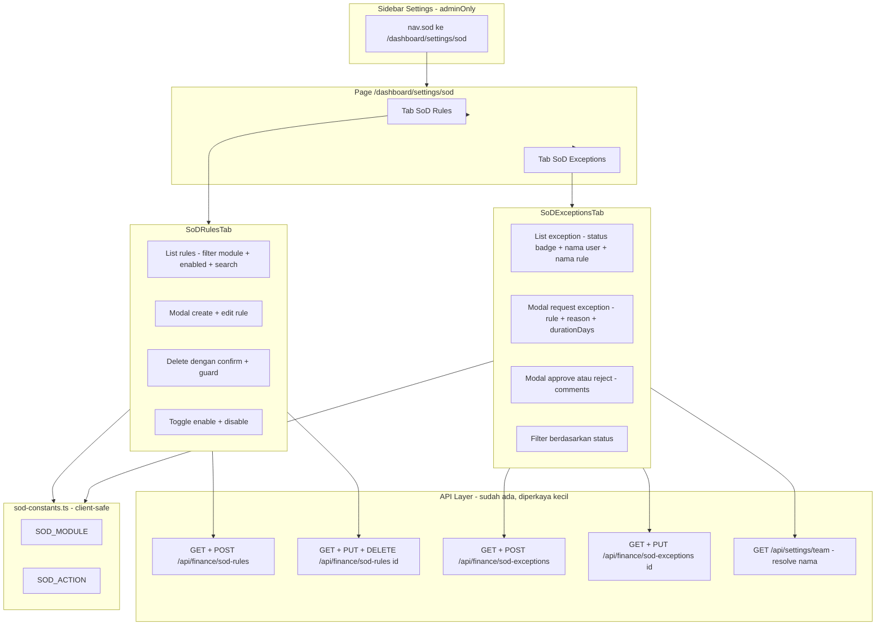

# Rencana — Halaman Manajemen SoD Dedicated (Session 70n)

> **Permintaan user:** Buat halaman manajemen SoD dedicated — CRUD untuk SoDRule + SoDException (UI di luar control-engine, data records bukan config).
>
> **Status:** MENUNGGU APPROVAL — belum ada kode yang diubah.

---

## 1. Konteks & Temuan Inspeksi

### Yang SUDAH siap (tidak perlu diubah)

| Komponen | Status | Lokasi |
|----------|--------|--------|
| Model `SoDRule` | ✅ | `packages/db/prisma/schema.prisma:2868` — name unique per tenant, role1/role2/module/action/enabled |
| Model `SoDException` | ✅ | `packages/db/prisma/schema.prisma:2939` — status PENDING/APPROVED/REJECTED/EXPIRED, expiresAt |
| API SoD Rules | ✅ lengkap | `apps/web/app/api/finance/sod-rules/route.ts` (GET list + POST create), `[id]/route.ts` (GET/PUT/DELETE), `check/route.ts` (POST test konflik) |
| API SoD Exceptions | ✅ | `apps/web/app/api/finance/sod-exceptions/route.ts` (GET list + POST request), `[id]/route.ts` (GET + PUT approve/reject) |
| Zod schemas | ✅ | `apps/web/lib/validation-schemas.ts:2224` — `createSoDRuleSchema`, `updateSoDRuleSchema`, `requestSoDExceptionSchema`, `approveSoDExceptionSchema` |
| RBAC | ✅ | `apps/web/lib/route-permissions.ts:57-61` — semua route SoD → `settings:edit`, fallback ADMIN |
| Enforcement engine | ✅ | `apps/web/lib/sod-enforcement.ts` (Session 70m) — sudah live di production |
| Team members API | ✅ | `apps/web/app/api/settings/team/route.ts` GET — untuk resolve nama user di daftar exception |

### Gap yang perlu diisi

1. **Tidak ada UI sama sekali** — 0 hasil search SoD di `apps/web/app/dashboard` (dikonfirmasi).
2. **List exception hanya return ID mentah** (`ruleId`, `userId`, `approverId`) tanpa nama — UI harus resolve manual, atau API di-enrich.
3. **POST exception hanya untuk diri sendiri** — `userId` diambil dari session; admin tidak bisa request atas nama user lain (kebutuhan wajar di halaman management).
4. **DELETE rule tidak ada guard** — `SoDException.ruleId` string tanpa FK cascade; delete rule menyisakan orphan exception (PENDING/APPROVED).
5. **Constant `SOD_MODULE`/`SOD_ACTION` tidak aman untuk client** — ada di `sod-enforcement.ts` yang meng-import prisma via `sod-engine.ts`; page client tidak boleh import ini (bundling prisma ke client).
6. **Nav & i18n belum ada** — `nav.sod` + namespace `settings.sod.*` belum ada di `messages/id.json` / `messages/en.json`.

---

## 2. Arsitektur Solusi

---

## 3. Scope

### IN (dikerjakan)

**Backend (enhancement kecil, read-safe):**

1. **Extract constants ke client-safe module** — buat `apps/web/lib/sod-constants.ts` (zero import) berisi `SOD_MODULE` + `SOD_ACTION`; `sod-enforcement.ts` re-export dari sini (test 9/9 yang import dari sod-enforcement tetap pass).
2. **Enrich GET `/api/finance/sod-exceptions`** — tambah field `ruleName`, `userName`, `approverName` (join/lookup sekali, read-only).
3. **POST `/api/finance/sod-exceptions`** — terima optional `userId` (ADMIN/SUPERADMIN hanya; validasi user exist di tenant); non-admin abaikan param. Ganti inline schema dengan `requestSoDExceptionSchema` dari validation-schemas (extend dengan `userId` optional) + `sanitizeObject` untuk konsistensi.
4. **Guard DELETE `/api/finance/sod-rules/[id]`** — return 409 jika ada exception `PENDING`/`APPROVED` yang mereferensikan rule; message sarankan disable (`enabled: false`) sebagai gantinya.

**Frontend:**

5. **Halaman `/dashboard/settings/sod`** — shell page dengan 2 tab (ikuti pola control-engine, tapi data-CRUD):
   - `page.tsx` — shell + tab switch + fetch awal
   - `components/SoDRulesTab.tsx` — list (desktop tabel + mobile card), filter module/enabled, search name, modal create/edit (name, description, role1, role2, module select dari `SOD_MODULE`, action select dari `SOD_ACTION` + opsi "semua action", enabled toggle), delete confirm dialog, toggle enable/disable cepat
   - `components/SoDExceptionsTab.tsx` — list dengan nama user/rule (resolved), status badge 4 warna, filter status, modal request (rule select, reason textarea min 10 char, durationDays 1-90 default 30, user select untuk admin on-behalf), modal approve/reject (comments optional), sembunyikan approve jika current user = requester (self-approval diblokir server-side), **tanpa tombol delete** (audit trail, status transition only)
6. **Nav** — `apps/web/components/layout/sidebar.tsx` tambah entry di children Settings setelah control-engine: `{ label: t('nav.sod'), href: '/dashboard/settings/sod' }` (adminOnly mengikuti parent).
7. **i18n** — tambah `nav.sod` + namespace `settings.sod.*` ke `apps/web/messages/id.json` DAN `apps/web/messages/en.json` (kedua file wajib).

### OUT (tidak dikerjakan / follow-up)

- ❌ Halaman "Test Rule" via `/api/finance/sod-rules/check` — endpoint sudah ada, UI check interaktif = follow-up.
- ❌ Perubahan enforcement engine / schema.prisma / middleware — tidak perlu, Do Not Touch.
- ❌ DELETE exception — by design tidak ada (audit trail); UI tidak menawarkan.
- ❌ Unit test route baru — perubahan backend tipis (join + param optional); verifikasi via tsc + smoke test runtime, mengikuti pola existing yang tidak punya route unit test.

---

## 4. File yang Dibuat / Diubah

| Aksi | File | Ringkasan |
|------|------|-----------|
| BARU | `apps/web/lib/sod-constants.ts` | `SOD_MODULE` + `SOD_ACTION`, client-safe, zero import |
| UBAH | `apps/web/lib/sod-enforcement.ts` | Re-export constants dari `./sod-constants` (hapus definisi lokal) |
| UBAH | `apps/web/app/api/finance/sod-exceptions/route.ts` | GET enrich nama; POST optional `userId` + pakai shared schema + sanitize |
| UBAH | `apps/web/app/api/finance/sod-rules/[id]/route.ts` | DELETE guard exception aktif → 409 |
| BARU | `apps/web/app/dashboard/settings/sod/page.tsx` | Shell halaman + 2 tab |
| BARU | `apps/web/app/dashboard/settings/sod/components/SoDRulesTab.tsx` | CRUD rules |
| BARU | `apps/web/app/dashboard/settings/sod/components/SoDExceptionsTab.tsx` | List + request + approve/reject exceptions |
| UBAH | `apps/web/components/layout/sidebar.tsx` | Entry nav `nav.sod` |
| UBAH | `apps/web/messages/id.json` | `nav.sod` + `settings.sod.*` |
| UBAH | `apps/web/messages/en.json` | `nav.sod` + `settings.sod.*` |
| UBAH | `CURRENT.md` | Entry Session 70n |
| UBAH | `FEATURES.md` | Row SoD UI di section 12.5 |

> **Catatan pola:** sebelum menulis page, inspect sibling (`control-engine/`, `custom-fields/`) untuk memastikan apakah route perlu `loading.tsx`/`error.tsx` sendiri atau mengandalkan `settings/loading.tsx` + `settings/error.tsx` yang sudah ada. Ikuti konvensi yang ditemukan.

---

## 5. Desain UI (Ringkas)

### Rules Tab

| Kolom (desktop) | Card (mobile) |
|-----------------|---------------|
| Name + description | Name + enabled badge |
| Role1 ↔ Role2 | Role1 ↔ Role2 |
| Module | Module + Action |
| Action | Enabled indicator |
| Enabled (badge) | — |
| Updated | Updated |
| Aksi: Edit, Toggle, Delete | Aksi: Edit, Toggle, Delete |

- Empty state: ilustrasi + tombol "Buat Rule Pertama".
- Modal create/edit: field name/description/role1/role2 wajib berbeda (server + client validate), module select dari `SOD_MODULE` (finance) + free-text, action select dari `SOD_ACTION` (expense.approve, bill.approve, unlock_request.decide) + option kosong = semua action.
- Delete: confirm dialog with typed confirmation name; jika 409 dari server, tampilkan message "Disable rule sebagai gantinya".

### Exceptions Tab

| Kolom | Isi |
|-------|-----|
| Rule | ruleName |
| User | userName (+email jika tersedia) |
| Status | badge: PENDING kuning, APPROVED hijau, REJECTED merah, EXPIRED abu |
| Reason | truncated + title tooltip |
| Expires | tanggal + indikator "aktif" jika APPROVED & belum lewat |
| Decided | approverName + tanggal |
| Aksi | Approve/Reject (hanya PENDING & bukan diri sendiri) |

- Modal request: rule select (hanya rules enabled), user select (admin; default diri sendiri), reason textarea (min 10 char), durationDays number (1-90, default 30).
- Modal approve/reject: ringkasan exception + comments optional; reject langsung, approve langsung (tidak ada multi-level di model).
- Tanpa delete; catatan kecil: "Exception dikelola via status — request, approve/reject, atau auto-expire harian 01:00."

---

## 6. Checklist Verifikasi (Definition of Done)

- [ ] `npx tsc --noEmit` → 0 errors
- [ ] Vitest full tetap pass (terutama sod-enforcement 9/9 setelah constants extraction)
- [ ] Smoke test rules: create → edit → toggle → delete (rule tanpa exception aktif)
- [ ] Smoke test rules: delete rule dengan exception PENDING/APPROVED → 409 + message jelas
- [ ] Smoke test exceptions: request (self) → list muncul nama user + ruleName → approve oleh user lain → status APPROVED
- [ ] Smoke test exceptions: admin request on-behalf user lain (param `userId`) → benar
- [ ] Smoke test exceptions: non-admin kirim `userId` → diabaikan (tetap self)
- [ ] RBAC: MEMBER/VIEWER akses `/dashboard/settings/sod` → ditolak (menu hidden + API 403)
- [ ] Tenant isolation: rules/exceptions tenant lain tidak muncul (query sudah filter `tenantId` — pastikan enrich join juga tenant-scoped)
- [ ] i18n: cek toggle ID/EN di halaman, tidak ada teks hardcoded
- [ ] Responsive: desktop tabel + mobile card berfungsi
- [ ] No console errors
- [ ] Docs updated (CURRENT.md, FEATURES.md)

---

## 7. Urutan Eksekusi (Todo)

1. Extract `sod-constants.ts` + re-export di `sod-enforcement.ts` → jalankan vitest (9/9 harus tetap pass)
2. Backend: enrich GET exceptions (nama) + POST optional `userId` + shared schema + sanitize
3. Backend: guard DELETE rule (cek exception aktif → 409)
4. UI: page shell + SoDRulesTab (list, modal create/edit, toggle, delete confirm)
5. UI: SoDExceptionsTab (list enriched, request modal, approve/reject modal, filter status)
6. Nav sidebar + i18n keys (id.json + en.json)
7. Verify: tsc + vitest + smoke test runtime semua skenario di §6
8. Docs: CURRENT.md + FEATURES.md → commit + push

---

## 8. Risiko & Mitigasi

| Risiko | Mitigasi |
|--------|----------|
| Constants extraction memutus test/mocking | Re-export dipertahankan di `sod-enforcement.ts`; vitest dijalankan di step 1 |
| Enrich join N+1 atau bocor cross-tenant | Lookup nama via `findFirst({ where: { id, tenantId } })` atau `findMany({ where: { tenantId, id: { in } } })` — tenant-scoped |
| Delete rule memutus exception lama | Guard 409; saran disable; exception EXPIRED/REJECTED tidak menghalangi delete |
| Import client terhadap sod-enforcement (prisma masuk bundle) | Constants di module terpisah client-safe; page import dari `sod-constants` |
| Duplikasi inline schema di route exceptions | Konsolidasi ke `validation-schemas.ts` saat menyentuh route |
