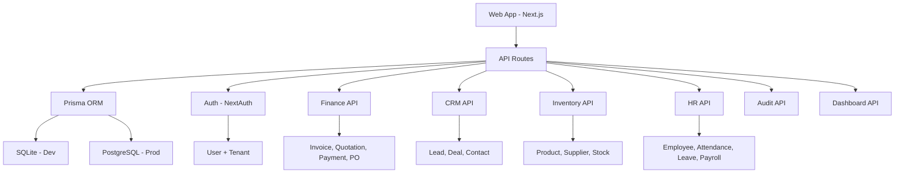

# 🗺️ Qalcuity Web App — Rencana Komprehensif

> **Status Analisis:** 6 Agustus 2026
> **Fokus:** Website dulu, kerjakan semua fitur

---

## 📊 Status Implementasi Saat Ini

### ✅ Sudah Berfungsi (Connected to DB)
| Komponen | Status |
|----------|--------|
| Authentication (Login/Register) | ✅ NextAuth + Prisma + SQLite |
| Middleware (Route Protection) | ✅ `/dashboard/*` protected |
| Tenant + User Registration | ✅ Creates tenant + admin user |
| Landing Page | ✅ Complete with sections |

### ⚠️ Sudah Ada UI, Tapi API Pakai Mock Data
| Halaman | UI | API | Database |
|---------|-----|-----|----------|
| Dashboard Stats | ✅ | ❌ Mock | ❌ |
| Finance Overview | ✅ | ❌ Hardcoded | ❌ |
| Invoices (List + Detail) | ✅ | ❌ Mock | ❌ |
| Quotations (List) | ✅ | ❌ Mock | ❌ |
| Payments (List) | ✅ | ❌ Mock | ❌ |
| Purchase Orders (List) | ✅ | ❌ Mock | ❌ |
| Chart of Account | ✅ | ❌ Hardcoded | ❌ |
| CRM Overview | ✅ | ❌ Hardcoded | ❌ |
| Leads (List + Detail) | ✅ | ❌ Mock | ❌ |
| Pipeline/Kanban | ✅ | ❌ Mock | ❌ |
| Deals (List + Detail) | ✅ | ❌ Mock | ❌ |
| Contacts (List + Detail) | ✅ | ❌ Mock | ❌ |
| Inventory Overview | ✅ | ❌ Hardcoded | ❌ |
| Products (List + Detail) | ✅ | ❌ Mock | ❌ |
| Suppliers (List + Detail) | ✅ | ❌ Mock | ❌ |
| Stock Management | ✅ | ❌ | ❌ |
| Categories | ✅ | ❌ | ❌ |
| HR Overview | ✅ | ❌ Hardcoded | ❌ |
| Employees (List + Detail) | ✅ | ❌ Mock | ❌ |
| Attendance | ✅ | ❌ Mock | ❌ |
| Leaves | ✅ | ❌ Mock | ❌ |
| Payroll | ✅ | ❌ Mock | ❌ |
| Audit Trail | ✅ | ❌ Hardcoded | ❌ |
| Settings (Profile) | ✅ | ❌ TODO | ❌ |
| Settings (Integrations) | ✅ | ❌ Hardcoded | ❌ |

### ❌ Missing Database Models
| Model | Dibutuhkan Untuk |
|-------|-----------------|
| `Quotation` + `QuotationItem` | Quotation management |
| `StockMovement` | Stock tracking |
| `Category` | Inventory categories |
| `Supplier` | Supplier management |
| `LeaveRequest` | Leave management |
| `AttendanceRecord` | Attendance tracking |
| `PayrollRecord` | Payroll processing |

---

## 🏗️ Arsitektur Target

---

## 📋 Rencana Eksekusi

### Wave 1: Database Schema Completion
**Goal:** Lengkapi semua model yang dibutuhkan

1. Tambah model `Quotation` + `QuotationItem` ke schema.prisma
2. Tambah model `StockMovement` ke schema.prisma
3. Tambah model `Category` ke schema.prisma
4. Tambah model `Supplier` ke schema.prisma
5. Tambah model `LeaveRequest` ke schema.prisma
6. Tambah model `AttendanceRecord` ke schema.prisma
7. Tambah model `PayrollRecord` ke schema.prisma
8. Relasi semua model ke Tenant
9. Run `prisma db push` / migration
10. Update seed.ts dengan data lengkap

### Wave 2: API Routes — Finance Module
**Goal:** Semua Finance API connected ke database

1. Rewrite `/api/finance/invoices` — GET/POST/PUT/DELETE pakai Prisma
2. Rewrite `/api/finance/invoices/[id]` — GET/PUT/DELETE pakai Prisma
3. Create `/api/finance/quotations` — GET/POST/PUT/DELETE pakai Prisma
4. Create `/api/finance/quotations/[id]` — GET/PUT/DELETE pakai Prisma
5. Rewrite `/api/finance/payments` — GET/POST pakai Prisma
6. Rewrite `/api/finance/payments/[id]` — GET/PUT pakai Prisma
7. Rewrite `/api/finance/purchase-orders` — GET/POST/PUT/DELETE pakai Prisma
8. Rewrite `/api/finance/purchase-orders/[id]` — GET/PUT/DELETE pakai Prisma
9. Create `/api/finance/accounts` — GET/POST/PUT pakai Prisma (Chart of Account)

### Wave 3: API Routes — CRM Module
**Goal:** Semua CRM API connected ke database

1. Rewrite `/api/crm/contacts` — GET/POST/PUT/DELETE pakai Prisma
2. Rewrite `/api/crm/contacts/[id]` — GET/PUT/DELETE pakai Prisma
3. Rewrite `/api/crm/leads` — GET/POST/PUT/DELETE pakai Prisma
4. Rewrite `/api/crm/leads/[id]` — GET/PUT/DELETE pakai Prisma
5. Rewrite `/api/crm/deals` — GET/POST/PUT/DELETE pakai Prisma
6. Rewrite `/api/crm/deals/[id]` — GET/PUT/DELETE pakai Prisma

### Wave 4: API Routes — Inventory Module
**Goal:** Semua Inventory API connected ke database

1. Rewrite `/api/inventory/products` — GET/POST/PUT/DELETE pakai Prisma
2. Rewrite `/api/inventory/products/[id]` — GET/PUT/DELETE pakai Prisma
3. Create `/api/inventory/suppliers` — GET/POST/PUT/DELETE pakai Prisma
4. Create `/api/inventory/suppliers/[id]` — GET/PUT/DELETE pakai Prisma
5. Create `/api/inventory/stock` — GET/POST (stock movements) pakai Prisma
6. Create `/api/inventory/categories` — GET/POST/PUT/DELETE pakai Prisma

### Wave 5: API Routes — HR Module
**Goal:** Semua HR API connected ke database

1. Rewrite `/api/hr/employees` — GET/POST/PUT/DELETE pakai Prisma
2. Rewrite `/api/hr/employees/[id]` — GET/PUT/DELETE pakai Prisma
3. Create `/api/hr/attendance` — GET/POST pakai Prisma
4. Create `/api/hr/attendance/[id]` — GET/PUT pakai Prisma
5. Create `/api/hr/leaves` — GET/POST/PUT pakai Prisma
6. Create `/api/hr/leaves/[id]` — GET/PUT pakai Prisma
7. Create `/api/hr/payroll` — GET/POST pakai Prisma
8. Create `/api/hr/payroll/[id]` — GET/PUT pakai Prisma

### Wave 6: API Routes — Dashboard + Audit
**Goal:** Dashboard stats dan audit trail dari database

1. Rewrite `/api/dashboard/stats` — Aggregate dari semua modul
2. Create `/api/audit` — GET dari AuditLog model
3. Create audit logging middleware/helper untuk semua CRUD operations

### Wave 7: Frontend — Finance Pages
**Goal:** Semua halaman Finance pakai data real

1. Update Finance Overview — Fetch dari API
2. Update Invoices page — Pastikan pakai API data
3. Update Invoice Detail page — Pastikan pakai API data
4. Update Quotations page — Fetch dari API
5. Update Quotation Detail page — Buat jika belum ada
6. Update Payments page — Fetch dari API
7. Update Payment Detail page — Buat jika belum ada
8. Update Purchase Orders page — Fetch dari API
9. Update Purchase Order Detail page — Buat jika belum ada
10. Update Chart of Account page — Fetch dari API
11. Buat/finalisasi form组件 untuk semua CRUD operations

### Wave 8: Frontend — CRM Pages
**Goal:** Semua halaman CRM pakai data real

1. Update CRM Overview — Fetch dari API
2. Update Leads page — Pastikan pakai API data
3. Update Lead Detail page — Pastikan pakai API data
4. Update Pipeline/Kanban — Fetch dari API + drag-drop
5. Update Deals page — Pastikan pakai API data
6. Update Deal Detail page — Pastikan pakai API data
7. Update Contacts page — Pastikan pakai API data
8. Update Contact Detail page — Pastikan pakai API data
9. Buat/finalisasi form组件 untuk semua CRUD operations

### Wave 9: Frontend — Inventory Pages
**Goal:** Semua halaman Inventory pakai data real

1. Update Inventory Overview — Fetch dari API
2. Update Products page — Pastikan pakai API data
3. Update Product Detail page — Pastikan pakai API data
4. Update Suppliers page — Fetch dari API
5. Update Supplier Detail page — Buat jika belum ada
6. Update Stock page — Fetch dari API
7. Update Categories page — Fetch dari API
8. Buat/finalisasi form组件 untuk semua CRUD operations

### Wave 10: Frontend — HR Pages
**Goal:** Semua halaman HR pakai data real

1. Update HR Overview — Fetch dari API
2. Update Employees page — Pastikan pakai API data
3. Update Employee Detail page — Pastikan pakai API data
4. Update Attendance page — Fetch dari API
5. Update Leaves page — Fetch dari API
6. Update Payroll page — Fetch dari API
7. Buat/finalisasi form组件 untuk semua CRUD operations

### Wave 11: Frontend — Settings + Audit
**Goal:** Settings dan Audit Trail berfungsi

1. Update Audit Trail page — Fetch dari API
2. Update Settings Profile — Connect ke auth API
3. Update Settings Company — CRUD tenant settings
4. Update Settings Team — Manage team members
5. Update Settings Security — Password change, 2FA
6. Update Settings Notifications — Notification preferences
7. Update Settings Billing — Subscription info

### Wave 12: Polish & Integration
**Goal:** Pastikan semua berfungsi smooth

1. Error handling konsisten di semua halaman
2. Loading states yang konsisten
3. Toast/notification untuk success/error
4. Confirmation dialog untuk delete operations
5. Form validation konsisten
6. Responsive design check
7. Empty state untuk semua list pages
8. Test semua CRUD flows end-to-end

---

## 🔑 Key Technical Decisions

1. **Database:** SQLite untuk dev, PostgreSQL untuk prod (Prisma mendukung keduanya)
2. **Auth:** NextAuth JWT strategy (sudah berfungsi)
3. **State Management:** React useState + useEffect (sederhana, cukup untuk MVP)
4. **Styling:** Tailwind CSS (sudah setup)
5. **API Pattern:** REST API dengan Next.js Route Handlers
6. **Form Handling:** Controlled components dengan React state
7. **Error Handling:** Try-catch dengan user-friendly messages
8. **Multi-tenancy:** Tenant ID di semua queries (filter by session.tenantId)

---

## ⚠️ Risks & Mitigations

| Risk | Impact | Mitigation |
|------|--------|------------|
| Schema changes break existing data | High | Backup DB sebelum migration |
| Mock data inconsistency | Medium | Standarisasi data structure |
| Large scope of work | High | Break into waves, prioritize |
| Auth tenant isolation | High | Pastikan semua query filter by tenantId |

---

**Last Updated:** 6 Agustus 2026
